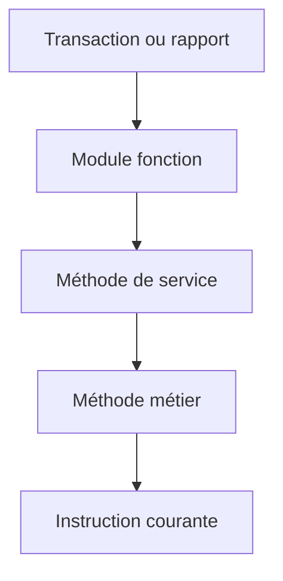

# 9. PILE D’APPELS ET CONTEXTE D’EXÉCUTION

## 9.A RÉSULTAT ATTENDU

- Comprendre comment le traitement a atteint la ligne courante
- Naviguer entre appelants et appelés
- Retrouver les paramètres et variables locales d’un niveau
- Distinguer pile ABAP[^terme-abap] et pile Dynpro[^terme-dynpro]
- Identifier le premier appel métier pertinent

## 9.B PRINCIPE

La pile d’appels représente les blocs actifs qui ont conduit à l’instruction courante.



## 9.C INFORMATIONS DISPONIBLES

Selon la version, une entrée de pile peut indiquer :

- profondeur ;
- type ABAP ou Dynpro ;
- type d’événement ;
- nom de méthode[^terme-methode], module ou routine ;
- programme ;
- include ;
- numéro de ligne.

## 9.D NAVIGUER DANS LA PILE

En sélectionnant un niveau, le débogueur repositionne le contexte visible :

- variables locales de la procédure ;
- paramètres d’entrée et de sortie ;
- variables globales du programme ;
- source correspondant à l’appel.

La navigation dans la pile n’exécute pas le programme. Elle change uniquement le contexte d’analyse.

## 9.E TROUVER LA CAUSE

Lorsqu’une erreur apparaît dans une routine générique standard, remonter la pile jusqu’au premier niveau qui :

- appartient au développement client ;
- construit les données incorrectes ;
- choisit un paramètre erroné ;
- appelle l’API[^terme-api] standard avec un contrat non respecté.

La ligne qui déclenche l’erreur n’est pas toujours la ligne qui crée sa cause.

## 9.F PILE DYNPRO

Dans une application classique, la pile peut inclure :

- PBO ;
- PAI ;
- modules d’écran ;
- programmes ABAP associés.

Un contexte Dynpro expose principalement les données globales du programme d’écran. Les variables locales appartiennent aux procédures ABAP actives.

## 9.G PROGRAMMES SYSTÈME

Les programmes système peuvent être masqués ou affichés différemment. Leur analyse nécessite l’activation du débogage système et les autorisations appropriées.

Activer ce mode uniquement lorsque le problème se situe réellement dans une couche système ou standard.

## 9.H PROCESS

### 9.H.1 Étape 1 — Arrêter au point fautif

Placer un breakpoint[^terme-breakpoint] où la donnée incorrecte est observée et reproduire avec le même utilisateur et le même mode d’exécution.

### 9.H.2 Étape 2 — Lire la pile du bas vers le haut

Identifier programme d’entrée et appels successifs. Relever le premier objet client ou point d’extension dans une pile standard.

### 9.H.3 Étape 3 — Examiner chaque frame

Sélectionner les niveaux et comparer paramètres reçus, variables locales et valeurs retournées. Trouver le dernier niveau où la donnée était correcte.

### 9.H.4 Étape 4 — Isoler la frontière fautive

Descendre d’un appel depuis ce dernier état correct. Cette frontière identifie l’interface ou la transformation responsable.

### 9.H.5 Étape 5 — Confirmer le contexte

Relever utilisateur, transaction, programme principal, unité RFC[^terme-rfc] ou job[^terme-job]. Le diagnostic est terminé lorsque l’appelant, l’appelé et le paramètre divergent sont identifiés.

## 9.I VÉRIFICATION

- Le scénario reproduit correspond au même utilisateur, mandant[^terme-mandant], transaction et jeu de données.
- L’horodatage et l’identifiant de l’analyse sont conservés.
- La cause retenue est soutenue par une ligne source, une trace[^terme-trace] ou une valeur observée.
- Après correction, le même scénario ne reproduit plus le défaut et le résultat métier reste identique.

## 9.J ERREURS FRÉQUENTES

- Modifier les données dans le débogueur puis considérer le résultat comme reproductible.
- Laisser une trace active trop longtemps.

## 9.K FICHE DE CONTRÔLE À COPIER

```text
Système / SID       :
Mandant             :
Utilisateur         :
Transaction / outil :
Objet technique     :
Jeu de données      :
Résultat attendu    :
Résultat observé    :
Horodatage          :
Ordre de transport  :
```

## 9.L TERMES DU LEXIQUE

- [Breakpoint](<../🧩 00 ├── LEXIQUE SAP ET ABAP/08 ├── EXECUTION EXPLOITATION ET ADMINISTRATION.md#breakpoint>)
- [Watchpoint](<../🧩 00 ├── LEXIQUE SAP ET ABAP/08 ├── EXECUTION EXPLOITATION ET ADMINISTRATION.md#watchpoint>)
- [Dump ABAP](<../🧩 00 ├── LEXIQUE SAP ET ABAP/08 ├── EXECUTION EXPLOITATION ET ADMINISTRATION.md#dump-abap>)
- [Trace](<../🧩 00 ├── LEXIQUE SAP ET ABAP/08 ├── EXECUTION EXPLOITATION ET ADMINISTRATION.md#trace>)

## 9.M RÉFÉRENCES OFFICIELLES SAP

- [Call Stack — SAP Help Portal](https://help.sap.com/docs/ABAP_PLATFORM_NEW/ba879a6e2ea04d9bb94c7ccd7cdac446/88feb68f058446539bb51e8d95caac00.html)
- [System Debugging — SAP Help Portal](https://help.sap.com/docs/ABAP_PLATFORM_NEW/ba879a6e2ea04d9bb94c7ccd7cdac446/4925636629ac16b7e10000000a42189d.html)

---

[Chapitre suivant — MODIFIER LES DONNÉES ET LE FLUX D’EXÉCUTION](<./10 ├── MODIFIER LES DONNEES ET LE FLUX D EXECUTION.md>)

[^terme-abap]: **ABAP.** Langage de programmation de la plateforme ABAP, conçu pour développer des applications métier et techniques SAP. Voir [l’entrée du lexique](<../🧩 00 ├── LEXIQUE SAP ET ABAP/04 ├── LANGAGE ET DEVELOPPEMENT ABAP.md#abap>).
[^terme-dynpro]: **DYNPRO.** Écran classique SAP composé d’une définition d’écran et d’une logique PBO/PAI. Voir [l’entrée du lexique](<../🧩 00 ├── LEXIQUE SAP ET ABAP/02 ├── SAP GUI NAVIGATION ET TRANSACTIONS.md#dynpro>).
[^terme-methode]: **MÉTHODE.** Comportement déclaré dans une classe ou une interface et appelé avec une liste de paramètres définie. Voir [l’entrée du lexique](<../🧩 00 ├── LEXIQUE SAP ET ABAP/04 ├── LANGAGE ET DEVELOPPEMENT ABAP.md#methode>).
[^terme-api]: **API.** Application Programming Interface, contrat exposant des opérations ou données utilisables par d’autres composants. Voir [l’entrée du lexique](<../🧩 00 ├── LEXIQUE SAP ET ABAP/10 └── ACRONYMES SAP.md#api>).
[^terme-breakpoint]: **BREAKPOINT.** Point d’arrêt suspendant l’exécution dans le débogueur. Voir [l’entrée du lexique](<../🧩 00 ├── LEXIQUE SAP ET ABAP/08 ├── EXECUTION EXPLOITATION ET ADMINISTRATION.md#breakpoint>).
[^terme-rfc]: **RFC.** Remote Function Call, mécanisme permettant d’appeler un module fonction compatible dans un autre contexte ou système. Voir [l’entrée du lexique](<../🧩 00 ├── LEXIQUE SAP ET ABAP/06 ├── PROGRAMMES CLASSES ET OBJETS TECHNIQUES.md#rfc>).
[^terme-job]: **JOB.** Traitement planifié en arrière-plan composé d’une ou plusieurs étapes. Voir [l’entrée du lexique](<../🧩 00 ├── LEXIQUE SAP ET ABAP/06 ├── PROGRAMMES CLASSES ET OBJETS TECHNIQUES.md#job>).
[^terme-mandant]: **MANDANT.** Subdivision logique d’un système SAP. Il est identifié par un numéro à trois chiffres et isole une partie des données, du paramétrage et des utilisateurs. Voir [l’entrée du lexique](<../🧩 00 ├── LEXIQUE SAP ET ABAP/01 ├── SYSTEMES ENVIRONNEMENTS ET MANDANTS.md#mandant>).
[^terme-trace]: **TRACE.** Enregistrement détaillé d’événements techniques pour analyser exécution, SQL ou appels. Voir [l’entrée du lexique](<../🧩 00 ├── LEXIQUE SAP ET ABAP/08 ├── EXECUTION EXPLOITATION ET ADMINISTRATION.md#trace>).
