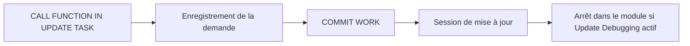

# 11. DEBUG SYSTÈME ET TRAITEMENTS SPÉCIAUX

## 11.A RÉSULTAT ATTENDU

- Comprendre le débogage système
- Activer le débogage des modules de mise à jour
- Identifier les changements de session interne
- Déboguer un appel externe avec le bon utilisateur
- Connaître les limites des traitements asynchrones

## 11.B DÉBOGAGE SYSTÈME

Le mode **System Debugging** permet d’entrer dans des programmes marqués comme programmes système, en plus des programmes applicatifs.

L’activer lorsque :

- le traitement pertinent est masqué dans le standard ;
- la pile indique un programme système ;
- une fonction technique doit être analysée.

Le désactiver après usage pour éviter de parcourir inutilement l’infrastructure SAP[^terme-acro-sap].

## 11.C DEBUG DE MISE À JOUR

Les modules appelés avec `IN UPDATE TASK` ne sont pas exécutés directement dans le même traitement dialogué. Pour les analyser :

1. entrer dans le débogueur avant le `COMMIT WORK`[^terme-commit-work] ;
2. activer **Update Debugging** dans les paramètres ;
3. poursuivre l’exécution ;
4. le débogueur s’arrête dans la tâche de mise à jour lorsque celle-ci démarre.



## 11.D MISES À JOUR ANNULÉES

Pour une mise à jour déjà en erreur, les outils de suivi des mises à jour permettent d’afficher l’enregistrement et, avec les autorisations nécessaires, de l’analyser dans le débogueur.

Ne pas retraiter ou modifier une mise à jour annulée sans comprendre son impact métier.

## 11.E APPELS HTTP ET RFC

Pour un appel entrant :

- utiliser un breakpoint[^terme-breakpoint] externe ;
- vérifier l’utilisateur technique réel ;
- reproduire exactement la requête ;
- contrôler les données transmises ;
- tenir compte du fait que le traitement ne possède pas nécessairement une interface SAP GUI[^terme-sap-gui].

## 11.F TRAITEMENTS ASYNCHRONES

Certains appels asynchrones ou transactionnels ne restent pas dans la session de débogage courante. Il peut être nécessaire de :

- utiliser un breakpoint externe ;
- analyser la file ou le journal technique ;
- reproduire l’unité appelée directement ;
- activer une option spécifique du débogueur.

## 11.G PROCESS

### 11.G.1 Étape 1 — Identifier le changement de contexte

Déterminer si le code s’exécute dans une mise à jour, un appel RFC[^terme-rfc], une tâche asynchrone, un autre utilisateur ou du code système. Relever l’instruction qui provoque ce changement.

### 11.G.2 Étape 2 — Activer uniquement le mode requis

Configurer le débogage système, update ou RFC selon le scénario et les autorisations. Éviter d’activer tous les modes : les arrêts dans le framework masquent le chemin utile.

### 11.G.3 Étape 3 — Placer un breakpoint dans le contexte cible

Utiliser un breakpoint externe lorsque l’utilisateur ou la session change. Pour une update task[^terme-update-task], cibler le module de mise à jour ; pour RFC, cibler le module appelé dans le système destinataire.

### 11.G.4 Étape 4 — Reproduire une seule unité

Exécuter le scénario et vérifier dans le débogueur l’utilisateur, le programme et le système. Si l’arrêt ne survient pas, déterminer si l’unité a été créée avant de modifier le breakpoint.

### 11.G.5 Étape 5 — Désactiver les options spéciales

Après analyse, retirer breakpoints externes et modes système/update. Le diagnostic est terminé lorsque le changement de contexte et le code réellement exécuté sont prouvés.

## 11.H VÉRIFICATION

- Le scénario reproduit correspond au même utilisateur, mandant[^terme-mandant], transaction et jeu de données.
- L’horodatage et l’identifiant de l’analyse sont conservés.
- La cause retenue est soutenue par une ligne source, une trace[^terme-trace] ou une valeur observée.
- Après correction, le même scénario ne reproduit plus le défaut et le résultat métier reste identique.

## 11.I ERREURS FRÉQUENTES

- Modifier les données dans le débogueur puis considérer le résultat comme reproductible.
- Laisser une trace active trop longtemps.

## 11.J FICHE DE CONTRÔLE À COPIER

```text
Système / SID       :
Mandant             :
Utilisateur         :
Transaction / outil :
Objet technique     :
Jeu de données      :
Résultat attendu    :
Résultat observé    :
Horodatage          :
Ordre de transport  :
```

## 11.K TERMES DU LEXIQUE

- [Breakpoint](<../🧩 00 ├── LEXIQUE SAP ET ABAP/08 ├── EXECUTION EXPLOITATION ET ADMINISTRATION.md#breakpoint>)
- [Watchpoint](<../🧩 00 ├── LEXIQUE SAP ET ABAP/08 ├── EXECUTION EXPLOITATION ET ADMINISTRATION.md#watchpoint>)
- [Dump ABAP](<../🧩 00 ├── LEXIQUE SAP ET ABAP/08 ├── EXECUTION EXPLOITATION ET ADMINISTRATION.md#dump-abap>)
- [Trace](<../🧩 00 ├── LEXIQUE SAP ET ABAP/08 ├── EXECUTION EXPLOITATION ET ADMINISTRATION.md#trace>)

## 11.L RÉFÉRENCES OFFICIELLES SAP

- [System Debugging — SAP Help Portal](https://help.sap.com/docs/ABAP_PLATFORM_NEW/ba879a6e2ea04d9bb94c7ccd7cdac446/4925636629ac16b7e10000000a42189d.html)
- [Debugger Settings — SAP Help Portal](https://help.sap.com/docs/ABAP_PLATFORM_NEW/ba879a6e2ea04d9bb94c7ccd7cdac446/7b8f8115c62847f493e69bef6e78ba81.html)
- [Analyzing Canceled Updates — SAP Help Portal](https://help.sap.com/docs/ABAP_PLATFORM_NEW/979cf1522d164bf7a781796efd8850ee/97de29925b894871aba86eb7e2963bcb.html)
- [Starting and Directly Debugging ABAP Programs — SAP Help Portal](https://help.sap.com/docs/ABAP_PLATFORM_NEW/ba879a6e2ea04d9bb94c7ccd7cdac446/a95208086a6e448aa35f08357d958af5.html)

---

[Chapitre suivant — DEBUG DES JOBS ET TRAITEMENTS EN ARRIÈRE-PLAN](<./12 ├── DEBUG DES JOBS ET TRAITEMENTS EN ARRIERE PLAN.md>)

[^terme-acro-sap]: **SAP.** Nom de l’éditeur et de son écosystème logiciel ; l’acronyme historique provient de l’allemand. Voir [l’entrée du lexique](<../🧩 00 ├── LEXIQUE SAP ET ABAP/10 └── ACRONYMES SAP.md#acro-sap>).
[^terme-commit-work]: **COMMIT WORK.** Instruction clôturant la SAP LUW courante, déclenchant notamment les mises à jour enregistrées et validant la base. Voir [l’entrée du lexique](<../🧩 00 ├── LEXIQUE SAP ET ABAP/08 ├── EXECUTION EXPLOITATION ET ADMINISTRATION.md#commit-work>).
[^terme-breakpoint]: **BREAKPOINT.** Point d’arrêt suspendant l’exécution dans le débogueur. Voir [l’entrée du lexique](<../🧩 00 ├── LEXIQUE SAP ET ABAP/08 ├── EXECUTION EXPLOITATION ET ADMINISTRATION.md#breakpoint>).
[^terme-sap-gui]: **SAP GUI.** Client graphique permettant d’utiliser les transactions et écrans d’un système SAP. Voir [l’entrée du lexique](<../🧩 00 ├── LEXIQUE SAP ET ABAP/02 ├── SAP GUI NAVIGATION ET TRANSACTIONS.md#sap-gui>).
[^terme-rfc]: **RFC.** Remote Function Call, mécanisme permettant d’appeler un module fonction compatible dans un autre contexte ou système. Voir [l’entrée du lexique](<../🧩 00 ├── LEXIQUE SAP ET ABAP/06 ├── PROGRAMMES CLASSES ET OBJETS TECHNIQUES.md#rfc>).
[^terme-update-task]: **UPDATE TASK.** Mécanisme différant des mises à jour pour les exécuter lors du `COMMIT WORK` dans des processus de mise à jour. Voir [l’entrée du lexique](<../🧩 00 ├── LEXIQUE SAP ET ABAP/08 ├── EXECUTION EXPLOITATION ET ADMINISTRATION.md#update-task>).
[^terme-mandant]: **MANDANT.** Subdivision logique d’un système SAP. Il est identifié par un numéro à trois chiffres et isole une partie des données, du paramétrage et des utilisateurs. Voir [l’entrée du lexique](<../🧩 00 ├── LEXIQUE SAP ET ABAP/01 ├── SYSTEMES ENVIRONNEMENTS ET MANDANTS.md#mandant>).
[^terme-trace]: **TRACE.** Enregistrement détaillé d’événements techniques pour analyser exécution, SQL ou appels. Voir [l’entrée du lexique](<../🧩 00 ├── LEXIQUE SAP ET ABAP/08 ├── EXECUTION EXPLOITATION ET ADMINISTRATION.md#trace>).
