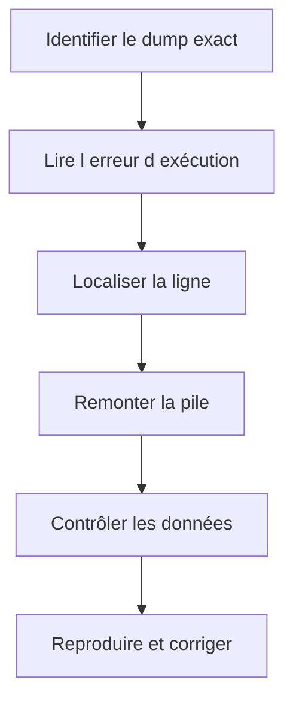

# 13. ANALYSER LES DUMPS AVEC ST22

## 13.A RÉSULTAT ATTENDU

- Comprendre ce qu’est un dump ABAP[^terme-dump-abap]
- Retrouver un dump avec `ST22`[^outil-st22]
- Lire les sections les plus utiles
- Relier l’erreur d’exécution au code et aux données
- Distinguer cause immédiate et cause initiale

## 13.B PRINCIPE

Lorsqu’une erreur d’exécution non gérée interrompt un programme ABAP, le système produit un **short dump** contenant le contexte technique disponible.

`ST22` permet de lister et analyser les erreurs d’exécution enregistrées pour le système et le mandant[^terme-mandant] accessibles à l’utilisateur autorisé.

## 13.C SÉLECTION

Rechercher avec :

- date et heure ;
- utilisateur ;
- programme ;
- erreur d’exécution ;
- mandant ;
- serveur lorsque disponible.

L’heure exacte fournie par l’utilisateur réduit fortement le périmètre.

## 13.D SECTIONS PRIORITAIRES

| Section              | Utilité                                  |
| -------------------- | ---------------------------------------- |
| Erreur d’exécution   | Catégorie technique                      |
| Exception[^terme-exception]            | Classe[^terme-classe] d’exception non gérée éventuelle  |
| Programme            | Objet interrompu                         |
| Analyse de l’erreur  | Explication du mécanisme                 |
| Comment corriger     | Orientations générales                   |
| Point d’arrêt        | Ligne et include concernés               |
| Source code extract  | Instructions autour de l’arrêt           |
| Pile d’appels        | Chemin ayant conduit au dump             |
| Variables            | Valeurs disponibles au moment de l’arrêt |
| Informations système | Contexte d’exécution                     |

## 13.E MÉTHODE DE LECTURE



## 13.F EXCEPTION NON GÉRÉE

Si le dump contient une classe `CX_*`, déterminer :

- quelle instruction l’a levée ;
- pourquoi aucun `CATCH` applicable ne l’a interceptée ;
- si l’exception devait être gérée localement ou propagée ;
- si les données d’entrée rendaient l’erreur prévisible.

Ne pas ajouter systématiquement `CATCH cx_root`. Le traitement doit préserver le sens de l’erreur.

## 13.G ERREURS DE MÉMOIRE OU DE TEMPS

Un dump de mémoire, de temps maximal ou de ressources requiert souvent des outils complémentaires :

- `SAT`[^outil-sat] ;
- `ST05`[^outil-st05] ;
- Memory Inspector ;
- analyse du volume ;
- contrôle des boucles et lectures SQL[^terme-acro-sql].

## 13.H AUTORISATION

L’accès aux dumps est protégé. SAP[^terme-acro-sap] documente notamment l’objet d’autorisation[^terme-objet-autorisation] `S_ABAPDUMP` pour l’analyse des dumps.

## 13.I PROCESS

### 13.I.1 Étape 1 — Fixer le contexte

Relever date, heure, utilisateur, transaction, saisie et action précédant l’arrêt. Sans ces valeurs, un dump du même type peut être attribué au mauvais scénario.

### 13.I.2 Étape 2 — Rechercher dans ST22

Ouvrir `ST22`, choisir la période et filtrer par utilisateur ou runtime error. Sélectionner l’entrée dont l’horodatage et le programme correspondent exactement.

### 13.I.3 Étape 3 — Lire dans l’ordre utile

Relever runtime error, exception, programme, include et ligne. Lire **Error analysis**, **How to correct the error**, extrait source puis pile d’appels.

### 13.I.4 Étape 4 — Localiser la responsabilité

Dans la pile, identifier le premier objet client, enhancement ou appel avec une valeur incorrecte. Vérifier que la version active du source correspond à l’extrait enregistré.

### 13.I.5 Étape 5 — Corréler les données

Comparer les variables du dump avec les entrées et données persistées. Corriger la première cause prouvée, puis rejouer le cas fautif et un cas nominal. Le diagnostic est terminé lorsqu’aucun nouveau dump n’est créé et que l’erreur est traitée de façon contrôlée.

## 13.J VÉRIFICATION

- Le scénario reproduit correspond au même utilisateur, mandant, transaction et jeu de données.
- L’horodatage et l’identifiant de l’analyse sont conservés.
- La cause retenue est soutenue par une ligne source, une trace[^terme-trace] ou une valeur observée.
- Après correction, le même scénario ne reproduit plus le défaut et le résultat métier reste identique.

## 13.K ERREURS FRÉQUENTES

- Modifier les données dans le débogueur puis considérer le résultat comme reproductible.
- Laisser une trace active trop longtemps.

## 13.L FICHE DE CONTRÔLE À COPIER

```text
Système / SID       :
Mandant             :
Utilisateur         :
Transaction / outil :
Objet technique     :
Jeu de données      :
Résultat attendu    :
Résultat observé    :
Horodatage          :
Ordre de transport  :
```

## 13.M TERMES DU LEXIQUE

- [Breakpoint](<../🧩 00 ├── LEXIQUE SAP ET ABAP/08 ├── EXECUTION EXPLOITATION ET ADMINISTRATION.md#breakpoint>)
- [Watchpoint](<../🧩 00 ├── LEXIQUE SAP ET ABAP/08 ├── EXECUTION EXPLOITATION ET ADMINISTRATION.md#watchpoint>)
- [Dump ABAP](<../🧩 00 ├── LEXIQUE SAP ET ABAP/08 ├── EXECUTION EXPLOITATION ET ADMINISTRATION.md#dump-abap>)
- [Trace](<../🧩 00 ├── LEXIQUE SAP ET ABAP/08 ├── EXECUTION EXPLOITATION ET ADMINISTRATION.md#trace>)

## 13.N RÉFÉRENCES OFFICIELLES SAP

- [ABAP Dump Analysis ST22 — SAP Help Portal](https://help.sap.com/docs/ABAP_PLATFORM_NEW/ba879a6e2ea04d9bb94c7ccd7cdac446/b134ab1cd8e44562b0fee9524c638cca.html)
- [ABAP Test and Analysis Tools — SAP Help Portal](https://help.sap.com/docs/ABAP_PLATFORM_NEW/ba879a6e2ea04d9bb94c7ccd7cdac446/491aa66f87041903e10000000a42189c.html)

---

[Chapitre suivant — ANALYSER LE TEMPS D’EXÉCUTION AVEC SAT](<./14 ├── ANALYSER LE TEMPS D EXECUTION AVEC SAT.md>)

[^terme-dump-abap]: **DUMP ABAP.** Arrêt d’exécution produisant une analyse détaillée consultable dans `ST22`. Voir [l’entrée du lexique](<../🧩 00 ├── LEXIQUE SAP ET ABAP/08 ├── EXECUTION EXPLOITATION ET ADMINISTRATION.md#dump-abap>).
[^terme-mandant]: **MANDANT.** Subdivision logique d’un système SAP. Il est identifié par un numéro à trois chiffres et isole une partie des données, du paramétrage et des utilisateurs. Voir [l’entrée du lexique](<../🧩 00 ├── LEXIQUE SAP ET ABAP/01 ├── SYSTEMES ENVIRONNEMENTS ET MANDANTS.md#mandant>).
[^terme-exception]: **EXCEPTION.** Objet ou signal représentant une situation anormale qu’un appelant peut traiter. Voir [l’entrée du lexique](<../🧩 00 ├── LEXIQUE SAP ET ABAP/04 ├── LANGAGE ET DEVELOPPEMENT ABAP.md#exception>).
[^terme-classe]: **CLASSE.** Modèle orienté objet définissant état et comportements. Voir [l’entrée du lexique](<../🧩 00 ├── LEXIQUE SAP ET ABAP/04 ├── LANGAGE ET DEVELOPPEMENT ABAP.md#classe>).
[^terme-acro-sql]: **SQL.** Structured Query Language. Voir [l’entrée du lexique](<../🧩 00 ├── LEXIQUE SAP ET ABAP/10 └── ACRONYMES SAP.md#acro-sql>).
[^terme-acro-sap]: **SAP.** Nom de l’éditeur et de son écosystème logiciel ; l’acronyme historique provient de l’allemand. Voir [l’entrée du lexique](<../🧩 00 ├── LEXIQUE SAP ET ABAP/10 └── ACRONYMES SAP.md#acro-sap>).
[^terme-objet-autorisation]: **OBJET D’AUTORISATION.** Structure de contrôle contenant des champs vérifiés lors d’une action. Voir [l’entrée du lexique](<../🧩 00 ├── LEXIQUE SAP ET ABAP/09 ├── NOTIONS FONCTIONNELLES ET ORGANISATIONNELLES.md#objet-autorisation>).
[^terme-trace]: **TRACE.** Enregistrement détaillé d’événements techniques pour analyser exécution, SQL ou appels. Voir [l’entrée du lexique](<../🧩 00 ├── LEXIQUE SAP ET ABAP/08 ├── EXECUTION EXPLOITATION ET ADMINISTRATION.md#trace>).

[^outil-st22]: **ST22.** Transaction d’analyse des terminaisons anormales et dumps ABAP. Voir [le chapitre associé](<13 ├── ANALYSER LES DUMPS AVEC ST22.md>).
[^outil-sat]: **SAT.** Runtime Analysis utilisée pour mesurer et analyser le temps d’exécution ABAP. Voir [le chapitre associé](<../🧩 20 ├── PERFORMANCE QUALITE ET TESTS/07 ├── MESURER LE TEMPS D EXECUTION AVEC SAT.md>).
[^outil-st05]: **ST05.** Performance Trace utilisée notamment pour enregistrer et analyser les accès SQL. Voir [le chapitre associé](<../🧩 20 ├── PERFORMANCE QUALITE ET TESTS/08 ├── ANALYSER LES ACCES SQL AVEC ST05.md>).
