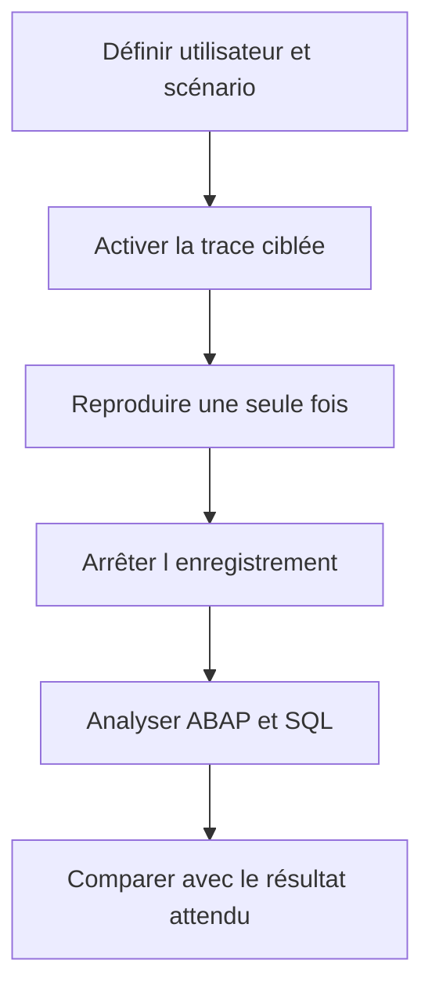

# 16. ANALYSE CIBLÉE AVEC ST12

## 16.A RÉSULTAT ATTENDU

- Comprendre le rôle d’une analyse de transaction unique
- Corréler trace[^terme-trace] ABAP[^terme-abap] et trace SQL[^terme-acro-sql]
- Enregistrer un scénario court et reproductible
- Identifier le chemin d’appel responsable d’un coût
- Savoir quand préférer `SAT`[^outil-sat] ou `ST05`[^outil-st05]

## 16.B RÔLE

`ST12`[^outil-st12] est couramment utilisé pour une analyse ciblée d’une transaction ou d’un traitement en combinant des informations d’exécution ABAP et SQL dans un même scénario.

L’outil peut varier selon la version et les composants installés. Les fonctions disponibles et les autorisations doivent être vérifiées sur le système concerné.

## 16.C QUAND L UTILISER

Utiliser une analyse ciblée lorsque :

- une transaction précise est lente ;
- le problème peut venir du code ABAP ou de la base ;
- il faut relier un accès SQL au chemin d’appel ;
- le scénario est suffisamment court pour être enregistré.

## 16.D DÉMARCHE



## 16.E CHOIX ENTRE OUTILS

| Besoin                         | Outil privilégié |
| ------------------------------ | ---------------- |
| Pas-à-pas et valeurs           | Débogueur        |
| Dump déjà produit              | `ST22`[^outil-st22]           |
| Temps des procédures ABAP      | `SAT`            |
| Détail des accès SQL           | `ST05`           |
| Corrélation ciblée ABAP et SQL | `ST12`           |

## 16.F ANALYSE

Chercher :

- unités ABAP dominantes ;
- accès SQL coûteux ;
- nombre d’appels ;
- répétitions ;
- temps propre et cumulé ;
- lien entre appel métier et accès technique.

Une trace ne remplace pas la compréhension fonctionnelle. Une requête coûteuse peut être nécessaire, tandis qu’une requête rapide répétée un million de fois constitue le vrai problème.

## 16.G PRÉCAUTIONS

- limiter la durée ;
- cibler l’utilisateur ;
- ne pas enregistrer plusieurs scénarios différents ;
- désactiver la trace ;
- conserver l’identifiant du résultat ;
- protéger les données techniques exportées.

## 16.H PROCESS

### 16.H.1 Étape 1 — Choisir ST12 pour une analyse combinée

Utiliser `ST12` lorsque le défaut nécessite de corréler temps ABAP et accès SQL dans une même reproduction. Fixer utilisateur, transaction, données et intervalle.

### 16.H.2 Étape 2 — Configurer les traces

Ouvrir `ST12`, sélectionner trace ABAP, SQL ou les deux, puis définir le contexte d’exécution. Limiter la durée et le périmètre afin de ne pas enregistrer des traitements étrangers.

### 16.H.3 Étape 3 — Capturer le scénario

Démarrer les traces juste avant l’action, reproduire le scénario une seule fois puis arrêter immédiatement l’enregistrement. Conserver l’identifiant de trace, l’horodatage, l’utilisateur, la transaction et les données utilisées afin de pouvoir répéter exactement la mesure.

### 16.H.4 Étape 4 — Analyser les deux axes

Lire d’abord la distribution globale, puis la trace ABAP pour les unités coûteuses et la trace SQL pour les instructions dominantes. Utiliser les horodatages et appels pour relier une méthode[^terme-methode] à ses accès.

### 16.H.5 Étape 5 — Comparer

Après correction, créer une nouvelle trace avec le même contexte. Comparer les identifiants et résultats. Le diagnostic est validé lorsque la cause dominante diminue sans déplacement injustifié du coût vers un autre axe.

## 16.I VÉRIFICATION

- Le scénario reproduit correspond au même utilisateur, mandant[^terme-mandant], transaction et jeu de données.
- L’horodatage et l’identifiant de l’analyse sont conservés.
- La cause retenue est soutenue par une ligne source, une trace ou une valeur observée.
- Après correction, le même scénario ne reproduit plus le défaut et le résultat métier reste identique.

## 16.J ERREURS FRÉQUENTES

- Modifier les données dans le débogueur puis considérer le résultat comme reproductible.
- Laisser une trace active trop longtemps.

## 16.K FICHE DE CONTRÔLE À COPIER

```text
Système / SID       :
Mandant             :
Utilisateur         :
Transaction / outil :
Objet technique     :
Jeu de données      :
Résultat attendu    :
Résultat observé    :
Horodatage          :
Ordre de transport  :
```

## 16.L TERMES DU LEXIQUE

- [Breakpoint](<../🧩 00 ├── LEXIQUE SAP ET ABAP/08 ├── EXECUTION EXPLOITATION ET ADMINISTRATION.md#breakpoint>)
- [Watchpoint](<../🧩 00 ├── LEXIQUE SAP ET ABAP/08 ├── EXECUTION EXPLOITATION ET ADMINISTRATION.md#watchpoint>)
- [Dump ABAP](<../🧩 00 ├── LEXIQUE SAP ET ABAP/08 ├── EXECUTION EXPLOITATION ET ADMINISTRATION.md#dump-abap>)
- [Trace](<../🧩 00 ├── LEXIQUE SAP ET ABAP/08 ├── EXECUTION EXPLOITATION ET ADMINISTRATION.md#trace>)

## 16.M RÉFÉRENCES OFFICIELLES SAP

- [ST12 Single Transaction Analysis — SAP Help Portal](https://help.sap.com/docs/SAP_TRADE_MANAGEMENT/d0043d28a55b45a1814735ecb296be7d/b6432c3277ba4f3187625524f58f338d.html)
- [How to Create an ST12 Performance Trace — SAP Help Portal](https://help.sap.com/docs/SUPPORT_CONTENT/abap/3353523507.html)
- [Analyzing Performance with ABAP Runtime Analysis — SAP Help Portal](https://help.sap.com/docs/ABAP_PLATFORM_NEW/ba879a6e2ea04d9bb94c7ccd7cdac446/3c74c6163ce4459888bc06dedda37685.html)
- [SQL Performance Monitoring — SAP Help Portal](https://help.sap.com/docs/ABAP_PLATFORM_NEW/a24970c68fcf4770a64bf9a78e3719e2/355d59ff44ce4f789d6b29cda7ec45fa.html)

---

[Chapitre suivant — ANALYSE MÉMOIRE AVEC MEMORY INSPECTOR](<./17 ├── ANALYSE MEMOIRE AVEC MEMORY INSPECTOR.md>)

[^terme-trace]: **TRACE.** Enregistrement détaillé d’événements techniques pour analyser exécution, SQL ou appels. Voir [l’entrée du lexique](<../🧩 00 ├── LEXIQUE SAP ET ABAP/08 ├── EXECUTION EXPLOITATION ET ADMINISTRATION.md#trace>).
[^terme-abap]: **ABAP.** Langage de programmation de la plateforme ABAP, conçu pour développer des applications métier et techniques SAP. Voir [l’entrée du lexique](<../🧩 00 ├── LEXIQUE SAP ET ABAP/04 ├── LANGAGE ET DEVELOPPEMENT ABAP.md#abap>).
[^terme-acro-sql]: **SQL.** Structured Query Language. Voir [l’entrée du lexique](<../🧩 00 ├── LEXIQUE SAP ET ABAP/10 └── ACRONYMES SAP.md#acro-sql>).
[^terme-methode]: **MÉTHODE.** Comportement déclaré dans une classe ou une interface et appelé avec une liste de paramètres définie. Voir [l’entrée du lexique](<../🧩 00 ├── LEXIQUE SAP ET ABAP/04 ├── LANGAGE ET DEVELOPPEMENT ABAP.md#methode>).
[^terme-mandant]: **MANDANT.** Subdivision logique d’un système SAP. Il est identifié par un numéro à trois chiffres et isole une partie des données, du paramétrage et des utilisateurs. Voir [l’entrée du lexique](<../🧩 00 ├── LEXIQUE SAP ET ABAP/01 ├── SYSTEMES ENVIRONNEMENTS ET MANDANTS.md#mandant>).

[^outil-sat]: **SAT.** Runtime Analysis utilisée pour mesurer et analyser le temps d’exécution ABAP. Voir [le chapitre associé](<../🧩 20 ├── PERFORMANCE QUALITE ET TESTS/07 ├── MESURER LE TEMPS D EXECUTION AVEC SAT.md>).
[^outil-st05]: **ST05.** Performance Trace utilisée notamment pour enregistrer et analyser les accès SQL. Voir [le chapitre associé](<../🧩 20 ├── PERFORMANCE QUALITE ET TESTS/08 ├── ANALYSER LES ACCES SQL AVEC ST05.md>).
[^outil-st12]: **ST12.** Outil d’analyse ciblée combinant des traces ABAP et SQL pour un scénario reproduit. Voir [le chapitre associé](<16 ├── ANALYSE CIBLEE AVEC ST12.md>).
[^outil-st22]: **ST22.** Transaction d’analyse des terminaisons anormales et dumps ABAP. Voir [le chapitre associé](<13 ├── ANALYSER LES DUMPS AVEC ST22.md>).
