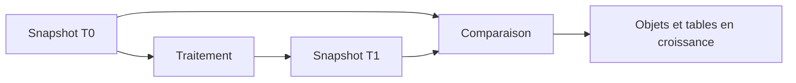

# 17. ANALYSE MÉMOIRE AVEC MEMORY INSPECTOR

## 17.A RÉSULTAT ATTENDU

- Comprendre le principe d’un snapshot mémoire
- Comparer deux états d’un traitement
- Identifier les tables, objets ou chaînes dominants
- Distinguer volume nécessaire et rétention anormale
- Relier l’analyse mémoire au code ABAP[^terme-abap]

## 17.B PRINCIPE

Le Memory Inspector analyse des snapshots de la mémoire d’un programme ABAP. La comparaison de deux snapshots permet de voir ce qui a été créé, augmenté ou conservé entre deux étapes.



## 17.C CAS D USAGE

- dump de manque de mémoire ;
- croissance progressive d’un traitement par lots ;
- table interne[^terme-table-interne] beaucoup plus volumineuse que prévu ;
- accumulation d’objets référencés ;
- chaînes ou buffers conservés ;
- différence importante entre deux étapes.

## 17.D SNAPSHOTS

Un snapshot représente un état. Une comparaison pertinente nécessite :

- même programme ;
- même scénario ;
- points de capture clairement définis ;
- volume connu ;
- absence de manipulations parasites entre les captures.

## 17.E VUES D ANALYSE

Selon la version, les vues peuvent présenter :

- synthèse ;
- tables internes ;
- classes et objets ;
- programmes ;
- chaînes ;
- relations ou cycles de références ;
- différences entre snapshots.

## 17.F INTERPRÉTATION

Une consommation élevée n’est pas automatiquement une fuite. Vérifier :

- nécessité fonctionnelle du volume ;
- durée de vie attendue ;
- libération à la fin de l’unité ;
- référence globale conservant un objet ;
- copie inutile d’une table ;
- accumulation dans une boucle ;
- résultat SQL[^terme-acro-sql] trop volumineux.

## 17.G ACTIONS DE CODE POSSIBLES

Après preuve :

- réduire les colonnes sélectionnées ;
- traiter par paquets ;
- éviter les copies ;
- libérer une table devenue inutile ;
- supprimer une référence conservée sans besoin ;
- revoir l’algorithme ;
- déplacer une agrégation vers la base lorsque pertinent.

Ne pas ajouter `FREE` partout sans mesurer. La gestion mémoire ABAP suit ses propres mécanismes et une libération prématurée peut dégrader la lisibilité sans résoudre la cause.

## 17.H PROCESS

### 17.H.1 Étape 1 — Définir deux points comparables

Choisir un point avant allocation et un point après le traitement suspect. Utiliser les mêmes données et éviter les interactions sans rapport entre les deux mesures.

### 17.H.2 Étape 2 — Créer le premier snapshot

Arrêter au premier breakpoint[^terme-breakpoint] et créer un snapshot mémoire depuis le débogueur ou l’outil disponible. Nommer la mesure avec scénario et étape.

### 17.H.3 Étape 3 — Créer le second snapshot

Poursuivre jusqu’au second point sans changer la sélection, puis créer le snapshot suivant. Vérifier que les deux captures appartiennent à la même exécution et au même utilisateur.

### 17.H.4 Étape 4 — Comparer les dominants

Ouvrir Memory Inspector, comparer taille totale, types, instances et références conservées. Chercher les objets dont le nombre ou la taille augmente sans être libéré après le traitement.

### 17.H.5 Étape 5 — Prouver l’origine

Relier le type dominant à sa création dans le code, corriger puis refaire les deux snapshots. La correction est validée lorsque l’écart attendu diminue avec un résultat fonctionnel identique.

## 17.I VÉRIFICATION

- Le scénario reproduit correspond au même utilisateur, mandant[^terme-mandant], transaction et jeu de données.
- L’horodatage et l’identifiant de l’analyse sont conservés.
- La cause retenue est soutenue par une ligne source, une trace[^terme-trace] ou une valeur observée.
- Après correction, le même scénario ne reproduit plus le défaut et le résultat métier reste identique.

## 17.J ERREURS FRÉQUENTES

- Modifier les données dans le débogueur puis considérer le résultat comme reproductible.
- Laisser une trace active trop longtemps.

## 17.K FICHE DE CONTRÔLE À COPIER

```text
Système / SID       :
Mandant             :
Utilisateur         :
Transaction / outil :
Objet technique     :
Jeu de données      :
Résultat attendu    :
Résultat observé    :
Horodatage          :
Ordre de transport  :
```

## 17.L TERMES DU LEXIQUE

- [Breakpoint](<../🧩 00 ├── LEXIQUE SAP ET ABAP/08 ├── EXECUTION EXPLOITATION ET ADMINISTRATION.md#breakpoint>)
- [Watchpoint](<../🧩 00 ├── LEXIQUE SAP ET ABAP/08 ├── EXECUTION EXPLOITATION ET ADMINISTRATION.md#watchpoint>)
- [Dump ABAP](<../🧩 00 ├── LEXIQUE SAP ET ABAP/08 ├── EXECUTION EXPLOITATION ET ADMINISTRATION.md#dump-abap>)
- [Trace](<../🧩 00 ├── LEXIQUE SAP ET ABAP/08 ├── EXECUTION EXPLOITATION ET ADMINISTRATION.md#trace>)

## 17.M RÉFÉRENCES OFFICIELLES SAP

- [Using the Memory Inspector Transaction — SAP Help Portal](https://help.sap.com/docs/ABAP_PLATFORM_NEW/ba879a6e2ea04d9bb94c7ccd7cdac446/49255f4629ac16b7e10000000a42189d.html)
- [Understanding the Memory Inspector Overview — SAP Help Portal](https://help.sap.com/docs/ABAP_PLATFORM_NEW/ba879a6e2ea04d9bb94c7ccd7cdac446/d538045f647c46adab25a98299a2dd03.html)
- [ABAP Test and Analysis Tools — SAP Help Portal](https://help.sap.com/docs/ABAP_PLATFORM_NEW/ba879a6e2ea04d9bb94c7ccd7cdac446/491aa66f87041903e10000000a42189c.html)

---

[Chapitre suivant — DIAGNOSTIC ET BONNES PRATIQUES](<./18 └── METHODE DE DIAGNOSTIC ET CHECKLIST.md>)

[^terme-abap]: **ABAP.** Langage de programmation de la plateforme ABAP, conçu pour développer des applications métier et techniques SAP. Voir [l’entrée du lexique](<../🧩 00 ├── LEXIQUE SAP ET ABAP/04 ├── LANGAGE ET DEVELOPPEMENT ABAP.md#abap>).
[^terme-table-interne]: **TABLE INTERNE.** Collection dynamique de lignes stockée en mémoire dans le programme ABAP. Voir [l’entrée du lexique](<../🧩 00 ├── LEXIQUE SAP ET ABAP/04 ├── LANGAGE ET DEVELOPPEMENT ABAP.md#table-interne>).
[^terme-acro-sql]: **SQL.** Structured Query Language. Voir [l’entrée du lexique](<../🧩 00 ├── LEXIQUE SAP ET ABAP/10 └── ACRONYMES SAP.md#acro-sql>).
[^terme-breakpoint]: **BREAKPOINT.** Point d’arrêt suspendant l’exécution dans le débogueur. Voir [l’entrée du lexique](<../🧩 00 ├── LEXIQUE SAP ET ABAP/08 ├── EXECUTION EXPLOITATION ET ADMINISTRATION.md#breakpoint>).
[^terme-mandant]: **MANDANT.** Subdivision logique d’un système SAP. Il est identifié par un numéro à trois chiffres et isole une partie des données, du paramétrage et des utilisateurs. Voir [l’entrée du lexique](<../🧩 00 ├── LEXIQUE SAP ET ABAP/01 ├── SYSTEMES ENVIRONNEMENTS ET MANDANTS.md#mandant>).
[^terme-trace]: **TRACE.** Enregistrement détaillé d’événements techniques pour analyser exécution, SQL ou appels. Voir [l’entrée du lexique](<../🧩 00 ├── LEXIQUE SAP ET ABAP/08 ├── EXECUTION EXPLOITATION ET ADMINISTRATION.md#trace>).
