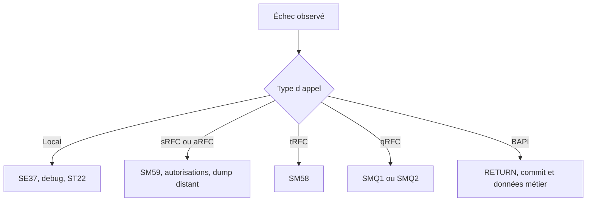

# 18. DIAGNOSTIC ET BONNES PRATIQUES

## 18.A RÉSULTAT ATTENDU

- Diagnostiquer un échec local, RFC[^terme-rfc] ou BAPI[^terme-bapi]
- Utiliser les transactions adaptées
- Vérifier le contrat avant de modifier le code
- Appliquer une checklist de conception et d’exploitation

## 18.B MÉTHODE DE DIAGNOSTIC



## 18.C QUESTIONS PRIORITAIRES

1. Le module appelé est-il le bon ?
2. L’interface active correspond-elle à l’appel ?
3. Les paramètres obligatoires sont-ils fournis ?
4. `sy-subrc` ou `RETURN` ont-ils été analysés immédiatement ?
5. La destination fonctionne-t-elle ?
6. L’utilisateur cible possède-t-il les autorisations ?
7. Un dump existe-t-il dans le système cible ?
8. Une unité tRFC[^terme-trfc] ou qRFC[^terme-qrfc] est-elle bloquée ?
9. Le commit attendu a-t-il été exécuté ?
10. Le traitement est-il idempotent avant relance ?

## 18.D OUTILS

| Outil           | Usage                                                     |
| --------------- | --------------------------------------------------------- |
| `SE37`[^outil-se37]          | Interface, test et documentation                          |
| `SE80`[^outil-se80]          | Groupe de fonctions et dépendances                        |
| `SM59`[^outil-sm59]          | Destinations et tests RFC                                 |
| `SM58`[^outil-sm58]          | tRFC                                                      |
| `SMQ1`[^outil-smq1] / `SMQ2`[^outil-smq2] | qRFC sortant et entrant                                   |
| `SM13`[^outil-sm13]          | Tâches de mise à jour                                     |
| `ST22`[^outil-st22]          | Dumps locaux ou distants                                  |
| `SU53`[^outil-su53]          | Dernier échec d’autorisation dans le contexte utilisateur |
| `STAUTHTRACE`[^outil-stauthtrace]   | Analyse d’autorisations selon les droits et procédures    |
| `SLG1`[^outil-slg1]          | Journal applicatif lorsqu’il est utilisé                  |

## 18.E CHECKLIST DE CONCEPTION

- Le nom décrit l’action et le périmètre.
- Le groupe de fonctions est cohérent.
- L’interface est minimale et typée.
- Les paramètres facultatifs sont documentés.
- Les erreurs sont structurées.
- Aucun état global caché n’est nécessaire.
- Le module ne déclenche pas de commit imprévu.
- Le module RFC valide toutes les entrées externes.
- Les autorisations métier sont contrôlées.
- Les volumes et temps de réponse sont bornés.
- La compatibilité des consommateurs est prise en compte.

## 18.F CHECKLIST D APPEL

- Générer le modèle d’appel depuis l’interface active.
- Contrôler `sy-subrc` immédiatement.
- Intercepter `SYSTEM_FAILURE` et `COMMUNICATION_FAILURE` pour un RFC classique.
- Analyser toute la table `RETURN` d’une BAPI.
- Utiliser commit ou rollback selon le modèle documenté.
- Journaliser la clé métier et l’identifiant de corrélation.
- Ne pas relancer une unité asynchrone sans analyse d’idempotence.

## 18.G RÈGLE FINALE

Une fonction visible dans `SE37` n’est pas automatiquement une API[^terme-api] stable. Une exécution réussie dans le système de développement ne prouve ni la sécurité, ni la compatibilité, ni la robustesse distribuée du scénario.

## 18.H PROCESS

### 18.H.1 Étape 1 — Décrire sans interpréter

Noter contexte, données, résultat attendu et résultat observé. Classer le symptôme : erreur fonctionnelle, dump, performance, mémoire, job[^terme-job] ou appel distant.

### 18.H.2 Étape 2 — Reproduire de façon minimale

Réduire les données et reproduire une fois. Si le défaut disparaît, réintroduire un paramètre à la fois jusqu’à identifier la condition nécessaire.

### 18.H.3 Étape 3 — Choisir l’outil

Utiliser débogueur pour le flux, `ST22` pour un dump, `SAT`[^outil-sat] pour le temps ABAP[^terme-abap], `ST05`[^outil-st05] pour SQL[^terme-acro-sql], `ST12`[^outil-st12] pour une corrélation, `SM37`[^outil-sm37] pour un job et Memory Inspector pour les allocations.

### 18.H.4 Étape 4 — Chercher la première divergence

Comparer le chemin attendu au chemin réel. Remonter pile, paramètres et valeurs jusqu’au dernier état correct, puis isoler l’instruction suivante.

### 18.H.5 Étape 5 — Corriger une cause

Modifier uniquement la cause prouvée. Exécuter le contrôle syntaxique et les tests de l’objet réellement responsable, puis l’activer avec ses dépendances. Documenter le lien entre la preuve observée, la correction et le résultat attendu.

### 18.H.6 Étape 6 — Vérifier et clôturer

Rejouer le cas fautif, un cas nominal et une limite. Retirer traces et breakpoints. Le diagnostic est clos lorsque la preuve avant/après est conservée et qu’aucun effet de bord nouveau n’apparaît.

## 18.I VÉRIFICATION

- Le scénario reproduit correspond au même utilisateur, mandant[^terme-mandant], transaction et jeu de données.
- L’horodatage et l’identifiant de l’analyse sont conservés.
- La cause retenue est soutenue par une ligne source, une trace[^terme-trace] ou une valeur observée.
- Après correction, le même scénario ne reproduit plus le défaut et le résultat métier reste identique.

## 18.J ERREURS FRÉQUENTES

- Modifier les données dans le débogueur puis considérer le résultat comme reproductible.
- Laisser une trace active trop longtemps.

## 18.K FICHE DE CONTRÔLE À COPIER

```text
Système / SID       :
Mandant             :
Utilisateur         :
Transaction / outil :
Objet technique     :
Jeu de données      :
Résultat attendu    :
Résultat observé    :
Horodatage          :
Ordre de transport  :
```

## 18.L TERMES DU LEXIQUE

- [Breakpoint](<../🧩 00 ├── LEXIQUE SAP ET ABAP/08 ├── EXECUTION EXPLOITATION ET ADMINISTRATION.md#breakpoint>)
- [Watchpoint](<../🧩 00 ├── LEXIQUE SAP ET ABAP/08 ├── EXECUTION EXPLOITATION ET ADMINISTRATION.md#watchpoint>)
- [Dump ABAP](<../🧩 00 ├── LEXIQUE SAP ET ABAP/08 ├── EXECUTION EXPLOITATION ET ADMINISTRATION.md#dump-abap>)
- [Trace](<../🧩 00 ├── LEXIQUE SAP ET ABAP/08 ├── EXECUTION EXPLOITATION ET ADMINISTRATION.md#trace>)

## 18.M RÉFÉRENCES OFFICIELLES SAP

- [Looking Up Function Modules — SAP Help Portal](https://help.sap.com/docs/ABAP_PLATFORM_NEW/bd833c8355f34e96a6e83096b38bf192/d1801ec1454211d189710000e8322d00.html)
- [Calling RFC Function Modules in ABAP — SAP Help Portal](https://help.sap.com/docs/ABAP_PLATFORM_NEW/753088fc00704d0a80e7fbd6803c8adb/48a0f18641bc062de10000000a42189d.html)
- [Monitoring the Transactional RFC — SAP Help Portal](https://help.sap.com/docs/SAP_S4HANA_ON-PREMISE/8999cee59b7c44fdb53fbbb4d703f8e6/df6ad0531d8b4208e10000000a174cb4.html)

[^terme-rfc]: **RFC.** Remote Function Call, mécanisme permettant d’appeler un module fonction compatible dans un autre contexte ou système. Voir [l’entrée du lexique](<../🧩 00 ├── LEXIQUE SAP ET ABAP/06 ├── PROGRAMMES CLASSES ET OBJETS TECHNIQUES.md#rfc>).
[^terme-bapi]: **BAPI.** Interface métier publiée autour d’un Business Object SAP, généralement implémentée par un module fonction RFC. Voir [l’entrée du lexique](<../🧩 00 ├── LEXIQUE SAP ET ABAP/06 ├── PROGRAMMES CLASSES ET OBJETS TECHNIQUES.md#bapi>).
[^terme-trfc]: **TRFC.** RFC transactionnel garantissant la répétition d’un appel jusqu’à son traitement unique côté protocole. Voir [l’entrée du lexique](<../🧩 00 ├── LEXIQUE SAP ET ABAP/07 ├── INTERFACES ET INTEGRATION.md#trfc>).
[^terme-qrfc]: **QRFC.** RFC transactionnel avec gestion de files afin de respecter un ordre de traitement. Voir [l’entrée du lexique](<../🧩 00 ├── LEXIQUE SAP ET ABAP/07 ├── INTERFACES ET INTEGRATION.md#qrfc>).
[^terme-api]: **API.** Application Programming Interface, contrat exposant des opérations ou données utilisables par d’autres composants. Voir [l’entrée du lexique](<../🧩 00 ├── LEXIQUE SAP ET ABAP/10 └── ACRONYMES SAP.md#api>).
[^terme-job]: **JOB.** Traitement planifié en arrière-plan composé d’une ou plusieurs étapes. Voir [l’entrée du lexique](<../🧩 00 ├── LEXIQUE SAP ET ABAP/06 ├── PROGRAMMES CLASSES ET OBJETS TECHNIQUES.md#job>).
[^terme-abap]: **ABAP.** Langage de programmation de la plateforme ABAP, conçu pour développer des applications métier et techniques SAP. Voir [l’entrée du lexique](<../🧩 00 ├── LEXIQUE SAP ET ABAP/04 ├── LANGAGE ET DEVELOPPEMENT ABAP.md#abap>).
[^terme-acro-sql]: **SQL.** Structured Query Language. Voir [l’entrée du lexique](<../🧩 00 ├── LEXIQUE SAP ET ABAP/10 └── ACRONYMES SAP.md#acro-sql>).
[^terme-mandant]: **MANDANT.** Subdivision logique d’un système SAP. Il est identifié par un numéro à trois chiffres et isole une partie des données, du paramétrage et des utilisateurs. Voir [l’entrée du lexique](<../🧩 00 ├── LEXIQUE SAP ET ABAP/01 ├── SYSTEMES ENVIRONNEMENTS ET MANDANTS.md#mandant>).
[^terme-trace]: **TRACE.** Enregistrement détaillé d’événements techniques pour analyser exécution, SQL ou appels. Voir [l’entrée du lexique](<../🧩 00 ├── LEXIQUE SAP ET ABAP/08 ├── EXECUTION EXPLOITATION ET ADMINISTRATION.md#trace>).

[^outil-se37]: **SE37.** Function Builder utilisé pour rechercher, afficher, tester et maintenir les modules fonction. Voir [le chapitre associé](<../🧩 12 ├── MODULES FONCTION RFC ET BAPI/03 ├── RECHERCHER ET ANALYSER AVEC SE37.md>).
[^outil-se80]: **SE80.** Object Navigator utilisé pour parcourir et maintenir les objets du Repository ABAP. Voir [le chapitre associé](<../🧩 01 ├── FONDAMENTAUX ABAP/04 ├── EDITEURS ABAP SE38 ET SE80.md>).
[^outil-sm59]: **SM59.** Transaction de création, test et maintenance des destinations RFC. Voir [le chapitre associé](<../🧩 12 ├── MODULES FONCTION RFC ET BAPI/14 ├── DESTINATIONS RFC AVEC SM59.md>).
[^outil-sm58]: **SM58.** Moniteur des appels tRFC en attente ou en erreur. Voir [le chapitre associé](<../🧩 12 ├── MODULES FONCTION RFC ET BAPI/16 ├── TRFC QRFC ET SURVEILLANCE.md>).
[^outil-smq1]: **SMQ1.** Moniteur des files qRFC sortantes. Voir [le chapitre associé](<../🧩 12 ├── MODULES FONCTION RFC ET BAPI/16 ├── TRFC QRFC ET SURVEILLANCE.md>).
[^outil-smq2]: **SMQ2.** Moniteur des files qRFC entrantes. Voir [le chapitre associé](<../🧩 12 ├── MODULES FONCTION RFC ET BAPI/16 ├── TRFC QRFC ET SURVEILLANCE.md>).
[^outil-sm13]: **SM13.** Transaction de surveillance et de reprise des enregistrements de mise à jour SAP. Voir [le chapitre associé](<../🧩 16 ├── LUW VERROUILLAGES ET MISES A JOUR/19 ├── ANALYSER ET REPRENDRE LES UPDATES AVEC SM13.md>).
[^outil-st22]: **ST22.** Transaction d’analyse des terminaisons anormales et dumps ABAP. Voir [le chapitre associé](<13 ├── ANALYSER LES DUMPS AVEC ST22.md>).
[^outil-su53]: **SU53.** Transaction affichant les derniers contrôles d’autorisation en échec pour l’utilisateur courant. Voir [le chapitre associé](<../🧩 21 ├── AUTORISATIONS ET SECURITE ABAP/02 ├── DIAGNOSTIQUER UN REFUS AVEC SU53 ET STAUTHTRACE.md>).
[^outil-stauthtrace]: **STAUTHTRACE.** Trace d’autorisations utilisée pour enregistrer et analyser les contrôles exécutés pendant un scénario. Voir [le chapitre associé](<../🧩 21 ├── AUTORISATIONS ET SECURITE ABAP/02 ├── DIAGNOSTIQUER UN REFUS AVEC SU53 ET STAUTHTRACE.md>).
[^outil-slg1]: **SLG1.** Transaction de recherche et d’affichage des journaux applicatifs persistés. Voir [le chapitre associé](<../🧩 19 ├── JOURNAUX APPLICATIFS/05 ├── ANALYSER LES JOURNAUX AVEC SLG1.md>).
[^outil-sat]: **SAT.** Runtime Analysis utilisée pour mesurer et analyser le temps d’exécution ABAP. Voir [le chapitre associé](<../🧩 20 ├── PERFORMANCE QUALITE ET TESTS/07 ├── MESURER LE TEMPS D EXECUTION AVEC SAT.md>).
[^outil-st05]: **ST05.** Performance Trace utilisée notamment pour enregistrer et analyser les accès SQL. Voir [le chapitre associé](<../🧩 20 ├── PERFORMANCE QUALITE ET TESTS/08 ├── ANALYSER LES ACCES SQL AVEC ST05.md>).
[^outil-st12]: **ST12.** Outil d’analyse ciblée combinant des traces ABAP et SQL pour un scénario reproduit. Voir [le chapitre associé](<16 ├── ANALYSE CIBLEE AVEC ST12.md>).
[^outil-sm37]: **SM37.** Transaction de recherche, surveillance et administration des jobs d’arrière-plan. Voir [le chapitre associé](<../🧩 18 ├── TRAITEMENTS EN ARRIERE PLAN/15 ├── SURVEILLER LES JOBS AVEC SM37.md>).
