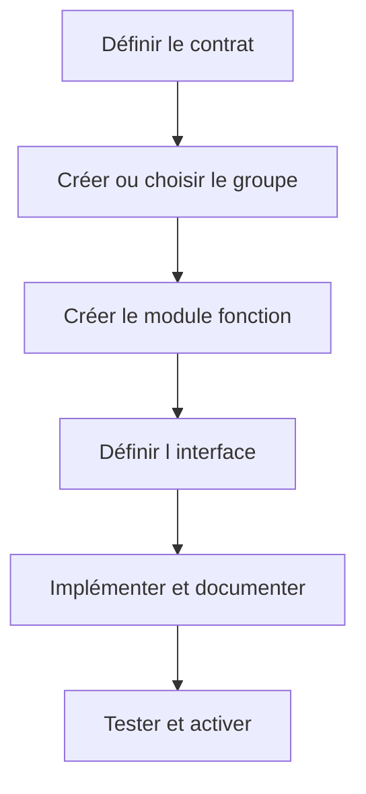

# 4. CRÉER UN GROUPE ET UN MODULE FONCTION

## 4.A RÉSULTAT ATTENDU

- Créer un groupe de fonctions dans le namespace client[^terme-namespace-client]
- Créer un module fonction[^terme-module-fonction] dans `SE37`[^outil-se37]
- Affecter les objets au package[^terme-package] et à l’ordre de transport[^terme-ordre-transport]
- Respecter les étapes d’activation

## 4.B PRÉREQUIS

Définir avant la création :

- responsabilité du module ;
- nom dans le namespace client ;
- package ;
- groupe de fonctions ;
- interface prévue ;
- stratégie d’erreur ;
- type de traitement.

## 4.C CRÉATION DU GROUPE

Le groupe peut être créé depuis `SE80`[^outil-se80] ou lors de la création du module selon le système.

Exemple :

```text
Groupe de fonctions : ZFG_DEV_PRODUCT
Description          : Services classiques sur les produits
Package              : ZDEV_ABAP
```

## 4.D CRÉATION DU MODULE

Dans `SE37` :

1. saisir `Z_DEV_PRODUCT_GET` ;
2. choisir **Créer** ;
3. renseigner le groupe `ZFG_DEV_PRODUCT` ;
4. saisir une description précise ;
5. définir l’interface ;
6. implémenter le traitement ;
7. documenter ;
8. vérifier la syntaxe ;
9. activer le module et le groupe.



## 4.E NOMMAGE

Le nom doit exprimer une action et un périmètre. Exemples :

- `Z_DEV_PRODUCT_GET`
- `Z_DEV_PRODUCT_VALIDATE`
- `Z_DEV_ORDER_CREATE`

Éviter :

- `Z_TEST1` ;
- `Z_FUNCTION` ;
- noms dépendant d’un écran ou d’un utilisateur ;
- abréviations incompréhensibles.

## 4.F TRANSPORT

Le groupe de fonctions et les modules sont des objets Repository. Vérifier que :

- le package n’est pas `$TMP`[^terme-objet-local-tmp] pour un développement transportable ;
- tous les sous-objets sont enregistrés dans l’ordre correct ;
- les types DDIC[^terme-acro-ddic] requis sont transportés avant ou avec le module ;
- l’activation est complète dans le système source.

## 4.G PROCESS

### 4.G.1 Étape 1 — Définir le périmètre du groupe

Regrouper uniquement des modules partageant un même domaine et, si nécessaire, des données globales maîtrisées. Définir package, préfixe et responsable avant la création.

### 4.G.2 Étape 2 — Créer le groupe dans SE80

Ouvrir `SE80`, sélectionner **Groupe de fonctions**, saisir le nom client et choisir **Créer**. Renseigner description, package et tâche de transport[^terme-tache-transport].

### 4.G.3 Étape 3 — Créer le module

Depuis le groupe, créer le module `Z...`, renseigner texte court et type de traitement. Ne cocher RFC[^terme-rfc] ou update que si le scénario impose réellement ces contraintes.

### 4.G.4 Étape 4 — Définir signature et code minimal

Créer les paramètres avec des types DDIC stables, ajouter les exceptions puis implémenter un traitement sans commit implicite. Contrôler chaque objet dépendant.

### 4.G.5 Étape 5 — Activer et tester

Activer le groupe et le module, tester cas nominal et erreur dans `SE37`, puis vérifier l’ordre de transport. La création est terminée lorsque l’appel ne dépend d’aucune initialisation cachée.

## 4.H VÉRIFICATION

- Le lecteur peut expliquer la différence entre cette notion et les concepts proches.
- Le choix technique est justifié par un besoin concret, pas uniquement par habitude.
- Les limites liées à la release, aux autorisations et au contexte d’exécution sont identifiées.

## 4.I ERREURS FRÉQUENTES

- Appeler un module fonction sans lire sa documentation et ses exceptions.
- Supposer qu’une BAPI[^terme-bapi] effectue automatiquement le commit.

## 4.J FICHE DE CONTRÔLE À COPIER

```text
Système / SID       :
Mandant             :
Utilisateur         :
Transaction / outil :
Objet technique     :
Jeu de données      :
Résultat attendu    :
Résultat observé    :
Horodatage          :
Ordre de transport  :
```

## 4.K TERMES DU LEXIQUE

- [Module fonction](<../🧩 00 ├── LEXIQUE SAP ET ABAP/06 ├── PROGRAMMES CLASSES ET OBJETS TECHNIQUES.md#module-fonction>)
- [Function group](<../🧩 00 ├── LEXIQUE SAP ET ABAP/06 ├── PROGRAMMES CLASSES ET OBJETS TECHNIQUES.md#function-group>)
- [RFC](<../🧩 00 ├── LEXIQUE SAP ET ABAP/10 └── ACRONYMES SAP.md#acro-rfc>)
- [BAPI](<../🧩 00 ├── LEXIQUE SAP ET ABAP/10 └── ACRONYMES SAP.md#acro-bapi>)
- [Destination RFC](<../🧩 00 ├── LEXIQUE SAP ET ABAP/07 ├── INTERFACES ET INTEGRATION.md#destination-rfc>)

## 4.L RÉFÉRENCES OFFICIELLES SAP

- [Creating New Function Modules — SAP Help Portal](https://help.sap.com/docs/ABAP_PLATFORM_NEW/bd833c8355f34e96a6e83096b38bf192/d1801ee8454211d189710000e8322d00.html)
- [Working with ABAP Function Groups and Modules — SAP Help Portal](https://help.sap.com/docs/ABAP_PLATFORM_NEW/c238d694b825421f940829321ffa326a/5b3370ee088a4e2b9579da3f6e994456.html)

---

[Chapitre suivant — DÉFINIR L INTERFACE DU MODULE FONCTION](<./05 ├── DEFINIR L INTERFACE DU MODULE FONCTION.md>)

[^terme-namespace-client]: **NAMESPACE CLIENT.** Espace de noms réservé aux développements spécifiques, souvent préfixés par `Z` ou `Y`. Voir [l’entrée du lexique](<../🧩 00 ├── LEXIQUE SAP ET ABAP/03 ├── REPOSITORY PACKAGES ET TRANSPORTS.md#namespace-client>).
[^terme-module-fonction]: **MODULE FONCTION.** Procédure globale appelée avec `CALL FUNCTION` et définie dans un groupe de fonctions. Voir [l’entrée du lexique](<../🧩 00 ├── LEXIQUE SAP ET ABAP/06 ├── PROGRAMMES CLASSES ET OBJETS TECHNIQUES.md#module-fonction>).
[^terme-package]: **PACKAGE.** Conteneur logique qui regroupe les objets de développement et détermine notamment leur transportabilité. Voir [l’entrée du lexique](<../🧩 00 ├── LEXIQUE SAP ET ABAP/03 ├── REPOSITORY PACKAGES ET TRANSPORTS.md#package>).
[^terme-ordre-transport]: **ORDRE DE TRANSPORT.** Conteneur qui regroupe des modifications à exporter puis importer dans d’autres systèmes. Voir [l’entrée du lexique](<../🧩 00 ├── LEXIQUE SAP ET ABAP/03 ├── REPOSITORY PACKAGES ET TRANSPORTS.md#ordre-transport>).
[^terme-objet-local-tmp]: **OBJET LOCAL $TMP.** Objet affecté au package local `$TMP`, non destiné au transport vers un autre système. Voir [l’entrée du lexique](<../🧩 00 ├── LEXIQUE SAP ET ABAP/03 ├── REPOSITORY PACKAGES ET TRANSPORTS.md#objet-local-tmp>).
[^terme-acro-ddic]: **DDIC.** Data Dictionary, abréviation courante de l’ABAP Dictionary. Voir [l’entrée du lexique](<../🧩 00 ├── LEXIQUE SAP ET ABAP/10 └── ACRONYMES SAP.md#acro-ddic>).
[^terme-tache-transport]: **TÂCHE DE TRANSPORT.** Sous-conteneur affecté à un utilisateur dans un ordre de transport. Voir [l’entrée du lexique](<../🧩 00 ├── LEXIQUE SAP ET ABAP/03 ├── REPOSITORY PACKAGES ET TRANSPORTS.md#tache-transport>).
[^terme-rfc]: **RFC.** Remote Function Call, mécanisme permettant d’appeler un module fonction compatible dans un autre contexte ou système. Voir [l’entrée du lexique](<../🧩 00 ├── LEXIQUE SAP ET ABAP/06 ├── PROGRAMMES CLASSES ET OBJETS TECHNIQUES.md#rfc>).
[^terme-bapi]: **BAPI.** Interface métier publiée autour d’un Business Object SAP, généralement implémentée par un module fonction RFC. Voir [l’entrée du lexique](<../🧩 00 ├── LEXIQUE SAP ET ABAP/06 ├── PROGRAMMES CLASSES ET OBJETS TECHNIQUES.md#bapi>).

[^outil-se37]: **SE37.** Function Builder utilisé pour rechercher, afficher, tester et maintenir les modules fonction. Voir [le chapitre associé](<03 ├── RECHERCHER ET ANALYSER AVEC SE37.md>).
[^outil-se80]: **SE80.** Object Navigator utilisé pour parcourir et maintenir les objets du Repository ABAP. Voir [le chapitre associé](<../🧩 01 ├── FONDAMENTAUX ABAP/04 ├── EDITEURS ABAP SE38 ET SE80.md>).
