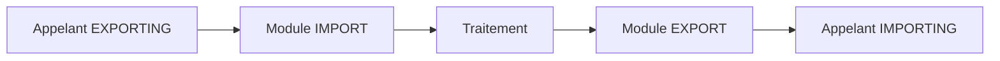

# 5. DÉFINIR L INTERFACE DU MODULE FONCTION

## 5.A RÉSULTAT ATTENDU

- Comprendre le sens des paramètres de l’interface
- Choisir entre import, export, modification et tables
- Définir les paramètres facultatifs et valeurs par défaut
- Construire un contrat minimal et explicite

## 5.B PERSPECTIVE DU MODULE

Les directions sont définies du point de vue du module fonction[^terme-module-fonction].

| Section `SE37`[^outil-se37] | Sens dans le module              | Section lors de l’appel |
| -------------- | -------------------------------- | ----------------------- |
| Import         | Le module reçoit                 | `EXPORTING`             |
| Export         | Le module retourne               | `IMPORTING`             |
| Modification   | Le module reçoit et retourne     | `CHANGING`              |
| Tables         | Table bidirectionnelle classique | `TABLES`                |



## 5.C EXEMPLE D INTERFACE

Module fictif `Z_DEV_PRODUCT_GET` :

```text
IMPORT
  IV_MATNR TYPE MATNR

EXPORT
  ES_MARA  TYPE MARA

EXCEPTIONS
  NOT_FOUND
  INVALID_INPUT
```

L’appelant fournit le numéro article et reçoit la structure uniquement lorsque la lecture réussit.

## 5.D PARAMÈTRES CHANGING

Utiliser `CHANGING` seulement lorsqu’une donnée représente réellement un état d’entrée-sortie. Ne pas l’utiliser pour réduire artificiellement le nombre de paramètres.

## 5.E PARAMÈTRES TABLES

`TABLES` est une forme classique encore présente dans de nombreuses API[^terme-api]. Pour un nouveau module non contraint par un framework, préférer généralement un paramètre tabulaire correctement typé dans `IMPORT`, `EXPORT` ou `CHANGING` lorsque la version le permet.

## 5.F FACULTATIF ET VALEUR PAR DÉFAUT

Un paramètre facultatif doit avoir un comportement documenté lorsque l’appelant ne le fournit pas.

Exemple :

```text
IV_LANGUAGE TYPE SYLANGU OPTIONAL
```

Le code peut ensuite utiliser `sy-langu` si le paramètre est initial. Éviter les paramètres facultatifs dont l’absence produit un comportement ambigu.

## 5.G CONTRAT MINIMAL

Une bonne interface :

- expose uniquement les données nécessaires ;
- utilise des types stables ;
- évite les structures excessivement larges ;
- ne dépend pas de données globales cachées ;
- documente les unités, formats et règles ;
- sépare résultat métier et diagnostic.

## 5.H PROCESS

### 5.H.1 Étape 1 — Écrire le contrat avant les onglets

Lister données nécessaires, résultats, valeurs modifiées et erreurs. Une donnée uniquement lue appartient à Import ; un résultat à Export ; une valeur lue puis modifiée à Changing.

### 5.H.2 Étape 2 — Ajouter les paramètres

Dans `SE37`, ouvrir le module en modification et saisir les paramètres dans les onglets correspondants. Utiliser des types DDIC[^terme-acro-ddic] adaptés au partage et des noms décrivant le rôle métier.

### 5.H.3 Étape 3 — Définir obligation et passage

Marquer les paramètres facultatifs uniquement si le code possède un comportement clair en leur absence. Choisir passage par valeur ou référence selon le contrat, sans utiliser Changing comme raccourci pour multiplier les sorties.

### 5.H.4 Étape 4 — Définir les erreurs

Ajouter exceptions classiques ou structure de retour selon le type d’API. Chaque erreur doit être déclenchée par une condition identifiable et documentée.

### 5.H.5 Étape 5 — Tester chaque combinaison

Exécuter tous les paramètres obligatoires, chaque option facultative et chaque exception[^terme-exception]. L’interface est validée lorsque l’appelant peut comprendre le résultat uniquement depuis la signature et la documentation.

## 5.I VÉRIFICATION

- Le lecteur peut expliquer la différence entre cette notion et les concepts proches.
- Le choix technique est justifié par un besoin concret, pas uniquement par habitude.
- Les limites liées à la release, aux autorisations et au contexte d’exécution sont identifiées.

## 5.J ERREURS FRÉQUENTES

- Appeler un module fonction sans lire sa documentation et ses exceptions.
- Supposer qu’une BAPI[^terme-bapi] effectue automatiquement le commit.

## 5.K FICHE DE CONTRÔLE À COPIER

```text
Système / SID       :
Mandant             :
Utilisateur         :
Transaction / outil :
Objet technique     :
Jeu de données      :
Résultat attendu    :
Résultat observé    :
Horodatage          :
Ordre de transport  :
```

## 5.L TERMES DU LEXIQUE

- [Module fonction](<../🧩 00 ├── LEXIQUE SAP ET ABAP/06 ├── PROGRAMMES CLASSES ET OBJETS TECHNIQUES.md#module-fonction>)
- [Interface](<../🧩 00 ├── LEXIQUE SAP ET ABAP/07 ├── INTERFACES ET INTEGRATION.md#interface-integration>)
- [Function group](<../🧩 00 ├── LEXIQUE SAP ET ABAP/06 ├── PROGRAMMES CLASSES ET OBJETS TECHNIQUES.md#function-group>)
- [RFC](<../🧩 00 ├── LEXIQUE SAP ET ABAP/10 └── ACRONYMES SAP.md#acro-rfc>)
- [BAPI](<../🧩 00 ├── LEXIQUE SAP ET ABAP/10 └── ACRONYMES SAP.md#acro-bapi>)
- [Destination RFC](<../🧩 00 ├── LEXIQUE SAP ET ABAP/07 ├── INTERFACES ET INTEGRATION.md#destination-rfc>)

## 5.M RÉFÉRENCES OFFICIELLES SAP

- [Specifying Parameters and Exceptions — SAP Help Portal](https://help.sap.com/docs/ABAP_PLATFORM_2021/bd833c8355f34e96a6e83096b38bf192/d1801f0f454211d189710000e8322d00.html)
- [Interface Parameters of a Function Module — SAP Help Portal](https://help.sap.com/docs/SAP_NETWEAVER_702/ff59ad5d6c55101492f7f1c64dee0529/d1801ece454211d189710000e8322d00.html)

---

[Chapitre suivant — TYPAGE, PASSAGE DE PARAMÈTRES ET COMPATIBILITÉ](<./06 ├── TYPAGE PASSAGE DE PARAMETRES ET COMPATIBILITE.md>)

[^terme-module-fonction]: **MODULE FONCTION.** Procédure globale appelée avec `CALL FUNCTION` et définie dans un groupe de fonctions. Voir [l’entrée du lexique](<../🧩 00 ├── LEXIQUE SAP ET ABAP/06 ├── PROGRAMMES CLASSES ET OBJETS TECHNIQUES.md#module-fonction>).
[^terme-api]: **API.** Application Programming Interface, contrat exposant des opérations ou données utilisables par d’autres composants. Voir [l’entrée du lexique](<../🧩 00 ├── LEXIQUE SAP ET ABAP/10 └── ACRONYMES SAP.md#api>).
[^terme-acro-ddic]: **DDIC.** Data Dictionary, abréviation courante de l’ABAP Dictionary. Voir [l’entrée du lexique](<../🧩 00 ├── LEXIQUE SAP ET ABAP/10 └── ACRONYMES SAP.md#acro-ddic>).
[^terme-exception]: **EXCEPTION.** Objet ou signal représentant une situation anormale qu’un appelant peut traiter. Voir [l’entrée du lexique](<../🧩 00 ├── LEXIQUE SAP ET ABAP/04 ├── LANGAGE ET DEVELOPPEMENT ABAP.md#exception>).
[^terme-bapi]: **BAPI.** Interface métier publiée autour d’un Business Object SAP, généralement implémentée par un module fonction RFC. Voir [l’entrée du lexique](<../🧩 00 ├── LEXIQUE SAP ET ABAP/06 ├── PROGRAMMES CLASSES ET OBJETS TECHNIQUES.md#bapi>).

[^outil-se37]: **SE37.** Function Builder utilisé pour rechercher, afficher, tester et maintenir les modules fonction. Voir [le chapitre associé](<03 ├── RECHERCHER ET ANALYSER AVEC SE37.md>).
