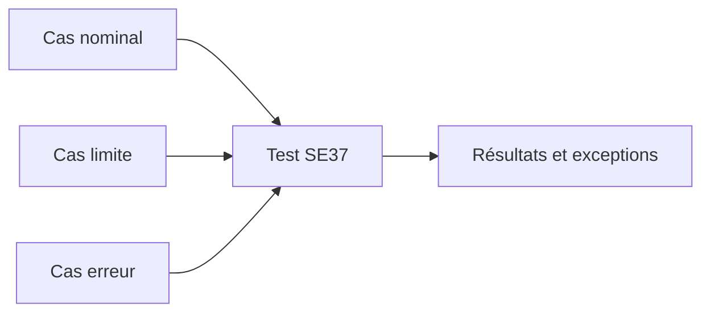

# 10. TEST, DOCUMENTATION ET LIBÉRATION

## 10.A RÉSULTAT ATTENDU

- Tester un module dans `SE37`[^outil-se37]
- Constituer des données de test reproductibles
- Documenter le contrat complet
- Comprendre la portée d’un statut de libération

## 10.B TEST DIRECT

Dans `SE37`, choisir **Tester / Exécuter**. L’écran de test reprend les sections de l’interface.

Procédure :

### 10.B.1 Étape 1 — Préparer un jeu de données

Relever une clé existante pour le cas nominal, une clé absente et une valeur limite. Identifier avant le test les effets persistants ou appels externes possibles.

### 10.B.2 Étape 2 — Renseigner l’interface

Dans `SE37`, choisir **Tester/Exécuter** et saisir tous les imports obligatoires. Pour les structures et tables, contrôler chaque composant et son format interne.

### 10.B.3 Étape 3 — Exécuter et relever toutes les sorties

Noter exports, changing, tables, exception[^terme-exception] et messages. Comparer avec le résultat attendu avant de modifier une entrée.

### 10.B.4 Étape 4 — Vérifier les effets de bord

Rechercher les écritures, verrous, tâches update ou commits indiqués par le contrat. Nettoyer les données de test selon la procédure prévue.

### 10.B.5 Étape 5 — Tester les autres branches

Recommencer avec cas absent, limite et chaque erreur prévue. Le test direct est validé lorsque toutes les branches ont un résultat observable et reproductible.



## 10.C SÉQUENCES DE TEST

Certains modules doivent être testés dans une séquence, par exemple :

### 10.C.1 Étape 1 — Définir l’ordre imposé

Identifier le module d’initialisation, la lecture, la modification et le module ou BAPI[^terme-bapi] de validation. Relever les données transmises entre appels.

### 10.C.2 Étape 2 — Construire la séquence

Dans l’outil de séquence `SE37`, ajouter les modules dans cet ordre et renseigner des entrées cohérentes. Ne valider pas encore la transaction si le test doit contrôler un rollback.

### 10.C.3 Étape 3 — Exécuter jusqu’à la modification

Contrôler les sorties après chaque appel. Si une étape échoue, arrêter : les étapes suivantes ne doivent pas masquer la première erreur.

### 10.C.4 Étape 4 — Tester validation et annulation

Exécuter une séquence avec commit prévu, puis une autre avec rollback. Vérifier la persistance réelle des données dans les deux cas.

Utiliser les fonctions de séquence de test disponibles dans le Function Builder lorsque le scénario l’exige. Ne pas conclure à un défaut uniquement parce qu’un module transactionnel a été appelé isolément.

## 10.D DOCUMENTATION

Documenter :

- objectif métier ou technique ;
- préconditions ;
- paramètres et unités ;
- valeurs facultatives ;
- effets en base ;
- exceptions et messages ;
- gestion du commit ;
- autorisations requises ;
- restrictions RFC[^terme-rfc] éventuelles.

## 10.E LIBÉRATION

Un indicateur de libération ou une documentation d’API[^terme-api] est une information importante pour les consommateurs. Pour un objet SAP[^terme-acro-sap] standard, ne pas déduire la stabilité publique du simple fait que le module est visible ou testable.

Pour un module client :

- définir les consommateurs autorisés ;
- établir une politique de compatibilité ;
- éviter les suppressions ou changements incompatibles ;
- versionner lorsque nécessaire.

## 10.F LIMITES DU TEST SE37

Le test direct ne remplace pas :

- un test du programme appelant ;
- un test d’autorisation RFC ;
- un test de destination ;
- un test de concurrence ;
- un test de rollback ;
- un test automatisé autour de la logique métier.

## 10.G PROCESS

### 10.G.1 Étape 1 — Compléter la documentation

Documenter objectif, paramètres, unités, valeurs initiales, exceptions, autorisations et responsabilité de commit. Un lecteur doit pouvoir construire un appel sans lire l’implémentation.

### 10.G.2 Étape 2 — Exécuter la matrice de tests

Tester cas nominal, absent, limite, autorisation refusée et erreur technique applicable. Conserver entrées et résultats.

### 10.G.3 Étape 3 — Contrôler qualité et dépendances

Exécuter contrôle syntaxique, ATC[^terme-acro-atc]/SCI[^outil-sci] prévu et liste d’utilisation. Vérifier que les types DDIC[^terme-acro-ddic] et objets appelés sont actifs et transportés avant le module.

### 10.G.4 Étape 4 — Libérer la livraison

Contrôler contenu de la tâche, activer le groupe complet puis libérer selon le processus. La livraison est validée lorsque documentation, tests et dépendances correspondent à la version transportée.

## 10.H VÉRIFICATION

- Le lecteur peut expliquer la différence entre cette notion et les concepts proches.
- Le choix technique est justifié par un besoin concret, pas uniquement par habitude.
- Les limites liées à la release, aux autorisations et au contexte d’exécution sont identifiées.

## 10.I ERREURS FRÉQUENTES

- Appeler un module fonction[^terme-module-fonction] sans lire sa documentation et ses exceptions.
- Supposer qu’une BAPI effectue automatiquement le commit.

## 10.J FICHE DE CONTRÔLE À COPIER

```text
Système / SID       :
Mandant             :
Utilisateur         :
Transaction / outil :
Objet technique     :
Jeu de données      :
Résultat attendu    :
Résultat observé    :
Horodatage          :
Ordre de transport  :
```

## 10.K TERMES DU LEXIQUE

- [Libération](<../🧩 00 ├── LEXIQUE SAP ET ABAP/03 ├── REPOSITORY PACKAGES ET TRANSPORTS.md#liberation-transport>)
- [Module fonction](<../🧩 00 ├── LEXIQUE SAP ET ABAP/06 ├── PROGRAMMES CLASSES ET OBJETS TECHNIQUES.md#module-fonction>)
- [Function group](<../🧩 00 ├── LEXIQUE SAP ET ABAP/06 ├── PROGRAMMES CLASSES ET OBJETS TECHNIQUES.md#function-group>)
- [RFC](<../🧩 00 ├── LEXIQUE SAP ET ABAP/10 └── ACRONYMES SAP.md#acro-rfc>)
- [BAPI](<../🧩 00 ├── LEXIQUE SAP ET ABAP/10 └── ACRONYMES SAP.md#acro-bapi>)
- [Destination RFC](<../🧩 00 ├── LEXIQUE SAP ET ABAP/07 ├── INTERFACES ET INTEGRATION.md#destination-rfc>)

## 10.L RÉFÉRENCES OFFICIELLES SAP

- [Testing Function Modules — SAP Help Portal](https://help.sap.com/docs/ABAP_PLATFORM_NEW/c6663103e6ad47dcb8bb830d85137077/496d3bbee0221ec6e10000000a42189b.html)
- [Specifying Parameters and Exceptions — SAP Help Portal](https://help.sap.com/docs/ABAP_PLATFORM_2021/bd833c8355f34e96a6e83096b38bf192/d1801f0f454211d189710000e8322d00.html)
- [Looking Up Function Modules — SAP Help Portal](https://help.sap.com/docs/ABAP_PLATFORM_NEW/bd833c8355f34e96a6e83096b38bf192/d1801ec1454211d189710000e8322d00.html)


---

[Chapitre suivant — MODULES FONCTION DE MISE À JOUR](<./11 ├── MODULES FONCTION DE MISE A JOUR.md>)

[^terme-exception]: **EXCEPTION.** Objet ou signal représentant une situation anormale qu’un appelant peut traiter. Voir [l’entrée du lexique](<../🧩 00 ├── LEXIQUE SAP ET ABAP/04 ├── LANGAGE ET DEVELOPPEMENT ABAP.md#exception>).
[^terme-bapi]: **BAPI.** Interface métier publiée autour d’un Business Object SAP, généralement implémentée par un module fonction RFC. Voir [l’entrée du lexique](<../🧩 00 ├── LEXIQUE SAP ET ABAP/06 ├── PROGRAMMES CLASSES ET OBJETS TECHNIQUES.md#bapi>).
[^terme-rfc]: **RFC.** Remote Function Call, mécanisme permettant d’appeler un module fonction compatible dans un autre contexte ou système. Voir [l’entrée du lexique](<../🧩 00 ├── LEXIQUE SAP ET ABAP/06 ├── PROGRAMMES CLASSES ET OBJETS TECHNIQUES.md#rfc>).
[^terme-api]: **API.** Application Programming Interface, contrat exposant des opérations ou données utilisables par d’autres composants. Voir [l’entrée du lexique](<../🧩 00 ├── LEXIQUE SAP ET ABAP/10 └── ACRONYMES SAP.md#api>).
[^terme-acro-sap]: **SAP.** Nom de l’éditeur et de son écosystème logiciel ; l’acronyme historique provient de l’allemand. Voir [l’entrée du lexique](<../🧩 00 ├── LEXIQUE SAP ET ABAP/10 └── ACRONYMES SAP.md#acro-sap>).
[^terme-acro-atc]: **ATC.** ABAP Test Cockpit, infrastructure de contrôles statiques et de gouvernance qualité. Voir [l’entrée du lexique](<../🧩 00 ├── LEXIQUE SAP ET ABAP/10 └── ACRONYMES SAP.md#acro-atc>).
[^terme-acro-ddic]: **DDIC.** Data Dictionary, abréviation courante de l’ABAP Dictionary. Voir [l’entrée du lexique](<../🧩 00 ├── LEXIQUE SAP ET ABAP/10 └── ACRONYMES SAP.md#acro-ddic>).
[^terme-module-fonction]: **MODULE FONCTION.** Procédure globale appelée avec `CALL FUNCTION` et définie dans un groupe de fonctions. Voir [l’entrée du lexique](<../🧩 00 ├── LEXIQUE SAP ET ABAP/06 ├── PROGRAMMES CLASSES ET OBJETS TECHNIQUES.md#module-fonction>).

[^outil-se37]: **SE37.** Function Builder utilisé pour rechercher, afficher, tester et maintenir les modules fonction. Voir [le chapitre associé](<03 ├── RECHERCHER ET ANALYSER AVEC SE37.md>).
[^outil-sci]: **SCI.** Code Inspector utilisé pour exécuter des contrôles statiques sur un ensemble d’objets ABAP. Voir [le chapitre associé](<../🧩 20 ├── PERFORMANCE QUALITE ET TESTS/13 ├── CODE INSPECTOR AVEC SCI.md>).
