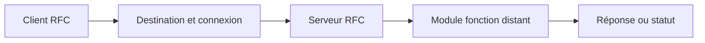

# 12. PRINCIPES DU RFC

## 12.A RÉSULTAT ATTENDU

- Comprendre la frontière de communication RFC[^terme-rfc]
- Distinguer appel local et appel distant
- Identifier client, serveur et destination
- Connaître les principales variantes du RFC

## 12.B DÉFINITION

Le **Remote Function Call** permet d’appeler un module fonction[^terme-module-fonction] distant depuis un système SAP[^terme-systeme-sap], un autre système ou un programme externe compatible.

## 12.C RÔLES

| Rôle        | Description                                    |
| ----------- | ---------------------------------------------- |
| Client RFC  | Initie l’appel                                 |
| Destination | Décrit la cible et les paramètres de connexion |
| Serveur RFC | Reçoit et exécute la demande                   |
| RFM         | Module fonction marqué comme distant           |

Le même système peut être client et serveur selon le scénario.

## 12.D FRONTIÈRE DISTRIBUÉE

Un appel RFC implique potentiellement :

- réseau ;
- authentification ;
- autorisations ;
- conversion de données ;
- indisponibilité de la cible ;
- temps de réponse variable ;
- erreurs de communication ;
- transaction répartie.

Ne pas traiter un RFC comme un simple appel local plus lent.

## 12.E VARIANTES

| Variante | Caractéristique générale                                          |
| -------- | ----------------------------------------------------------------- |
| sRFC     | Appel synchrone, attente du résultat                              |
| aRFC     | Appel asynchrone, résultat éventuellement reçu plus tard          |
| tRFC[^terme-trfc]     | Appel transactionnel enregistré pour exécution fiable             |
| qRFC[^terme-qrfc]     | tRFC ordonné dans une file                                        |
| bgRFC    | Infrastructure plus récente pour certains traitements asynchrones |

Le choix dépend du besoin de réponse, d’ordre, de fiabilité et de reprise.

## 12.F RFC ET BAPI

Une BAPI[^terme-bapi] est généralement implémentée par un module fonction compatible RFC, mais tout module RFC n’est pas une BAPI. La BAPI ajoute un contrat métier standardisé et une gouvernance d’API[^terme-api].

## 12.G PROCESS

### 12.G.1 Étape 1 — Cartographier les deux systèmes

Relever système appelant, destination, système cible, mandant[^terme-mandant] et utilisateur technique. Définir si l’appel doit être synchrone, asynchrone ou transactionnel.

### 12.G.2 Étape 2 — Identifier le contrat distant

Afficher le module cible dans son système et vérifier l’attribut[^terme-attribut] RFC, les types compatibles, les autorisations métier et les effets transactionnels.

### 12.G.3 Étape 3 — Tester la destination séparément

Dans `SM59`[^outil-sm59], effectuer test de connexion puis test d’autorisation disponible. Ne modifier pas le code tant qu’une erreur réseau ou de logon subsiste.

### 12.G.4 Étape 4 — Tester l’appel minimal

Appeler avec une entrée non destructive, traiter `SYSTEM_FAILURE` et `COMMUNICATION_FAILURE`, puis comparer la sortie au test local du système cible.

### 12.G.5 Étape 5 — Prouver la sécurité et la reprise

Tester avec l’utilisateur réellement configuré et un cas refusé. Le flux est validé lorsque connexion, autorisation, contrat fonctionnel et comportement après erreur sont connus.

## 12.H VÉRIFICATION

- Le lecteur peut expliquer la différence entre cette notion et les concepts proches.
- Le choix technique est justifié par un besoin concret, pas uniquement par habitude.
- Les limites liées à la release, aux autorisations et au contexte d’exécution sont identifiées.

## 12.I ERREURS FRÉQUENTES

- Appeler un module fonction sans lire sa documentation et ses exceptions.
- Supposer qu’une BAPI effectue automatiquement le commit.

## 12.J TERMES DU LEXIQUE

- [Module fonction](<../🧩 00 ├── LEXIQUE SAP ET ABAP/06 ├── PROGRAMMES CLASSES ET OBJETS TECHNIQUES.md#module-fonction>)
- [Function group](<../🧩 00 ├── LEXIQUE SAP ET ABAP/06 ├── PROGRAMMES CLASSES ET OBJETS TECHNIQUES.md#function-group>)
- [RFC](<../🧩 00 ├── LEXIQUE SAP ET ABAP/10 └── ACRONYMES SAP.md#acro-rfc>)
- [BAPI](<../🧩 00 ├── LEXIQUE SAP ET ABAP/10 └── ACRONYMES SAP.md#acro-bapi>)
- [Destination RFC](<../🧩 00 ├── LEXIQUE SAP ET ABAP/07 ├── INTERFACES ET INTEGRATION.md#destination-rfc>)

## 12.K RÉFÉRENCES OFFICIELLES SAP

- [RFC Calls — SAP Help Portal](https://help.sap.com/docs/ABAP_PLATFORM_NEW/753088fc00704d0a80e7fbd6803c8adb/48920827feb35ed2e10000000a42189d.html)
- [Calling RFC Function Modules in ABAP — SAP Help Portal](https://help.sap.com/docs/ABAP_PLATFORM_NEW/753088fc00704d0a80e7fbd6803c8adb/48a0f18641bc062de10000000a42189d.html)
- [Describing Remote Function Calls and BAPIs — SAP Learning](https://learning.sap.com/courses/technical-implementation-and-operation-i-of-sap-s-4hana-and-sap-business-suite/describing-remote-function-calls-and-bapis)

---

[Chapitre suivant — MODULES FONCTION DISTANTS ET CONTRAINTES](<./13 ├── MODULES FONCTION DISTANTS ET CONTRAINTES.md>)

[^terme-rfc]: **RFC.** Remote Function Call, mécanisme permettant d’appeler un module fonction compatible dans un autre contexte ou système. Voir [l’entrée du lexique](<../🧩 00 ├── LEXIQUE SAP ET ABAP/06 ├── PROGRAMMES CLASSES ET OBJETS TECHNIQUES.md#rfc>).
[^terme-module-fonction]: **MODULE FONCTION.** Procédure globale appelée avec `CALL FUNCTION` et définie dans un groupe de fonctions. Voir [l’entrée du lexique](<../🧩 00 ├── LEXIQUE SAP ET ABAP/06 ├── PROGRAMMES CLASSES ET OBJETS TECHNIQUES.md#module-fonction>).
[^terme-systeme-sap]: **SYSTÈME SAP.** Ensemble technique cohérent comprenant au minimum une base de données et un ou plusieurs serveurs d’applications. Il est généralement identifié par un SID de trois caractères. Voir [l’entrée du lexique](<../🧩 00 ├── LEXIQUE SAP ET ABAP/01 ├── SYSTEMES ENVIRONNEMENTS ET MANDANTS.md#systeme-sap>).
[^terme-trfc]: **TRFC.** RFC transactionnel garantissant la répétition d’un appel jusqu’à son traitement unique côté protocole. Voir [l’entrée du lexique](<../🧩 00 ├── LEXIQUE SAP ET ABAP/07 ├── INTERFACES ET INTEGRATION.md#trfc>).
[^terme-qrfc]: **QRFC.** RFC transactionnel avec gestion de files afin de respecter un ordre de traitement. Voir [l’entrée du lexique](<../🧩 00 ├── LEXIQUE SAP ET ABAP/07 ├── INTERFACES ET INTEGRATION.md#qrfc>).
[^terme-bapi]: **BAPI.** Interface métier publiée autour d’un Business Object SAP, généralement implémentée par un module fonction RFC. Voir [l’entrée du lexique](<../🧩 00 ├── LEXIQUE SAP ET ABAP/06 ├── PROGRAMMES CLASSES ET OBJETS TECHNIQUES.md#bapi>).
[^terme-api]: **API.** Application Programming Interface, contrat exposant des opérations ou données utilisables par d’autres composants. Voir [l’entrée du lexique](<../🧩 00 ├── LEXIQUE SAP ET ABAP/10 └── ACRONYMES SAP.md#api>).
[^terme-mandant]: **MANDANT.** Subdivision logique d’un système SAP. Il est identifié par un numéro à trois chiffres et isole une partie des données, du paramétrage et des utilisateurs. Voir [l’entrée du lexique](<../🧩 00 ├── LEXIQUE SAP ET ABAP/01 ├── SYSTEMES ENVIRONNEMENTS ET MANDANTS.md#mandant>).
[^terme-attribut]: **ATTRIBUT.** Composant de données déclaré dans une classe et appartenant soit à chaque instance, soit à la classe elle-même. Voir [l’entrée du lexique](<../🧩 00 ├── LEXIQUE SAP ET ABAP/04 ├── LANGAGE ET DEVELOPPEMENT ABAP.md#attribut>).

[^outil-sm59]: **SM59.** Transaction de création, test et maintenance des destinations RFC. Voir [le chapitre associé](<14 ├── DESTINATIONS RFC AVEC SM59.md>).
