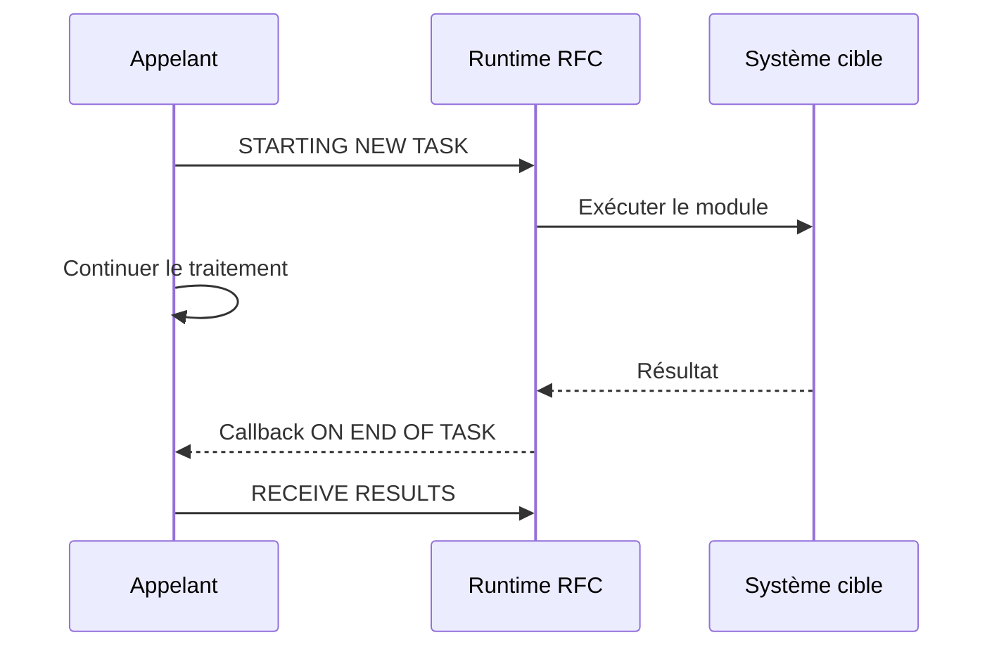

# 15. APPELS RFC SYNCHRONES ET ASYNCHRONES

## 15.A RÉSULTAT ATTENDU

- Implémenter un appel RFC[^terme-rfc] synchrone
- Comprendre `STARTING NEW TASK`
- Recevoir un résultat asynchrone
- Choisir le mode adapté au besoin

## 15.B RFC SYNCHRONE

L’appelant attend la fin du module distant :

```abap
CALL FUNCTION 'Z_DEV_READ_REMOTE'
  DESTINATION 'S4H_DEV_100'
  EXPORTING
    iv_key                = lv_key
  IMPORTING
    es_result             = ls_result
  EXCEPTIONS
    system_failure        = 1 MESSAGE lv_message
    communication_failure = 2 MESSAGE lv_message
    OTHERS                = 3.
```

Utiliser ce mode lorsqu’un résultat est requis avant de poursuivre.

## 15.C RFC ASYNCHRONE

`STARTING NEW TASK` démarre un appel asynchrone :

```abap
CALL FUNCTION 'Z_DEV_READ_REMOTE'
  STARTING NEW TASK lv_task
  DESTINATION 'S4H_DEV_100'
  CALLING on_end_of_task ON END OF TASK
  EXPORTING
    iv_key = lv_key.
```

La forme exacte de callback dépend du style procédural ou objet et de la version ABAP[^terme-abap].

## 15.D RÉCEPTION

Dans le callback, utiliser `RECEIVE RESULTS FROM FUNCTION` :

```abap
RECEIVE RESULTS FROM FUNCTION 'Z_DEV_READ_REMOTE'
  IMPORTING
    es_result             = ls_result
  EXCEPTIONS
    system_failure        = 1 MESSAGE lv_message
    communication_failure = 2 MESSAGE lv_message
    OTHERS                = 3.
```

## 15.E FLUX



## 15.F ATTENTE ET PARALLÉLISME

Un aRFC peut servir au traitement parallèle, notamment avec des groupes de serveurs. Ce mode exige :

- découpage indépendant des unités ;
- nombre de tâches maîtrisé ;
- gestion de la fin de chaque tâche ;
- agrégation sûre des résultats ;
- gestion des ressources et erreurs.

Ne pas paralléliser un traitement sans mesurer la charge globale du système.

## 15.G CHOIX

| Besoin                        | Mode probable |
| ----------------------------- | ------------- |
| Résultat immédiat obligatoire | sRFC          |
| Travail parallèle avec retour | aRFC          |
| Livraison fiable différée     | tRFC[^terme-trfc] ou qRFC[^terme-qrfc]  |
| Ordre strict entre unités     | qRFC          |

## 15.H PROCESS

### 15.H.1 Étape 1 — Choisir le modèle d’appel

Utiliser un appel synchrone lorsque le résultat est requis immédiatement. Choisir un appel asynchrone uniquement si l’appelant peut continuer et si la collecte du résultat ou de l’erreur est explicitement conçue.

### 15.H.2 Étape 2 — Vérifier destination et contrat

Tester la destination dans `SM59`[^outil-sm59], puis contrôler dans le système cible la signature RFC, les autorisations et les effets métier du module.

### 15.H.3 Étape 3 — Implémenter l’appel synchrone

Utiliser `DESTINATION`, mapper les paramètres et traiter séparément `COMMUNICATION_FAILURE`, `SYSTEM_FAILURE` et les erreurs métier. Ne considérer les sorties valides qu’après succès.

### 15.H.4 Étape 4 — Implémenter l’asynchrone

Définir un nom de tâche unique, utiliser `STARTING NEW TASK` et fournir une routine ou méthode[^terme-methode] de callback si un résultat est attendu. Dans le callback, appeler `RECEIVE RESULTS FROM FUNCTION` et traiter ses erreurs.

### 15.H.5 Étape 5 — Tester les deux fins

Tester succès, cible indisponible et erreur métier. Pour l’asynchrone, prouver que l’appelant n’attend pas un résultat avant le callback. Le flux est validé lorsque chaque issue produit un état observable et corrélé à la tâche.

## 15.I VÉRIFICATION

- Le contrôle syntaxique réussit.
- La version active correspond au code sauvegardé.
- L’exécution produit le résultat décrit dans le chapitre.
- Les cas vide, limite et erreur sont testés séparément lorsque la syntaxe le permet.

## 15.J ERREURS FRÉQUENTES

- Copier un exemple sans adapter les types, noms d’objets et données disponibles dans le système.
- Tester uniquement le cas nominal et ignorer les valeurs initiales, absentes ou invalides.
- Appeler un module fonction[^terme-module-fonction] sans lire sa documentation et ses exceptions.
- Supposer qu’une BAPI[^terme-bapi] effectue automatiquement le commit.

## 15.K SNIPPET À RÉUTILISER

> [!NOTE]
> Adapter les noms `Z*`, les types DDIC[^terme-acro-ddic], les données et les autorisations au système cible. Effectuer un contrôle syntaxique avant activation.

```abap
CALL FUNCTION 'Z_DEV_READ_REMOTE'
  DESTINATION 'S4H_DEV_100'
  EXPORTING
    iv_key                = lv_key
  IMPORTING
    es_result             = ls_result
  EXCEPTIONS
    system_failure        = 1 MESSAGE lv_message
    communication_failure = 2 MESSAGE lv_message
    OTHERS                = 3.
```

## 15.L TERMES DU LEXIQUE

- [Module fonction](<../🧩 00 ├── LEXIQUE SAP ET ABAP/06 ├── PROGRAMMES CLASSES ET OBJETS TECHNIQUES.md#module-fonction>)
- [Function group](<../🧩 00 ├── LEXIQUE SAP ET ABAP/06 ├── PROGRAMMES CLASSES ET OBJETS TECHNIQUES.md#function-group>)
- [RFC](<../🧩 00 ├── LEXIQUE SAP ET ABAP/10 └── ACRONYMES SAP.md#acro-rfc>)
- [BAPI](<../🧩 00 ├── LEXIQUE SAP ET ABAP/10 └── ACRONYMES SAP.md#acro-bapi>)
- [Destination RFC](<../🧩 00 ├── LEXIQUE SAP ET ABAP/07 ├── INTERFACES ET INTEGRATION.md#destination-rfc>)

## 15.M RÉFÉRENCES OFFICIELLES SAP

- [CALL FUNCTION STARTING NEW TASK — ABAP Keyword Documentation](https://help.sap.com/doc/abapdocu_816_index_htm/8.16/en-US/ABAPCALL_FUNCTION_STARTING.html)
- [Receiving Results from an Asynchronous RFC — SAP Help Portal](https://help.sap.com/docs/ABAP_PLATFORM_NEW/753088fc00704d0a80e7fbd6803c8adb/489bdeec0c1c73e7e10000000a42189b.html)
- [Parallel Processing with Asynchronous RFC — SAP Help Portal](https://help.sap.com/docs/ABAP_PLATFORM_NEW/753088fc00704d0a80e7fbd6803c8adb/489aa5b948c673e8e10000000a42189b.html)

---

[Chapitre suivant — TRFC, QRFC ET SURVEILLANCE](<./16 ├── TRFC QRFC ET SURVEILLANCE.md>)

[^terme-rfc]: **RFC.** Remote Function Call, mécanisme permettant d’appeler un module fonction compatible dans un autre contexte ou système. Voir [l’entrée du lexique](<../🧩 00 ├── LEXIQUE SAP ET ABAP/06 ├── PROGRAMMES CLASSES ET OBJETS TECHNIQUES.md#rfc>).
[^terme-abap]: **ABAP.** Langage de programmation de la plateforme ABAP, conçu pour développer des applications métier et techniques SAP. Voir [l’entrée du lexique](<../🧩 00 ├── LEXIQUE SAP ET ABAP/04 ├── LANGAGE ET DEVELOPPEMENT ABAP.md#abap>).
[^terme-trfc]: **TRFC.** RFC transactionnel garantissant la répétition d’un appel jusqu’à son traitement unique côté protocole. Voir [l’entrée du lexique](<../🧩 00 ├── LEXIQUE SAP ET ABAP/07 ├── INTERFACES ET INTEGRATION.md#trfc>).
[^terme-qrfc]: **QRFC.** RFC transactionnel avec gestion de files afin de respecter un ordre de traitement. Voir [l’entrée du lexique](<../🧩 00 ├── LEXIQUE SAP ET ABAP/07 ├── INTERFACES ET INTEGRATION.md#qrfc>).
[^terme-methode]: **MÉTHODE.** Comportement déclaré dans une classe ou une interface et appelé avec une liste de paramètres définie. Voir [l’entrée du lexique](<../🧩 00 ├── LEXIQUE SAP ET ABAP/04 ├── LANGAGE ET DEVELOPPEMENT ABAP.md#methode>).
[^terme-module-fonction]: **MODULE FONCTION.** Procédure globale appelée avec `CALL FUNCTION` et définie dans un groupe de fonctions. Voir [l’entrée du lexique](<../🧩 00 ├── LEXIQUE SAP ET ABAP/06 ├── PROGRAMMES CLASSES ET OBJETS TECHNIQUES.md#module-fonction>).
[^terme-bapi]: **BAPI.** Interface métier publiée autour d’un Business Object SAP, généralement implémentée par un module fonction RFC. Voir [l’entrée du lexique](<../🧩 00 ├── LEXIQUE SAP ET ABAP/06 ├── PROGRAMMES CLASSES ET OBJETS TECHNIQUES.md#bapi>).
[^terme-acro-ddic]: **DDIC.** Data Dictionary, abréviation courante de l’ABAP Dictionary. Voir [l’entrée du lexique](<../🧩 00 ├── LEXIQUE SAP ET ABAP/10 └── ACRONYMES SAP.md#acro-ddic>).

[^outil-sm59]: **SM59.** Transaction de création, test et maintenance des destinations RFC. Voir [le chapitre associé](<14 ├── DESTINATIONS RFC AVEC SM59.md>).
