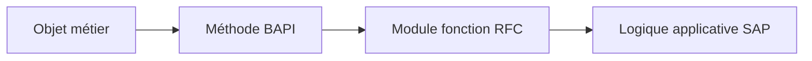

# 18. PRINCIPES DES BAPI ET RECHERCHE

## 18.A RÉSULTAT ATTENDU

- Définir une BAPI[^terme-bapi]
- Distinguer BAPI et module RFC[^terme-rfc] générique
- Rechercher une BAPI existante
- Vérifier son contrat et sa documentation

## 18.B DÉFINITION

Une **Business Application Programming Interface** est une interface métier standardisée exposant une opération sur un objet ou un processus SAP[^terme-acro-sap]. Elle est généralement implémentée par un module fonction[^terme-module-fonction] distant.



## 18.C BAPI ET RFC

| Module RFC                     | BAPI                                                       |
| ------------------------------ | ---------------------------------------------------------- |
| Technologie de communication   | Contrat métier standardisé                                 |
| Peut être purement technique   | Porte une sémantique métier                                |
| Peut être spécifique client    | Peut être fournie par SAP ou définie selon les règles BAPI |
| Pas nécessairement liée au BOR | Historiquement exposée comme méthode[^terme-methode] d’un objet BOR        |

Toute BAPI est liée à la technologie RFC classique, mais tout module RFC n’est pas une BAPI.

## 18.D RECHERCHE

Outils classiques selon le système :

- `BAPI` ou BAPI Explorer ;
- `SWO1`[^outil-swo1] et Business Object[^terme-business-object] Repository ;
- `SE37`[^outil-se37] pour l’interface technique[^terme-interface-integration] ;
- documentation de l’application SAP ;
- Repository Information System.

## 18.E ANALYSE

Avant d’utiliser une BAPI, lire :

- documentation générale ;
- paramètres obligatoires ;
- structures `X` de mise à jour éventuelles ;
- table ou structure `RETURN` ;
- règles de commit ;
- unités et formats ;
- restrictions fonctionnelles ;
- séquence d’appels ;
- notes et documentation du composant.

## 18.F TEST

Une BAPI peut être testée dans `SE37`, mais le test isolé peut être incomplet. Certaines BAPI nécessitent :

- préparation de données ;
- appel de plusieurs méthodes ;
- `BAPI_TRANSACTION_COMMIT` ;
- rollback en cas d’erreur ;
- contexte métier valide.

## 18.G CHOIX D API

Lorsqu’une API[^terme-api] officielle plus récente existe pour le scénario, suivre la recommandation du produit SAP. Ne pas choisir une BAPI uniquement parce qu’elle est connue ou facile à appeler.

## 18.H PROCESS

### 18.H.1 Étape 1 — Partir de l’objet métier

Définir l’opération et l’objet : créer, modifier, lire ou annuler. Rechercher dans le BAPI Explorer ou les outils Repository disponibles plutôt que déduire le nom du module.

### 18.H.2 Étape 2 — Vérifier le statut de la BAPI

Lire documentation, méthode métier, statut de publication et restrictions S/4HANA. Écarter un module interne ressemblant à une BAPI mais non publié pour le scénario.

### 18.H.3 Étape 3 — Étudier l’interface complète

Ouvrir le module dans `SE37`. Relever clés, structures principales, structures `X`, tables, `RETURN` et comportement transactionnel documenté.

### 18.H.4 Étape 4 — Chercher un exemple fiable

Examiner les appelants SAP ou programmes de test livrés. Vérifier que l’exemple correspond à la même opération et release, notamment pour les indicateurs de mise à jour.

### 18.H.5 Étape 5 — Tester sans commit initial

Exécuter avec une donnée de test, lire toutes les lignes `RETURN` et rechercher le document avant commit. La BAPI est comprise lorsque validation, commit/rollback et clé retournée sont explicitement identifiés.

## 18.I VÉRIFICATION

- Le lecteur peut expliquer la différence entre cette notion et les concepts proches.
- Le choix technique est justifié par un besoin concret, pas uniquement par habitude.
- Les limites liées à la release, aux autorisations et au contexte d’exécution sont identifiées.

## 18.J ERREURS FRÉQUENTES

- Appeler un module fonction sans lire sa documentation et ses exceptions.
- Supposer qu’une BAPI effectue automatiquement le commit.

## 18.K FICHE DE CONTRÔLE À COPIER

```text
Système / SID       :
Mandant             :
Utilisateur         :
Transaction / outil :
Objet technique     :
Jeu de données      :
Résultat attendu    :
Résultat observé    :
Horodatage          :
Ordre de transport  :
```

## 18.L TERMES DU LEXIQUE

- [BAPI](<../🧩 00 ├── LEXIQUE SAP ET ABAP/10 └── ACRONYMES SAP.md#acro-bapi>)
- [Module fonction](<../🧩 00 ├── LEXIQUE SAP ET ABAP/06 ├── PROGRAMMES CLASSES ET OBJETS TECHNIQUES.md#module-fonction>)
- [Function group](<../🧩 00 ├── LEXIQUE SAP ET ABAP/06 ├── PROGRAMMES CLASSES ET OBJETS TECHNIQUES.md#function-group>)
- [RFC](<../🧩 00 ├── LEXIQUE SAP ET ABAP/10 └── ACRONYMES SAP.md#acro-rfc>)
- [Destination RFC](<../🧩 00 ├── LEXIQUE SAP ET ABAP/07 ├── INTERFACES ET INTEGRATION.md#destination-rfc>)

## 18.M RÉFÉRENCES OFFICIELLES SAP

- [Describing Remote Function Calls and BAPIs — SAP Learning](https://learning.sap.com/courses/technical-implementation-and-operation-i-of-sap-s-4hana-and-sap-business-suite/describing-remote-function-calls-and-bapis)
- [Explaining the Integration Technology Based on BAPIs and IDocs — SAP Learning](https://learning.sap.com/courses/developing-integration-scenarios-using-idoc-rfc-adapter-of-sap-process-orchestration/explaining-the-integration-technology-based-on-bapis-and-idocs-basics_db458c59-a70f-480d-b139-65065be1b9e9)
- [Transaction Model for Developing BAPIs — SAP Help Portal](https://help.sap.com/docs/SAP_ERP/67ae2d27aed945b7bd0ad1d2185ec217/4d5b102ba1483d8fe10000000a42189e.html)

---

[Chapitre suivant — INTERFACES BAPI, STRUCTURES X ET RETURN](<./19 ├── INTERFACES BAPI STRUCTURES X ET RETURN.md>)

[^terme-bapi]: **BAPI.** Interface métier publiée autour d’un Business Object SAP, généralement implémentée par un module fonction RFC. Voir [l’entrée du lexique](<../🧩 00 ├── LEXIQUE SAP ET ABAP/06 ├── PROGRAMMES CLASSES ET OBJETS TECHNIQUES.md#bapi>).
[^terme-rfc]: **RFC.** Remote Function Call, mécanisme permettant d’appeler un module fonction compatible dans un autre contexte ou système. Voir [l’entrée du lexique](<../🧩 00 ├── LEXIQUE SAP ET ABAP/06 ├── PROGRAMMES CLASSES ET OBJETS TECHNIQUES.md#rfc>).
[^terme-acro-sap]: **SAP.** Nom de l’éditeur et de son écosystème logiciel ; l’acronyme historique provient de l’allemand. Voir [l’entrée du lexique](<../🧩 00 ├── LEXIQUE SAP ET ABAP/10 └── ACRONYMES SAP.md#acro-sap>).
[^terme-module-fonction]: **MODULE FONCTION.** Procédure globale appelée avec `CALL FUNCTION` et définie dans un groupe de fonctions. Voir [l’entrée du lexique](<../🧩 00 ├── LEXIQUE SAP ET ABAP/06 ├── PROGRAMMES CLASSES ET OBJETS TECHNIQUES.md#module-fonction>).
[^terme-methode]: **MÉTHODE.** Comportement déclaré dans une classe ou une interface et appelé avec une liste de paramètres définie. Voir [l’entrée du lexique](<../🧩 00 ├── LEXIQUE SAP ET ABAP/04 ├── LANGAGE ET DEVELOPPEMENT ABAP.md#methode>).
[^terme-business-object]: **BUSINESS OBJECT.** Représentation métier d’une entité avec données, opérations et cycle de vie. Voir [l’entrée du lexique](<../🧩 00 ├── LEXIQUE SAP ET ABAP/09 ├── NOTIONS FONCTIONNELLES ET ORGANISATIONNELLES.md#business-object>).
[^terme-interface-integration]: **INTERFACE.** Mécanisme d’échange de données ou de fonctions entre composants. Voir [l’entrée du lexique](<../🧩 00 ├── LEXIQUE SAP ET ABAP/07 ├── INTERFACES ET INTEGRATION.md#interface-integration>).
[^terme-api]: **API.** Application Programming Interface, contrat exposant des opérations ou données utilisables par d’autres composants. Voir [l’entrée du lexique](<../🧩 00 ├── LEXIQUE SAP ET ABAP/10 └── ACRONYMES SAP.md#api>).

[^outil-swo1]: **SWO1.** Business Object Builder utilisé pour afficher et maintenir les objets BOR classiques. Voir [le chapitre associé](<../🧩 33 ├── WORKFLOW CLASSIQUE/01 └── DIAGNOSTIQUER UN WORKFLOW NON DEMARRE.md>).
[^outil-se37]: **SE37.** Function Builder utilisé pour rechercher, afficher, tester et maintenir les modules fonction. Voir [le chapitre associé](<03 ├── RECHERCHER ET ANALYSER AVEC SE37.md>).
