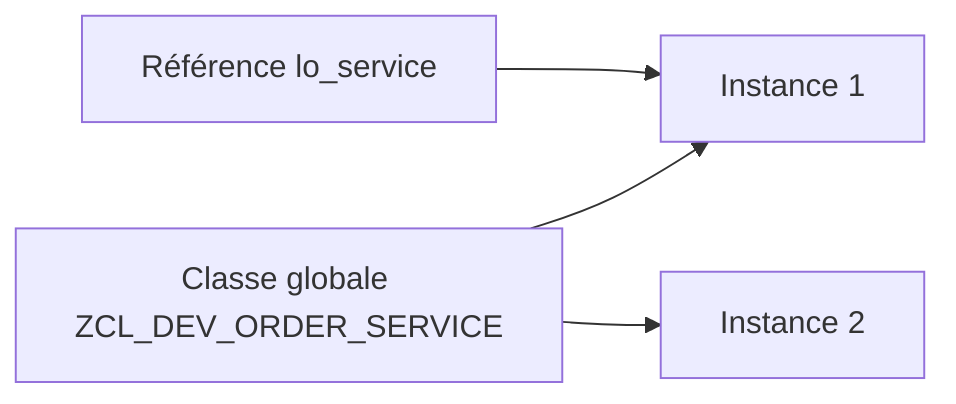

# 1. PRINCIPES D’ABAP OBJECTS ET CLASSES GLOBALES

## 1.A RÉSULTAT ATTENDU

- Comprendre le rôle d’une classe globale[^terme-classe-globale] dans un système ABAP[^terme-abap].
- Distinguer classe, objet, référence et instance.
- Savoir quand créer une classe `ZCL_*` plutôt qu’un `FORM` ou un module fonction[^terme-module-fonction].
- Comprendre pourquoi les classes globales `SE24`[^terme-class-builder-se24] constituent le fil conducteur de ce dossier.

## 1.B DÉFINITION

Une **classe** décrit un type d’objet : ses données, ses opérations et les règles qui maintiennent son état cohérent. Un **objet** est une instance concrète de cette classe. Une **référence** contient l’adresse logique permettant d’accéder à l’objet.

Une classe globale créée avec `SE24` est enregistrée dans le Repository ABAP[^terme-repository-abap]. Elle peut être utilisée par les programmes du système, sous réserve de visibilité[^terme-visibilite], de package[^terme-package] et d’autorisations. Une classe locale[^terme-classe-locale], au contraire, n’est visible que dans son programme ou son Class Pool[^terme-class-pool].



## 1.C POURQUOI UTILISER UNE CLASSE GLOBALE

Une classe globale est pertinente lorsque la logique doit être :

- réutilisée par plusieurs programmes ;
- encapsulée derrière une interface stable ;
- testée indépendamment de l’écran ou du report appelant ;
- transportée comme un objet Repository[^terme-objet-repository] identifiable ;
- étendue sans dupliquer du code ;
- appelée depuis un report, un module fonction, une BAdI[^terme-acro-badi], un job[^terme-job] ou un service.

## 1.D CAS D’USAGE

Un programme d’achat doit vérifier une quantité, lire les données article, calculer une date et produire un résultat. Si ces règles restent directement dans le report, elles deviennent difficiles à réutiliser et à tester. Une classe globale `ZCL_MM_PURCHASE_REQ_SERVICE` peut exposer une méthode[^terme-methode] `CREATE_REQUEST` et masquer les détails techniques.

## 1.E CHOISIR ENTRE LES PRINCIPAUX MÉCANISMES

| Besoin | Mécanisme généralement adapté |
|---|---|
| Logique métier réutilisable et testable | Classe globale |
| API[^terme-api] distante ou interface historique | Module fonction RFC[^terme-rfc] |
| Traitement local très court | Méthode privée ou classe locale |
| Extension du standard | BAdI ou enhancement appelant une classe globale |
| Simple orchestration d’un report | Report appelant des classes globales |

## 1.F COMMENT COMMENCER

1. Identifier une responsabilité unique : calcul, lecture, validation ou orchestration.
2. Choisir un nom de classe explicite, par exemple `ZCL_SD_PRICING_SERVICE`.
3. Définir l’API publique[^terme-api-publique] avant d’implémenter les détails.
4. Placer les données internes dans la section privée.
5. Créer un report de démonstration ou un test ABAP Unit.
6. Vérifier qu’un appelant n’a pas besoin de connaître l’implémentation interne.

## 1.G CODE À ADAPTER

```abap
" Construire les dépendances avant d’exécuter le traitement.
DATA(lo_service) = NEW zcl_dev_order_service( ).

TRY.
    DATA(ls_result) = lo_service->process(
      iv_order_id = p_order ).
  CATCH zcx_dev_order INTO DATA(lx_order).
    MESSAGE lx_order->get_text( ) TYPE 'E'.
ENDTRY.
```

> [!IMPORTANT]
> Le nom de classe, la méthode, le type de résultat et l’exception[^terme-exception] sont fictifs. Ils doivent être créés dans le namespace client[^terme-namespace-client].

## 1.H CONTRÔLE

Le chapitre est acquis lorsque le lecteur peut expliquer :

- pourquoi `lo_service` n’est pas l’objet lui-même mais une référence ;
- pourquoi une classe globale est réutilisable dans plusieurs programmes ;
- quelle responsabilité doit rester dans le report appelant.

## 1.I ERREURS FRÉQUENTES

- Créer une classe unique contenant toutes les règles du domaine.
- Exposer tous les attributs en `PUBLIC`.
- Utiliser une classe uniquement comme regroupement de méthodes statiques sans état ni abstraction.
- Mélanger accès aux données, dialogue utilisateur et calcul métier dans la même méthode.

## 1.J COMPATIBILITÉ S/4HANA

- Statut : compatible avec le développement ABAP classique sur SAP[^terme-acro-sap] S/4HANA.
- Vérifier la syntaxe exacte avec l’aide `F1`[^terme-aide-f1] du système cible lorsque plusieurs versions d’ABAP Platform sont prises en charge.
- Les objets globaux doivent être créés dans le package et l’ordre de transport[^terme-ordre-transport] du projet.

## 1.K RÉFÉRENCES OFFICIELLES SAP

- [ABAP Objects — ABAP Keyword Documentation](https://help.sap.com/doc/abapdocu_latest_index_htm/latest/en-US/ABENABAP_OBJECTS.html)
- [Classes — SAP Help Portal](https://help.sap.com/docs/PRODUCT_ID/10a002cd6c531014b5e1cb16d2455072/c3225b5c54f411d194a60000e8353423.html)
- [Class Builder — SAP Help Portal](https://help.sap.com/docs/ABAP_PLATFORM_BW4HANA/a602ff71a47c441bb3000504ec938fea/cac035baa6c611d1b4790000e8a52bed.html)

---

[Chapitre suivant — ANALYSER UNE CLASSE GLOBALE AVEC SE24](<./02 ├── ANALYSER UNE CLASSE GLOBALE AVEC SE24.md>)

[^terme-classe-globale]: **CLASSE GLOBALE.** Classe Repository réutilisable dans le système ABAP. Voir [l’entrée du lexique](<../🧩 00 ├── LEXIQUE SAP ET ABAP/06 ├── PROGRAMMES CLASSES ET OBJETS TECHNIQUES.md#classe-globale>).
[^terme-abap]: **ABAP.** Langage de programmation de la plateforme ABAP, conçu pour développer des applications métier et techniques SAP. Voir [l’entrée du lexique](<../🧩 00 ├── LEXIQUE SAP ET ABAP/04 ├── LANGAGE ET DEVELOPPEMENT ABAP.md#abap>).
[^terme-module-fonction]: **MODULE FONCTION.** Procédure globale appelée avec `CALL FUNCTION` et définie dans un groupe de fonctions. Voir [l’entrée du lexique](<../🧩 00 ├── LEXIQUE SAP ET ABAP/06 ├── PROGRAMMES CLASSES ET OBJETS TECHNIQUES.md#module-fonction>).
[^terme-class-builder-se24]: **CLASS BUILDER (SE24).** Outil SAP GUI utilisé pour créer, afficher, modifier, tester et documenter les classes et interfaces globales ABAP. Voir [l’entrée du lexique](<../🧩 00 ├── LEXIQUE SAP ET ABAP/06 ├── PROGRAMMES CLASSES ET OBJETS TECHNIQUES.md#class-builder-se24>).
[^terme-repository-abap]: **REPOSITORY ABAP.** Ensemble central des objets de développement d’un système ABAP. Voir [l’entrée du lexique](<../🧩 00 ├── LEXIQUE SAP ET ABAP/03 ├── REPOSITORY PACKAGES ET TRANSPORTS.md#repository-abap>).
[^terme-visibilite]: **VISIBILITÉ.** Règle déterminant où un composant de classe peut être utilisé : `PUBLIC`, `PROTECTED` ou `PRIVATE`. Voir [l’entrée du lexique](<../🧩 00 ├── LEXIQUE SAP ET ABAP/04 ├── LANGAGE ET DEVELOPPEMENT ABAP.md#visibilite>).
[^terme-package]: **PACKAGE.** Conteneur logique qui regroupe les objets de développement et détermine notamment leur transportabilité. Voir [l’entrée du lexique](<../🧩 00 ├── LEXIQUE SAP ET ABAP/03 ├── REPOSITORY PACKAGES ET TRANSPORTS.md#package>).
[^terme-classe-locale]: **CLASSE LOCALE.** Classe définie dans le code source d’un programme, d’un include ou d’un Class Pool et visible uniquement dans ce contexte de compilation. Voir [l’entrée du lexique](<../🧩 00 ├── LEXIQUE SAP ET ABAP/06 ├── PROGRAMMES CLASSES ET OBJETS TECHNIQUES.md#classe-locale>).
[^terme-class-pool]: **CLASS POOL.** Programme technique généré qui contient la définition et l’implémentation d’une classe globale ABAP. Voir [l’entrée du lexique](<../🧩 00 ├── LEXIQUE SAP ET ABAP/06 ├── PROGRAMMES CLASSES ET OBJETS TECHNIQUES.md#class-pool>).
[^terme-objet-repository]: **OBJET REPOSITORY.** Unité de développement gérée par le Repository et le système de transport. Voir [l’entrée du lexique](<../🧩 00 ├── LEXIQUE SAP ET ABAP/03 ├── REPOSITORY PACKAGES ET TRANSPORTS.md#objet-repository>).
[^terme-acro-badi]: **BADI.** Business Add-In, mécanisme d’extension orienté objet du standard SAP. Voir [l’entrée du lexique](<../🧩 00 ├── LEXIQUE SAP ET ABAP/10 └── ACRONYMES SAP.md#acro-badi>).
[^terme-job]: **JOB.** Traitement planifié en arrière-plan composé d’une ou plusieurs étapes. Voir [l’entrée du lexique](<../🧩 00 ├── LEXIQUE SAP ET ABAP/06 ├── PROGRAMMES CLASSES ET OBJETS TECHNIQUES.md#job>).
[^terme-methode]: **MÉTHODE.** Comportement déclaré dans une classe ou une interface et appelé avec une liste de paramètres définie. Voir [l’entrée du lexique](<../🧩 00 ├── LEXIQUE SAP ET ABAP/04 ├── LANGAGE ET DEVELOPPEMENT ABAP.md#methode>).
[^terme-api]: **API.** Application Programming Interface, contrat exposant des opérations ou données utilisables par d’autres composants. Voir [l’entrée du lexique](<../🧩 00 ├── LEXIQUE SAP ET ABAP/10 └── ACRONYMES SAP.md#api>).
[^terme-rfc]: **RFC.** Remote Function Call, mécanisme permettant d’appeler un module fonction compatible dans un autre contexte ou système. Voir [l’entrée du lexique](<../🧩 00 ├── LEXIQUE SAP ET ABAP/06 ├── PROGRAMMES CLASSES ET OBJETS TECHNIQUES.md#rfc>).
[^terme-api-publique]: **API PUBLIQUE.** Ensemble des composants publics qu’une classe expose à ses consommateurs : méthodes, événements, types, constantes et attributs publics. Voir [l’entrée du lexique](<../🧩 00 ├── LEXIQUE SAP ET ABAP/04 ├── LANGAGE ET DEVELOPPEMENT ABAP.md#api-publique>).
[^terme-exception]: **EXCEPTION.** Objet ou signal représentant une situation anormale qu’un appelant peut traiter. Voir [l’entrée du lexique](<../🧩 00 ├── LEXIQUE SAP ET ABAP/04 ├── LANGAGE ET DEVELOPPEMENT ABAP.md#exception>).
[^terme-namespace-client]: **NAMESPACE CLIENT.** Espace de noms réservé aux développements spécifiques, souvent préfixés par `Z` ou `Y`. Voir [l’entrée du lexique](<../🧩 00 ├── LEXIQUE SAP ET ABAP/03 ├── REPOSITORY PACKAGES ET TRANSPORTS.md#namespace-client>).
[^terme-acro-sap]: **SAP.** Nom de l’éditeur et de son écosystème logiciel ; l’acronyme historique provient de l’allemand. Voir [l’entrée du lexique](<../🧩 00 ├── LEXIQUE SAP ET ABAP/10 └── ACRONYMES SAP.md#acro-sap>).
[^terme-aide-f1]: **AIDE F1.** Aide contextuelle expliquant un champ, une fonction ou un mot-clé. Voir [l’entrée du lexique](<../🧩 00 ├── LEXIQUE SAP ET ABAP/02 ├── SAP GUI NAVIGATION ET TRANSACTIONS.md#aide-f1>).
[^terme-ordre-transport]: **ORDRE DE TRANSPORT.** Conteneur qui regroupe des modifications à exporter puis importer dans d’autres systèmes. Voir [l’entrée du lexique](<../🧩 00 ├── LEXIQUE SAP ET ABAP/03 ├── REPOSITORY PACKAGES ET TRANSPORTS.md#ordre-transport>).
