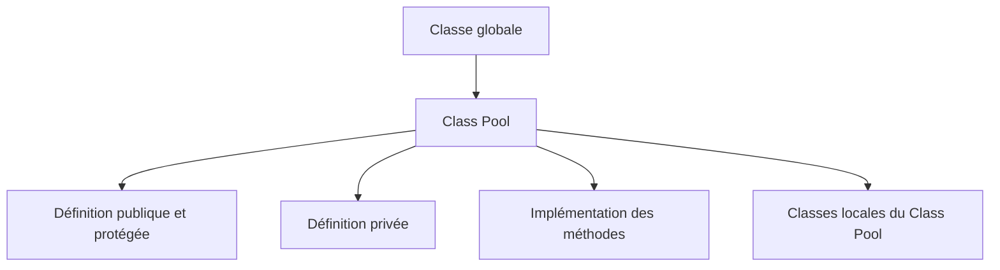

# 4. CLASS POOL ET ORGANISATION TECHNIQUE

## 4.A RÉSULTAT ATTENDU

- Comprendre où le système stocke une classe globale[^terme-classe-globale].
- Identifier les includes gérés par le Class Builder[^terme-class-builder-se24].
- Savoir où placer les classes locales et les déclarations privées au Class Pool[^terme-class-pool].
- Éviter les modifications techniques qui rendent l’objet incohérent.

## 4.B FONCTIONNEMENT

Une classe globale est stockée dans un programme spécial appelé **Class Pool**. Le Class Builder organise la définition, l’implémentation et les parties locales dans des includes techniques.



Le nom technique des includes est généré. Il ne faut pas renommer, déplacer ou supprimer manuellement ces includes.

## 4.C PARTIES LOCALES UTILES

Le Class Builder fournit généralement des emplacements pour :

- définitions locales visibles de la classe globale ;
- implémentations locales ;
- macros historiques ;
- classes de test ABAP[^terme-abap] Unit.

Les classes locales sont utiles pour des collaborateurs strictement internes ou des doubles de test. Elles ne remplacent pas les classes globales devant être appelées depuis d’autres objets.

## 4.D PROCESS

### 4.D.1 Étape 1 — Ouvrir le class pool

Afficher la classe dans `SE24` ou `SE80`[^outil-se80], puis naviguer vers son programme de classe et ses includes. Relever le nom technique généré et le package[^terme-package].

### 4.D.2 Étape 2 — Identifier les parties générées

Distinguer définition publique/protected/private, implémentations de méthodes, includes locaux et zones contrôlées par le Class Builder. Ne modifier pas manuellement une section dont la prochaine génération écraserait le contenu.

### 4.D.3 Étape 3 — Localiser le bon point de maintenance

Pour une signature, revenir aux onglets du Class Builder. Pour le corps d’une méthode[^terme-methode], ouvrir son implémentation. Pour une classe locale[^terme-classe-locale] prévue, utiliser l’include local dédié.

### 4.D.4 Étape 4 — Contrôler la cohérence globale

Après modification, exécuter le contrôle de la classe complète. Une erreur signalée dans un include généré doit être corrigée depuis le composant source correspondant.

### 4.D.5 Étape 5 — Activer et vérifier

Activer la classe et tous ses composants. La procédure est validée lorsque les zones générées restent intactes et que chaque changement se trouve dans son point de maintenance durable.

## 4.E CAS D’USAGE

Une classe globale doit utiliser un petit parseur qui n’a aucun sens en dehors de son implémentation. Une classe locale du Class Pool peut encapsuler ce détail sans ajouter un objet global supplémentaire dans le package.

## 4.F CODE DE CLASSE LOCALE À ADAPTER

```abap
" Modifier uniquement les données de la table cible maîtrisée.
CLASS lcl_tokenizer DEFINITION FINAL.
  PUBLIC SECTION.
    METHODS split
      IMPORTING iv_text TYPE string
      RETURNING VALUE(rt_tokens) TYPE string_table.
ENDCLASS.

CLASS lcl_tokenizer IMPLEMENTATION.
  METHOD split.
    SPLIT iv_text AT space INTO TABLE rt_tokens.
    DELETE rt_tokens WHERE table_line IS INITIAL.
  ENDMETHOD.
ENDCLASS.
```

## 4.G CONTRÔLE

- La classe globale reste activable.
- La classe locale n’est pas visible depuis un report externe.
- Aucun include généré n’a été créé manuellement.
- La responsabilité de la classe locale est strictement interne.

## 4.H ERREURS FRÉQUENTES

- Développer toute la logique dans les includes au lieu des méthodes de la classe globale.
- Déclarer globalement une classe qui ne sert qu’à une seule implémentation privée.
- Dépendre d’une classe locale depuis un autre objet Repository[^terme-objet-repository].

## 4.I COMPATIBILITÉ S/4HANA

- Statut : compatible avec le développement ABAP classique sur SAP[^terme-acro-sap] S/4HANA.
- Vérifier la syntaxe exacte avec l’aide `F1`[^terme-aide-f1] du système cible lorsque plusieurs versions d’ABAP Platform sont prises en charge.
- Les objets globaux doivent être créés dans le package et l’ordre de transport[^terme-ordre-transport] du projet.

## 4.J RÉFÉRENCES OFFICIELLES SAP

- [Creating Local Definitions and Implementations — SAP Help Portal](https://help.sap.com/docs/ABAP_PLATFORM_NEW/bd833c8355f34e96a6e83096b38bf192/b5693ecb185011d5969b00a0c94260a5.html)
- [Class Builder — SAP Help Portal](https://help.sap.com/docs/ABAP_PLATFORM_BW4HANA/a602ff71a47c441bb3000504ec938fea/cac035baa6c611d1b4790000e8a52bed.html)

---

[Chapitre suivant — VISIBILITÉ, TYPES, CONSTANTES ET ATTRIBUTS](<./05 ├── VISIBILITE TYPES CONSTANTES ET ATTRIBUTS.md>)

[^terme-classe-globale]: **CLASSE GLOBALE.** Classe Repository réutilisable dans le système ABAP. Voir [l’entrée du lexique](<../🧩 00 ├── LEXIQUE SAP ET ABAP/06 ├── PROGRAMMES CLASSES ET OBJETS TECHNIQUES.md#classe-globale>).
[^terme-class-builder-se24]: **CLASS BUILDER (SE24).** Outil SAP GUI utilisé pour créer, afficher, modifier, tester et documenter les classes et interfaces globales ABAP. Voir [l’entrée du lexique](<../🧩 00 ├── LEXIQUE SAP ET ABAP/06 ├── PROGRAMMES CLASSES ET OBJETS TECHNIQUES.md#class-builder-se24>).
[^terme-class-pool]: **CLASS POOL.** Programme technique généré qui contient la définition et l’implémentation d’une classe globale ABAP. Voir [l’entrée du lexique](<../🧩 00 ├── LEXIQUE SAP ET ABAP/06 ├── PROGRAMMES CLASSES ET OBJETS TECHNIQUES.md#class-pool>).
[^terme-abap]: **ABAP.** Langage de programmation de la plateforme ABAP, conçu pour développer des applications métier et techniques SAP. Voir [l’entrée du lexique](<../🧩 00 ├── LEXIQUE SAP ET ABAP/04 ├── LANGAGE ET DEVELOPPEMENT ABAP.md#abap>).
[^terme-package]: **PACKAGE.** Conteneur logique qui regroupe les objets de développement et détermine notamment leur transportabilité. Voir [l’entrée du lexique](<../🧩 00 ├── LEXIQUE SAP ET ABAP/03 ├── REPOSITORY PACKAGES ET TRANSPORTS.md#package>).
[^terme-methode]: **MÉTHODE.** Comportement déclaré dans une classe ou une interface et appelé avec une liste de paramètres définie. Voir [l’entrée du lexique](<../🧩 00 ├── LEXIQUE SAP ET ABAP/04 ├── LANGAGE ET DEVELOPPEMENT ABAP.md#methode>).
[^terme-classe-locale]: **CLASSE LOCALE.** Classe définie dans le code source d’un programme, d’un include ou d’un Class Pool et visible uniquement dans ce contexte de compilation. Voir [l’entrée du lexique](<../🧩 00 ├── LEXIQUE SAP ET ABAP/06 ├── PROGRAMMES CLASSES ET OBJETS TECHNIQUES.md#classe-locale>).
[^terme-objet-repository]: **OBJET REPOSITORY.** Unité de développement gérée par le Repository et le système de transport. Voir [l’entrée du lexique](<../🧩 00 ├── LEXIQUE SAP ET ABAP/03 ├── REPOSITORY PACKAGES ET TRANSPORTS.md#objet-repository>).
[^terme-acro-sap]: **SAP.** Nom de l’éditeur et de son écosystème logiciel ; l’acronyme historique provient de l’allemand. Voir [l’entrée du lexique](<../🧩 00 ├── LEXIQUE SAP ET ABAP/10 └── ACRONYMES SAP.md#acro-sap>).
[^terme-aide-f1]: **AIDE F1.** Aide contextuelle expliquant un champ, une fonction ou un mot-clé. Voir [l’entrée du lexique](<../🧩 00 ├── LEXIQUE SAP ET ABAP/02 ├── SAP GUI NAVIGATION ET TRANSACTIONS.md#aide-f1>).
[^terme-ordre-transport]: **ORDRE DE TRANSPORT.** Conteneur qui regroupe des modifications à exporter puis importer dans d’autres systèmes. Voir [l’entrée du lexique](<../🧩 00 ├── LEXIQUE SAP ET ABAP/03 ├── REPOSITORY PACKAGES ET TRANSPORTS.md#ordre-transport>).

[^outil-se80]: **SE80.** Object Navigator utilisé pour parcourir et maintenir les objets du Repository ABAP. Voir [le chapitre associé](<../🧩 01 ├── FONDAMENTAUX ABAP/04 ├── EDITEURS ABAP SE38 ET SE80.md>).
