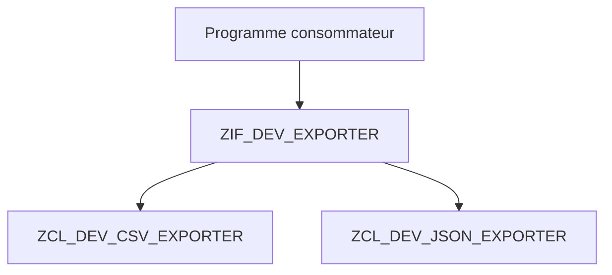

# 12. POLYMORPHISME PAR INTERFACE

## 12.A RÉSULTAT ATTENDU

- Utiliser une référence d’interface.
- Substituer plusieurs implémentations.
- Éliminer des branchements techniques répétés.

## 12.B PRINCIPE

Le polymorphisme[^terme-polymorphisme] permet d’appeler la même méthode[^terme-methode] sur des objets de classes différentes, tant qu’ils respectent le même contrat.



## 12.C CAS D’USAGE

Une extraction doit produire du CSV[^terme-csv] ou du JSON[^terme-json] selon une configuration. Au lieu de placer un `CASE` dans chaque appelant, deux classes implémentent `ZIF_DEV_EXPORTER`.

## 12.D CODE À ADAPTER

```abap
" Construire les dépendances avant d’exécuter le traitement.
DATA lo_exporter TYPE REF TO zif_dev_exporter.

CASE iv_format.
  WHEN 'CSV'.
    lo_exporter = NEW zcl_dev_csv_exporter( ).
  WHEN 'JSON'.
    lo_exporter = NEW zcl_dev_json_exporter( ).
  WHEN OTHERS.
    RAISE EXCEPTION TYPE zcx_dev_unsupported_format.
ENDCASE.

DATA(lv_payload) = lo_exporter->serialize( it_data ).
```

Le `CASE` reste ici au point de composition[^terme-composition]. Le traitement métier utilise ensuite uniquement l’interface.

## 12.E PROCESS

### 12.E.1 Étape 1 — Créer deux implémentations conformes

Implémenter la même interface dans deux classes avec des comportements distincts mais un résultat respectant le même contrat.

### 12.E.2 Étape 2 — Typer le consommateur sur l’interface

Déclarer sa dépendance `TYPE REF TO` l’interface. Supprimer tout `CASE` sur le nom de classe[^terme-classe] utilisé uniquement pour choisir l’appel.

### 12.E.3 Étape 3 — Injecter la première classe

Affecter au consommateur une référence vers la première implémentation, puis exécuter la méthode via le type interface. Conserver les entrées, le résultat et les effets observables comme cas de référence pour la substitution suivante.

### 12.E.4 Étape 4 — Substituer la seconde

Changer seulement l’objet injecté et relancer les mêmes entrées. L’appelant ne doit nécessiter aucune modification.

### 12.E.5 Étape 5 — Ajouter un double déterministe

Créer une classe locale[^terme-classe-locale] de test implémentant l’interface et retournant une valeur contrôlée. Le polymorphisme est validé lorsque le consommateur est testable sans la dépendance réelle.

## 12.F CASTS

Un up-cast vers une interface est généralement implicite et sûr. Un down-cast vers une classe concrète avec `CAST` ou `?=` doit rester exceptionnel : il révèle souvent que le contrat de l’interface est insuffisant ou que l’appelant connaît trop l’implémentation.

## 12.G CONTRÔLE

Le code métier ne doit contenir aucun nom de classe d’implémentation après la phase de composition.

## 12.H ERREURS FRÉQUENTES

- Tester la classe dynamique avec `INSTANCE OF` pour choisir le comportement.
- Ajouter des méthodes spécifiques à l’interface uniquement pour satisfaire une classe.
- Répéter la création des implémentations partout au lieu de centraliser la composition.

## 12.I COMPATIBILITÉ S/4HANA

- Statut : compatible avec le développement ABAP[^terme-abap] classique sur SAP[^terme-acro-sap] S/4HANA.
- Vérifier la syntaxe exacte avec l’aide `F1`[^terme-aide-f1] du système cible lorsque plusieurs versions d’ABAP Platform sont prises en charge.
- Les objets globaux doivent être créés dans le package[^terme-package] et l’ordre de transport[^terme-ordre-transport] du projet.

## 12.J RÉFÉRENCES OFFICIELLES SAP

- [Using Interfaces — SAP Learning](https://learning.sap.com/courses/deepening-your-abap-programming-knowledge/using-interfaces_e45af9bb-46e5-457b-88ef-d5ad6b0d38d7)
- [Inheritance and Interfaces — ABAP Keyword Documentation](https://help.sap.com/doc/abapdocu_latest_index_htm/latest/en-US/ABENINHERITANCE_INTERFACES.html)

---

[Chapitre suivant — HÉRITAGE, REDÉFINITION ET SUPER](<./13 ├── HERITAGE REDEFINITION ET SUPER.md>)

[^terme-polymorphisme]: **POLYMORPHISME.** Capacité à utiliser plusieurs classes concrètes au travers d’un même type de référence abstrait. Voir [l’entrée du lexique](<../🧩 00 ├── LEXIQUE SAP ET ABAP/04 ├── LANGAGE ET DEVELOPPEMENT ABAP.md#polymorphisme>).
[^terme-methode]: **MÉTHODE.** Comportement déclaré dans une classe ou une interface et appelé avec une liste de paramètres définie. Voir [l’entrée du lexique](<../🧩 00 ├── LEXIQUE SAP ET ABAP/04 ├── LANGAGE ET DEVELOPPEMENT ABAP.md#methode>).
[^terme-csv]: **CSV.** Format texte tabulaire utilisant un séparateur de champs et des règles d’échappement. Voir [l’entrée du lexique](<../🧩 00 ├── LEXIQUE SAP ET ABAP/07 ├── INTERFACES ET INTEGRATION.md#csv>).
[^terme-json]: **JSON.** Format texte structuré utilisant objets, tableaux, chaînes, nombres, booléens et valeur null. Voir [l’entrée du lexique](<../🧩 00 ├── LEXIQUE SAP ET ABAP/07 ├── INTERFACES ET INTEGRATION.md#json>).
[^terme-composition]: **COMPOSITION.** Relation dans laquelle une classe réalise son comportement en contenant ou en utilisant d’autres objets spécialisés. Voir [l’entrée du lexique](<../🧩 00 ├── LEXIQUE SAP ET ABAP/04 ├── LANGAGE ET DEVELOPPEMENT ABAP.md#composition>).
[^terme-classe]: **CLASSE.** Modèle orienté objet définissant état et comportements. Voir [l’entrée du lexique](<../🧩 00 ├── LEXIQUE SAP ET ABAP/04 ├── LANGAGE ET DEVELOPPEMENT ABAP.md#classe>).
[^terme-classe-locale]: **CLASSE LOCALE.** Classe définie dans le code source d’un programme, d’un include ou d’un Class Pool et visible uniquement dans ce contexte de compilation. Voir [l’entrée du lexique](<../🧩 00 ├── LEXIQUE SAP ET ABAP/06 ├── PROGRAMMES CLASSES ET OBJETS TECHNIQUES.md#classe-locale>).
[^terme-abap]: **ABAP.** Langage de programmation de la plateforme ABAP, conçu pour développer des applications métier et techniques SAP. Voir [l’entrée du lexique](<../🧩 00 ├── LEXIQUE SAP ET ABAP/04 ├── LANGAGE ET DEVELOPPEMENT ABAP.md#abap>).
[^terme-acro-sap]: **SAP.** Nom de l’éditeur et de son écosystème logiciel ; l’acronyme historique provient de l’allemand. Voir [l’entrée du lexique](<../🧩 00 ├── LEXIQUE SAP ET ABAP/10 └── ACRONYMES SAP.md#acro-sap>).
[^terme-aide-f1]: **AIDE F1.** Aide contextuelle expliquant un champ, une fonction ou un mot-clé. Voir [l’entrée du lexique](<../🧩 00 ├── LEXIQUE SAP ET ABAP/02 ├── SAP GUI NAVIGATION ET TRANSACTIONS.md#aide-f1>).
[^terme-package]: **PACKAGE.** Conteneur logique qui regroupe les objets de développement et détermine notamment leur transportabilité. Voir [l’entrée du lexique](<../🧩 00 ├── LEXIQUE SAP ET ABAP/03 ├── REPOSITORY PACKAGES ET TRANSPORTS.md#package>).
[^terme-ordre-transport]: **ORDRE DE TRANSPORT.** Conteneur qui regroupe des modifications à exporter puis importer dans d’autres systèmes. Voir [l’entrée du lexique](<../🧩 00 ├── LEXIQUE SAP ET ABAP/03 ├── REPOSITORY PACKAGES ET TRANSPORTS.md#ordre-transport>).
