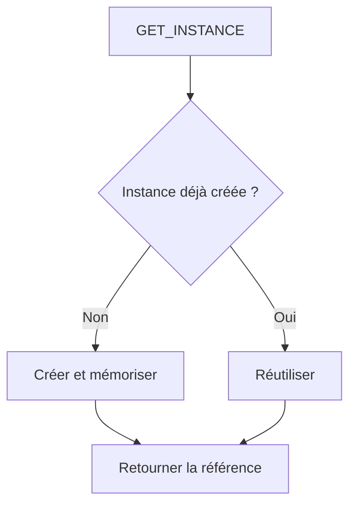

# 18. ENCADRER L’USAGE D’UN SINGLETON

## 18.A RÉSULTAT ATTENDU

- Implémenter un Singleton[^terme-singleton] uniquement lorsqu’une instance unique par session interne est requise.
- Garantir une instance unique par session interne.
- Savoir quand ne pas utiliser ce pattern.

## 18.B DÉFINITION

Un Singleton contrôle sa propre instanciation et retourne toujours la même instance pendant une session interne ABAP[^terme-abap]. Il utilise généralement :

- une instanciation privée ;
- un attribut[^terme-attribut] statique contenant la référence ;
- une méthode statique[^terme-methode-statique] `GET_INSTANCE`.



## 18.C PROCESS

### 18.C.1 Étape 1 — Justifier l’unicité

Vérifier que le processus exige réellement une seule instance par session interne. Si le besoin est seulement de partager une dépendance, préférer l’injection explicite.

### 18.C.2 Étape 2 — Fermer l’instanciation

Créer `ZCL_DEV_APP_CONTEXT` et définir l’instanciation privée. Vérifier depuis un report que `NEW zcl_dev_app_context( )` est interdit.

### 18.C.3 Étape 3 — Stocker l’instance

Créer l’attribut de classe[^terme-classe] privé `GO_INSTANCE TYPE REF TO zcl_dev_app_context`. Créer la méthode de classe publique `GET_INSTANCE` avec une référence de même type en `RETURNING`.

### 18.C.4 Étape 4 — Implémenter la création paresseuse

Si `GO_INSTANCE` n’est pas liée, créer l’objet ; retourner ensuite la référence existante. Ne placer pas dans le singleton un état utilisateur qui devrait être isolé par opération.

### 18.C.5 Étape 5 — Tester portée et identité

Appeler deux fois et comparer les références. Relancer dans une nouvelle session interne pour vérifier la portée réelle. Le singleton est validé uniquement si cette portée correspond au besoin documenté.

## 18.D CODE PRÊT À ADAPTER

```abap
" Définir le contrat et limiter l’API publique au besoin réel.
CLASS zcl_dev_app_context DEFINITION
  PUBLIC
  FINAL
  CREATE PRIVATE.

  PUBLIC SECTION.
    CLASS-METHODS get_instance
      RETURNING VALUE(ro_instance) TYPE REF TO zcl_dev_app_context.

    METHODS get_run_id
      RETURNING VALUE(rv_run_id) TYPE sysuuid_c32.

  PRIVATE SECTION.
    CLASS-DATA go_instance TYPE REF TO zcl_dev_app_context.
    DATA mv_run_id TYPE sysuuid_c32.

    METHODS constructor.
ENDCLASS.

CLASS zcl_dev_app_context IMPLEMENTATION.
  METHOD constructor.
    TRY.
        mv_run_id = cl_system_uuid=>create_uuid_c32_static( ).
      CATCH cx_uuid_error.
        CLEAR mv_run_id.
    ENDTRY.
  ENDMETHOD.

  METHOD get_instance.
    IF go_instance IS NOT BOUND.
      go_instance = NEW zcl_dev_app_context( ).
    ENDIF.
    ro_instance = go_instance.
  ENDMETHOD.

  METHOD get_run_id.
    rv_run_id = mv_run_id.
  ENDMETHOD.
ENDCLASS.
```

Test :

```abap
DATA(lo_first)  = zcl_dev_app_context=>get_instance( ).
DATA(lo_second) = zcl_dev_app_context=>get_instance( ).
ASSERT lo_first = lo_second.
```

## 18.E LIMITES

Un Singleton est un état global masqué. Il complique les tests, le parallélisme et la réinitialisation. Il est pertinent pour une ressource réellement unique dans la session, pas pour éviter de transmettre une dépendance.

## 18.F CONTRÔLE

- `NEW zcl_dev_app_context( )` est interdit hors de la classe.
- Deux appels retournent la même référence.
- Une nouvelle session interne peut créer une autre instance.
- Le Singleton ne contient pas d’état utilisateur persistant supposé partagé entre systèmes ou processus.

## 18.G ERREURS FRÉQUENTES

- Considérer le Singleton comme unique dans tout le système SAP[^terme-systeme-sap].
- Stocker des données métier sensibles dans un attribut statique.
- Utiliser le pattern à la place d’une injection de dépendances[^terme-injection-dependances].

## 18.H COMPATIBILITÉ S/4HANA

- Statut : compatible, mais à usage limité.
- L’instance est unique dans une session interne ABAP, pas dans le système, le mandant[^terme-mandant], un cluster ou plusieurs processus de travail[^terme-processus-travail].
- Préférer l’injection de dépendances lorsque l’objectif est seulement de partager ou remplacer un service.
- Ne pas utiliser un Singleton comme cache distribué ni comme stockage persistant.

## 18.I RÉFÉRENCES OFFICIELLES SAP

- [Static Classes and Singletons — ABAP Keyword Documentation](https://help.sap.com/doc/abapdocu_latest_index_htm/latest/en-US/ABENSTATIC_CLASS_SINGLETON_GUIDL.html)
- [ABAP Objects Design Patterns - Singleton — SAP Help Portal](https://help.sap.com/docs/SUPPORT_CONTENT/abapobjects/3353525629.html)
- [Singleton Classes — SAP Help Portal](https://help.sap.com/docs/SUPPORT_CONTENT/abap/3353524225.html)

---

[Chapitre suivant — COMPOSITION ET DÉLÉGATION](<./19 ├── COMPOSITION ET DELEGATION.md>)

[^terme-singleton]: **SINGLETON.** Pattern limitant la création à une seule instance accessible dans une session interne ABAP. Voir [l’entrée du lexique](<../🧩 00 ├── LEXIQUE SAP ET ABAP/04 ├── LANGAGE ET DEVELOPPEMENT ABAP.md#singleton>).
[^terme-abap]: **ABAP.** Langage de programmation de la plateforme ABAP, conçu pour développer des applications métier et techniques SAP. Voir [l’entrée du lexique](<../🧩 00 ├── LEXIQUE SAP ET ABAP/04 ├── LANGAGE ET DEVELOPPEMENT ABAP.md#abap>).
[^terme-attribut]: **ATTRIBUT.** Composant de données déclaré dans une classe et appartenant soit à chaque instance, soit à la classe elle-même. Voir [l’entrée du lexique](<../🧩 00 ├── LEXIQUE SAP ET ABAP/04 ├── LANGAGE ET DEVELOPPEMENT ABAP.md#attribut>).
[^terme-methode-statique]: **MÉTHODE STATIQUE.** Méthode déclarée `CLASS-METHODS`, appelée sur la classe avec `=>` sans créer d’instance. Voir [l’entrée du lexique](<../🧩 00 ├── LEXIQUE SAP ET ABAP/04 ├── LANGAGE ET DEVELOPPEMENT ABAP.md#methode-statique>).
[^terme-classe]: **CLASSE.** Modèle orienté objet définissant état et comportements. Voir [l’entrée du lexique](<../🧩 00 ├── LEXIQUE SAP ET ABAP/04 ├── LANGAGE ET DEVELOPPEMENT ABAP.md#classe>).
[^terme-systeme-sap]: **SYSTÈME SAP.** Ensemble technique cohérent comprenant au minimum une base de données et un ou plusieurs serveurs d’applications. Il est généralement identifié par un SID de trois caractères. Voir [l’entrée du lexique](<../🧩 00 ├── LEXIQUE SAP ET ABAP/01 ├── SYSTEMES ENVIRONNEMENTS ET MANDANTS.md#systeme-sap>).
[^terme-injection-dependances]: **INJECTION DE DÉPENDANCES.** Fourniture des collaborateurs d’un objet depuis l’extérieur au lieu de les créer directement dans son implémentation. Voir [l’entrée du lexique](<../🧩 00 ├── LEXIQUE SAP ET ABAP/04 ├── LANGAGE ET DEVELOPPEMENT ABAP.md#injection-dependances>).
[^terme-mandant]: **MANDANT.** Subdivision logique d’un système SAP. Il est identifié par un numéro à trois chiffres et isole une partie des données, du paramétrage et des utilisateurs. Voir [l’entrée du lexique](<../🧩 00 ├── LEXIQUE SAP ET ABAP/01 ├── SYSTEMES ENVIRONNEMENTS ET MANDANTS.md#mandant>).
[^terme-processus-travail]: **PROCESSUS DE TRAVAIL.** Processus serveur exécutant une catégorie de traitement ABAP. Voir [l’entrée du lexique](<../🧩 00 ├── LEXIQUE SAP ET ABAP/08 ├── EXECUTION EXPLOITATION ET ADMINISTRATION.md#processus-travail>).
