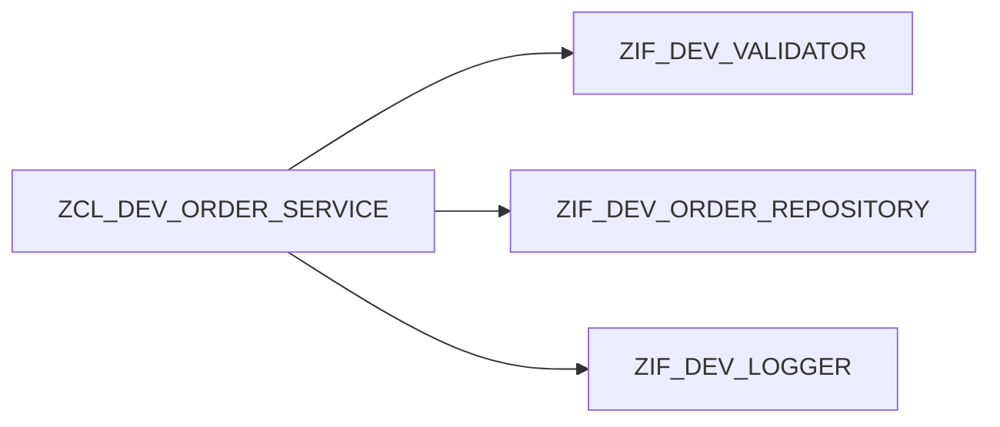

# 19. COMPOSITION ET DÉLÉGATION

## 19.A RÉSULTAT ATTENDU

- Construire une classe[^terme-classe] à partir de collaborateurs.
- Déléguer une responsabilité au bon objet.
- Préférer la composition[^terme-composition] à l’héritage[^terme-heritage] lorsque la relation est « utilise » plutôt que « est un ».

## 19.B CAS D’USAGE

Une classe de création de commande utilise un validateur, un repository et un journal. Elle n’est ni un validateur ni un repository : elle les compose.



## 19.C PROCESS

### 19.C.1 Étape 1 — Séparer les responsabilités

Lister les actions de la classe et identifier celles appartenant à un service indépendant. Nommer chaque collaborateur par son rôle, pas par une étape technique.

### 19.C.2 Étape 2 — Définir les contrats

Créer une interface pour chaque collaboration variable ou testable. Vérifier que sa signature ne dépend pas de l’orchestrateur.

### 19.C.3 Étape 3 — Injecter les composants

Ajouter des références d’interface privées et les recevoir dans le constructeur. Refuser une référence non liée avant d’affecter l’état.

### 19.C.4 Étape 4 — Déléguer

Dans la méthode[^terme-methode] métier, appeler chaque collaborateur et conserver uniquement séquence, décisions globales et gestion cohérente des erreurs.

### 19.C.5 Étape 5 — Tester indépendamment

Injecter des doubles enregistrant les appels. Vérifier ordre, paramètres et arrêt après erreur. La composition est validée lorsque chaque responsabilité peut évoluer sans modifier les autres contrats.

## 19.D CODE À ADAPTER

Signatures publiques de la classe d’orchestration :

```abap
METHODS constructor
  IMPORTING
    io_validator  TYPE REF TO zif_dev_validator
    io_repository TYPE REF TO zif_dev_order_repository
    io_logger     TYPE REF TO zif_dev_logger.

METHODS create_order
  IMPORTING is_order TYPE zdev_order
  RETURNING VALUE(rv_order_id) TYPE zdev_order_id
  RAISING   zcx_dev_invalid_order.

METHODS is_valid
  IMPORTING is_order TYPE zdev_order
  RETURNING VALUE(rv_valid) TYPE abap_bool.
```

```abap
" Définir le contrat et limiter l’API publique au besoin réel.
METHOD constructor.
  mo_validator  = io_validator.
  mo_repository = io_repository.
  mo_logger     = io_logger.
ENDMETHOD.

METHOD create_order.
  mo_validator->validate( is_order ).
  DATA(lv_id) = mo_repository->save( is_order ).
  mo_logger->info( |Commande { lv_id } créée| ).
  rv_order_id = lv_id.
ENDMETHOD.
```

## 19.E DÉLÉGATION

La méthode publique peut déléguer une partie de son travail sans exposer le collaborateur :

```abap
" Définir le contrat et limiter l’API publique au besoin réel.
METHOD is_valid.
  rv_valid = mo_validator->is_valid( is_order ).
ENDMETHOD.
```

## 19.F CONTRÔLE

- La classe principale ne connaît pas les détails de persistance.
- Chaque collaborateur peut être testé séparément.
- Remplacer le logger ne modifie pas la règle de création.
- Aucune sous-classe n’est créée uniquement pour changer une dépendance.

## 19.G ERREURS FRÉQUENTES

- Créer un objet collaborateur directement dans chaque méthode.
- Exposer les dépendances comme attributs publics.
- Introduire trop de petites interfaces sans responsabilité réelle.

## 19.H COMPATIBILITÉ S/4HANA

- Statut : compatible avec le développement ABAP[^terme-abap] classique sur SAP[^terme-acro-sap] S/4HANA.
- Vérifier la syntaxe exacte avec l’aide `F1`[^terme-aide-f1] du système cible lorsque plusieurs versions d’ABAP Platform sont prises en charge.
- Les objets globaux doivent être créés dans le package[^terme-package] et l’ordre de transport[^terme-ordre-transport] du projet.

## 19.I RÉFÉRENCES OFFICIELLES SAP

- [ABAP Objects — ABAP Keyword Documentation](https://help.sap.com/doc/abapdocu_latest_index_htm/latest/en-US/ABENABAP_OBJECTS.html)
- [Defining Interfaces — SAP Learning](https://learning.sap.com/courses/deepening-your-abap-programming-knowledge/defining-interfaces_ab3c7c07-bb66-424b-ba06-6cfa7cc39439)

---

[Chapitre suivant — INJECTION DE DÉPENDANCES](<./20 ├── INJECTION DE DEPENDANCES.md>)

[^terme-classe]: **CLASSE.** Modèle orienté objet définissant état et comportements. Voir [l’entrée du lexique](<../🧩 00 ├── LEXIQUE SAP ET ABAP/04 ├── LANGAGE ET DEVELOPPEMENT ABAP.md#classe>).
[^terme-composition]: **COMPOSITION.** Relation dans laquelle une classe réalise son comportement en contenant ou en utilisant d’autres objets spécialisés. Voir [l’entrée du lexique](<../🧩 00 ├── LEXIQUE SAP ET ABAP/04 ├── LANGAGE ET DEVELOPPEMENT ABAP.md#composition>).
[^terme-heritage]: **HÉRITAGE.** Relation permettant à une sous-classe de reprendre les composants accessibles d’une super-classe et de spécialiser son comportement. Voir [l’entrée du lexique](<../🧩 00 ├── LEXIQUE SAP ET ABAP/04 ├── LANGAGE ET DEVELOPPEMENT ABAP.md#heritage>).
[^terme-methode]: **MÉTHODE.** Comportement déclaré dans une classe ou une interface et appelé avec une liste de paramètres définie. Voir [l’entrée du lexique](<../🧩 00 ├── LEXIQUE SAP ET ABAP/04 ├── LANGAGE ET DEVELOPPEMENT ABAP.md#methode>).
[^terme-abap]: **ABAP.** Langage de programmation de la plateforme ABAP, conçu pour développer des applications métier et techniques SAP. Voir [l’entrée du lexique](<../🧩 00 ├── LEXIQUE SAP ET ABAP/04 ├── LANGAGE ET DEVELOPPEMENT ABAP.md#abap>).
[^terme-acro-sap]: **SAP.** Nom de l’éditeur et de son écosystème logiciel ; l’acronyme historique provient de l’allemand. Voir [l’entrée du lexique](<../🧩 00 ├── LEXIQUE SAP ET ABAP/10 └── ACRONYMES SAP.md#acro-sap>).
[^terme-aide-f1]: **AIDE F1.** Aide contextuelle expliquant un champ, une fonction ou un mot-clé. Voir [l’entrée du lexique](<../🧩 00 ├── LEXIQUE SAP ET ABAP/02 ├── SAP GUI NAVIGATION ET TRANSACTIONS.md#aide-f1>).
[^terme-package]: **PACKAGE.** Conteneur logique qui regroupe les objets de développement et détermine notamment leur transportabilité. Voir [l’entrée du lexique](<../🧩 00 ├── LEXIQUE SAP ET ABAP/03 ├── REPOSITORY PACKAGES ET TRANSPORTS.md#package>).
[^terme-ordre-transport]: **ORDRE DE TRANSPORT.** Conteneur qui regroupe des modifications à exporter puis importer dans d’autres systèmes. Voir [l’entrée du lexique](<../🧩 00 ├── LEXIQUE SAP ET ABAP/03 ├── REPOSITORY PACKAGES ET TRANSPORTS.md#ordre-transport>).
