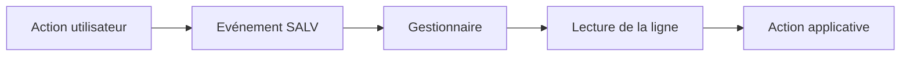

# 8. ÉVÉNEMENTS ET INTERACTIONS SALV

## 8.A RÉSULTAT ATTENDU

- Déclarer une classe[^terme-classe] gestionnaire
- Réagir au double-clic et aux liens
- Retrouver la ligne sélectionnée de manière sûre

## 8.B CLASSE GESTIONNAIRE

```abap
CLASS lcl_events DEFINITION FINAL.
  PUBLIC SECTION.
    CLASS-METHODS on_double_click
      FOR EVENT double_click OF cl_salv_events_table
      IMPORTING row column.
ENDCLASS.

CLASS lcl_events IMPLEMENTATION.
  METHOD on_double_click.
    READ TABLE gt_flights INDEX row INTO DATA(ls_flight).
    IF sy-subrc = 0.
      MESSAGE |{ column }: { ls_flight-carrid }| TYPE 'S'.
    ENDIF.
  ENDMETHOD.
ENDCLASS.
```

## 8.C ENREGISTRER LE GESTIONNAIRE

```abap
DATA lo_events TYPE REF TO cl_salv_events_table.

lo_events = go_alv->get_event( ).
SET HANDLER lcl_events=>on_double_click FOR lo_events.
```

## 8.D LIENS ET CELLULES INTERACTIVES

Une colonne configurée comme hotspot ou lien déclenche l’événement `LINK_CLICK`. Le gestionnaire reçoit la ligne et la colonne concernées.

## 8.E PRÉCAUTIONS

- Vérifier que l’index reçu existe encore dans la table affichée.
- Ne pas exécuter une mise à jour métier sur un simple double-clic sans confirmation.
- Contrôler les autorisations avant d’ouvrir une transaction ou un objet.
- Éviter les sélections SQL[^terme-acro-sql] répétées pour chaque clic lorsque les données peuvent être préparées en amont.

## 8.F FLUX



## 8.G PROCESS

### 8.G.1 Étape 1 — Choisir l’événement adapté

Associer l’interaction au besoin réel : lien ou hotspot, double-clic, commande ajoutée ou sélection. Ne pas déclencher plusieurs actions différentes depuis le même geste sans règle explicite.

### 8.G.2 Étape 2 — Déclarer une méthode avec la signature exacte

Dans la classe gestionnaire, déclarer la méthode[^terme-methode] `FOR EVENT ... OF ...` avec les paramètres fournis par l’événement SALV[^terme-acro-salv]. Ne pas ajouter de paramètre applicatif à la signature de l’événement.

### 8.G.3 Étape 3 — Instancier et enregistrer le gestionnaire

Créer une référence dont la durée de vie couvre l’affichage, récupérer `GET_EVENT`, puis exécuter `SET HANDLER ... FOR ...` avant `DISPLAY`.

### 8.G.4 Étape 4 — Rendre la cellule interactive

Configurer la colonne comme lien ou hotspot lorsque l’événement l’exige. Une méthode enregistrée sans colonne interactive ne sera pas appelée par un simple clic.

### 8.G.5 Étape 5 — Résoudre la ligne et valider l’action

Vérifier l’indice et le nom de colonne reçus, lire la ligne correspondante sans supposer qu’elle existe, puis exécuter les contrôles d’autorisation avant l’action métier.

### 8.G.6 Étape 6 — Tester après tri et filtrage

Tester l’événement sur plusieurs lignes, après un tri, après un filtre et sans sélection. Vérifier que la bonne clé métier est transmise au traitement.

## 8.H VÉRIFICATION

- Le contrôle syntaxique réussit.
- La version active correspond au code sauvegardé.
- L’exécution produit le résultat décrit dans le chapitre.
- Les cas vide, limite et erreur sont testés séparément lorsque la syntaxe le permet.

## 8.I ERREURS FRÉQUENTES

- Copier un exemple sans adapter les types, noms d’objets et données disponibles dans le système.
- Tester uniquement le cas nominal et ignorer les valeurs initiales, absentes ou invalides.
- Afficher un volume non borné dans l’ALV[^terme-alv].
- Rendre une cellule éditable sans validation ni sauvegarde transactionnelle.

## 8.J SNIPPET À RÉUTILISER

> [!NOTE]
> Adapter les noms `Z*`, les types DDIC[^terme-acro-ddic], les données et les autorisations au système cible. Effectuer un contrôle syntaxique avant activation.

```abap
CLASS lcl_events DEFINITION FINAL.
  PUBLIC SECTION.
    CLASS-METHODS on_double_click
      FOR EVENT double_click OF cl_salv_events_table
      IMPORTING row column.
ENDCLASS.

CLASS lcl_events IMPLEMENTATION.
  METHOD on_double_click.
    READ TABLE gt_flights INDEX row INTO DATA(ls_flight).
    IF sy-subrc = 0.
      MESSAGE |{ column }: { ls_flight-carrid }| TYPE 'S'.
    ENDIF.
  ENDMETHOD.
ENDCLASS.
```

## 8.K TERMES DU LEXIQUE

- [SALV](<../🧩 00 ├── LEXIQUE SAP ET ABAP/10 └── ACRONYMES SAP.md#acro-salv>)
- [ALV](<../🧩 00 ├── LEXIQUE SAP ET ABAP/10 └── ACRONYMES SAP.md#acro-alv>)
- [Table interne](<../🧩 00 ├── LEXIQUE SAP ET ABAP/04 ├── LANGAGE ET DEVELOPPEMENT ABAP.md#table-interne>)

## 8.L RÉFÉRENCES OFFICIELLES SAP

- [Handling Single and Double Clicks — SAP Help Portal](https://help.sap.com/docs/ABAP_PLATFORM_NEW/b1c834a22d05483b8a75710743b5ff26/4ebc7038f39c68bbe10000000a42189e.html)
- [Displaying Interactive Elements — SAP Help Portal](https://help.sap.com/docs/ABAP_PLATFORM_NEW/b1c834a22d05483b8a75710743b5ff26/4ec1afd0087c2b91e10000000a42189d.html)

---

[Chapitre suivant — SALV EN PLEIN ÉCRAN, CONTENEUR ET FENÊTRE](<./09 ├── SALV EN PLEIN ECRAN CONTENEUR ET FENETRE.md>)

[^terme-classe]: **CLASSE.** Modèle orienté objet définissant état et comportements. Voir [l’entrée du lexique](<../🧩 00 ├── LEXIQUE SAP ET ABAP/04 ├── LANGAGE ET DEVELOPPEMENT ABAP.md#classe>).
[^terme-acro-sql]: **SQL.** Structured Query Language. Voir [l’entrée du lexique](<../🧩 00 ├── LEXIQUE SAP ET ABAP/10 └── ACRONYMES SAP.md#acro-sql>).
[^terme-methode]: **MÉTHODE.** Comportement déclaré dans une classe ou une interface et appelé avec une liste de paramètres définie. Voir [l’entrée du lexique](<../🧩 00 ├── LEXIQUE SAP ET ABAP/04 ├── LANGAGE ET DEVELOPPEMENT ABAP.md#methode>).
[^terme-acro-salv]: **SALV.** Simple ALV / famille de classes `CL_SALV_*`. Voir [l’entrée du lexique](<../🧩 00 ├── LEXIQUE SAP ET ABAP/10 └── ACRONYMES SAP.md#acro-salv>).
[^terme-alv]: **ALV.** ABAP List Viewer, ensemble de technologies d’affichage tabulaire avec tri, filtre, total et variantes. Voir [l’entrée du lexique](<../🧩 00 ├── LEXIQUE SAP ET ABAP/06 ├── PROGRAMMES CLASSES ET OBJETS TECHNIQUES.md#alv>).
[^terme-acro-ddic]: **DDIC.** Data Dictionary, abréviation courante de l’ABAP Dictionary. Voir [l’entrée du lexique](<../🧩 00 ├── LEXIQUE SAP ET ABAP/10 └── ACRONYMES SAP.md#acro-ddic>).
