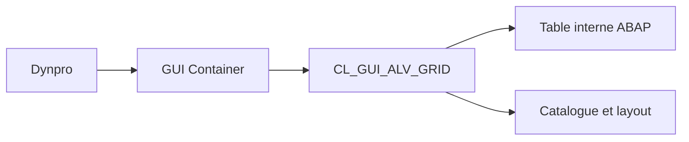

# 10. PRINCIPES DE CL_GUI_ALV_GRID

## 10.A RÉSULTAT ATTENDU

- Comprendre le rôle du Grid Control
- Identifier ses composants obligatoires
- Distinguer données backend[^terme-backend] et état frontend[^terme-frontend]

## 10.B ARCHITECTURE

`CL_GUI_ALV_GRID` représente un contrôle graphique géré par le SAP[^terme-acro-sap] Control Framework. Il affiche une table interne[^terme-table-interne] dans un conteneur rattaché à un écran SAP GUI[^terme-sap-gui].

## 10.C COMPOSANTS

- un écran Dynpro[^terme-dynpro] ;
- un conteneur, par exemple `CL_GUI_CUSTOM_CONTAINER` ;
- une instance `CL_GUI_ALV_GRID` ;
- une table interne de sortie ;
- un catalogue de champs ou une structure DDIC[^terme-structure-abap] ;
- éventuellement une classe[^terme-classe] de gestion des événements.

## 10.D CYCLE DE VIE

Créer le conteneur et la grille une seule fois, généralement lors du premier PBO. Lors des PBO suivants, actualiser la grille au lieu de recréer les contrôles.

## 10.E BACKEND ET FRONTEND

La table interne existe côté serveur ABAP[^terme-abap]. L’utilisateur manipule une représentation côté frontend. Pour un ALV[^terme-alv] éditable, les changements doivent être transférés et validés avant la sauvegarde.

## 10.F QUAND UTILISER LE GRID

- écran Dynpro existant ;
- édition ;
- événements détaillés ;
- toolbar personnalisée ;
- styles par cellule ;
- rafraîchissements fréquents.

## 10.G VÉRIFICATION

- Le lecteur peut expliquer la différence entre cette notion et les concepts proches.
- Le choix technique est justifié par un besoin concret, pas uniquement par habitude.
- Les limites liées à la release, aux autorisations et au contexte d’exécution sont identifiées.

## 10.H ERREURS FRÉQUENTES

- Afficher un volume non borné dans l’ALV.
- Rendre une cellule éditable sans validation ni sauvegarde transactionnelle.

## 10.I TERMES DU LEXIQUE

- [ALV](<../🧩 00 ├── LEXIQUE SAP ET ABAP/10 └── ACRONYMES SAP.md#acro-alv>)
- [SALV](<../🧩 00 ├── LEXIQUE SAP ET ABAP/10 └── ACRONYMES SAP.md#acro-salv>)
- [Table interne](<../🧩 00 ├── LEXIQUE SAP ET ABAP/04 ├── LANGAGE ET DEVELOPPEMENT ABAP.md#table-interne>)

## 10.J RÉFÉRENCES OFFICIELLES SAP

- [Instance for ALV Grid Control — SAP Help Portal](https://help.sap.com/docs/ABAP_PLATFORM_NEW/70396d7dec4c4f19b9ca3b2e47559d12/4ebaebe1251356a2e10000000a421937.html)
- [Working with the ALV Grid Control — SAP Help Portal](https://help.sap.com/docs/ABAP_PLATFORM_NEW/70396d7dec4c4f19b9ca3b2e47559d12/4ebd16291041389ee10000000a421937.html)
- [Methods of Class CL_GUI_ALV_GRID — SAP Help Portal](https://help.sap.com/docs/ABAP_PLATFORM_NEW/70396d7dec4c4f19b9ca3b2e47559d12/22a3f5ecd2fe11d2b467006094192fe3.html)

---

[Chapitre suivant — ÉCRAN DYNPRO ET CUSTOM CONTAINER](<./11 ├── ECRAN DYNPRO ET CUSTOM CONTAINER.md>)

[^terme-backend]: **BACKEND.** Système serveur qui exécute la logique ABAP et accède aux données. Voir [l’entrée du lexique](<../🧩 00 ├── LEXIQUE SAP ET ABAP/01 ├── SYSTEMES ENVIRONNEMENTS ET MANDANTS.md#backend>).
[^terme-frontend]: **FRONTEND.** Poste ou couche cliente utilisée par l’utilisateur, par exemple SAP GUI for Windows. Voir [l’entrée du lexique](<../🧩 00 ├── LEXIQUE SAP ET ABAP/01 ├── SYSTEMES ENVIRONNEMENTS ET MANDANTS.md#frontend>).
[^terme-acro-sap]: **SAP.** Nom de l’éditeur et de son écosystème logiciel ; l’acronyme historique provient de l’allemand. Voir [l’entrée du lexique](<../🧩 00 ├── LEXIQUE SAP ET ABAP/10 └── ACRONYMES SAP.md#acro-sap>).
[^terme-table-interne]: **TABLE INTERNE.** Collection dynamique de lignes stockée en mémoire dans le programme ABAP. Voir [l’entrée du lexique](<../🧩 00 ├── LEXIQUE SAP ET ABAP/04 ├── LANGAGE ET DEVELOPPEMENT ABAP.md#table-interne>).
[^terme-sap-gui]: **SAP GUI.** Client graphique permettant d’utiliser les transactions et écrans d’un système SAP. Voir [l’entrée du lexique](<../🧩 00 ├── LEXIQUE SAP ET ABAP/02 ├── SAP GUI NAVIGATION ET TRANSACTIONS.md#sap-gui>).
[^terme-dynpro]: **DYNPRO.** Écran classique SAP composé d’une définition d’écran et d’une logique PBO/PAI. Voir [l’entrée du lexique](<../🧩 00 ├── LEXIQUE SAP ET ABAP/02 ├── SAP GUI NAVIGATION ET TRANSACTIONS.md#dynpro>).
[^terme-structure-abap]: **STRUCTURE.** Objet ou type composé de plusieurs composants nommés. Voir [l’entrée du lexique](<../🧩 00 ├── LEXIQUE SAP ET ABAP/04 ├── LANGAGE ET DEVELOPPEMENT ABAP.md#structure-abap>).
[^terme-classe]: **CLASSE.** Modèle orienté objet définissant état et comportements. Voir [l’entrée du lexique](<../🧩 00 ├── LEXIQUE SAP ET ABAP/04 ├── LANGAGE ET DEVELOPPEMENT ABAP.md#classe>).
[^terme-abap]: **ABAP.** Langage de programmation de la plateforme ABAP, conçu pour développer des applications métier et techniques SAP. Voir [l’entrée du lexique](<../🧩 00 ├── LEXIQUE SAP ET ABAP/04 ├── LANGAGE ET DEVELOPPEMENT ABAP.md#abap>).
[^terme-alv]: **ALV.** ABAP List Viewer, ensemble de technologies d’affichage tabulaire avec tri, filtre, total et variantes. Voir [l’entrée du lexique](<../🧩 00 ├── LEXIQUE SAP ET ABAP/06 ├── PROGRAMMES CLASSES ET OBJETS TECHNIQUES.md#alv>).
