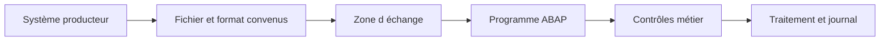

# 1. PRINCIPES DES INTERFACES FICHIERS

## 1.A RÉSULTAT ATTENDU

- Identifier le rôle d’une interface fichier
- Distinguer transport, format et traitement métier
- Structurer un échange robuste et exploitable
- Délimiter le périmètre par rapport aux RFC[^terme-rfc] et BAPI[^terme-bapi]

## 1.B DÉFINITION

Une **interface fichier** échange des données au moyen d’un fichier déposé ou récupéré dans un emplacement convenu. Le fichier constitue un contrat entre un producteur et un consommateur.

Une interface ne se limite pas à lire ou écrire des octets. Elle doit définir :

- le propriétaire du fichier ;
- l’emplacement de dépôt ;
- le nommage ;
- le format et l’encodage[^terme-encodage] ;
- la fréquence ;
- les contrôles ;
- la gestion des doublons ;
- la stratégie de reprise ;
- la conservation et l’archivage.

## 1.C COUCHES À SÉPARER

| Couche               | Responsabilité                                 |
| -------------------- | ---------------------------------------------- |
| Transport            | Dépôt, accès, déplacement ou téléchargement    |
| Sérialisation        | CSV[^terme-csv], largeur fixe, XML[^terme-xml], JSON[^terme-json] ou binaire        |
| Validation technique | Structure, types, nombre de colonnes, encodage |
| Validation métier    | Existence et cohérence des données SAP[^terme-acro-sap]         |
| Traitement           | Création ou modification via API[^terme-api] métier        |
| Traçabilité          | Logs, statuts, compteurs et erreurs            |

## 1.D PÉRIMÈTRE

Ce dossier traite les fichiers du serveur d’application[^terme-fichier-serveur-application] et du poste utilisateur dans SAP GUI[^terme-sap-gui]. Les RFC, BAPI et appels distants sont traités dans le dossier précédent. Les IDoc[^terme-idoc], services web et technologies d’intégration pourront faire l’objet de dossiers dédiés.

## 1.E RÈGLE DIRECTRICE

Le programme doit pouvoir expliquer précisément :

1. quel fichier a été traité ;
2. avec quel format ;
3. quelles lignes ont été acceptées ou rejetées ;
4. quelles opérations SAP ont été exécutées ;
5. comment reprendre sans créer de doublons.

## 1.F PROCESS

### 1.F.1 Étape 1 — Définir le contrat du fichier

Fixer producteur, consommateur, emplacement, encodage, séparateur, fin de ligne, formats, volume et fréquence. Définir aussi la règle de nommage et l’unicité.

### 1.F.2 Étape 2 — Définir la preuve de complétude

Choisir comment le consommateur distingue un fichier terminé : renommage atomique, extension temporaire, témoin ou protocole externe.

### 1.F.3 Étape 3 — Définir validation et rejet

Lister contrôles d’en-tête, colonnes, types, doublons et cohérence métier. Décider si une ligne invalide rejette tout le fichier ou alimente un rejet corrélé.

### 1.F.4 Étape 4 — Définir transaction et reprise

Choisir taille des lots, stratégie de commit, clé d’idempotence et reprise après interruption. Une relance ne doit pas créer de doublon.

### 1.F.5 Étape 5 — Tester le protocole

Tester fichier valide, vide, tronqué, encodage invalide, doublon et reprise. L’interface est validée lorsque chaque cas produit un état, un journal et une reprise déterministes.

## 1.G VÉRIFICATION

- Le fichier est créé ou lu dans l’emplacement attendu.
- Le nombre de lignes, la taille et l’encodage correspondent au contrat.
- Les caractères accentués, séparateurs, guillemets et fins de ligne sont testés.
- Le traitement journalise les rejets et permet une reprise sans doublon.

## 1.H ERREURS FRÉQUENTES

- Mélanger fichiers frontend[^terme-frontend] et serveur dans un même scénario.
- Parser un CSV par simple séparation alors que les champs peuvent être échappés.

## 1.I TERMES DU LEXIQUE

- [Interface](<../🧩 00 ├── LEXIQUE SAP ET ABAP/07 ├── INTERFACES ET INTEGRATION.md#interface-integration>)
- [Flux entrant](<../🧩 00 ├── LEXIQUE SAP ET ABAP/07 ├── INTERFACES ET INTEGRATION.md#flux-entrant>)
- [Flux sortant](<../🧩 00 ├── LEXIQUE SAP ET ABAP/07 ├── INTERFACES ET INTEGRATION.md#flux-sortant>)
- [CSV](<../🧩 00 ├── LEXIQUE SAP ET ABAP/07 ├── INTERFACES ET INTEGRATION.md#csv>)
- [Encodage](<../🧩 00 ├── LEXIQUE SAP ET ABAP/07 ├── INTERFACES ET INTEGRATION.md#encodage>)
- [Serveur d’application](<../🧩 00 ├── LEXIQUE SAP ET ABAP/07 ├── INTERFACES ET INTEGRATION.md#fichier-serveur-application>)

## 1.J RÉFÉRENCES OFFICIELLES SAP

- [ABAP File Interface — SAP Help Portal](https://help.sap.com/docs/ABAP_PLATFORM_NEW/7bfe8cdcfbb040dcb6702dada8c3e2f0/fa2fd3be291f469f862c4c8215e0549b.html)
- [Physical and Logical File Names — SAP Help Portal](https://help.sap.com/docs/ABAP_PLATFORM_NEW/7bfe8cdcfbb040dcb6702dada8c3e2f0/9e49819d5b2a440fb508772494b9a473.html)

---

[Chapitre suivant — SERVEUR D’APPLICATION OU POSTE UTILISATEUR](<./02 ├── SERVEUR D APPLICATION OU POSTE UTILISATEUR.md>)

[^terme-rfc]: **RFC.** Remote Function Call, mécanisme permettant d’appeler un module fonction compatible dans un autre contexte ou système. Voir [l’entrée du lexique](<../🧩 00 ├── LEXIQUE SAP ET ABAP/06 ├── PROGRAMMES CLASSES ET OBJETS TECHNIQUES.md#rfc>).
[^terme-bapi]: **BAPI.** Interface métier publiée autour d’un Business Object SAP, généralement implémentée par un module fonction RFC. Voir [l’entrée du lexique](<../🧩 00 ├── LEXIQUE SAP ET ABAP/06 ├── PROGRAMMES CLASSES ET OBJETS TECHNIQUES.md#bapi>).
[^terme-encodage]: **ENCODAGE.** Règle transformant les caractères en octets et inversement. Voir [l’entrée du lexique](<../🧩 00 ├── LEXIQUE SAP ET ABAP/07 ├── INTERFACES ET INTEGRATION.md#encodage>).
[^terme-csv]: **CSV.** Format texte tabulaire utilisant un séparateur de champs et des règles d’échappement. Voir [l’entrée du lexique](<../🧩 00 ├── LEXIQUE SAP ET ABAP/07 ├── INTERFACES ET INTEGRATION.md#csv>).
[^terme-xml]: **XML.** Format texte hiérarchique basé sur des balises. Voir [l’entrée du lexique](<../🧩 00 ├── LEXIQUE SAP ET ABAP/07 ├── INTERFACES ET INTEGRATION.md#xml>).
[^terme-json]: **JSON.** Format texte structuré utilisant objets, tableaux, chaînes, nombres, booléens et valeur null. Voir [l’entrée du lexique](<../🧩 00 ├── LEXIQUE SAP ET ABAP/07 ├── INTERFACES ET INTEGRATION.md#json>).
[^terme-acro-sap]: **SAP.** Nom de l’éditeur et de son écosystème logiciel ; l’acronyme historique provient de l’allemand. Voir [l’entrée du lexique](<../🧩 00 ├── LEXIQUE SAP ET ABAP/10 └── ACRONYMES SAP.md#acro-sap>).
[^terme-api]: **API.** Application Programming Interface, contrat exposant des opérations ou données utilisables par d’autres composants. Voir [l’entrée du lexique](<../🧩 00 ├── LEXIQUE SAP ET ABAP/10 └── ACRONYMES SAP.md#api>).
[^terme-fichier-serveur-application]: **SERVEUR D’APPLICATION.** Emplacement du backend où un programme ABAP peut lire ou écrire avec `OPEN DATASET`. Voir [l’entrée du lexique](<../🧩 00 ├── LEXIQUE SAP ET ABAP/07 ├── INTERFACES ET INTEGRATION.md#fichier-serveur-application>).
[^terme-sap-gui]: **SAP GUI.** Client graphique permettant d’utiliser les transactions et écrans d’un système SAP. Voir [l’entrée du lexique](<../🧩 00 ├── LEXIQUE SAP ET ABAP/02 ├── SAP GUI NAVIGATION ET TRANSACTIONS.md#sap-gui>).
[^terme-idoc]: **IDOC.** Document intermédiaire SAP structuré en segments pour l’échange de messages métier. Voir [l’entrée du lexique](<../🧩 00 ├── LEXIQUE SAP ET ABAP/07 ├── INTERFACES ET INTEGRATION.md#idoc>).
[^terme-frontend]: **FRONTEND.** Poste ou couche cliente utilisée par l’utilisateur, par exemple SAP GUI for Windows. Voir [l’entrée du lexique](<../🧩 00 ├── LEXIQUE SAP ET ABAP/01 ├── SYSTEMES ENVIRONNEMENTS ET MANDANTS.md#frontend>).
