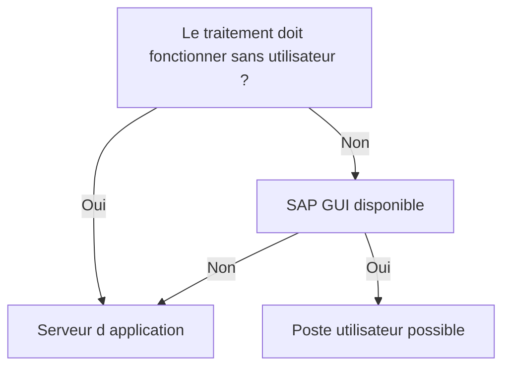

# 2. SERVEUR D’APPLICATION OU POSTE UTILISATEUR

## 2.A RÉSULTAT ATTENDU

- Distinguer les deux emplacements de fichiers
- Choisir une solution compatible avec le mode d’exécution
- Éviter les dépendances au poste utilisateur

## 2.B DEUX SYSTÈMES DE FICHIERS

Un programme ABAP[^terme-abap] peut principalement manipuler :

| Emplacement           | Exécution du code         | API[^terme-api] principale                                          |
| --------------------- | ------------------------- | ------------------------------------------------------- |
| Serveur d’application[^terme-fichier-serveur-application] | Instance AS ABAP          | Instructions `OPEN DATASET`, `READ DATASET`, `TRANSFER` |
| Poste utilisateur     | Machine exécutant SAP GUI[^terme-sap-gui] | `CL_GUI_FRONTEND_SERVICES`                              |



## 2.C SERVEUR D’APPLICATION

À privilégier pour :

- les traitements planifiés ;
- les interfaces automatiques ;
- les volumes importants ;
- les répertoires partagés avec un middleware ;
- les traitements nécessitant une reprise contrôlée.

Dans un système réparti, chaque instance peut disposer de son propre système de fichiers. Un chemin physique local n’est donc pas nécessairement visible depuis toutes les instances.

## 2.D POSTE UTILISATEUR

À réserver aux interactions explicites :

- import manuel ponctuel ;
- export demandé par l’utilisateur ;
- sélection d’un fichier au moyen d’une boîte de dialogue.

Ces opérations dépendent de SAP GUI et ne doivent pas être utilisées dans un job[^terme-job] de fond.

## 2.E DÉCISION

| Besoin                                   | Choix recommandé      |
| ---------------------------------------- | --------------------- |
| Interface nocturne                       | Serveur d’application |
| Fichier déposé par CPI ou SFTP           | Serveur d’application |
| Export manuel d’une liste                | Poste utilisateur     |
| Traitement relançable sans session       | Serveur d’application |
| Sélection interactive d’un fichier local | Poste utilisateur     |

## 2.F PROCESS

### 2.F.1 Étape 1 — Identifier le mode d’exécution

Déterminer si le programme fonctionne en dialogue uniquement ou aussi en job, RFC[^terme-rfc] ou traitement sans frontend[^terme-frontend]. Un job ne peut pas utiliser les services du poste utilisateur.

### 2.F.2 Étape 2 — Choisir l’emplacement

Utiliser le serveur pour un échange automatisé et partagé. Utiliser le frontend uniquement pour une action interactive où l’utilisateur choisit localement le fichier.

### 2.F.3 Étape 3 — Choisir l’API

Pour le serveur, utiliser noms logiques et `OPEN DATASET`. Pour le frontend, utiliser `CL_GUI_FRONTEND_SERVICES` et vérifier la disponibilité de SAP GUI.

### 2.F.4 Étape 4 — Tester les contextes

Exécuter en dialogue puis, si requis, en arrière-plan. Une erreur frontend en job impose de basculer vers un chemin serveur.

### 2.F.5 Étape 5 — Valider sécurité et reprise

Contrôler autorisations, chemins et récupération. Le choix est validé lorsque l’emplacement reste accessible dans tous les modes prévus.

## 2.G VÉRIFICATION

- Le scénario reproduit correspond au même utilisateur, mandant[^terme-mandant], transaction et jeu de données.
- L’horodatage et l’identifiant de l’analyse sont conservés.
- La cause retenue est soutenue par une ligne source, une trace[^terme-trace] ou une valeur observée.
- Après correction, le même scénario ne reproduit plus le défaut et le résultat métier reste identique.

## 2.H ERREURS FRÉQUENTES

- Mélanger fichiers frontend et serveur dans un même scénario.
- Parser un CSV[^terme-csv] par simple séparation alors que les champs peuvent être échappés.

## 2.I FICHE DE CONTRÔLE À COPIER

```text
Système / SID       :
Mandant             :
Utilisateur         :
Transaction / outil :
Objet technique     :
Jeu de données      :
Résultat attendu    :
Résultat observé    :
Horodatage          :
Ordre de transport  :
```

## 2.J TERMES DU LEXIQUE

- [Serveur d’application](<../🧩 00 ├── LEXIQUE SAP ET ABAP/07 ├── INTERFACES ET INTEGRATION.md#fichier-serveur-application>)
- [Interface](<../🧩 00 ├── LEXIQUE SAP ET ABAP/07 ├── INTERFACES ET INTEGRATION.md#interface-integration>)
- [Flux entrant](<../🧩 00 ├── LEXIQUE SAP ET ABAP/07 ├── INTERFACES ET INTEGRATION.md#flux-entrant>)
- [Flux sortant](<../🧩 00 ├── LEXIQUE SAP ET ABAP/07 ├── INTERFACES ET INTEGRATION.md#flux-sortant>)
- [CSV](<../🧩 00 ├── LEXIQUE SAP ET ABAP/07 ├── INTERFACES ET INTEGRATION.md#csv>)
- [Encodage](<../🧩 00 ├── LEXIQUE SAP ET ABAP/07 ├── INTERFACES ET INTEGRATION.md#encodage>)

## 2.K RÉFÉRENCES OFFICIELLES SAP

- [ABAP File Interface — SAP Help Portal](https://help.sap.com/docs/ABAP_PLATFORM_NEW/7bfe8cdcfbb040dcb6702dada8c3e2f0/fa2fd3be291f469f862c4c8215e0549b.html)
- [Files on the Presentation Server — ABAP Keyword Documentation](https://help.sap.com/doc/abapdocu_latest_index_htm/latest/en-US/ABENFRONTEND_FILES.html)
- [Physical and Logical File Names — SAP Help Portal](https://help.sap.com/docs/ABAP_PLATFORM_NEW/7bfe8cdcfbb040dcb6702dada8c3e2f0/9e49819d5b2a440fb508772494b9a473.html)

---

[Chapitre suivant — RÉPERTOIRES SERVEUR ET TRANSACTION AL11](<./03 ├── REPERTOIRES SERVEUR ET TRANSACTION AL11.md>)

[^terme-abap]: **ABAP.** Langage de programmation de la plateforme ABAP, conçu pour développer des applications métier et techniques SAP. Voir [l’entrée du lexique](<../🧩 00 ├── LEXIQUE SAP ET ABAP/04 ├── LANGAGE ET DEVELOPPEMENT ABAP.md#abap>).
[^terme-api]: **API.** Application Programming Interface, contrat exposant des opérations ou données utilisables par d’autres composants. Voir [l’entrée du lexique](<../🧩 00 ├── LEXIQUE SAP ET ABAP/10 └── ACRONYMES SAP.md#api>).
[^terme-fichier-serveur-application]: **SERVEUR D’APPLICATION.** Emplacement du backend où un programme ABAP peut lire ou écrire avec `OPEN DATASET`. Voir [l’entrée du lexique](<../🧩 00 ├── LEXIQUE SAP ET ABAP/07 ├── INTERFACES ET INTEGRATION.md#fichier-serveur-application>).
[^terme-sap-gui]: **SAP GUI.** Client graphique permettant d’utiliser les transactions et écrans d’un système SAP. Voir [l’entrée du lexique](<../🧩 00 ├── LEXIQUE SAP ET ABAP/02 ├── SAP GUI NAVIGATION ET TRANSACTIONS.md#sap-gui>).
[^terme-job]: **JOB.** Traitement planifié en arrière-plan composé d’une ou plusieurs étapes. Voir [l’entrée du lexique](<../🧩 00 ├── LEXIQUE SAP ET ABAP/06 ├── PROGRAMMES CLASSES ET OBJETS TECHNIQUES.md#job>).
[^terme-rfc]: **RFC.** Remote Function Call, mécanisme permettant d’appeler un module fonction compatible dans un autre contexte ou système. Voir [l’entrée du lexique](<../🧩 00 ├── LEXIQUE SAP ET ABAP/06 ├── PROGRAMMES CLASSES ET OBJETS TECHNIQUES.md#rfc>).
[^terme-frontend]: **FRONTEND.** Poste ou couche cliente utilisée par l’utilisateur, par exemple SAP GUI for Windows. Voir [l’entrée du lexique](<../🧩 00 ├── LEXIQUE SAP ET ABAP/01 ├── SYSTEMES ENVIRONNEMENTS ET MANDANTS.md#frontend>).
[^terme-mandant]: **MANDANT.** Subdivision logique d’un système SAP. Il est identifié par un numéro à trois chiffres et isole une partie des données, du paramétrage et des utilisateurs. Voir [l’entrée du lexique](<../🧩 00 ├── LEXIQUE SAP ET ABAP/01 ├── SYSTEMES ENVIRONNEMENTS ET MANDANTS.md#mandant>).
[^terme-trace]: **TRACE.** Enregistrement détaillé d’événements techniques pour analyser exécution, SQL ou appels. Voir [l’entrée du lexique](<../🧩 00 ├── LEXIQUE SAP ET ABAP/08 ├── EXECUTION EXPLOITATION ET ADMINISTRATION.md#trace>).
[^terme-csv]: **CSV.** Format texte tabulaire utilisant un séparateur de champs et des règles d’échappement. Voir [l’entrée du lexique](<../🧩 00 ├── LEXIQUE SAP ET ABAP/07 ├── INTERFACES ET INTEGRATION.md#csv>).
