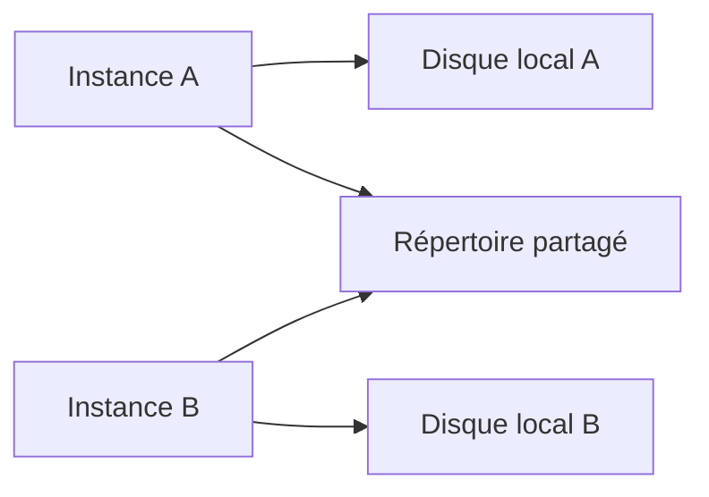

# 3. RÉPERTOIRES SERVEUR ET TRANSACTION AL11

## 3.A RÉSULTAT ATTENDU

- Comprendre le rôle de `AL11`[^outil-al11]
- Identifier les limites d’un chemin serveur
- Vérifier un fichier sans confondre consultation et configuration

## 3.B RÔLE DE `AL11`

La transaction `AL11` affiche les répertoires du serveur d’application[^terme-fichier-serveur-application] déclarés dans la configuration du système. Elle permet généralement de consulter les fichiers accessibles depuis l’instance concernée.

`AL11` n’est pas un explorateur universel du système d’exploitation et ne remplace pas :

- la configuration des noms logiques ;
- les autorisations ABAP[^terme-abap] ;
- les droits du compte système d’exploitation ;
- une procédure d’archivage ou de transfert.

## 3.C SYSTÈME RÉPARTI



Un fichier écrit sur un disque local de l’instance A peut être introuvable si le job[^terme-job] suivant s’exécute sur l’instance B. Les interfaces automatiques doivent utiliser un stockage partagé ou une contrainte d’exécution maîtrisée.

## 3.D VÉRIFICATIONS

Avant le développement :

1. identifier le répertoire logique attendu ;
2. confirmer qu’il existe dans chaque environnement[^terme-environnement] ;
3. vérifier s’il est partagé entre instances ;
4. connaître le compte chargé de déposer ou récupérer le fichier ;
5. vérifier les règles de purge ;
6. tester avec l’utilisateur technique réel.

## 3.E UTILISATION PROFESSIONNELLE

Ne coder aucun chemin observé uniquement en développement. Un chemin comme `/usr/sap/.../interface` peut différer entre DEV, QAS et PRD. La résolution doit passer par un nom logique ou une configuration applicative transportable.

## 3.F PROCESS

### 3.F.1 Étape 1 — Ouvrir l’alias attendu

Saisir `/nAL11`, rechercher l’alias documenté puis l’ouvrir. Ne choisir pas un répertoire uniquement parce que son nom ressemble au flux.

### 3.F.2 Étape 2 — Relever le contexte physique

Noter chemin et serveur d’application. Sur un système multi-instance, déterminer si le stockage est partagé ou local.

### 3.F.3 Étape 3 — Identifier le fichier exact

Relever nom, date et taille, puis comparer l’horodatage avec le journal du producteur. Un fichier visible peut appartenir à une autre exécution.

### 3.F.4 Étape 4 — Vérifier lecture et autorisation

Confirmer avec le programme ou un test contrôlé que le chemin physique est accessible par l’utilisateur d’exécution. La visibilité[^terme-visibilite] dans `AL11` ne prouve pas cette autorisation.

### 3.F.5 Étape 5 — Classer l’anomalie

Distinguer absent, vide, incomplet, illisible et inaccessible. Ne modifier aucun fichier. Le diagnostic est terminé lorsque chemin, instance et anomalie sont prouvés.

## 3.G ERREURS FRÉQUENTES

- Mélanger fichiers frontend[^terme-frontend] et serveur dans un même scénario.
- Parser un CSV[^terme-csv] par simple séparation alors que les champs peuvent être échappés.

## 3.H FICHE DE CONTRÔLE À COPIER

```text
Système / SID       :
Mandant             :
Utilisateur         :
Transaction / outil :
Objet technique     :
Jeu de données      :
Résultat attendu    :
Résultat observé    :
Horodatage          :
Ordre de transport  :
```

## 3.I TERMES DU LEXIQUE

- [Transaction](<../🧩 00 ├── LEXIQUE SAP ET ABAP/02 ├── SAP GUI NAVIGATION ET TRANSACTIONS.md#transaction>)
- [Interface](<../🧩 00 ├── LEXIQUE SAP ET ABAP/07 ├── INTERFACES ET INTEGRATION.md#interface-integration>)
- [Flux entrant](<../🧩 00 ├── LEXIQUE SAP ET ABAP/07 ├── INTERFACES ET INTEGRATION.md#flux-entrant>)
- [Flux sortant](<../🧩 00 ├── LEXIQUE SAP ET ABAP/07 ├── INTERFACES ET INTEGRATION.md#flux-sortant>)
- [CSV](<../🧩 00 ├── LEXIQUE SAP ET ABAP/07 ├── INTERFACES ET INTEGRATION.md#csv>)
- [Encodage](<../🧩 00 ├── LEXIQUE SAP ET ABAP/07 ├── INTERFACES ET INTEGRATION.md#encodage>)

## 3.J RÉFÉRENCES OFFICIELLES SAP

- [ABAP File Interface — SAP Help Portal](https://help.sap.com/docs/ABAP_PLATFORM_NEW/7bfe8cdcfbb040dcb6702dada8c3e2f0/fa2fd3be291f469f862c4c8215e0549b.html)
- [Physical and Logical File Names — SAP Help Portal](https://help.sap.com/docs/ABAP_PLATFORM_NEW/7bfe8cdcfbb040dcb6702dada8c3e2f0/9e49819d5b2a440fb508772494b9a473.html)

---

[Chapitre suivant — NOMS ET CHEMINS LOGIQUES AVEC `FILE`[^outil-file]](<./04 ├── NOMS ET CHEMINS LOGIQUES AVEC FILE.md>)

[^terme-fichier-serveur-application]: **SERVEUR D’APPLICATION.** Emplacement du backend où un programme ABAP peut lire ou écrire avec `OPEN DATASET`. Voir [l’entrée du lexique](<../🧩 00 ├── LEXIQUE SAP ET ABAP/07 ├── INTERFACES ET INTEGRATION.md#fichier-serveur-application>).
[^terme-abap]: **ABAP.** Langage de programmation de la plateforme ABAP, conçu pour développer des applications métier et techniques SAP. Voir [l’entrée du lexique](<../🧩 00 ├── LEXIQUE SAP ET ABAP/04 ├── LANGAGE ET DEVELOPPEMENT ABAP.md#abap>).
[^terme-job]: **JOB.** Traitement planifié en arrière-plan composé d’une ou plusieurs étapes. Voir [l’entrée du lexique](<../🧩 00 ├── LEXIQUE SAP ET ABAP/06 ├── PROGRAMMES CLASSES ET OBJETS TECHNIQUES.md#job>).
[^terme-environnement]: **ENVIRONNEMENT.** Rôle fonctionnel attribué à un système dans le cycle de vie : développement, test, recette, préproduction ou production. Voir [l’entrée du lexique](<../🧩 00 ├── LEXIQUE SAP ET ABAP/01 ├── SYSTEMES ENVIRONNEMENTS ET MANDANTS.md#environnement>).
[^terme-visibilite]: **VISIBILITÉ.** Règle déterminant où un composant de classe peut être utilisé : `PUBLIC`, `PROTECTED` ou `PRIVATE`. Voir [l’entrée du lexique](<../🧩 00 ├── LEXIQUE SAP ET ABAP/04 ├── LANGAGE ET DEVELOPPEMENT ABAP.md#visibilite>).
[^terme-frontend]: **FRONTEND.** Poste ou couche cliente utilisée par l’utilisateur, par exemple SAP GUI for Windows. Voir [l’entrée du lexique](<../🧩 00 ├── LEXIQUE SAP ET ABAP/01 ├── SYSTEMES ENVIRONNEMENTS ET MANDANTS.md#frontend>).
[^terme-csv]: **CSV.** Format texte tabulaire utilisant un séparateur de champs et des règles d’échappement. Voir [l’entrée du lexique](<../🧩 00 ├── LEXIQUE SAP ET ABAP/07 ├── INTERFACES ET INTEGRATION.md#csv>).

[^outil-al11]: **AL11.** Transaction affichant les répertoires de fichiers accessibles sur le serveur d’applications. Voir [le chapitre associé](<03 ├── REPERTOIRES SERVEUR ET TRANSACTION AL11.md>).
[^outil-file]: **FILE.** Transaction de maintenance des noms et chemins de fichiers logiques. Voir [le chapitre associé](<04 ├── NOMS ET CHEMINS LOGIQUES AVEC FILE.md>).
