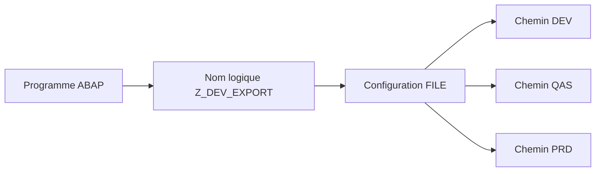

# 4. NOMS ET CHEMINS LOGIQUES AVEC `FILE`

## 4.A RÉSULTAT ATTENDU

- Éviter les chemins physiques codés en dur
- Configurer des noms indépendants de la plateforme
- Résoudre un nom logique dans un programme ABAP[^terme-abap]

## 4.B PRINCIPE

La transaction `FILE`[^outil-file] permet de définir des chemins et noms de fichiers logiques indépendants du système d’exploitation. Chaque environnement[^terme-environnement] résout ensuite le même nom logique vers un chemin physique adapté.



## 4.C ÉLÉMENTS

| Élément                | Rôle                                                             |
| ---------------------- | ---------------------------------------------------------------- |
| Chemin logique         | Représente un répertoire selon la plateforme                     |
| Nom de fichier logique | Décrit le fichier et son format physique                         |
| Syntax group           | Permet des définitions spécifiques au système d’exploitation     |
| Paramètres             | Injectent une date, un identifiant ou une autre valeur contrôlée |

## 4.D RÉSOLUTION DANS LE PROGRAMME

```abap
" Appeler l’API classique et traiter explicitement son résultat.
DATA lv_file TYPE string.

CALL FUNCTION 'FILE_GET_NAME'
  EXPORTING
    logical_filename = 'Z_DEV_EXPORT_PRODUCTS'
    parameter_1      = sy-datum
  IMPORTING
    file_name        = lv_file
  EXCEPTIONS
    file_not_found   = 1
    OTHERS           = 2.

IF sy-subrc <> 0.
  MESSAGE e001(zdev_file).
ENDIF.
```

L’interface exacte du module fonction[^terme-module-fonction] doit être vérifiée dans `SE37`[^outil-se37] sur la version du système.

## 4.E RÈGLES

- Utiliser des noms explicites préfixés par l’espace client.
- Contrôler les paramètres injectés.
- Ne jamais injecter directement un chemin saisi librement par l’utilisateur.
- Tester la résolution dans tous les environnements.
- Documenter le propriétaire de la configuration `FILE`.

## 4.F PROCESS

### 4.F.1 Étape 1 — Examiner la configuration FILE

Ouvrir `FILE`, afficher nom et chemin logiques. Relever syntax group, placeholders et chemin physique associé au système.

### 4.F.2 Étape 2 — Préparer les paramètres

Identifier les variables utilisées par la définition. Fournir uniquement des valeurs validées, sans séparateur de chemin transmis par l’utilisateur.

### 4.F.3 Étape 3 — Résoudre avec l’API standard

Dans `SE37`, ouvrir `FILE_GET_NAME` ou l’API[^terme-api] prévue sur la release, reprendre sa signature exacte et renseigner nom logique et paramètres obligatoires.

### 4.F.4 Étape 4 — Valider le résultat

Vérifier que le chemin retourné appartient au répertoire autorisé, utilise le syntax group du serveur et possède le nom attendu.

### 4.F.5 Étape 5 — Tester le consommateur

Utiliser le chemin dans `OPEN DATASET`, traiter `SY-SUBRC` puis fermer. La configuration est validée lorsque le même nom logique fonctionne dans chaque système sans chemin codé en dur.

## 4.G VÉRIFICATION

- Le fichier est créé ou lu dans l’emplacement attendu.
- Le nombre de lignes, la taille et l’encodage[^terme-encodage] correspondent au contrat.
- Les caractères accentués, séparateurs, guillemets et fins de ligne sont testés.
- Le traitement journalise les rejets et permet une reprise sans doublon.

## 4.H ERREURS FRÉQUENTES

- Copier un exemple sans adapter les types, noms d’objets et données disponibles dans le système.
- Tester uniquement le cas nominal et ignorer les valeurs initiales, absentes ou invalides.
- Mélanger fichiers frontend[^terme-frontend] et serveur dans un même scénario.
- Parser un CSV[^terme-csv] par simple séparation alors que les champs peuvent être échappés.

## 4.I SNIPPET À RÉUTILISER

> [!NOTE]
> Adapter les noms `Z*`, les types DDIC[^terme-acro-ddic], les données et les autorisations au système cible. Effectuer un contrôle syntaxique avant activation.

```abap
" Appeler l’API classique et traiter explicitement son résultat.
DATA lv_file TYPE string.

CALL FUNCTION 'FILE_GET_NAME'
  EXPORTING
    logical_filename = 'Z_DEV_EXPORT_PRODUCTS'
    parameter_1      = sy-datum
  IMPORTING
    file_name        = lv_file
  EXCEPTIONS
    file_not_found   = 1
    OTHERS           = 2.

IF sy-subrc <> 0.
  MESSAGE e001(zdev_file).
ENDIF.
```

## 4.J TERMES DU LEXIQUE

- [Interface](<../🧩 00 ├── LEXIQUE SAP ET ABAP/07 ├── INTERFACES ET INTEGRATION.md#interface-integration>)
- [Flux entrant](<../🧩 00 ├── LEXIQUE SAP ET ABAP/07 ├── INTERFACES ET INTEGRATION.md#flux-entrant>)
- [Flux sortant](<../🧩 00 ├── LEXIQUE SAP ET ABAP/07 ├── INTERFACES ET INTEGRATION.md#flux-sortant>)
- [CSV](<../🧩 00 ├── LEXIQUE SAP ET ABAP/07 ├── INTERFACES ET INTEGRATION.md#csv>)
- [Encodage](<../🧩 00 ├── LEXIQUE SAP ET ABAP/07 ├── INTERFACES ET INTEGRATION.md#encodage>)
- [Serveur d’application](<../🧩 00 ├── LEXIQUE SAP ET ABAP/07 ├── INTERFACES ET INTEGRATION.md#fichier-serveur-application>)

## 4.K RÉFÉRENCES OFFICIELLES SAP

- [Physical and Logical File Names — SAP Help Portal](https://help.sap.com/docs/ABAP_PLATFORM_NEW/7bfe8cdcfbb040dcb6702dada8c3e2f0/9e49819d5b2a440fb508772494b9a473.html)
- [Defining Logical Path and File Names — SAP Help Portal](https://help.sap.com/docs/SAP_NETWEAVER_700/10907a5e6c531014a252fdc4265a1f8e/4d88692f8d7a40ade10000000a15822b.html)

---

[Chapitre suivant — AUTORISATIONS ET SÉCURITÉ DES FICHIERS](<./05 ├── AUTORISATIONS ET SECURITE DES FICHIERS.md>)

[^terme-abap]: **ABAP.** Langage de programmation de la plateforme ABAP, conçu pour développer des applications métier et techniques SAP. Voir [l’entrée du lexique](<../🧩 00 ├── LEXIQUE SAP ET ABAP/04 ├── LANGAGE ET DEVELOPPEMENT ABAP.md#abap>).
[^terme-environnement]: **ENVIRONNEMENT.** Rôle fonctionnel attribué à un système dans le cycle de vie : développement, test, recette, préproduction ou production. Voir [l’entrée du lexique](<../🧩 00 ├── LEXIQUE SAP ET ABAP/01 ├── SYSTEMES ENVIRONNEMENTS ET MANDANTS.md#environnement>).
[^terme-module-fonction]: **MODULE FONCTION.** Procédure globale appelée avec `CALL FUNCTION` et définie dans un groupe de fonctions. Voir [l’entrée du lexique](<../🧩 00 ├── LEXIQUE SAP ET ABAP/06 ├── PROGRAMMES CLASSES ET OBJETS TECHNIQUES.md#module-fonction>).
[^terme-api]: **API.** Application Programming Interface, contrat exposant des opérations ou données utilisables par d’autres composants. Voir [l’entrée du lexique](<../🧩 00 ├── LEXIQUE SAP ET ABAP/10 └── ACRONYMES SAP.md#api>).
[^terme-encodage]: **ENCODAGE.** Règle transformant les caractères en octets et inversement. Voir [l’entrée du lexique](<../🧩 00 ├── LEXIQUE SAP ET ABAP/07 ├── INTERFACES ET INTEGRATION.md#encodage>).
[^terme-frontend]: **FRONTEND.** Poste ou couche cliente utilisée par l’utilisateur, par exemple SAP GUI for Windows. Voir [l’entrée du lexique](<../🧩 00 ├── LEXIQUE SAP ET ABAP/01 ├── SYSTEMES ENVIRONNEMENTS ET MANDANTS.md#frontend>).
[^terme-csv]: **CSV.** Format texte tabulaire utilisant un séparateur de champs et des règles d’échappement. Voir [l’entrée du lexique](<../🧩 00 ├── LEXIQUE SAP ET ABAP/07 ├── INTERFACES ET INTEGRATION.md#csv>).
[^terme-acro-ddic]: **DDIC.** Data Dictionary, abréviation courante de l’ABAP Dictionary. Voir [l’entrée du lexique](<../🧩 00 ├── LEXIQUE SAP ET ABAP/10 └── ACRONYMES SAP.md#acro-ddic>).

[^outil-file]: **FILE.** Transaction de maintenance des noms et chemins de fichiers logiques. Voir [le chapitre associé](<04 ├── NOMS ET CHEMINS LOGIQUES AVEC FILE.md>).
[^outil-se37]: **SE37.** Function Builder utilisé pour rechercher, afficher, tester et maintenir les modules fonction. Voir [le chapitre associé](<../🧩 12 ├── MODULES FONCTION RFC ET BAPI/03 ├── RECHERCHER ET ANALYSER AVEC SE37.md>).
