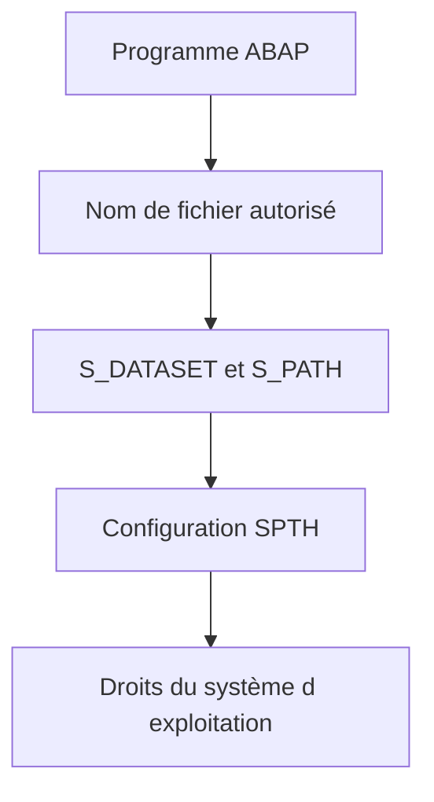

# 5. AUTORISATIONS ET SÉCURITÉ DES FICHIERS

## 5.A RÉSULTAT ATTENDU

- Comprendre les contrôles appliqués aux accès fichiers
- Réduire les risques d’injection de chemin
- Protéger les données échangées

## 5.B NIVEAUX DE CONTRÔLE

L’accès à un fichier du serveur dépend de plusieurs niveaux :



- `S_DATASET` contrôle l’accès selon le programme, le fichier et l’activité.
- `S_PATH` permet un contrôle indépendant du programme sur les chemins enregistrés.
- Le système d’exploitation doit également autoriser le compte de l’instance AS ABAP[^terme-abap].

## 5.C RISQUES

Un nom de fichier fourni depuis l’extérieur et utilisé directement dans `OPEN DATASET` crée un risque sérieux :

- lecture d’un fichier non prévu ;
- écrasement d’un fichier ;
- traversée de répertoires avec `../` ;
- divulgation de données ;
- exécution d’un filtre de système d’exploitation si `FILTER` est utilisé.

## 5.D MESURES

- Résoudre les noms par `FILE`[^outil-file].
- Utiliser une liste blanche d’identifiants, pas une liste noire de caractères.
- Refuser les chemins relatifs et séquences de remontée.
- Limiter les droits en lecture, écriture et suppression.
- Ne jamais journaliser un contenu sensible en clair.
- Chiffrer ou protéger les zones d’échange selon la classification des données.
- Séparer les répertoires d’entrée, de travail, d’archive et d’erreur.

## 5.E CONTRÔLE EXPLICITE

Selon le contexte et la politique du système, un contrôle explicite avec `AUTHORITY_CHECK_DATASET` peut compléter les contrôles automatiques. Le résultat doit être traité avant toute ouverture du fichier.

## 5.F PROCESS

### 5.F.1 Étape 1 — Restreindre le chemin

Utiliser un nom logique `FILE` ou une liste blanche. Refuser traversée et séparateur non attendu avant résolution.

### 5.F.2 Étape 2 — Contrôler l’autorisation

Exécuter les contrôles métier avant lecture ou écriture. Vérifier avec la sécurité les objets techniques appliqués par le système cible.

### 5.F.3 Étape 3 — Ouvrir dans le mode minimal

Choisir lecture, écriture ou ajout selon le besoin, avec encodage[^terme-encodage] explicite. Tester immédiatement `SY-SUBRC`.

### 5.F.4 Étape 4 — Protéger le diagnostic

Journaliser numéro de ligne, clé de corrélation et erreur, sans secret ni contenu personnel complet.

### 5.F.5 Étape 5 — Tester succès et refus

Exécuter avec utilisateur autorisé, chemin interdit et fichier inaccessible. La sécurité est validée lorsque chaque refus bloque avant modification et conserve une preuve contrôlée.

## 5.G VÉRIFICATION

- Le scénario reproduit correspond au même utilisateur, mandant[^terme-mandant], transaction et jeu de données.
- L’horodatage et l’identifiant de l’analyse sont conservés.
- La cause retenue est soutenue par une ligne source, une trace[^terme-trace] ou une valeur observée.
- Après correction, le même scénario ne reproduit plus le défaut et le résultat métier reste identique.

## 5.H ERREURS FRÉQUENTES

- Mélanger fichiers frontend[^terme-frontend] et serveur dans un même scénario.
- Parser un CSV[^terme-csv] par simple séparation alors que les champs peuvent être échappés.

## 5.I FICHE DE CONTRÔLE À COPIER

```text
Système / SID       :
Mandant             :
Utilisateur         :
Transaction / outil :
Objet technique     :
Jeu de données      :
Résultat attendu    :
Résultat observé    :
Horodatage          :
Ordre de transport  :
```

## 5.J TERMES DU LEXIQUE

- [Interface](<../🧩 00 ├── LEXIQUE SAP ET ABAP/07 ├── INTERFACES ET INTEGRATION.md#interface-integration>)
- [Flux entrant](<../🧩 00 ├── LEXIQUE SAP ET ABAP/07 ├── INTERFACES ET INTEGRATION.md#flux-entrant>)
- [Flux sortant](<../🧩 00 ├── LEXIQUE SAP ET ABAP/07 ├── INTERFACES ET INTEGRATION.md#flux-sortant>)
- [CSV](<../🧩 00 ├── LEXIQUE SAP ET ABAP/07 ├── INTERFACES ET INTEGRATION.md#csv>)
- [Encodage](<../🧩 00 ├── LEXIQUE SAP ET ABAP/07 ├── INTERFACES ET INTEGRATION.md#encodage>)
- [Serveur d’application](<../🧩 00 ├── LEXIQUE SAP ET ABAP/07 ├── INTERFACES ET INTEGRATION.md#fichier-serveur-application>)

## 5.K RÉFÉRENCES OFFICIELLES SAP

- [Authorization for File Access — SAP Help Portal](https://help.sap.com/docs/ABAP_PLATFORM_NEW/7bfe8cdcfbb040dcb6702dada8c3e2f0/dc545b5a743047b6b468bbadd0085ce2.html)
- [OPEN DATASET Security Notes — ABAP Keyword Documentation](https://help.sap.com/doc/abapdocu_latest_index_htm/latest/en-US/ABAPOPEN_DATASET.html)
- [Physical and Logical File Names — SAP Help Portal](https://help.sap.com/docs/ABAP_PLATFORM_NEW/7bfe8cdcfbb040dcb6702dada8c3e2f0/9e49819d5b2a440fb508772494b9a473.html)

---

[Chapitre suivant — CYCLE `OPEN DATASET` ET `CLOSE DATASET`](<./06 ├── CYCLE OPEN DATASET ET CLOSE DATASET.md>)

[^terme-abap]: **ABAP.** Langage de programmation de la plateforme ABAP, conçu pour développer des applications métier et techniques SAP. Voir [l’entrée du lexique](<../🧩 00 ├── LEXIQUE SAP ET ABAP/04 ├── LANGAGE ET DEVELOPPEMENT ABAP.md#abap>).
[^terme-encodage]: **ENCODAGE.** Règle transformant les caractères en octets et inversement. Voir [l’entrée du lexique](<../🧩 00 ├── LEXIQUE SAP ET ABAP/07 ├── INTERFACES ET INTEGRATION.md#encodage>).
[^terme-mandant]: **MANDANT.** Subdivision logique d’un système SAP. Il est identifié par un numéro à trois chiffres et isole une partie des données, du paramétrage et des utilisateurs. Voir [l’entrée du lexique](<../🧩 00 ├── LEXIQUE SAP ET ABAP/01 ├── SYSTEMES ENVIRONNEMENTS ET MANDANTS.md#mandant>).
[^terme-trace]: **TRACE.** Enregistrement détaillé d’événements techniques pour analyser exécution, SQL ou appels. Voir [l’entrée du lexique](<../🧩 00 ├── LEXIQUE SAP ET ABAP/08 ├── EXECUTION EXPLOITATION ET ADMINISTRATION.md#trace>).
[^terme-frontend]: **FRONTEND.** Poste ou couche cliente utilisée par l’utilisateur, par exemple SAP GUI for Windows. Voir [l’entrée du lexique](<../🧩 00 ├── LEXIQUE SAP ET ABAP/01 ├── SYSTEMES ENVIRONNEMENTS ET MANDANTS.md#frontend>).
[^terme-csv]: **CSV.** Format texte tabulaire utilisant un séparateur de champs et des règles d’échappement. Voir [l’entrée du lexique](<../🧩 00 ├── LEXIQUE SAP ET ABAP/07 ├── INTERFACES ET INTEGRATION.md#csv>).

[^outil-file]: **FILE.** Transaction de maintenance des noms et chemins de fichiers logiques. Voir [le chapitre associé](<04 ├── NOMS ET CHEMINS LOGIQUES AVEC FILE.md>).
