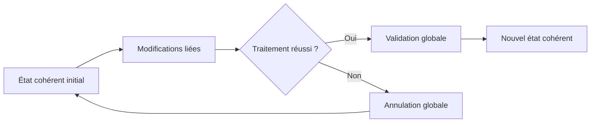

# 1. PRINCIPES DE COHÉRENCE TRANSACTIONNELLE

## 1.A RÉSULTAT ATTENDU

- Comprendre pourquoi plusieurs écritures doivent être traitées comme une seule opération métier
- Identifier les trois mécanismes classiques : LUW[^terme-acro-luw], verrouillage et mise à jour
- Concevoir un traitement suivant le principe « tout ou rien »

## 1.B PROBLÈME À RÉSOUDRE

Une opération métier modifie souvent plusieurs objets persistants. Une commande peut nécessiter la création d’un en-tête, de postes, de statuts et d’un historique. En cas d’échec, la base ne doit pas conserver un état partiel incohérent.

## 1.C TROIS MÉCANISMES COMPLÉMENTAIRES

| Mécanisme        | Rôle                                                                |
| ---------------- | ------------------------------------------------------------------- |
| SAP LUW[^terme-sap-luw]          | Regrouper les modifications d’une opération métier                  |
| Verrouillage SAP | Empêcher des modifications concurrentes incompatibles               |
| Mise à jour SAP  | Reporter et regrouper les écritures exécutées lors de la validation |

Une écriture SQL[^terme-acro-sql] réussie ne signifie pas encore que toute l’opération métier est validée. La frontière transactionnelle appartient au traitement appelant.

## 1.D RÈGLE DIRECTRICE

Le programme doit définir explicitement :

1. le début logique de l’opération ;
2. les données à verrouiller ;
3. les contrôles effectués avant l’écriture ;
4. le point unique de validation ;
5. le comportement en cas d’erreur ;
6. la méthode[^terme-methode] de diagnostic et de reprise.

## 1.E PROCESS

### 1.E.1 ÉTAPE 1 — DÉFINIR L’UNITÉ MÉTIER ATOMIQUE

Lister les écritures qui doivent réussir ou échouer ensemble. Identifier la clé métier, les tables concernées et les effets externes éventuels. Une unité transactionnelle ne se déduit pas du découpage technique en méthodes : elle se déduit de l’état métier qui doit rester cohérent.

### 1.E.2 ÉTAPE 2 — RECENSER LES BORNES TRANSACTIONNELLES

Rechercher les `COMMIT WORK`[^terme-commit-work], `ROLLBACK WORK`[^terme-rollback-work], appels de BAPI[^terme-bapi] avec gestion de commit, appels RFC[^terme-rfc] et traitements qui quittent le contexte courant. Vérifier aussi les commits effectués par les API[^terme-api] appelées. Aucun composant interne ne doit valider une partie de l’unité sans contrat explicite.

### 1.E.3 ÉTAPE 3 — PROTÉGER LA DONNÉE PARTAGÉE

Déterminer la clé de verrouillage la plus fine couvrant l’invariant[^terme-invariant] métier. Poser le verrou SAP avant la décision de mise à jour, puis relire l’état persistant déterminant. Traiter une collision comme un résultat fonctionnel contrôlé, pas comme une autorisation de poursuivre sans protection.

### 1.E.4 ÉTAPE 4 — ORDONNER CONTRÔLES ET ÉCRITURES

Effectuer les validations structurelles et métier avant les effets irréversibles. Regrouper les écritures de la même unité et vérifier chaque retour d’API. Enregistrer les modules de mise à jour seulement lorsque leurs paramètres sont complets et cohérents.

### 1.E.5 ÉTAPE 5 — CENTRALISER LA DÉCISION FINALE

L’orchestrateur exécute un seul `COMMIT WORK` lorsque toute l’unité est prête, ou `ROLLBACK WORK` tant qu’aucun effet externe irréversible n’a eu lieu. Libérer les verrous selon la propriété définie par `_SCOPE` et les chemins d’erreur prévus.

### 1.E.6 ÉTAPE 6 — PROUVER LA COHÉRENCE

Tester le succès, une erreur avant écriture, une erreur après une première écriture, une collision concurrente et une update task[^terme-update-task] en échec. Après chaque test, contrôler les tables, `SM12`[^outil-sm12], `SM13`[^outil-sm13] et le journal applicatif. Aucun scénario ne doit laisser un état métier partiellement validé sans statut de reprise.

## 1.F VÉRIFICATION

- Les données sont toutes validées ou toutes annulées selon le cas testé.
- Les verrous sont libérés à la fin du traitement normal et après erreur.
- Aucune update en erreur inattendue ne reste dans `SM13`.
- Les collisions concurrentes produisent un message contrôlé, pas une incohérence.

## 1.G ERREURS FRÉQUENTES

- Supprimer manuellement un verrou sans comprendre son propriétaire.
- Relancer une update en erreur sans vérifier l’état métier.

## 1.H TERMES DU LEXIQUE

- [Transaction](<../🧩 00 ├── LEXIQUE SAP ET ABAP/02 ├── SAP GUI NAVIGATION ET TRANSACTIONS.md#transaction>)
- [SAP LUW](<../🧩 00 ├── LEXIQUE SAP ET ABAP/08 ├── EXECUTION EXPLOITATION ET ADMINISTRATION.md#sap-luw>)
- [LUW base de données](<../🧩 00 ├── LEXIQUE SAP ET ABAP/08 ├── EXECUTION EXPLOITATION ET ADMINISTRATION.md#luw-base>)
- [COMMIT WORK](<../🧩 00 ├── LEXIQUE SAP ET ABAP/08 ├── EXECUTION EXPLOITATION ET ADMINISTRATION.md#commit-work>)
- [ROLLBACK WORK](<../🧩 00 ├── LEXIQUE SAP ET ABAP/08 ├── EXECUTION EXPLOITATION ET ADMINISTRATION.md#rollback-work>)
- [Enqueue server](<../🧩 00 ├── LEXIQUE SAP ET ABAP/08 ├── EXECUTION EXPLOITATION ET ADMINISTRATION.md#enqueue-server>)

## 1.I RÉFÉRENCES OFFICIELLES SAP

- [LUWs in ABAP — SAP Help Portal](https://help.sap.com/docs/ABAP_PLATFORM_NEW/8132142fd1a144a59303663a03a7c2d4/54f5462a9604498382319304869a4280.html)
- [LUW and Transactional Phases — SAP Help Portal](https://help.sap.com/docs/abap-cloud/abap-concepts/luw-and-transactional-phases)

---

[Chapitre suivant — LUW BASE DE DONNÉES ET SAP LUW](<./02 ├── LUW BASE DE DONNEES ET SAP LUW.md>)

[^terme-acro-luw]: **LUW.** Logical Unit of Work. Voir [l’entrée du lexique](<../🧩 00 ├── LEXIQUE SAP ET ABAP/10 └── ACRONYMES SAP.md#acro-luw>).
[^terme-sap-luw]: **SAP LUW.** Unité logique métier SAP pouvant regrouper plusieurs étapes de dialogue et différer les mises à jour jusqu’au commit. Voir [l’entrée du lexique](<../🧩 00 ├── LEXIQUE SAP ET ABAP/08 ├── EXECUTION EXPLOITATION ET ADMINISTRATION.md#sap-luw>).
[^terme-acro-sql]: **SQL.** Structured Query Language. Voir [l’entrée du lexique](<../🧩 00 ├── LEXIQUE SAP ET ABAP/10 └── ACRONYMES SAP.md#acro-sql>).
[^terme-methode]: **MÉTHODE.** Comportement déclaré dans une classe ou une interface et appelé avec une liste de paramètres définie. Voir [l’entrée du lexique](<../🧩 00 ├── LEXIQUE SAP ET ABAP/04 ├── LANGAGE ET DEVELOPPEMENT ABAP.md#methode>).
[^terme-commit-work]: **COMMIT WORK.** Instruction clôturant la SAP LUW courante, déclenchant notamment les mises à jour enregistrées et validant la base. Voir [l’entrée du lexique](<../🧩 00 ├── LEXIQUE SAP ET ABAP/08 ├── EXECUTION EXPLOITATION ET ADMINISTRATION.md#commit-work>).
[^terme-rollback-work]: **ROLLBACK WORK.** Instruction annulant les modifications non validées de la LUW courante et les tâches de mise à jour enregistrées. Voir [l’entrée du lexique](<../🧩 00 ├── LEXIQUE SAP ET ABAP/08 ├── EXECUTION EXPLOITATION ET ADMINISTRATION.md#rollback-work>).
[^terme-bapi]: **BAPI.** Interface métier publiée autour d’un Business Object SAP, généralement implémentée par un module fonction RFC. Voir [l’entrée du lexique](<../🧩 00 ├── LEXIQUE SAP ET ABAP/06 ├── PROGRAMMES CLASSES ET OBJETS TECHNIQUES.md#bapi>).
[^terme-rfc]: **RFC.** Remote Function Call, mécanisme permettant d’appeler un module fonction compatible dans un autre contexte ou système. Voir [l’entrée du lexique](<../🧩 00 ├── LEXIQUE SAP ET ABAP/06 ├── PROGRAMMES CLASSES ET OBJETS TECHNIQUES.md#rfc>).
[^terme-api]: **API.** Application Programming Interface, contrat exposant des opérations ou données utilisables par d’autres composants. Voir [l’entrée du lexique](<../🧩 00 ├── LEXIQUE SAP ET ABAP/10 └── ACRONYMES SAP.md#api>).
[^terme-invariant]: **INVARIANT.** Condition qui doit rester vraie pendant toute la durée de vie valide d’un objet. Voir [l’entrée du lexique](<../🧩 00 ├── LEXIQUE SAP ET ABAP/04 ├── LANGAGE ET DEVELOPPEMENT ABAP.md#invariant>).
[^terme-update-task]: **UPDATE TASK.** Mécanisme différant des mises à jour pour les exécuter lors du `COMMIT WORK` dans des processus de mise à jour. Voir [l’entrée du lexique](<../🧩 00 ├── LEXIQUE SAP ET ABAP/08 ├── EXECUTION EXPLOITATION ET ADMINISTRATION.md#update-task>).

[^outil-sm12]: **SM12.** Transaction de surveillance et d’administration des entrées de verrouillage SAP. Voir [le chapitre associé](<12 ├── ANALYSER LES VERROUS AVEC SM12.md>).
[^outil-sm13]: **SM13.** Transaction de surveillance et de reprise des enregistrements de mise à jour SAP. Voir [le chapitre associé](<19 ├── ANALYSER ET REPRENDRE LES UPDATES AVEC SM13.md>).
