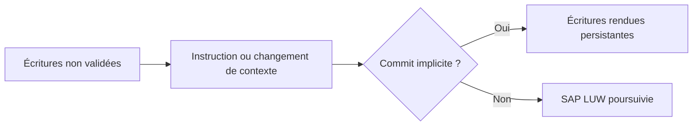

# 3. BORNES DE TRANSACTION ET COMMITS IMPLICITES

## 3.A RÉSULTAT ATTENDU

- Identifier les événements pouvant terminer une database LUW[^terme-acro-luw]
- Éviter les validations accidentelles au milieu d’un traitement
- Protéger la phase de sauvegarde

## 3.B COMMITS EXPLICITES ET IMPLICITES

`COMMIT WORK`[^terme-commit-work] termine explicitement la SAP LUW[^terme-sap-luw]. Le runtime ABAP[^terme-abap] peut également déclencher des commits de base de données lors de certains changements de contexte, par exemple lorsqu’un traitement quitte une étape de dialogue ou transfère le contrôle vers un autre processus.

## 3.C SITUATIONS À ANALYSER

- appel RFC[^terme-rfc] synchrone ou asynchrone ;
- `WAIT` ;
- changement d’étape de dialogue ;
- certains appels de programmes ou de transactions ;
- instruction explicitement documentée comme provoquant un commit.

La liste exacte dépend du contexte et de la version. Vérifier la documentation de l’instruction utilisée au lieu de supposer qu’un appel est transactionnellement neutre.

## 3.D RÈGLE DE CONCEPTION

Pendant une phase de sauvegarde :

- ne pas appeler un composant dont le contrat transactionnel est inconnu ;
- ne pas exécuter de `COMMIT WORK` dans une API[^terme-api] réutilisable ;
- ne pas déléguer la validation à une méthode[^terme-methode] profonde ;
- laisser le propriétaire de la transaction décider du commit ou du rollback.

## 3.E PROCESS

### 3.E.1 ÉTAPE 1 — PARTIR DE LA BORNE MÉTIER ATTENDUE

Identifier les données qui doivent rester atomiques et l’endroit où leur validation est autorisée. Relever le programme ou la transaction qui possède cette décision. Toute borne technique trouvée avant ce point est potentiellement prématurée.

### 3.E.2 ÉTAPE 2 — RECHERCHER LES COMMITS EXPLICITES

Utiliser la recherche de code pour localiser `COMMIT WORK`, `ROLLBACK WORK`[^terme-rollback-work], `BAPI_TRANSACTION_COMMIT` et `BAPI_TRANSACTION_ROLLBACK` dans le code Z appelé. Étendre l’analyse aux exits, BAdI[^terme-acro-badi], modules fonction et wrappers réellement traversés par le scénario.

### 3.E.3 ÉTAPE 3 — CONTRÔLER LES CHANGEMENTS DE CONTEXTE

Repérer les appels RFC, les traitements en update task[^terme-update-task], les étapes de dialogue et les API qui documentent une transaction propre. Pour chaque changement, noter quelles données sont déjà validées et quelles opérations restent en attente. Un appel dans une autre unité ne peut pas être annulé par le rollback local.

### 3.E.4 ÉTAPE 4 — VÉRIFIER PAR UNE TRACE CIBLÉE

Exécuter un scénario minimal avec un identifiant de donnée unique et une trace[^terme-trace] SQL[^terme-acro-sql] limitée à l’utilisateur concerné. Corréler les écritures et les fins de traitement avec le flux applicatif. La trace sert à confirmer une borne suspectée, pas à remplacer la lecture de la documentation de l’API.

### 3.E.5 ÉTAPE 5 — SUPPRIMER OU ENCADRER LA BORNE INCORRECTE

Remonter le commit à l’orchestrateur lorsque le contrat de l’API le permet. Si une API impose sa propre transaction, isoler cet effet, documenter son irréversibilité et prévoir une compensation. Ne jamais neutraliser un commit standard sans analyser ses invariants.

### 3.E.6 ÉTAPE 6 — REJOUER UN ÉCHEC APRÈS CHAQUE BORNE

Provoquer une erreur immédiatement après les points identifiés. Vérifier les tables, l’update task et les systèmes externes. Le scénario est maîtrisé seulement si chaque état intermédiaire est soit impossible, soit détectable et compensable.

## 3.F VÉRIFICATION

- Les données sont toutes validées ou toutes annulées selon le cas testé.
- Les verrous sont libérés à la fin du traitement normal et après erreur.
- Aucune update en erreur inattendue ne reste dans `SM13`[^outil-sm13].
- Les collisions concurrentes produisent un message contrôlé, pas une incohérence.

## 3.G ERREURS FRÉQUENTES

- Supprimer manuellement un verrou sans comprendre son propriétaire.
- Relancer une update en erreur sans vérifier l’état métier.

## 3.H TERMES DU LEXIQUE

- [Transaction](<../🧩 00 ├── LEXIQUE SAP ET ABAP/02 ├── SAP GUI NAVIGATION ET TRANSACTIONS.md#transaction>)
- [SAP LUW](<../🧩 00 ├── LEXIQUE SAP ET ABAP/08 ├── EXECUTION EXPLOITATION ET ADMINISTRATION.md#sap-luw>)
- [LUW base de données](<../🧩 00 ├── LEXIQUE SAP ET ABAP/08 ├── EXECUTION EXPLOITATION ET ADMINISTRATION.md#luw-base>)
- [COMMIT WORK](<../🧩 00 ├── LEXIQUE SAP ET ABAP/08 ├── EXECUTION EXPLOITATION ET ADMINISTRATION.md#commit-work>)
- [ROLLBACK WORK](<../🧩 00 ├── LEXIQUE SAP ET ABAP/08 ├── EXECUTION EXPLOITATION ET ADMINISTRATION.md#rollback-work>)
- [Enqueue server](<../🧩 00 ├── LEXIQUE SAP ET ABAP/08 ├── EXECUTION EXPLOITATION ET ADMINISTRATION.md#enqueue-server>)

## 3.I RÉFÉRENCES OFFICIELLES SAP

- [LUWs in ABAP — SAP Help Portal](https://help.sap.com/docs/ABAP_PLATFORM_NEW/8132142fd1a144a59303663a03a7c2d4/54f5462a9604498382319304869a4280.html)
- [Transactional Consistency Check — SAP Help Portal](https://help.sap.com/docs/ABAP_PLATFORM_NEW/753088fc00704d0a80e7fbd6803c8adb/89be29c77d1b4b5e80678e4d2da51345.html)
- [Committing Database Changes — SAP Help Portal](https://help.sap.com/docs/SAP_NETWEAVER_702/fe24b0146c551014891ad42d6b2789e5/fceb3b64358411d1829f0000e829fbfe.html)

---

[Chapitre suivant — `COMMIT WORK` ET `COMMIT WORK AND WAIT`](<./04 ├── COMMIT WORK ET COMMIT WORK AND WAIT.md>)

[^terme-acro-luw]: **LUW.** Logical Unit of Work. Voir [l’entrée du lexique](<../🧩 00 ├── LEXIQUE SAP ET ABAP/10 └── ACRONYMES SAP.md#acro-luw>).
[^terme-commit-work]: **COMMIT WORK.** Instruction clôturant la SAP LUW courante, déclenchant notamment les mises à jour enregistrées et validant la base. Voir [l’entrée du lexique](<../🧩 00 ├── LEXIQUE SAP ET ABAP/08 ├── EXECUTION EXPLOITATION ET ADMINISTRATION.md#commit-work>).
[^terme-sap-luw]: **SAP LUW.** Unité logique métier SAP pouvant regrouper plusieurs étapes de dialogue et différer les mises à jour jusqu’au commit. Voir [l’entrée du lexique](<../🧩 00 ├── LEXIQUE SAP ET ABAP/08 ├── EXECUTION EXPLOITATION ET ADMINISTRATION.md#sap-luw>).
[^terme-abap]: **ABAP.** Langage de programmation de la plateforme ABAP, conçu pour développer des applications métier et techniques SAP. Voir [l’entrée du lexique](<../🧩 00 ├── LEXIQUE SAP ET ABAP/04 ├── LANGAGE ET DEVELOPPEMENT ABAP.md#abap>).
[^terme-rfc]: **RFC.** Remote Function Call, mécanisme permettant d’appeler un module fonction compatible dans un autre contexte ou système. Voir [l’entrée du lexique](<../🧩 00 ├── LEXIQUE SAP ET ABAP/06 ├── PROGRAMMES CLASSES ET OBJETS TECHNIQUES.md#rfc>).
[^terme-api]: **API.** Application Programming Interface, contrat exposant des opérations ou données utilisables par d’autres composants. Voir [l’entrée du lexique](<../🧩 00 ├── LEXIQUE SAP ET ABAP/10 └── ACRONYMES SAP.md#api>).
[^terme-methode]: **MÉTHODE.** Comportement déclaré dans une classe ou une interface et appelé avec une liste de paramètres définie. Voir [l’entrée du lexique](<../🧩 00 ├── LEXIQUE SAP ET ABAP/04 ├── LANGAGE ET DEVELOPPEMENT ABAP.md#methode>).
[^terme-rollback-work]: **ROLLBACK WORK.** Instruction annulant les modifications non validées de la LUW courante et les tâches de mise à jour enregistrées. Voir [l’entrée du lexique](<../🧩 00 ├── LEXIQUE SAP ET ABAP/08 ├── EXECUTION EXPLOITATION ET ADMINISTRATION.md#rollback-work>).
[^terme-acro-badi]: **BADI.** Business Add-In, mécanisme d’extension orienté objet du standard SAP. Voir [l’entrée du lexique](<../🧩 00 ├── LEXIQUE SAP ET ABAP/10 └── ACRONYMES SAP.md#acro-badi>).
[^terme-update-task]: **UPDATE TASK.** Mécanisme différant des mises à jour pour les exécuter lors du `COMMIT WORK` dans des processus de mise à jour. Voir [l’entrée du lexique](<../🧩 00 ├── LEXIQUE SAP ET ABAP/08 ├── EXECUTION EXPLOITATION ET ADMINISTRATION.md#update-task>).
[^terme-trace]: **TRACE.** Enregistrement détaillé d’événements techniques pour analyser exécution, SQL ou appels. Voir [l’entrée du lexique](<../🧩 00 ├── LEXIQUE SAP ET ABAP/08 ├── EXECUTION EXPLOITATION ET ADMINISTRATION.md#trace>).
[^terme-acro-sql]: **SQL.** Structured Query Language. Voir [l’entrée du lexique](<../🧩 00 ├── LEXIQUE SAP ET ABAP/10 └── ACRONYMES SAP.md#acro-sql>).

[^outil-sm13]: **SM13.** Transaction de surveillance et de reprise des enregistrements de mise à jour SAP. Voir [le chapitre associé](<19 ├── ANALYSER ET REPRENDRE LES UPDATES AVEC SM13.md>).
