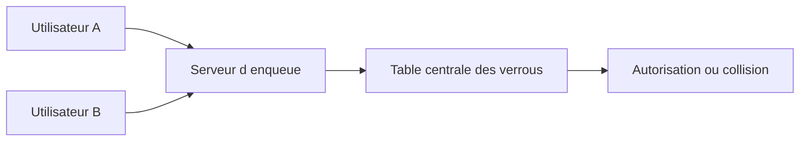

# 6. CONCEPT DE VERROUILLAGE SAP

## 6.A RÉSULTAT ATTENDU

- Comprendre le rôle du verrouillage logique SAP[^terme-acro-sap]
- Distinguer verrou SAP et verrou de base de données
- Prévenir les mises à jour concurrentes perdues

## 6.B POURQUOI UN VERROU SAP

Une transaction interactive peut couvrir plusieurs écrans. Les verrous de base de données sont libérés à la fin de chaque database LUW[^terme-acro-luw] ; ils ne peuvent donc pas protéger seuls l’ensemble de l’opération métier.

Le système SAP[^terme-systeme-sap] maintient une table centrale de verrous en mémoire. Chaque entrée décrit un objet métier, une clé, un propriétaire et un mode de verrouillage.

## 6.C VERROU OPTIMISTE OU PESSIMISTE

- Un verrou pessimiste est pris avant la modification et empêche immédiatement un accès concurrent incompatible.
- Un verrou optimiste autorise d’abord plusieurs lecteurs, puis tente une conversion avant la sauvegarde.

## 6.D RÈGLE

Verrouiller l’objet métier, pas seulement une instruction SQL[^terme-acro-sql]. Le verrou doit couvrir la période comprise entre la lecture déterminante et la validation.

## 6.E PROCESS

### 6.E.1 ÉTAPE 1 — IDENTIFIER L’INVARIANT À PROTÉGER

Décrire la décision qui ne doit pas être prise simultanément par deux sessions : modifier un document, attribuer un numéro ou changer un statut. En déduire la ressource métier et la clé minimale qui couvrent cet invariant[^terme-invariant].

### 6.E.2 ÉTAPE 2 — UTILISER UN OBJET DE VERROUILLAGE DDIC

Rechercher dans `SE11`[^outil-se11] un objet de verrouillage standard correspondant aux données. Pour un objet Z, créer un objet fondé sur les tables et relations nécessaires. Utiliser les modules `ENQUEUE_*` et `DEQUEUE_*` générés ; ne pas construire directement une entrée dans la table de verrouillage.

### 6.E.3 ÉTAPE 3 — ACQUÉRIR LE VERROU AVANT LA DÉCISION

Déterminer la clé, appeler le module `ENQUEUE_*` et traiter toutes ses exceptions. Après obtention, relire les données utilisées pour prendre la décision métier, car elles ont pu changer depuis une lecture antérieure.

### 6.E.4 ÉTAPE 4 — LIMITER LA DURÉE DU VERROU

Exécuter sous verrou uniquement les contrôles et mises à jour nécessaires. Éviter les dialogues utilisateur, appels réseau longs et traitements de masse dans cette zone. La propriété et la libération doivent être cohérentes avec `_SCOPE` et l’update task[^terme-update-task].

### 6.E.5 ÉTAPE 5 — LIBÉRER DANS TOUS LES CHEMINS PRÉVUS

Laisser le commit ou le rollback libérer le verrou lorsque le contrat le prévoit, ou appeler le module `DEQUEUE_*` avec la même clé pour une libération explicite. Couvrir les exceptions gérées, retours anticipés et annulations.

### 6.E.6 ÉTAPE 6 — TESTER AVEC DEUX SESSIONS

Dans une première session, conserver le verrou sur une clé connue. Dans une seconde, tenter la même opération puis une opération sur une autre clé. Vérifier la collision contrôlée dans le premier cas, l’absence de blocage excessif dans le second et la disparition du verrou dans `SM12`[^outil-sm12] après la fin prévue.

## 6.F VÉRIFICATION

- Les données sont toutes validées ou toutes annulées selon le cas testé.
- Les verrous sont libérés à la fin du traitement normal et après erreur.
- Aucune update en erreur inattendue ne reste dans `SM13`[^outil-sm13].
- Les collisions concurrentes produisent un message contrôlé, pas une incohérence.

## 6.G ERREURS FRÉQUENTES

- Supprimer manuellement un verrou sans comprendre son propriétaire.
- Relancer une update en erreur sans vérifier l’état métier.

## 6.H TERMES DU LEXIQUE

- [SAP LUW](<../🧩 00 ├── LEXIQUE SAP ET ABAP/08 ├── EXECUTION EXPLOITATION ET ADMINISTRATION.md#sap-luw>)
- [LUW base de données](<../🧩 00 ├── LEXIQUE SAP ET ABAP/08 ├── EXECUTION EXPLOITATION ET ADMINISTRATION.md#luw-base>)
- [COMMIT WORK](<../🧩 00 ├── LEXIQUE SAP ET ABAP/08 ├── EXECUTION EXPLOITATION ET ADMINISTRATION.md#commit-work>)
- [ROLLBACK WORK](<../🧩 00 ├── LEXIQUE SAP ET ABAP/08 ├── EXECUTION EXPLOITATION ET ADMINISTRATION.md#rollback-work>)
- [Enqueue server](<../🧩 00 ├── LEXIQUE SAP ET ABAP/08 ├── EXECUTION EXPLOITATION ET ADMINISTRATION.md#enqueue-server>)
- [Update task](<../🧩 00 ├── LEXIQUE SAP ET ABAP/08 ├── EXECUTION EXPLOITATION ET ADMINISTRATION.md#update-task>)

## 6.I RÉFÉRENCES OFFICIELLES SAP

- [SAP Lock Concept — SAP Help Portal](https://help.sap.com/docs/ABAP_PLATFORM_NEW/7bbf03267f654b5cb06a8bf78f61fca1/9101274dc2e048d4b473fe5c45ae4e29.html)
- [Lock Table — SAP Help Portal](https://help.sap.com/docs/ABAP_PLATFORM_NEW/6568469cf5a1460a8d85c58b83d21ec2/47daae4038793c85e10000000a42189c.html)
- [Work Processes in Application Server ABAP — SAP Help Portal](https://help.sap.com/docs/ABAP_PLATFORM_NEW/e067931e0b0a4b2089f4db327879cd55/22d85d37ab534b86a5098ded38c06c0f.html)

---

[Chapitre suivant — CRÉER UN OBJET DE VERROUILLAGE AVEC `SE11`](<./07 ├── CREER UN OBJET DE VERROUILLAGE AVEC SE11.md>)

[^terme-acro-sap]: **SAP.** Nom de l’éditeur et de son écosystème logiciel ; l’acronyme historique provient de l’allemand. Voir [l’entrée du lexique](<../🧩 00 ├── LEXIQUE SAP ET ABAP/10 └── ACRONYMES SAP.md#acro-sap>).
[^terme-acro-luw]: **LUW.** Logical Unit of Work. Voir [l’entrée du lexique](<../🧩 00 ├── LEXIQUE SAP ET ABAP/10 └── ACRONYMES SAP.md#acro-luw>).
[^terme-systeme-sap]: **SYSTÈME SAP.** Ensemble technique cohérent comprenant au minimum une base de données et un ou plusieurs serveurs d’applications. Il est généralement identifié par un SID de trois caractères. Voir [l’entrée du lexique](<../🧩 00 ├── LEXIQUE SAP ET ABAP/01 ├── SYSTEMES ENVIRONNEMENTS ET MANDANTS.md#systeme-sap>).
[^terme-acro-sql]: **SQL.** Structured Query Language. Voir [l’entrée du lexique](<../🧩 00 ├── LEXIQUE SAP ET ABAP/10 └── ACRONYMES SAP.md#acro-sql>).
[^terme-invariant]: **INVARIANT.** Condition qui doit rester vraie pendant toute la durée de vie valide d’un objet. Voir [l’entrée du lexique](<../🧩 00 ├── LEXIQUE SAP ET ABAP/04 ├── LANGAGE ET DEVELOPPEMENT ABAP.md#invariant>).
[^terme-update-task]: **UPDATE TASK.** Mécanisme différant des mises à jour pour les exécuter lors du `COMMIT WORK` dans des processus de mise à jour. Voir [l’entrée du lexique](<../🧩 00 ├── LEXIQUE SAP ET ABAP/08 ├── EXECUTION EXPLOITATION ET ADMINISTRATION.md#update-task>).

[^outil-se11]: **SE11.** Transaction de l’ABAP Dictionary utilisée pour analyser et maintenir les objets DDIC. Voir [le chapitre associé](<../🧩 07 ├── DICTIONNAIRE ABAP/02 ├── NAVIGATION ET ANALYSE AVEC SE11.md>).
[^outil-sm12]: **SM12.** Transaction de surveillance et d’administration des entrées de verrouillage SAP. Voir [le chapitre associé](<12 ├── ANALYSER LES VERROUS AVEC SM12.md>).
[^outil-sm13]: **SM13.** Transaction de surveillance et de reprise des enregistrements de mise à jour SAP. Voir [le chapitre associé](<19 ├── ANALYSER ET REPRENDRE LES UPDATES AVEC SM13.md>).
