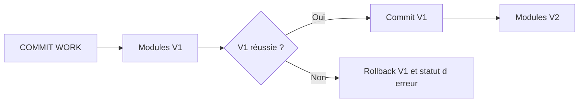

# 16. MISES À JOUR `V1` ET `V2`

## 16.A RÉSULTAT ATTENDU

- Distinguer mises à jour prioritaires et secondaires
- Comprendre leur ordre de traitement
- Choisir la catégorie selon la criticité métier

## 16.B PRIORITÉS

| Catégorie | Usage                                                       | Caractéristique                                                                    |
| --------- | ----------------------------------------------------------- | ---------------------------------------------------------------------------------- |
| V1        | Données primaires indispensables à la transaction           | Exécutées en premier, dans l’ordre d’enregistrement, dans une database LUW[^terme-acro-luw] commune |
| V2        | Données secondaires pouvant suivre la validation principale | Exécutées après la réussite de V1, éventuellement par des processus dédiés         |

Une erreur V2 ne doit pas remettre en cause les données V1 déjà validées. V2 convient donc uniquement aux mises à jour dont le retard ou la reprise séparée est acceptable.

## 16.C CRITÈRE DE CHOIX

Utiliser V1 pour ce qui définit la cohérence de l’objet métier. Utiliser V2 pour des informations dérivées ou statistiques lorsque le standard concerné le prévoit. Ne pas détourner V2 pour masquer un traitement lent sans analyser la cohérence.

## 16.D PROCESS

### 16.D.1 ÉTAPE 1 — CLASSER CHAQUE ÉCRITURE PAR CRITICITÉ

Lister les tables et effets produits par la transaction. Marquer comme V1 tout ce qui est nécessaire à la cohérence et au résultat métier principal. Marquer comme V2 uniquement les compléments pouvant être retardés sans rendre le document principal invalide.

### 16.D.2 ÉTAPE 2 — CONFIGURER LE TYPE DE MISE À JOUR

Dans `SE37`[^outil-se37], afficher le module fonction[^terme-module-fonction] et contrôler ses attributs de traitement. Pour un module Z, affecter le type de mise à jour conforme au classement retenu, puis contrôler et activer le groupe de fonctions. Ne pas modifier le type d’un module standard.

### 16.D.3 ÉTAPE 3 — ENREGISTRER LES APPELS DANS LE BON ORDRE LOGIQUE

Préparer des paramètres complets, enregistrer les modules V1 et V2 dans la même SAP LUW[^terme-sap-luw], puis laisser l’orchestrateur décider du commit. Ne pas créer une dépendance V1 vers un résultat qui ne sera produit qu’en V2.

### 16.D.4 ÉTAPE 4 — TESTER LE SUCCÈS COMPLET

Exécuter le scénario avec `COMMIT WORK AND WAIT`. Vérifier immédiatement les données V1, puis contrôler l’exécution des données V2 dans `SM13`[^outil-sm13] ou dans les tables concernées. Documenter le délai acceptable pour les résultats secondaires.

### 16.D.5 ÉTAPE 5 — PROVOQUER UN ÉCHEC V1

Dans un scénario Z contrôlé, faire échouer un module V1. Vérifier que le résultat principal n’est pas annoncé comme réussi et analyser l’entrée dans `SM13`. Contrôler le comportement des modules dépendants avant toute répétition.

### 16.D.6 ÉTAPE 6 — PROVOQUER UN ÉCHEC V2

Faire échouer séparément une mise à jour V2 et vérifier que le document principal reste cohérent. Le journal doit permettre d’identifier et de reprendre le complément sans recréer le résultat V1. Si ce n’est pas possible, le classement V2 est incorrect.

## 16.E VÉRIFICATION

- Les données sont toutes validées ou toutes annulées selon le cas testé.
- Les verrous sont libérés à la fin du traitement normal et après erreur.
- Aucune update en erreur inattendue ne reste dans `SM13`.
- Les collisions concurrentes produisent un message contrôlé, pas une incohérence.

## 16.F ERREURS FRÉQUENTES

- Supprimer manuellement un verrou sans comprendre son propriétaire.
- Relancer une update en erreur sans vérifier l’état métier.

## 16.G TERMES DU LEXIQUE

- [SAP LUW](<../🧩 00 ├── LEXIQUE SAP ET ABAP/08 ├── EXECUTION EXPLOITATION ET ADMINISTRATION.md#sap-luw>)
- [LUW base de données](<../🧩 00 ├── LEXIQUE SAP ET ABAP/08 ├── EXECUTION EXPLOITATION ET ADMINISTRATION.md#luw-base>)
- [COMMIT WORK](<../🧩 00 ├── LEXIQUE SAP ET ABAP/08 ├── EXECUTION EXPLOITATION ET ADMINISTRATION.md#commit-work>)
- [ROLLBACK WORK](<../🧩 00 ├── LEXIQUE SAP ET ABAP/08 ├── EXECUTION EXPLOITATION ET ADMINISTRATION.md#rollback-work>)
- [Enqueue server](<../🧩 00 ├── LEXIQUE SAP ET ABAP/08 ├── EXECUTION EXPLOITATION ET ADMINISTRATION.md#enqueue-server>)
- [Update task](<../🧩 00 ├── LEXIQUE SAP ET ABAP/08 ├── EXECUTION EXPLOITATION ET ADMINISTRATION.md#update-task>)

## 16.H RÉFÉRENCES OFFICIELLES SAP

- [V1 and V2 Update Function Modules — SAP Help Portal](https://help.sap.com/docs/ABAP_PLATFORM_NEW/979cf1522d164bf7a781796efd8850ee/23e9aa61638e404d81575e939b5cd847.html)
- [The Update Process — SAP Help Portal](https://help.sap.com/docs/SAP_NETWEAVER_AS_ABAP_752/979cf1522d164bf7a781796efd8850ee/c8ed15db039b4f45a8507015f531976b.html)
- [Update Statuses — SAP Help Portal](https://help.sap.com/docs/ABAP_PLATFORM_NEW/979cf1522d164bf7a781796efd8850ee/3c7ad8b964b74aac9e1d3e709b33e794.html)

---

[Chapitre suivant — MISE À JOUR LOCALE AVEC `SET UPDATE TASK LOCAL`](<./17 ├── MISE A JOUR LOCALE AVEC SET UPDATE TASK LOCAL.md>)

[^terme-acro-luw]: **LUW.** Logical Unit of Work. Voir [l’entrée du lexique](<../🧩 00 ├── LEXIQUE SAP ET ABAP/10 └── ACRONYMES SAP.md#acro-luw>).
[^terme-module-fonction]: **MODULE FONCTION.** Procédure globale appelée avec `CALL FUNCTION` et définie dans un groupe de fonctions. Voir [l’entrée du lexique](<../🧩 00 ├── LEXIQUE SAP ET ABAP/06 ├── PROGRAMMES CLASSES ET OBJETS TECHNIQUES.md#module-fonction>).
[^terme-sap-luw]: **SAP LUW.** Unité logique métier SAP pouvant regrouper plusieurs étapes de dialogue et différer les mises à jour jusqu’au commit. Voir [l’entrée du lexique](<../🧩 00 ├── LEXIQUE SAP ET ABAP/08 ├── EXECUTION EXPLOITATION ET ADMINISTRATION.md#sap-luw>).

[^outil-se37]: **SE37.** Function Builder utilisé pour rechercher, afficher, tester et maintenir les modules fonction. Voir [le chapitre associé](<../🧩 12 ├── MODULES FONCTION RFC ET BAPI/03 ├── RECHERCHER ET ANALYSER AVEC SE37.md>).
[^outil-sm13]: **SM13.** Transaction de surveillance et de reprise des enregistrements de mise à jour SAP. Voir [le chapitre associé](<19 ├── ANALYSER ET REPRENDRE LES UPDATES AVEC SM13.md>).
