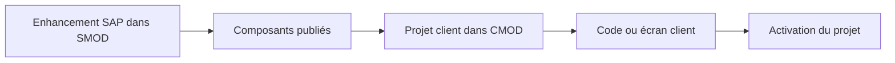

# 5. CUSTOMER EXITS ET ENHANCEMENTS CLASSIQUES

## 5.A RÉSULTAT ATTENDU

- Comprendre le modèle `SMOD`[^outil-smod] / `CMOD`[^outil-cmod]
- Distinguer définition SAP[^terme-acro-sap] et projet client
- Identifier les composants d’un enhancement classique

## 5.B ARCHITECTURE



SAP définit l’enhancement et ses composants. Le client crée un projet `CMOD`, lui affecte un ou plusieurs enhancements, implémente les composants puis active le projet.

## 5.C TYPES DE COMPOSANTS

- function module exit ;
- screen exit ;
- menu exit ;
- extensions de données associées selon l’application.

Un enhancement classique peut regrouper plusieurs composants qui doivent être analysés ensemble.

## 5.D ACTIVATION

Le code présent dans un include client ne suffit pas. Le projet `CMOD` contenant l’enhancement doit être actif. Une seule implémentation active est normalement attendue pour un enhancement classique donné.

## 5.E LIMITES

- technologie historique ;
- contrat souvent moins flexible qu’un BAdI[^terme-acro-badi] ;
- dépendance à des programmes, écrans ou groupes de fonctions précis ;
- pas de filtrage générique comparable aux BAdI ;
- plusieurs besoins peuvent devoir être regroupés dans le même projet ou composant.

## 5.F PROCESS

### 5.F.1 ÉTAPE 1 — IDENTIFIER L’ENHANCEMENT CANDIDAT

À partir du programme ou du package[^terme-package] standard, rechercher les appels `CALL CUSTOMER-FUNCTION`, les objets `SMOD` associés et leur documentation. Relever le nom technique de l’enhancement, pas seulement celui du module `EXIT_*`.

### 5.F.2 ÉTAPE 2 — ANALYSER TOUS LES COMPOSANTS DANS `SMOD`

Afficher l’enhancement et inventorier function exits, screen exits, menu exits et objets DDIC[^terme-acro-ddic] associés. Ouvrir chaque composant pour comprendre son rôle. Un même enhancement peut exiger plusieurs composants cohérents pour livrer une fonctionnalité complète.

### 5.F.3 ÉTAPE 3 — VÉRIFIER LE POINT D’APPEL

Depuis le module `EXIT_*`, remonter au `CALL CUSTOMER-FUNCTION` dans le standard. Poser un breakpoint[^terme-breakpoint] et exécuter le scénario. Relever les paramètres, le moment de l’appel et les traitements standard postérieurs.

### 5.F.4 ÉTAPE 4 — RECHERCHER LE PROJET CLIENT

Dans `CMOD`, identifier si l’enhancement est déjà affecté à un projet. Vérifier son statut actif, son package et son propriétaire fonctionnel. Ne pas créer un projet concurrent pour un enhancement déjà géré.

### 5.F.5 ÉTAPE 5 — IMPLÉMENTER LE PÉRIMÈTRE MINIMAL

Utiliser les includes client, subscreens ou fonctions de menu fournis par le projet. Ajouter les extensions DDIC requises avant le code qui les consomme. Déléguer la logique à des objets Z testables et éviter les dépendances globales inutiles.

### 5.F.6 ÉTAPE 6 — ACTIVER ET TESTER L’ENSEMBLE

Activer les objets techniques puis le projet CMOD. Reproduire le scénario avec breakpoint, vérifier le résultat métier et tester les cas hors périmètre. Contrôler l’ordre de transport[^terme-ordre-transport] de tous les composants et de l’activation.

## 5.G VÉRIFICATION

- L’implémentation ou le projet est actif et transporté dans le bon ordre.
- Un breakpoint confirme que le point d’extension est appelé dans le scénario visé.
- Le comportement standard reste inchangé hors du périmètre fonctionnel prévu.
- Aucune modification directe d’un objet SAP standard n’a été créée.

## 5.H ERREURS FRÉQUENTES

- Choisir le premier exit trouvé sans vérifier le moment exact de l’appel.
- Créer plusieurs implémentations concurrentes sans règles de filtre.

## 5.I FICHE DE CONTRÔLE À COPIER

```text
Système / SID       :
Mandant             :
Utilisateur         :
Transaction / outil :
Objet technique     :
Jeu de données      :
Résultat attendu    :
Résultat observé    :
Horodatage          :
Ordre de transport  :
```

## 5.J TERMES DU LEXIQUE

- [BAdI](<../🧩 00 ├── LEXIQUE SAP ET ABAP/10 └── ACRONYMES SAP.md#acro-badi>)
- [BTE](<../🧩 00 ├── LEXIQUE SAP ET ABAP/10 └── ACRONYMES SAP.md#acro-bte>)
- [Objet Repository](<../🧩 00 ├── LEXIQUE SAP ET ABAP/03 ├── REPOSITORY PACKAGES ET TRANSPORTS.md#objet-repository>)

## 5.K RÉFÉRENCES OFFICIELLES SAP

- [Customer Exits — SAP Help Portal](https://help.sap.com/docs/ABAP_PLATFORM_NEW/2b28ffa716c24348903f8ffbfeb81df8/c81975cc43b111d1896f0000e8322d00.html)
- [Customer Exit Glossary — SAP Help Portal](https://help.sap.com/saphelp_snc700_ehp01/helpdata/en/35/26b1b7afab52b9e10000009b38f974/content.htm)
- [Types of Exits — SAP Help Portal](https://help.sap.com/docs/ABAP_PLATFORM_NEW/2b28ffa716c24348903f8ffbfeb81df8/c81975e643b111d1896f0000e8322d00.html)

---

[Chapitre suivant — ANALYSER UN ENHANCEMENT AVEC `SMOD`](<./06 ├── ANALYSER UN ENHANCEMENT AVEC SMOD.md>)

[^terme-acro-sap]: **SAP.** Nom de l’éditeur et de son écosystème logiciel ; l’acronyme historique provient de l’allemand. Voir [l’entrée du lexique](<../🧩 00 ├── LEXIQUE SAP ET ABAP/10 └── ACRONYMES SAP.md#acro-sap>).
[^terme-acro-badi]: **BADI.** Business Add-In, mécanisme d’extension orienté objet du standard SAP. Voir [l’entrée du lexique](<../🧩 00 ├── LEXIQUE SAP ET ABAP/10 └── ACRONYMES SAP.md#acro-badi>).
[^terme-package]: **PACKAGE.** Conteneur logique qui regroupe les objets de développement et détermine notamment leur transportabilité. Voir [l’entrée du lexique](<../🧩 00 ├── LEXIQUE SAP ET ABAP/03 ├── REPOSITORY PACKAGES ET TRANSPORTS.md#package>).
[^terme-acro-ddic]: **DDIC.** Data Dictionary, abréviation courante de l’ABAP Dictionary. Voir [l’entrée du lexique](<../🧩 00 ├── LEXIQUE SAP ET ABAP/10 └── ACRONYMES SAP.md#acro-ddic>).
[^terme-breakpoint]: **BREAKPOINT.** Point d’arrêt suspendant l’exécution dans le débogueur. Voir [l’entrée du lexique](<../🧩 00 ├── LEXIQUE SAP ET ABAP/08 ├── EXECUTION EXPLOITATION ET ADMINISTRATION.md#breakpoint>).
[^terme-ordre-transport]: **ORDRE DE TRANSPORT.** Conteneur qui regroupe des modifications à exporter puis importer dans d’autres systèmes. Voir [l’entrée du lexique](<../🧩 00 ├── LEXIQUE SAP ET ABAP/03 ├── REPOSITORY PACKAGES ET TRANSPORTS.md#ordre-transport>).

[^outil-smod]: **SMOD.** Transaction de recherche et d’analyse des enhancements SAP classiques. Voir [le chapitre associé](<06 ├── ANALYSER UN ENHANCEMENT AVEC SMOD.md>).
[^outil-cmod]: **CMOD.** Transaction de gestion des projets d’extensions client classiques. Voir [le chapitre associé](<07 ├── CREER ET ACTIVER UN PROJET CMOD.md>).
