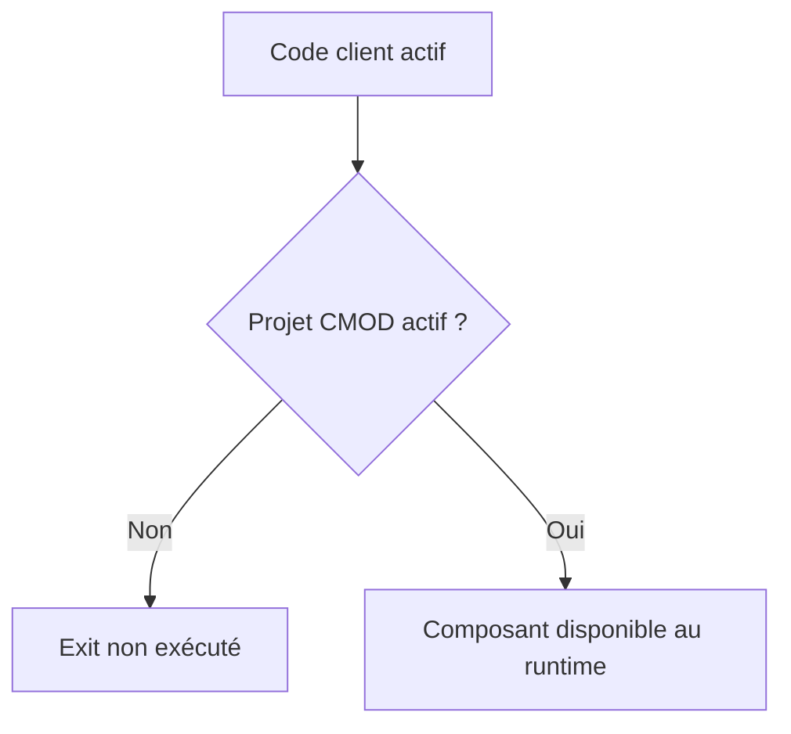

# 7. CRÉER ET ACTIVER UN PROJET `CMOD`

## 7.A RÉSULTAT ATTENDU

- Créer un projet d’extension client
- Affecter un enhancement `SMOD`[^outil-smod]
- Implémenter, transporter et activer le projet

## 7.B PROCESS

### 7.B.1 ÉTAPE 1 — VÉRIFIER L’ABSENCE DE PROJET CONCURRENT

À partir de l’enhancement validé dans `SMOD`, rechercher son affectation existante. Si un projet actif le contient déjà, analyser ce projet et compléter sa gouvernance plutôt que de créer une seconde affectation incompatible.

### 7.B.2 ÉTAPE 2 — CRÉER LE PROJET DANS `CMOD`

Saisir `/nCMOD`, entrer un nom Z conforme aux conventions puis choisir **Créer**. Renseigner une description fonctionnelle explicite, le package[^terme-package] et la demande de transport. Éviter les noms temporaires qui ne permettent pas d’identifier le domaine.

### 7.B.3 ÉTAPE 3 — AFFECTER L’ENHANCEMENT

Ouvrir l’affectation des extensions et ajouter le nom `SMOD` confirmé. Traiter tout message indiquant une utilisation existante. Enregistrer puis ouvrir la vue des composants pour vérifier que la liste attendue est complète.

### 7.B.4 ÉTAPE 4 — IMPLÉMENTER LES COMPOSANTS CLIENT

Pour chaque function exit, ouvrir l’include client prévu et déléguer la logique à une classe[^terme-classe] Z. Pour un screen ou menu exit, créer les objets associés selon leur contrat. Ajouter auparavant les append structures nécessaires aux données affichées ou transmises.

### 7.B.5 ÉTAPE 5 — ACTIVER DANS L’ORDRE

Contrôler et activer les objets DDIC[^terme-acro-ddic], includes, classes, écrans et fonctions de menu. Activer ensuite le projet CMOD[^outil-cmod]. Vérifier séparément le statut actif du code et celui du projet ; l’un ne remplace pas l’autre.

### 7.B.6 ÉTAPE 6 — TESTER ET CONTRÔLER LE TRANSPORT

Placer un breakpoint[^terme-breakpoint] dans le composant, exécuter le processus standard et vérifier le résultat cible ainsi qu’un cas hors périmètre. Contrôler que le projet et tous ses objets dépendants figurent dans des demandes transportées dans l’ordre requis.

## 7.C NOMMAGE

Utiliser les conventions du client pour le projet, les classes déléguées et les objets DDIC. Le nom du projet doit permettre d’identifier le domaine fonctionnel et le besoin, sans reprendre un nom générique tel que `ZTEST`.

## 7.D ACTIVATION



Vérifier les deux niveaux : activation des objets ABAP[^terme-abap] et activation du projet.

## 7.E TRANSPORT

Le projet `CMOD`, les includes client, les classes déléguées, les écrans et les objets DDIC doivent être transportés dans un ordre cohérent. Contrôler les dépendances entre Workbench et Customizing[^terme-customizing] lorsque l’extension utilise aussi du paramétrage.

## 7.F VÉRIFICATION

- L’implémentation ou le projet est actif et transporté dans le bon ordre.
- Un breakpoint confirme que le point d’extension est appelé dans le scénario visé.
- Le comportement standard reste inchangé hors du périmètre fonctionnel prévu.
- Aucune modification directe d’un objet SAP[^terme-acro-sap] standard n’a été créée.

## 7.G ERREURS FRÉQUENTES

- Choisir le premier exit trouvé sans vérifier le moment exact de l’appel.
- Créer plusieurs implémentations concurrentes sans règles de filtre.

## 7.H FICHE DE CONTRÔLE À COPIER

```text
Système / SID       :
Mandant             :
Utilisateur         :
Transaction / outil :
Objet technique     :
Jeu de données      :
Résultat attendu    :
Résultat observé    :
Horodatage          :
Ordre de transport  :
```

## 7.I TERMES DU LEXIQUE

- [BAdI](<../🧩 00 ├── LEXIQUE SAP ET ABAP/10 └── ACRONYMES SAP.md#acro-badi>)
- [BTE](<../🧩 00 ├── LEXIQUE SAP ET ABAP/10 └── ACRONYMES SAP.md#acro-bte>)
- [Objet Repository](<../🧩 00 ├── LEXIQUE SAP ET ABAP/03 ├── REPOSITORY PACKAGES ET TRANSPORTS.md#objet-repository>)

## 7.J RÉFÉRENCES OFFICIELLES SAP

- [Customer Exits — SAP Help Portal](https://help.sap.com/docs/ABAP_PLATFORM_NEW/2b28ffa716c24348903f8ffbfeb81df8/c81975cc43b111d1896f0000e8322d00.html)
- [Activating User Exits — SAP Help Portal](https://help.sap.com/docs/SAP_S4HANA_ON-PREMISE/83f4631d77654e14800e31b17fe9bd45/4c3a1afc9995677ae10000000a42189b.html)
- [Customer Exit Glossary — SAP Help Portal](https://help.sap.com/saphelp_snc700_ehp01/helpdata/en/35/26b1b7afab52b9e10000009b38f974/content.htm)

---

[Chapitre suivant — FUNCTION MODULE EXITS](<./08 ├── FUNCTION MODULE EXITS.md>)

[^terme-package]: **PACKAGE.** Conteneur logique qui regroupe les objets de développement et détermine notamment leur transportabilité. Voir [l’entrée du lexique](<../🧩 00 ├── LEXIQUE SAP ET ABAP/03 ├── REPOSITORY PACKAGES ET TRANSPORTS.md#package>).
[^terme-classe]: **CLASSE.** Modèle orienté objet définissant état et comportements. Voir [l’entrée du lexique](<../🧩 00 ├── LEXIQUE SAP ET ABAP/04 ├── LANGAGE ET DEVELOPPEMENT ABAP.md#classe>).
[^terme-acro-ddic]: **DDIC.** Data Dictionary, abréviation courante de l’ABAP Dictionary. Voir [l’entrée du lexique](<../🧩 00 ├── LEXIQUE SAP ET ABAP/10 └── ACRONYMES SAP.md#acro-ddic>).
[^terme-breakpoint]: **BREAKPOINT.** Point d’arrêt suspendant l’exécution dans le débogueur. Voir [l’entrée du lexique](<../🧩 00 ├── LEXIQUE SAP ET ABAP/08 ├── EXECUTION EXPLOITATION ET ADMINISTRATION.md#breakpoint>).
[^terme-abap]: **ABAP.** Langage de programmation de la plateforme ABAP, conçu pour développer des applications métier et techniques SAP. Voir [l’entrée du lexique](<../🧩 00 ├── LEXIQUE SAP ET ABAP/04 ├── LANGAGE ET DEVELOPPEMENT ABAP.md#abap>).
[^terme-customizing]: **CUSTOMIZING.** Paramétrage permettant d’adapter le comportement standard SAP à l’organisation. Voir [l’entrée du lexique](<../🧩 00 ├── LEXIQUE SAP ET ABAP/09 ├── NOTIONS FONCTIONNELLES ET ORGANISATIONNELLES.md#customizing>).
[^terme-acro-sap]: **SAP.** Nom de l’éditeur et de son écosystème logiciel ; l’acronyme historique provient de l’allemand. Voir [l’entrée du lexique](<../🧩 00 ├── LEXIQUE SAP ET ABAP/10 └── ACRONYMES SAP.md#acro-sap>).

[^outil-smod]: **SMOD.** Transaction de recherche et d’analyse des enhancements SAP classiques. Voir [le chapitre associé](<06 ├── ANALYSER UN ENHANCEMENT AVEC SMOD.md>).
[^outil-cmod]: **CMOD.** Transaction de gestion des projets d’extensions client classiques. Voir [le chapitre associé](<07 ├── CREER ET ACTIVER UN PROJET CMOD.md>).
