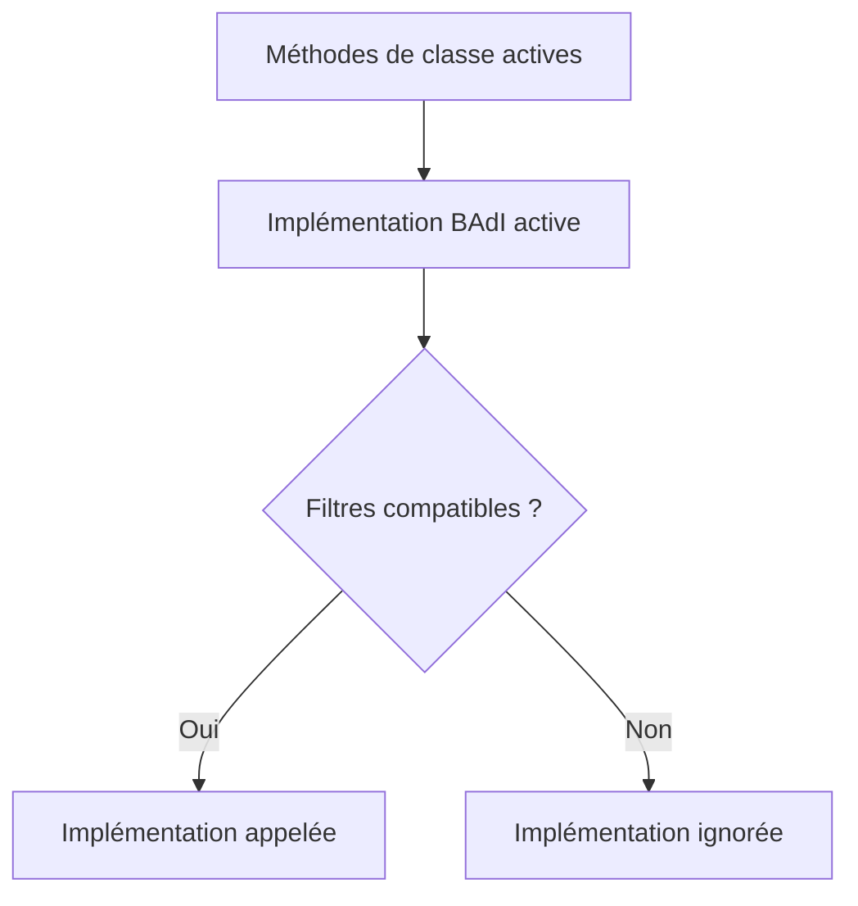

# 15. IMPLÉMENTER UNE BAdI AVEC `SE19`

## 15.A RÉSULTAT ATTENDU

- Créer une implémentation BAdI[^terme-acro-badi] client
- Générer ou affecter la classe[^terme-classe] d’implémentation
- Activer et tester l’ensemble des objets

## 15.B PROCESS

### 15.B.1 ÉTAPE 1 — PARTIR D’UNE DÉFINITION VALIDÉE

Conserver le nom, la méthode[^terme-methode], le point d’appel, les filtres et les implémentations existantes analysés dans `SE18`[^outil-se18]. Définir le cas métier sélectionné et les cas qui doivent rester sans effet.

### 15.B.2 ÉTAPE 2 — CRÉER L’IMPLÉMENTATION DANS `SE19`

Saisir `/nSE19`, choisir le mode de BAdI approprié puis créer une implémentation Z pour la définition ou l’enhancement spot. Renseigner une description explicite, le package[^terme-package] et la demande de transport.

### 15.B.3 ÉTAPE 3 — MAINTENIR LES FILTRES

Saisir uniquement les valeurs nécessaires au périmètre convenu et contrôler leur type. Comparer avec les implémentations actives afin d’éviter un chevauchement involontaire. Documenter le comportement attendu lorsque aucune valeur ne correspond.

### 15.B.4 ÉTAPE 4 — IMPLÉMENTER LES MÉTHODES

Ouvrir la classe générée ou affectée. Dans chaque méthode nécessaire, valider le contexte puis déléguer à une classe de service Z. Respecter la direction des paramètres, les exceptions et la LUW[^terme-acro-luw] du standard. Laisser les méthodes non utilisées sans effet explicite.

### 15.B.5 ÉTAPE 5 — ACTIVER TOUS LES NIVEAUX

Contrôler et activer la classe de service, la classe d’implémentation et l’implémentation BAdI. Vérifier le statut actif dans `SE19`[^outil-se19] et l’apparition de l’implémentation dans `SE18`. Contrôler les dépendances de transport.

### 15.B.6 ÉTAPE 6 — TESTER LA SÉLECTION RUNTIME

Placer un breakpoint[^terme-breakpoint] dans la méthode BAdI. Tester une valeur de filtre incluse, une valeur exclue, un cas d’erreur et les scénarios couverts par d’autres implémentations. Vérifier le résultat après le retour au standard et l’absence d’effet hors périmètre.

## 15.C DÉLÉGATION

Conserver une classe d’implémentation légère :

```abap
METHOD if_ex_zbadi_demo~change_data.
  zcl_dev_badi_service=>change_data(
    EXPORTING
      is_context = is_context
    CHANGING
      cs_data    = cs_data ).
ENDMETHOD.
```

Cette délégation[^terme-delegation] facilite les tests, la réutilisation et la séparation entre contrat SAP[^terme-acro-sap] et logique client.

## 15.D ACTIVATION



## 15.E VÉRIFICATION

- L’implémentation ou le projet est actif et transporté dans le bon ordre.
- Un breakpoint confirme que le point d’extension est appelé dans le scénario visé.
- Le comportement standard reste inchangé hors du périmètre fonctionnel prévu.
- Aucune modification directe d’un objet SAP standard n’a été créée.

## 15.F ERREURS FRÉQUENTES

- Copier un exemple sans adapter les types, noms d’objets et données disponibles dans le système.
- Tester uniquement le cas nominal et ignorer les valeurs initiales, absentes ou invalides.
- Choisir le premier exit trouvé sans vérifier le moment exact de l’appel.
- Créer plusieurs implémentations concurrentes sans règles de filtre.

## 15.G SNIPPET À RÉUTILISER

> [!NOTE]
> Adapter les noms `Z*`, les types DDIC[^terme-acro-ddic], les données et les autorisations au système cible. Effectuer un contrôle syntaxique avant activation.

```abap
METHOD if_ex_zbadi_demo~change_data.
  zcl_dev_badi_service=>change_data(
    EXPORTING
      is_context = is_context
    CHANGING
      cs_data    = cs_data ).
ENDMETHOD.
```

## 15.H TERMES DU LEXIQUE

- [BAdI](<../🧩 00 ├── LEXIQUE SAP ET ABAP/10 └── ACRONYMES SAP.md#acro-badi>)
- [BTE](<../🧩 00 ├── LEXIQUE SAP ET ABAP/10 └── ACRONYMES SAP.md#acro-bte>)
- [Objet Repository](<../🧩 00 ├── LEXIQUE SAP ET ABAP/03 ├── REPOSITORY PACKAGES ET TRANSPORTS.md#objet-repository>)

## 15.I RÉFÉRENCES OFFICIELLES SAP

- [Implementation of BAdIs in the Enhancement Builder — SAP Help Portal](https://help.sap.com/docs/SAP_NETWEAVER_700/12a713d06c531014903e876ccc9a0b0d27/b2873842134bad04e10000000a1550b0.html)
- [How to Implement a BAdI — SAP Help Portal](https://help.sap.com/docs/ABAP_PLATFORM_NEW/46a2cfc13d25463b8b9a3d2a3c3ba0d9/44f518d884056c30e10000000a114a6b.html)
- [Business Add-Ins — SAP Help Portal](https://help.sap.com/docs/PRODUCT_ID/46a2cfc13d25463b8b9a3d2a3c3ba0d9/8ff2e540f8648431e10000000a1550b0.html)

---

[Chapitre suivant — BAdI CLASSIQUES, FILTRES ET USAGE MULTIPLE](<./16 ├── BADI CLASSIQUES FILTRES ET USAGE MULTIPLE.md>)

[^terme-acro-badi]: **BADI.** Business Add-In, mécanisme d’extension orienté objet du standard SAP. Voir [l’entrée du lexique](<../🧩 00 ├── LEXIQUE SAP ET ABAP/10 └── ACRONYMES SAP.md#acro-badi>).
[^terme-classe]: **CLASSE.** Modèle orienté objet définissant état et comportements. Voir [l’entrée du lexique](<../🧩 00 ├── LEXIQUE SAP ET ABAP/04 ├── LANGAGE ET DEVELOPPEMENT ABAP.md#classe>).
[^terme-methode]: **MÉTHODE.** Comportement déclaré dans une classe ou une interface et appelé avec une liste de paramètres définie. Voir [l’entrée du lexique](<../🧩 00 ├── LEXIQUE SAP ET ABAP/04 ├── LANGAGE ET DEVELOPPEMENT ABAP.md#methode>).
[^terme-package]: **PACKAGE.** Conteneur logique qui regroupe les objets de développement et détermine notamment leur transportabilité. Voir [l’entrée du lexique](<../🧩 00 ├── LEXIQUE SAP ET ABAP/03 ├── REPOSITORY PACKAGES ET TRANSPORTS.md#package>).
[^terme-acro-luw]: **LUW.** Logical Unit of Work. Voir [l’entrée du lexique](<../🧩 00 ├── LEXIQUE SAP ET ABAP/10 └── ACRONYMES SAP.md#acro-luw>).
[^terme-breakpoint]: **BREAKPOINT.** Point d’arrêt suspendant l’exécution dans le débogueur. Voir [l’entrée du lexique](<../🧩 00 ├── LEXIQUE SAP ET ABAP/08 ├── EXECUTION EXPLOITATION ET ADMINISTRATION.md#breakpoint>).
[^terme-delegation]: **DÉLÉGATION.** Technique par laquelle une méthode transmet tout ou partie d’un traitement à un objet collaborateur. Voir [l’entrée du lexique](<../🧩 00 ├── LEXIQUE SAP ET ABAP/04 ├── LANGAGE ET DEVELOPPEMENT ABAP.md#delegation>).
[^terme-acro-sap]: **SAP.** Nom de l’éditeur et de son écosystème logiciel ; l’acronyme historique provient de l’allemand. Voir [l’entrée du lexique](<../🧩 00 ├── LEXIQUE SAP ET ABAP/10 └── ACRONYMES SAP.md#acro-sap>).
[^terme-acro-ddic]: **DDIC.** Data Dictionary, abréviation courante de l’ABAP Dictionary. Voir [l’entrée du lexique](<../🧩 00 ├── LEXIQUE SAP ET ABAP/10 └── ACRONYMES SAP.md#acro-ddic>).

[^outil-se18]: **SE18.** BAdI Builder utilisé pour rechercher et analyser les définitions de BAdI. Voir [le chapitre associé](<14 ├── ANALYSER UNE DEFINITION BADI AVEC SE18.md>).
[^outil-se19]: **SE19.** BAdI Builder utilisé pour créer et maintenir les implémentations de BAdI. Voir [le chapitre associé](<15 ├── IMPLEMENTER UNE BADI AVEC SE19.md>).
