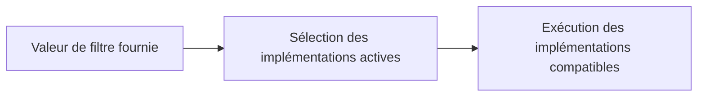

# 16. BAdI CLASSIQUES, FILTRES ET USAGE MULTIPLE

## 16.A RÉSULTAT ATTENDU

- Maintenir une implémentation de BAdI[^terme-acro-badi] classique
- Comprendre la sélection par filtre
- Anticiper l’ordre et la multiplicité des appels

## 16.B BAdI CLASSIQUE

Les BAdI classiques utilisent le modèle historique du BAdI Builder. Ils restent fréquents dans les applications ECC et certains composants S/4HANA. Depuis AS ABAP[^terme-abap] 7.0, SAP[^terme-acro-sap] distingue les BAdI classiques des BAdI intégrés au Enhancement Framework.

## 16.C FILTRES

Une définition filter-dependent sélectionne une ou plusieurs implémentations selon une valeur fournie par l’application. L’implémentation doit maintenir les valeurs de filtre qu’elle prend en charge.



Ne pas coder dans la méthode[^terme-methode] une seconde logique de sélection qui duplique inutilement le filtre configuré.

## 16.D USAGE MULTIPLE

Avec multiple-use, plusieurs implémentations peuvent être exécutées. Le code ne doit pas dépendre d’un ordre non garanti, sauf contrat explicite de l’application.

Éviter :

- plusieurs implémentations modifiant la même donnée sans coordination ;
- un état global partagé ;
- des commits dans une implémentation ;
- une dépendance au nom technique d’une autre implémentation.

## 16.E DIAGNOSTIC

- afficher les implémentations actives dans `SE18`[^outil-se18] ou `SE19`[^outil-se19] ;
- vérifier les valeurs de filtre ;
- placer un breakpoint[^terme-breakpoint] dans chaque classe[^terme-classe] candidate ;
- contrôler la multiplicité et l’ordre observé ;
- mesurer le temps si le BAdI est appelé dans une boucle.

## 16.F PROCESS

### 16.F.1 ÉTAPE 1 — RELEVER LES ATTRIBUTS DE LA DÉFINITION

Dans `SE18`, vérifier si la BAdI est à usage simple ou multiple et si elle possède un filtre. Ouvrir le type du filtre et la documentation. Identifier dans le code appelant la valeur exacte utilisée pour la sélection runtime.

### 16.F.2 ÉTAPE 2 — CARTOGRAPHIER LES IMPLÉMENTATIONS

Lister les implémentations actives avec leurs classes et plages de filtre. Repérer les valeurs qui se recouvrent et les implémentations sans filtre restrictif. Pour l’usage multiple, analyser le code sans dépendre d’un ordre non garanti par le contrat.

### 16.F.3 ÉTAPE 3 — DÉFINIR UNE MATRICE DE SÉLECTION

Pour chaque valeur de filtre significative, indiquer quelles implémentations doivent être sélectionnées et le résultat attendu. Ajouter les valeurs initiales, inconnues et limites. Cette matrice sert de preuve avant et après activation.

### 16.F.4 ÉTAPE 4 — IMPLÉMENTER SANS DÉPENDANCE CROISÉE

Créer ou ajuster les filtres dans `SE19`, puis isoler la logique de chaque implémentation. Ne pas supposer qu’une autre implémentation a déjà modifié un paramètre. Si un ordre métier est indispensable, centraliser l’orchestration dans une seule implémentation maîtrisée.

### 16.F.5 ÉTAPE 5 — TESTER CHAQUE LIGNE DE LA MATRICE

Poser des breakpoints dans toutes les implémentations candidates et exécuter le scénario pour chaque valeur. Relever les implémentations appelées, les paramètres avant/après et le résultat final. Corriger tout chevauchement non prévu.

### 16.F.6 ÉTAPE 6 — CONTRÔLER ACTIVATION ET TRANSPORT

Vérifier que les classes et implémentations sont actives et incluses dans les demandes attendues. Rejouer la matrice dans le système cible, car les implémentations présentes et leur activation peuvent différer entre environnements.

## 16.G VÉRIFICATION

- L’implémentation ou le projet est actif et transporté dans le bon ordre.
- Un breakpoint confirme que le point d’extension est appelé dans le scénario visé.
- Le comportement standard reste inchangé hors du périmètre fonctionnel prévu.
- Aucune modification directe d’un objet SAP standard n’a été créée.

## 16.H ERREURS FRÉQUENTES

- Choisir le premier exit trouvé sans vérifier le moment exact de l’appel.
- Créer plusieurs implémentations concurrentes sans règles de filtre.

## 16.I FICHE DE CONTRÔLE À COPIER

```text
Système / SID       :
Mandant             :
Utilisateur         :
Transaction / outil :
Objet technique     :
Jeu de données      :
Résultat attendu    :
Résultat observé    :
Horodatage          :
Ordre de transport  :
```

## 16.J TERMES DU LEXIQUE

- [BAdI](<../🧩 00 ├── LEXIQUE SAP ET ABAP/10 └── ACRONYMES SAP.md#acro-badi>)
- [BTE](<../🧩 00 ├── LEXIQUE SAP ET ABAP/10 └── ACRONYMES SAP.md#acro-bte>)
- [Objet Repository](<../🧩 00 ├── LEXIQUE SAP ET ABAP/03 ├── REPOSITORY PACKAGES ET TRANSPORTS.md#objet-repository>)

## 16.K RÉFÉRENCES OFFICIELLES SAP

- [Classic BAdIs — SAP Help Portal](https://help.sap.com/docs/ABAP_PLATFORM_NEW/2b28ffa716c24348903f8ffbfeb81df8/e6d54d3c596f0b26e10000000a11402f.html)
- [Implementing a Filter-Dependent Classic BAdI — SAP Help Portal](https://help.sap.com/docs/ABAP_PLATFORM_2020/2b28ffa716c24348903f8ffbfeb81df8/9790e24662d6d8478cf1f392108c5df0.html)
- [How to Use Filters — SAP Help Portal](https://help.sap.com/docs/ABAP_PLATFORM_NEW/46a2cfc13d25463b8b9a3d2a3c3ba0d9/44f6cd83912541aae10000000a114a6b.html)

---

[Chapitre suivant — ENHANCEMENT SPOTS ET IMPLÉMENTATIONS](<./17 ├── ENHANCEMENT SPOTS ET IMPLEMENTATIONS.md>)

[^terme-acro-badi]: **BADI.** Business Add-In, mécanisme d’extension orienté objet du standard SAP. Voir [l’entrée du lexique](<../🧩 00 ├── LEXIQUE SAP ET ABAP/10 └── ACRONYMES SAP.md#acro-badi>).
[^terme-abap]: **ABAP.** Langage de programmation de la plateforme ABAP, conçu pour développer des applications métier et techniques SAP. Voir [l’entrée du lexique](<../🧩 00 ├── LEXIQUE SAP ET ABAP/04 ├── LANGAGE ET DEVELOPPEMENT ABAP.md#abap>).
[^terme-acro-sap]: **SAP.** Nom de l’éditeur et de son écosystème logiciel ; l’acronyme historique provient de l’allemand. Voir [l’entrée du lexique](<../🧩 00 ├── LEXIQUE SAP ET ABAP/10 └── ACRONYMES SAP.md#acro-sap>).
[^terme-methode]: **MÉTHODE.** Comportement déclaré dans une classe ou une interface et appelé avec une liste de paramètres définie. Voir [l’entrée du lexique](<../🧩 00 ├── LEXIQUE SAP ET ABAP/04 ├── LANGAGE ET DEVELOPPEMENT ABAP.md#methode>).
[^terme-breakpoint]: **BREAKPOINT.** Point d’arrêt suspendant l’exécution dans le débogueur. Voir [l’entrée du lexique](<../🧩 00 ├── LEXIQUE SAP ET ABAP/08 ├── EXECUTION EXPLOITATION ET ADMINISTRATION.md#breakpoint>).
[^terme-classe]: **CLASSE.** Modèle orienté objet définissant état et comportements. Voir [l’entrée du lexique](<../🧩 00 ├── LEXIQUE SAP ET ABAP/04 ├── LANGAGE ET DEVELOPPEMENT ABAP.md#classe>).

[^outil-se18]: **SE18.** BAdI Builder utilisé pour rechercher et analyser les définitions de BAdI. Voir [le chapitre associé](<14 ├── ANALYSER UNE DEFINITION BADI AVEC SE18.md>).
[^outil-se19]: **SE19.** BAdI Builder utilisé pour créer et maintenir les implémentations de BAdI. Voir [le chapitre associé](<15 ├── IMPLEMENTER UNE BADI AVEC SE19.md>).
