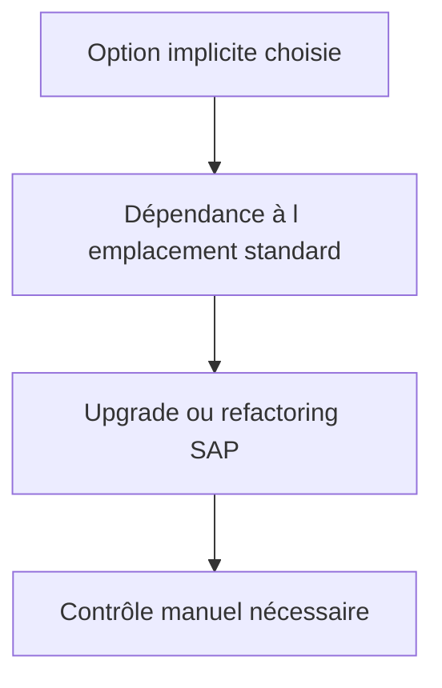

# 19. OPTIONS D’ENHANCEMENT IMPLICITES

## 19.A RÉSULTAT ATTENDU

- Afficher les options implicites dans l’éditeur SAP GUI[^terme-sap-gui]
- Choisir un emplacement stable
- Limiter le couplage au code standard

## 19.B PRINCIPE

Le runtime fournit automatiquement des options implicites à certains emplacements, sans instruction `ENHANCEMENT-POINT` écrite dans le code. Elles peuvent être affichées dans l’éditeur ABAP[^terme-abap] via les opérations d’enhancement.

Emplacements courants :

- début et fin de `FORM`, module fonction[^terme-module-fonction] ou méthode[^terme-methode] ;
- fin d’un programme ou include ;
- fin de certaines sections de classes ou interfaces ;
- listes de paramètres extensibles selon le type d’objet.

## 19.C RISQUE



Une option implicite est moins explicite qu’un BAdI[^terme-acro-badi] ou un point publié. Son emplacement peut devenir inadapté après une évolution du standard, même si l’objet d’implémentation reste actif.

## 19.D RÈGLES

- utiliser l’option la plus locale possible ;
- ne pas copier un bloc standard complet ;
- déléguer immédiatement à une classe[^terme-classe] client ;
- éviter la dépendance à des variables locales instables ;
- documenter la justification de l’absence d’autre extension ;
- prévoir un contrôle dans `SPAU_ENH`[^outil-spau-enh] après upgrade ;
- limiter les traitements coûteux en début ou fin de méthode appelée fréquemment.

## 19.E PROCESS

### 19.E.1 ÉTAPE 1 — PROUVER L’ABSENCE D’EXTENSION PUBLIQUE ADAPTÉE

Documenter les BAdI, customer exits et points explicites recherchés et la raison de leur rejet. Une option implicite est un recours lié à une position source ; elle ne doit pas remplacer un contrat public disponible.

### 19.E.2 ÉTAPE 2 — AFFICHER LES OPTIONS IMPLICITES

Ouvrir le programme, l’include, la fonction ou la méthode standard en affichage. Activer l’affichage des options d’enhancement implicites dans l’éditeur. Relever toutes les positions proposées autour de la zone utile, sans passer immédiatement en modification.

### 19.E.3 ÉTAPE 3 — CHOISIR LA POSITION LA MOINS FRAGILE

Analyser les données disponibles, les validations déjà exécutées et les traitements suivants. Préférer une frontière de méthode, fonction ou include dont le rôle est stable. Écarter une position dont la logique dépend de variables locales temporaires non documentées.

### 19.E.4 ÉTAPE 4 — CRÉER L’IMPLÉMENTATION Z

Sélectionner l’option retenue et créer une enhancement implementation Z transportable. Renseigner une description incluant le besoin et la position standard. Ne modifier aucune ligne SAP en dehors du bloc d’enhancement.

### 19.E.5 ÉTAPE 5 — DÉLÉGUER LA LOGIQUE

Limiter le bloc à la collecte des données, aux conditions de périmètre et à l’appel d’une classe Z. Éviter un commit, un dialogue ou une dépendance à l’ordre d’autres enhancements implicites. Traiter explicitement les cas où les données locales sont initiales.

### 19.E.6 ÉTAPE 6 — TESTER ET CRÉER LE CONTRÔLE D’UPGRADE

Tester le scénario cible et les chemins voisins de la source standard. Conserver programme, include, méthode, position et extrait contextuel. Après upgrade, utiliser ces informations et les outils d’ajustement d’enhancements pour confirmer que le point reste pertinent.

## 19.F VÉRIFICATION

- L’implémentation ou le projet est actif et transporté dans le bon ordre.
- Un breakpoint[^terme-breakpoint] confirme que le point d’extension est appelé dans le scénario visé.
- Le comportement standard reste inchangé hors du périmètre fonctionnel prévu.
- Aucune modification directe d’un objet SAP standard n’a été créée.

## 19.G ERREURS FRÉQUENTES

- Choisir le premier exit trouvé sans vérifier le moment exact de l’appel.
- Créer plusieurs implémentations concurrentes sans règles de filtre.

## 19.H FICHE DE CONTRÔLE À COPIER

```text
Système / SID       :
Mandant             :
Utilisateur         :
Transaction / outil :
Objet technique     :
Jeu de données      :
Résultat attendu    :
Résultat observé    :
Horodatage          :
Ordre de transport  :
```

## 19.I TERMES DU LEXIQUE

- [BAdI](<../🧩 00 ├── LEXIQUE SAP ET ABAP/10 └── ACRONYMES SAP.md#acro-badi>)
- [BTE](<../🧩 00 ├── LEXIQUE SAP ET ABAP/10 └── ACRONYMES SAP.md#acro-bte>)
- [Objet Repository](<../🧩 00 ├── LEXIQUE SAP ET ABAP/03 ├── REPOSITORY PACKAGES ET TRANSPORTS.md#objet-repository>)

## 19.J RÉFÉRENCES OFFICIELLES SAP

- [Implicit Enhancement Options — SAP Help Portal](https://help.sap.com/docs/ABAP_PLATFORM_NEW/46a2cfc13d25463b8b9a3d2a3c3ba0d9/29e59441026aae5fe10000000a1550b0.html)
- [Enhancement Options — SAP Help Portal](https://help.sap.com/docs/ABAP_PLATFORM_NEW/46a2cfc13d25463b8b9a3d2a3c3ba0d9/fbe3d8403e37762ae10000000a155106.html)
- [ABAP Source Code Enhancements — SAP Help Portal](https://help.sap.com/docs/SAP_NETWEAVER_AS_ABAP_752/46a2cfc13d25463b8b9a3d2a3c3ba0d9/a047e94086087e7fe10000000a1550b0.html)

---

[Chapitre suivant — ENHANCEMENTS DE CLASSES : PRE, POST ET OVERWRITE](<./20 ├── ENHANCEMENTS DE CLASSES PRE POST ET OVERWRITE.md>)

[^terme-sap-gui]: **SAP GUI.** Client graphique permettant d’utiliser les transactions et écrans d’un système SAP. Voir [l’entrée du lexique](<../🧩 00 ├── LEXIQUE SAP ET ABAP/02 ├── SAP GUI NAVIGATION ET TRANSACTIONS.md#sap-gui>).
[^terme-abap]: **ABAP.** Langage de programmation de la plateforme ABAP, conçu pour développer des applications métier et techniques SAP. Voir [l’entrée du lexique](<../🧩 00 ├── LEXIQUE SAP ET ABAP/04 ├── LANGAGE ET DEVELOPPEMENT ABAP.md#abap>).
[^terme-module-fonction]: **MODULE FONCTION.** Procédure globale appelée avec `CALL FUNCTION` et définie dans un groupe de fonctions. Voir [l’entrée du lexique](<../🧩 00 ├── LEXIQUE SAP ET ABAP/06 ├── PROGRAMMES CLASSES ET OBJETS TECHNIQUES.md#module-fonction>).
[^terme-methode]: **MÉTHODE.** Comportement déclaré dans une classe ou une interface et appelé avec une liste de paramètres définie. Voir [l’entrée du lexique](<../🧩 00 ├── LEXIQUE SAP ET ABAP/04 ├── LANGAGE ET DEVELOPPEMENT ABAP.md#methode>).
[^terme-acro-badi]: **BADI.** Business Add-In, mécanisme d’extension orienté objet du standard SAP. Voir [l’entrée du lexique](<../🧩 00 ├── LEXIQUE SAP ET ABAP/10 └── ACRONYMES SAP.md#acro-badi>).
[^terme-classe]: **CLASSE.** Modèle orienté objet définissant état et comportements. Voir [l’entrée du lexique](<../🧩 00 ├── LEXIQUE SAP ET ABAP/04 ├── LANGAGE ET DEVELOPPEMENT ABAP.md#classe>).
[^terme-breakpoint]: **BREAKPOINT.** Point d’arrêt suspendant l’exécution dans le débogueur. Voir [l’entrée du lexique](<../🧩 00 ├── LEXIQUE SAP ET ABAP/08 ├── EXECUTION EXPLOITATION ET ADMINISTRATION.md#breakpoint>).

[^outil-spau-enh]: **SPAU_ENH.** Outil d’ajustement des enhancements après une mise à niveau du système. Voir [le chapitre associé](<23 └── TRANSPORT DEBUG UPGRADE ET BONNES PRATIQUES.md>).
