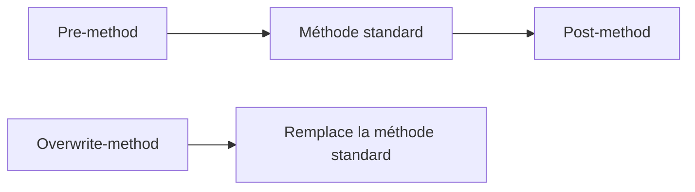

# 20. ENHANCEMENTS DE CLASSES : PRE, POST ET OVERWRITE

## 20.A RÉSULTAT ATTENDU

- Étendre une classe globale[^terme-classe-globale] sans la modifier directement
- Comprendre pre-method, post-method et overwrite-method
- Évaluer les risques de remplacement d’une méthode[^terme-methode]

## 20.B MODES

| Mode             | Moment d’exécution                              | Effet                |
| ---------------- | ----------------------------------------------- | -------------------- |
| Pre-method       | Avant la méthode d’origine                      | Prétraitement        |
| Post-method      | Après la méthode d’origine si le flux le permet | Post-traitement      |
| Overwrite-method | À la place de la méthode d’origine              | Remplacement complet |



Une overwrite-method ne peut pas être combinée avec des pre/post methods pour la même méthode d’origine.

## 20.C AUTRES EXTENSIONS DE CLASSE

Selon l’objet et la version, le framework permet notamment :

- ajout de méthodes ;
- ajout de composants ;
- ajout de paramètres facultatifs ;
- amélioration d’interfaces ou de groupes de fonctions.

## 20.D RISQUES

L’overwrite-method copie implicitement la responsabilité du code standard. Les corrections futures de SAP[^terme-acro-sap] dans la méthode d’origine ne sont plus exécutées. Ce mécanisme doit rester exceptionnel.

Pour un pre/post method :

- vérifier les exceptions ;
- ne pas supposer que le post-traitement s’exécutera après toute sortie selon la version et le flux ;
- éviter de modifier un état interne non prévu ;
- mesurer les effets sur toutes les sous-classes et tous les appelants.

## 20.E PROCESS

### 20.E.1 ÉTAPE 1 — ANALYSER LA MÉTHODE STANDARD

Ouvrir la classe et la méthode en affichage dans `SE24`[^terme-class-builder-se24] ou `SE80`[^outil-se80]. Relever la signature, les préconditions, les effets, les exceptions et les appelants. Reproduire le scénario avec un breakpoint[^terme-breakpoint] afin de confirmer les valeurs d’entrée et de sortie.

### 20.E.2 ÉTAPE 2 — CHOISIR LE TYPE D’ENHANCEMENT

Utiliser un pré-exit pour préparer ou valider avant le code standard, un post-exit pour compléter le résultat après le standard, et un overwrite uniquement lorsque le remplacement complet est indispensable. Documenter pourquoi une BAdI[^terme-acro-badi], un point explicite ou une composition[^terme-composition] ne couvre pas le besoin.

### 20.E.3 ÉTAPE 3 — MESURER LES DONNÉES DISPONIBLES

Vérifier les paramètres et attributs accessibles à l’option retenue. Déterminer quelles valeurs peuvent être modifiées et comment le standard les consomme. Pour un overwrite, inventorier toutes les branches standard qui ne s’exécuteront plus.

### 20.E.4 ÉTAPE 4 — CRÉER L’IMPLÉMENTATION

Depuis les opérations d’enhancement de la classe, créer une enhancement implementation Z et le bloc pré, post ou overwrite. Affecter le package[^terme-package] et le transport. Conserver le code du bloc minimal et déléguer le métier à une classe Z.

### 20.E.5 ÉTAPE 5 — TESTER L’ORDRE ET LES EXCEPTIONS

Poser des breakpoints dans le pré-exit, la méthode standard et le post-exit afin de confirmer la séquence. Tester un retour normal et chaque exception[^terme-exception] pertinente. Pour un overwrite, comparer les résultats à un référentiel standard sur toutes les variantes métier.

### 20.E.6 ÉTAPE 6 — ENCADRER LE RISQUE D’UPGRADE

Activer et transporter l’ensemble des objets, puis consigner la version et le contenu standard remplacé. Après une mise à niveau, comparer la méthode livrée par SAP et réévaluer l’overwrite avant réactivation. Une nouvelle correction standard ignorée doit être traitée explicitement.

## 20.F VÉRIFICATION

- L’implémentation ou le projet est actif et transporté dans le bon ordre.
- Un breakpoint confirme que le point d’extension est appelé dans le scénario visé.
- Le comportement standard reste inchangé hors du périmètre fonctionnel prévu.
- Aucune modification directe d’un objet SAP standard n’a été créée.

## 20.G ERREURS FRÉQUENTES

- Choisir le premier exit trouvé sans vérifier le moment exact de l’appel.
- Créer plusieurs implémentations concurrentes sans règles de filtre.

## 20.H FICHE DE CONTRÔLE À COPIER

```text
Système / SID       :
Mandant             :
Utilisateur         :
Transaction / outil :
Objet technique     :
Jeu de données      :
Résultat attendu    :
Résultat observé    :
Horodatage          :
Ordre de transport  :
```

## 20.I TERMES DU LEXIQUE

- [Classe](<../🧩 00 ├── LEXIQUE SAP ET ABAP/04 ├── LANGAGE ET DEVELOPPEMENT ABAP.md#classe>)
- [BAdI](<../🧩 00 ├── LEXIQUE SAP ET ABAP/10 └── ACRONYMES SAP.md#acro-badi>)
- [BTE](<../🧩 00 ├── LEXIQUE SAP ET ABAP/10 └── ACRONYMES SAP.md#acro-bte>)
- [Objet Repository](<../🧩 00 ├── LEXIQUE SAP ET ABAP/03 ├── REPOSITORY PACKAGES ET TRANSPORTS.md#objet-repository>)

## 20.J RÉFÉRENCES OFFICIELLES SAP

- [Enhancements to Classes and Interfaces — SAP Help Portal](https://help.sap.com/docs/ABAP_PLATFORM_NEW/46a2cfc13d25463b8b9a3d2a3c3ba0d9/584fb541d3d52d31e10000000a155106.html)
- [Enhancing Components of Global Classes — SAP Help Portal](https://help.sap.com/docs/SAP_NETWEAVER_AS_ABAP_FOR_SOH_740/46a2cfc13d25463b8b9a3d2a3c3ba0d9/86b83142680d5c33e10000000a155106.html)
- [Enhancement Technologies — SAP Help Portal](https://help.sap.com/docs/ABAP_PLATFORM_NEW/46a2cfc13d25463b8b9a3d2a3c3ba0d9/7063da4023a28631e10000000a1550b0.html)

---

[Chapitre suivant — BAdI DU ENHANCEMENT FRAMEWORK ET APPELS ABAP](<./21 ├── BADI DU ENHANCEMENT FRAMEWORK ET APPELS ABAP.md>)

[^terme-classe-globale]: **CLASSE GLOBALE.** Classe Repository réutilisable dans le système ABAP. Voir [l’entrée du lexique](<../🧩 00 ├── LEXIQUE SAP ET ABAP/06 ├── PROGRAMMES CLASSES ET OBJETS TECHNIQUES.md#classe-globale>).
[^terme-methode]: **MÉTHODE.** Comportement déclaré dans une classe ou une interface et appelé avec une liste de paramètres définie. Voir [l’entrée du lexique](<../🧩 00 ├── LEXIQUE SAP ET ABAP/04 ├── LANGAGE ET DEVELOPPEMENT ABAP.md#methode>).
[^terme-acro-sap]: **SAP.** Nom de l’éditeur et de son écosystème logiciel ; l’acronyme historique provient de l’allemand. Voir [l’entrée du lexique](<../🧩 00 ├── LEXIQUE SAP ET ABAP/10 └── ACRONYMES SAP.md#acro-sap>).
[^terme-class-builder-se24]: **CLASS BUILDER (SE24).** Outil SAP GUI utilisé pour créer, afficher, modifier, tester et documenter les classes et interfaces globales ABAP. Voir [l’entrée du lexique](<../🧩 00 ├── LEXIQUE SAP ET ABAP/06 ├── PROGRAMMES CLASSES ET OBJETS TECHNIQUES.md#class-builder-se24>).
[^terme-breakpoint]: **BREAKPOINT.** Point d’arrêt suspendant l’exécution dans le débogueur. Voir [l’entrée du lexique](<../🧩 00 ├── LEXIQUE SAP ET ABAP/08 ├── EXECUTION EXPLOITATION ET ADMINISTRATION.md#breakpoint>).
[^terme-acro-badi]: **BADI.** Business Add-In, mécanisme d’extension orienté objet du standard SAP. Voir [l’entrée du lexique](<../🧩 00 ├── LEXIQUE SAP ET ABAP/10 └── ACRONYMES SAP.md#acro-badi>).
[^terme-composition]: **COMPOSITION.** Relation dans laquelle une classe réalise son comportement en contenant ou en utilisant d’autres objets spécialisés. Voir [l’entrée du lexique](<../🧩 00 ├── LEXIQUE SAP ET ABAP/04 ├── LANGAGE ET DEVELOPPEMENT ABAP.md#composition>).
[^terme-package]: **PACKAGE.** Conteneur logique qui regroupe les objets de développement et détermine notamment leur transportabilité. Voir [l’entrée du lexique](<../🧩 00 ├── LEXIQUE SAP ET ABAP/03 ├── REPOSITORY PACKAGES ET TRANSPORTS.md#package>).
[^terme-exception]: **EXCEPTION.** Objet ou signal représentant une situation anormale qu’un appelant peut traiter. Voir [l’entrée du lexique](<../🧩 00 ├── LEXIQUE SAP ET ABAP/04 ├── LANGAGE ET DEVELOPPEMENT ABAP.md#exception>).

[^outil-se80]: **SE80.** Object Navigator utilisé pour parcourir et maintenir les objets du Repository ABAP. Voir [le chapitre associé](<../🧩 01 ├── FONDAMENTAUX ABAP/04 ├── EDITEURS ABAP SE38 ET SE80.md>).
