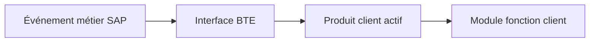

# 22. BUSINESS TRANSACTION EVENTS AVEC `FIBF`

## 22.A RÉSULTAT ATTENDU

- Comprendre le principe des Business Transaction Events
- Identifier processus, interface et produit
- Implémenter un module fonction[^terme-module-fonction] sans modifier l’application

## 22.B PRINCIPE

Un BTE[^terme-acro-bte] est un événement métier auquel une application permet de rattacher un module fonction client. Cette technologie est notamment rencontrée dans les domaines financiers.



SAP[^terme-acro-sap] fournit généralement un module exemple décrivant l’interface. Le module client doit reprendre exactement cette interface.

## 22.C DÉMARCHE

1. Ouvrir `FIBF`[^outil-fibf].
2. Rechercher le processus ou l’événement approprié.
3. Analyser le module exemple fourni par SAP.
4. Copier l’interface vers un module fonction client.
5. Implémenter la logique en déléguant à une classe[^terme-classe].
6. Créer et activer le produit client.
7. Affecter le module au processus selon le Customizing[^terme-customizing] prévu.
8. Tester le scénario complet et le contexte transactionnel.

## 22.D PRÉCAUTIONS

- distinguer événements de publication et processus avec valeur de retour ;
- respecter l’interface du module exemple ;
- ne pas exécuter de commit ;
- vérifier si plusieurs produits peuvent être actifs ;
- contrôler le mandant[^terme-mandant] et le transport du Customizing ;
- documenter l’ordre d’exécution observé.

## 22.E PROCESS

### 22.E.1 ÉTAPE 1 — IDENTIFIER L’ÉVÉNEMENT BTE

Dans `FIBF`, utiliser l’environnement[^terme-environnement] d’information pour rechercher l’événement correspondant au processus FI. Lire sa documentation et relever s’il s’agit d’un événement de type publication ou processus, ainsi que le module exemple fourni.

### 22.E.2 ÉTAPE 2 — ANALYSER L’INTERFACE D’EXEMPLE

Ouvrir le module exemple dans `SE37`[^outil-se37]. Relever les paramètres, tables, exceptions et commentaires. Utiliser la liste d’utilisation ou un breakpoint[^terme-breakpoint] pour confirmer que l’événement est déclenché dans le scénario S/4HANA concerné.

### 22.E.3 ÉTAPE 3 — CRÉER LE MODULE CLIENT

Copier l’interface vers un module fonction Z dans un groupe client, sans modifier la signature attendue. Implémenter une adaptation légère puis déléguer à une classe Z. Ne pas exécuter de commit si l’événement appartient à la LUW[^terme-acro-luw] standard.

### 22.E.4 ÉTAPE 4 — DÉFINIR ET ACTIVER LE PRODUIT

Dans les vues de paramétrage FIBF prévues, créer ou réutiliser un produit client Z avec une description et un statut maîtrisés. Affecter l’événement au module Z pour le périmètre requis. Enregistrer le paramétrage dans la demande appropriée.

### 22.E.5 ÉTAPE 5 — CONFIRMER L’APPEL AU RUNTIME

Activer le module et le produit, poser un breakpoint dans le module Z puis reproduire le document FI. Relever l’événement, les paramètres, le nombre d’appels et le moment par rapport à la validation du document.

### 22.E.6 ÉTAPE 6 — TESTER LE PÉRIMÈTRE ET LE TRANSPORT

Tester le cas cible, une société ou opération hors périmètre, une erreur contrôlée et l’annulation de la transaction. Vérifier le transport du module, de la classe et du paramétrage produit. Refaire le test dans le système cible avec le produit actif.

## 22.F VÉRIFICATION

- L’implémentation ou le projet est actif et transporté dans le bon ordre.
- Un breakpoint confirme que le point d’extension est appelé dans le scénario visé.
- Le comportement standard reste inchangé hors du périmètre fonctionnel prévu.
- Aucune modification directe d’un objet SAP standard n’a été créée.

## 22.G ERREURS FRÉQUENTES

- Choisir le premier exit trouvé sans vérifier le moment exact de l’appel.
- Créer plusieurs implémentations concurrentes sans règles de filtre.

## 22.H FICHE DE CONTRÔLE À COPIER

```text
Système / SID       :
Mandant             :
Utilisateur         :
Transaction / outil :
Objet technique     :
Jeu de données      :
Résultat attendu    :
Résultat observé    :
Horodatage          :
Ordre de transport  :
```

## 22.I TERMES DU LEXIQUE

- [Transaction](<../🧩 00 ├── LEXIQUE SAP ET ABAP/02 ├── SAP GUI NAVIGATION ET TRANSACTIONS.md#transaction>)
- [BAdI](<../🧩 00 ├── LEXIQUE SAP ET ABAP/10 └── ACRONYMES SAP.md#acro-badi>)
- [BTE](<../🧩 00 ├── LEXIQUE SAP ET ABAP/10 └── ACRONYMES SAP.md#acro-bte>)
- [Objet Repository](<../🧩 00 ├── LEXIQUE SAP ET ABAP/03 ├── REPOSITORY PACKAGES ET TRANSPORTS.md#objet-repository>)

## 22.J RÉFÉRENCES OFFICIELLES SAP

- [BTE - Business Transaction Event — SAP Help Portal](https://help.sap.com/docs/SUPPORT_CONTENT/abap/3353525100.html)
- [Events, Business Transaction Events — SAP Help Portal](https://help.sap.com/docs/SAP_S4HANA_ON-PREMISE/e200555127f24878bed8d1481c9d5a0b/9601c5536a51204be10000000a174cb4.html)
- [Defining a Business Transaction Event — SAP Help Portal](https://help.sap.com/docs/SAP_S4HANA_ON-PREMISE/c30311a28bc24fe08bd47eafbf3fd930/59cc7fd2927f477bb965c77b3b71060f.html)

---

[Chapitre suivant — TRANSPORT, DEBUG, UPGRADE ET BONNES PRATIQUES](<./23 └── TRANSPORT DEBUG UPGRADE ET BONNES PRATIQUES.md>)

[^terme-module-fonction]: **MODULE FONCTION.** Procédure globale appelée avec `CALL FUNCTION` et définie dans un groupe de fonctions. Voir [l’entrée du lexique](<../🧩 00 ├── LEXIQUE SAP ET ABAP/06 ├── PROGRAMMES CLASSES ET OBJETS TECHNIQUES.md#module-fonction>).
[^terme-acro-bte]: **BTE.** Business Transaction Event, mécanisme d’extension utilisé notamment dans certains domaines financiers. Voir [l’entrée du lexique](<../🧩 00 ├── LEXIQUE SAP ET ABAP/10 └── ACRONYMES SAP.md#acro-bte>).
[^terme-acro-sap]: **SAP.** Nom de l’éditeur et de son écosystème logiciel ; l’acronyme historique provient de l’allemand. Voir [l’entrée du lexique](<../🧩 00 ├── LEXIQUE SAP ET ABAP/10 └── ACRONYMES SAP.md#acro-sap>).
[^terme-classe]: **CLASSE.** Modèle orienté objet définissant état et comportements. Voir [l’entrée du lexique](<../🧩 00 ├── LEXIQUE SAP ET ABAP/04 ├── LANGAGE ET DEVELOPPEMENT ABAP.md#classe>).
[^terme-customizing]: **CUSTOMIZING.** Paramétrage permettant d’adapter le comportement standard SAP à l’organisation. Voir [l’entrée du lexique](<../🧩 00 ├── LEXIQUE SAP ET ABAP/09 ├── NOTIONS FONCTIONNELLES ET ORGANISATIONNELLES.md#customizing>).
[^terme-mandant]: **MANDANT.** Subdivision logique d’un système SAP. Il est identifié par un numéro à trois chiffres et isole une partie des données, du paramétrage et des utilisateurs. Voir [l’entrée du lexique](<../🧩 00 ├── LEXIQUE SAP ET ABAP/01 ├── SYSTEMES ENVIRONNEMENTS ET MANDANTS.md#mandant>).
[^terme-environnement]: **ENVIRONNEMENT.** Rôle fonctionnel attribué à un système dans le cycle de vie : développement, test, recette, préproduction ou production. Voir [l’entrée du lexique](<../🧩 00 ├── LEXIQUE SAP ET ABAP/01 ├── SYSTEMES ENVIRONNEMENTS ET MANDANTS.md#environnement>).
[^terme-breakpoint]: **BREAKPOINT.** Point d’arrêt suspendant l’exécution dans le débogueur. Voir [l’entrée du lexique](<../🧩 00 ├── LEXIQUE SAP ET ABAP/08 ├── EXECUTION EXPLOITATION ET ADMINISTRATION.md#breakpoint>).
[^terme-acro-luw]: **LUW.** Logical Unit of Work. Voir [l’entrée du lexique](<../🧩 00 ├── LEXIQUE SAP ET ABAP/10 └── ACRONYMES SAP.md#acro-luw>).

[^outil-fibf]: **FIBF.** Transaction d’accès au framework Business Transaction Events et à ses produits/processus. Voir [le chapitre associé](<22 ├── BUSINESS TRANSACTION EVENTS AVEC FIBF.md>).
[^outil-se37]: **SE37.** Function Builder utilisé pour rechercher, afficher, tester et maintenir les modules fonction. Voir [le chapitre associé](<../🧩 12 ├── MODULES FONCTION RFC ET BAPI/03 ├── RECHERCHER ET ANALYSER AVEC SE37.md>).
