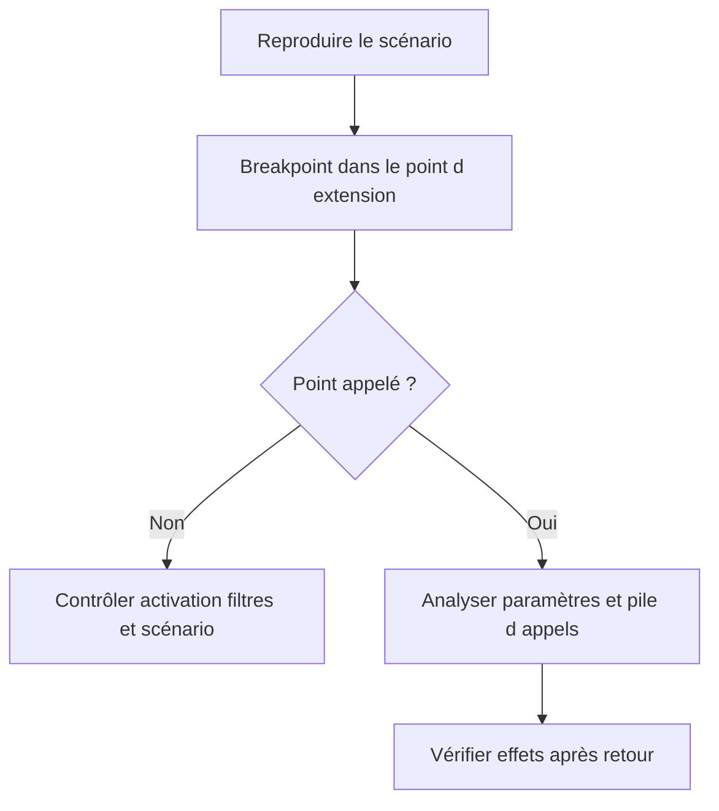

# 23. TRANSPORT, DEBUG, UPGRADE ET BONNES PRATIQUES

## 23.A RÉSULTAT ATTENDU

- Livrer une extension complète et activable
- Diagnostiquer son exécution
- Contrôler les impacts d’un upgrade

## 23.B TRANSPORT

Vérifier la présence de tous les objets :

- projet `CMOD`[^outil-cmod] et includes client ;
- implémentation BAdI[^terme-acro-badi] et classe[^terme-classe] associée ;
- enhancement implementation et éléments ;
- objets DDIC[^terme-acro-ddic] ;
- sous-écrans et textes ;
- Customizing[^terme-customizing] BTE[^terme-acro-bte] ou valeurs de filtre ;
- classe de service et classe de messages.

Les objets Workbench et Customizing peuvent appartenir à des ordres distincts. Définir leur ordre d’import.

## 23.C DEBUG



Pour un point appelé en update task[^terme-update-task], RFC[^terme-rfc] ou job[^terme-job], utiliser le type de breakpoint[^terme-breakpoint] adapté et les outils de surveillance correspondants.

## 23.D UPGRADE

`SPAU_ENH`[^outil-spau-enh] et l’Enhancement Information System permettent d’identifier les enhancements nécessitant une analyse ou un ajustement. Une implémentation active peut rester syntaxiquement valide tout en devenant fonctionnellement incorrecte après modification du standard.

Contrôler particulièrement :

- enhancement sections ;
- options implicites ;
- overwrite-methods ;
- dépendances à des variables locales ;
- interfaces BAdI modifiées ;
- customer exits remplacés ou migrés.

## 23.E CHECKLIST

- [ ] Extension publiée privilégiée avant une option implicite
- [ ] Point d’appel prouvé par debug
- [ ] Contrat et contexte transactionnel documentés
- [ ] Aucun commit caché
- [ ] Logique déléguée à une classe client
- [ ] Activation et désactivation testées
- [ ] Filtres et multiplicités vérifiés
- [ ] Effets de bord et performance mesurés
- [ ] Tous les objets et Customizing transportés
- [ ] Cas d’erreur et rollback testés
- [ ] Contrôle `SPAU_ENH` prévu après upgrade
- [ ] Documentation technique reliée au besoin métier

## 23.F PROCESS

### 23.F.1 ÉTAPE 1 — INVENTORIER L’EXTENSION COMPLÈTE

Lister le point standard, le projet CMOD ou l’implémentation, les classes, includes, objets DDIC, écrans, filtres et paramétrages. Relever le package[^terme-package], les demandes et les dépendances. Une activation locale réussie ne prouve pas que l’ensemble est transportable.

### 23.F.2 ÉTAPE 2 — CONTRÔLER L’ORDRE DE TRANSPORT

Placer les domaines, éléments de données et append structures avant le code et les écrans qui les référencent. Inclure les objets d’implémentation et le paramétrage d’activation requis. Vérifier le contenu des demandes dans `SE09`[^outil-se09] ou `SE10`[^outil-se10] avant libération.

### 23.F.3 ÉTAPE 3 — PROUVER L’APPEL PAR DEBUG

Dans le système source, poser un breakpoint dans l’implémentation et reproduire un scénario identifié. Conserver la pile, les paramètres, les filtres et le résultat. Après import, répéter la même preuve avec les mêmes caractéristiques fonctionnelles.

### 23.F.4 ÉTAPE 4 — DIAGNOSTIQUER UNE EXTENSION NON APPELÉE

Contrôler successivement le point d’appel standard, le statut actif, le projet ou produit, les filtres, le mandant[^terme-mandant] et la version de l’objet. Comparer les implémentations présentes entre systèmes. Ne modifier le code qu’après avoir isolé le niveau où la sélection échoue.

### 23.F.5 ÉTAPE 5 — TRAITER LA MISE À NIVEAU

Après upgrade ou support package, examiner les ajustements d’enhancements dans les outils prévus, notamment `SPAU_ENH` lorsque le système l’utilise. Comparer le contexte source, les signatures et les implémentations standard nouvelles. Réévaluer chaque option implicite, section et overwrite.

### 23.F.6 ÉTAPE 6 — EXÉCUTER LA NON-RÉGRESSION

Tester le cas cible, les cas exclus, les filtres, les erreurs, la LUW[^terme-acro-luw] et les performances. Vérifier qu’aucune correction standard nouvelle n’est masquée. Documenter la version testée, les objets ajustés et la décision de conserver, adapter ou retirer l’extension.

## 23.G VÉRIFICATION

- L’implémentation ou le projet est actif et transporté dans le bon ordre.
- Un breakpoint confirme que le point d’extension est appelé dans le scénario visé.
- Le comportement standard reste inchangé hors du périmètre fonctionnel prévu.
- Aucune modification directe d’un objet SAP[^terme-acro-sap] standard n’a été créée.

## 23.H ERREURS FRÉQUENTES

- Choisir le premier exit trouvé sans vérifier le moment exact de l’appel.
- Créer plusieurs implémentations concurrentes sans règles de filtre.

## 23.I FICHE DE CONTRÔLE À COPIER

```text
Système / SID       :
Mandant             :
Utilisateur         :
Transaction / outil :
Objet technique     :
Jeu de données      :
Résultat attendu    :
Résultat observé    :
Horodatage          :
Ordre de transport  :
```

## 23.J TERMES DU LEXIQUE

- [BAdI](<../🧩 00 ├── LEXIQUE SAP ET ABAP/10 └── ACRONYMES SAP.md#acro-badi>)
- [BTE](<../🧩 00 ├── LEXIQUE SAP ET ABAP/10 └── ACRONYMES SAP.md#acro-bte>)
- [Objet Repository](<../🧩 00 ├── LEXIQUE SAP ET ABAP/03 ├── REPOSITORY PACKAGES ET TRANSPORTS.md#objet-repository>)

## 23.K RÉFÉRENCES OFFICIELLES SAP

- [Performing Adjustments — SAP Help Portal](https://help.sap.com/docs/ABAP_PLATFORM_NEW/46a2cfc13d25463b8b9a3d2a3c3ba0d9/f8ec104259a2e62ce10000000a1550b0.html)
- [Enhancement Information System — SAP Help Portal](https://help.sap.com/docs/SAP_NETWEAVER_750/46a2cfc13d25463b8b9a3d2a3c3ba0d9/29503e423a95b36be10000000a155106.html)
- [Enhancement Framework — SAP Help Portal](https://help.sap.com/docs/SAP_S4HANA_ON-PREMISE/e322becd165844e5868e590bc8efafaf/949cdc40132a8531e10000000a1550b0.html)
- [Adjusting Classes, Interfaces and Function Groups — SAP Help Portal](https://help.sap.com/docs/ABAP_PLATFORM_NEW/46a2cfc13d25463b8b9a3d2a3c3ba0d9/4640793345962f8fe10000000a1553f6.html)

[^terme-acro-badi]: **BADI.** Business Add-In, mécanisme d’extension orienté objet du standard SAP. Voir [l’entrée du lexique](<../🧩 00 ├── LEXIQUE SAP ET ABAP/10 └── ACRONYMES SAP.md#acro-badi>).
[^terme-classe]: **CLASSE.** Modèle orienté objet définissant état et comportements. Voir [l’entrée du lexique](<../🧩 00 ├── LEXIQUE SAP ET ABAP/04 ├── LANGAGE ET DEVELOPPEMENT ABAP.md#classe>).
[^terme-acro-ddic]: **DDIC.** Data Dictionary, abréviation courante de l’ABAP Dictionary. Voir [l’entrée du lexique](<../🧩 00 ├── LEXIQUE SAP ET ABAP/10 └── ACRONYMES SAP.md#acro-ddic>).
[^terme-customizing]: **CUSTOMIZING.** Paramétrage permettant d’adapter le comportement standard SAP à l’organisation. Voir [l’entrée du lexique](<../🧩 00 ├── LEXIQUE SAP ET ABAP/09 ├── NOTIONS FONCTIONNELLES ET ORGANISATIONNELLES.md#customizing>).
[^terme-acro-bte]: **BTE.** Business Transaction Event, mécanisme d’extension utilisé notamment dans certains domaines financiers. Voir [l’entrée du lexique](<../🧩 00 ├── LEXIQUE SAP ET ABAP/10 └── ACRONYMES SAP.md#acro-bte>).
[^terme-update-task]: **UPDATE TASK.** Mécanisme différant des mises à jour pour les exécuter lors du `COMMIT WORK` dans des processus de mise à jour. Voir [l’entrée du lexique](<../🧩 00 ├── LEXIQUE SAP ET ABAP/08 ├── EXECUTION EXPLOITATION ET ADMINISTRATION.md#update-task>).
[^terme-rfc]: **RFC.** Remote Function Call, mécanisme permettant d’appeler un module fonction compatible dans un autre contexte ou système. Voir [l’entrée du lexique](<../🧩 00 ├── LEXIQUE SAP ET ABAP/06 ├── PROGRAMMES CLASSES ET OBJETS TECHNIQUES.md#rfc>).
[^terme-job]: **JOB.** Traitement planifié en arrière-plan composé d’une ou plusieurs étapes. Voir [l’entrée du lexique](<../🧩 00 ├── LEXIQUE SAP ET ABAP/06 ├── PROGRAMMES CLASSES ET OBJETS TECHNIQUES.md#job>).
[^terme-breakpoint]: **BREAKPOINT.** Point d’arrêt suspendant l’exécution dans le débogueur. Voir [l’entrée du lexique](<../🧩 00 ├── LEXIQUE SAP ET ABAP/08 ├── EXECUTION EXPLOITATION ET ADMINISTRATION.md#breakpoint>).
[^terme-package]: **PACKAGE.** Conteneur logique qui regroupe les objets de développement et détermine notamment leur transportabilité. Voir [l’entrée du lexique](<../🧩 00 ├── LEXIQUE SAP ET ABAP/03 ├── REPOSITORY PACKAGES ET TRANSPORTS.md#package>).
[^terme-mandant]: **MANDANT.** Subdivision logique d’un système SAP. Il est identifié par un numéro à trois chiffres et isole une partie des données, du paramétrage et des utilisateurs. Voir [l’entrée du lexique](<../🧩 00 ├── LEXIQUE SAP ET ABAP/01 ├── SYSTEMES ENVIRONNEMENTS ET MANDANTS.md#mandant>).
[^terme-acro-luw]: **LUW.** Logical Unit of Work. Voir [l’entrée du lexique](<../🧩 00 ├── LEXIQUE SAP ET ABAP/10 └── ACRONYMES SAP.md#acro-luw>).
[^terme-acro-sap]: **SAP.** Nom de l’éditeur et de son écosystème logiciel ; l’acronyme historique provient de l’allemand. Voir [l’entrée du lexique](<../🧩 00 ├── LEXIQUE SAP ET ABAP/10 └── ACRONYMES SAP.md#acro-sap>).

[^outil-cmod]: **CMOD.** Transaction de gestion des projets d’extensions client classiques. Voir [le chapitre associé](<07 ├── CREER ET ACTIVER UN PROJET CMOD.md>).
[^outil-spau-enh]: **SPAU_ENH.** Outil d’ajustement des enhancements après une mise à niveau du système. Voir [le chapitre associé](<23 └── TRANSPORT DEBUG UPGRADE ET BONNES PRATIQUES.md>).
[^outil-se09]: **SE09.** Transaction de l’Organisateur de transports utilisée pour consulter et gérer les ordres et tâches de transport. Voir [le chapitre associé](<../🧩 01 ├── FONDAMENTAUX ABAP/03 ├── PACKAGES ET ORDRES DE TRANSPORT.md>).
[^outil-se10]: **SE10.** Transaction de l’Organisateur de transports utilisée pour consulter et gérer les ordres et tâches de transport. Voir [le chapitre associé](<../🧩 01 ├── FONDAMENTAUX ABAP/03 ├── PACKAGES ET ORDRES DE TRANSPORT.md>).
