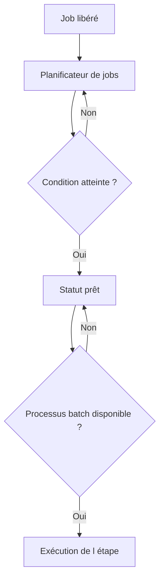

# 2. ARCHITECTURE ET PROCESSUS DE TRAVAIL BATCH

## 2.A RÉSULTAT ATTENDU

- Comprendre où un job[^terme-job] est exécuté
- Identifier le rôle du planificateur et des processus de travail[^terme-processus-travail]
- Expliquer pourquoi un job peut attendre après son heure théorique

## 2.B ARCHITECTURE SIMPLIFIÉE



Les processus de travail de fond sont configurés sur les serveurs d’application. Un job prêt peut rester en attente si aucune ressource compatible n’est disponible ou si des jobs de priorité supérieure doivent être servis.

## 2.C SERVEUR CIBLE

Un job peut être affecté à un serveur d’application[^terme-fichier-serveur-application] précis. Cette contrainte doit rester exceptionnelle : elle réduit les possibilités de répartition de charge et peut empêcher le démarrage si le serveur est indisponible.

Un serveur cible est justifié seulement lorsqu’une dépendance technique l’impose, par exemple :

- accès à une ressource locale au serveur ;
- commande externe installée sur un hôte précis ;
- configuration Basis spécifique ;
- contrainte explicitement documentée par SAP[^terme-acro-sap].

## 2.D OUTILS D’ANALYSE

- `SM37`[^outil-sm37] : statut et serveur d’exécution du job ;
- `SM50`[^outil-sm50] : processus de travail de l’instance courante ;
- `SM51`[^outil-sm51] : liste des serveurs d’application ;
- `RZ04` : modes d’exploitation et répartition des processus ;
- `SM21`[^outil-sm21] : journal système.

## 2.E PROCESS

### 2.E.1 ÉTAPE 1 — IDENTIFIER L’EXÉCUTION ET LE SERVEUR

Dans `SM37`, ouvrir le job et relever l’heure, l’étape, le statut et le serveur d’exécution. Distinguer l’attente de planification, l’attente d’un processus batch et l’exécution réelle. Ne pas attribuer un retard au programme avant son démarrage effectif.

### 2.E.2 ÉTAPE 2 — CONTRÔLER LE PROGRAMME DE L’ÉTAPE

Relever le programme, la variante, l’utilisateur et la classe[^terme-classe]. Vérifier si l’étape appelle un programme ABAP[^terme-abap], une commande externe ou un programme externe. Chaque type utilise un contexte et des autorisations différents.

### 2.E.3 ÉTAPE 3 — EXAMINER LA DISPONIBILITÉ BATCH

Avec les outils d’administration autorisés, contrôler les processus de travail batch disponibles sur le serveur et les groupes de serveurs définis. Corréler leur occupation avec l’heure prévue du job. Une absence de capacité doit être traitée avec Basis, pas contournée dans le code.

### 2.E.4 ÉTAPE 4 — DISTINGUER TEMPS D’ATTENTE ET TEMPS D’EXÉCUTION

Comparer l’heure prévue, l’heure de début et l’heure de fin dans `SM37`. Calculer séparément le retard de démarrage et la durée du programme. Utiliser ensuite le journal, le spool[^terme-spool] ou une trace[^terme-trace] ciblée uniquement pour la partie réellement lente.

### 2.E.5 ÉTAPE 5 — VÉRIFIER LES CONTRAINTES DE CIBLAGE

Contrôler la classe de job, le serveur cible, le groupe de serveurs et les restrictions d’exploitation. Vérifier qu’un ciblage trop étroit ne force pas le job à attendre une ressource indisponible. Toute modification de capacité ou de classe relève de la gouvernance Basis.

### 2.E.6 ÉTAPE 6 — REPRODUIRE ET MESURER

Planifier une exécution contrôlée avec les mêmes caractéristiques et un volume représentatif. Conserver les horodatages, le serveur et les ressources. Comparer avant/après correction sans mélanger un gain de capacité système et une optimisation du programme ABAP.

## 2.F VÉRIFICATION

- Le job apparaît dans `SM37` avec le statut attendu.
- Le journal ne contient pas de message d’erreur non traité.
- Le spool, le fichier ou le journal applicatif contient le résultat attendu.
- Une relance contrôlée ne crée pas de doublon métier.

## 2.G ERREURS FRÉQUENTES

- Planifier un job avec l’utilisateur personnel d’un développeur.
- Relancer un job non idempotent après un échec partiel.

## 2.H FICHE DE CONTRÔLE À COPIER

```text
Système / SID       :
Mandant             :
Utilisateur         :
Transaction / outil :
Objet technique     :
Jeu de données      :
Résultat attendu    :
Résultat observé    :
Horodatage          :
Ordre de transport  :
```

## 2.I TERMES DU LEXIQUE

- [Processus de travail](<../🧩 00 ├── LEXIQUE SAP ET ABAP/08 ├── EXECUTION EXPLOITATION ET ADMINISTRATION.md#processus-travail>)
- [Job](<../🧩 00 ├── LEXIQUE SAP ET ABAP/06 ├── PROGRAMMES CLASSES ET OBJETS TECHNIQUES.md#job>)
- [Spool](<../🧩 00 ├── LEXIQUE SAP ET ABAP/06 ├── PROGRAMMES CLASSES ET OBJETS TECHNIQUES.md#spool>)
- [Processus background](<../🧩 00 ├── LEXIQUE SAP ET ABAP/08 ├── EXECUTION EXPLOITATION ET ADMINISTRATION.md#processus-background>)
- [Variante](<../🧩 00 ├── LEXIQUE SAP ET ABAP/06 ├── PROGRAMMES CLASSES ET OBJETS TECHNIQUES.md#variante>)

## 2.J RÉFÉRENCES OFFICIELLES SAP

- [Background Work Processes — SAP Help Portal](https://help.sap.com/docs/ABAP_PLATFORM_NEW/b07e7195f03f438b8e7ed273099d74f3/4b2b3c3e8eb51780e10000000a42189c.html)
- [Job Start Management — SAP Help Portal](https://help.sap.com/docs/ABAP_PLATFORM_NEW/b07e7195f03f438b8e7ed273099d74f3/4b2bc0094c594ba2e10000000a42189c.html)

---

[Chapitre suivant — JOBS ET ÉTAPES DE JOB](<./03 ├── JOBS ET ETAPES DE JOB.md>)

[^terme-job]: **JOB.** Traitement planifié en arrière-plan composé d’une ou plusieurs étapes. Voir [l’entrée du lexique](<../🧩 00 ├── LEXIQUE SAP ET ABAP/06 ├── PROGRAMMES CLASSES ET OBJETS TECHNIQUES.md#job>).
[^terme-processus-travail]: **PROCESSUS DE TRAVAIL.** Processus serveur exécutant une catégorie de traitement ABAP. Voir [l’entrée du lexique](<../🧩 00 ├── LEXIQUE SAP ET ABAP/08 ├── EXECUTION EXPLOITATION ET ADMINISTRATION.md#processus-travail>).
[^terme-fichier-serveur-application]: **SERVEUR D’APPLICATION.** Emplacement du backend où un programme ABAP peut lire ou écrire avec `OPEN DATASET`. Voir [l’entrée du lexique](<../🧩 00 ├── LEXIQUE SAP ET ABAP/07 ├── INTERFACES ET INTEGRATION.md#fichier-serveur-application>).
[^terme-acro-sap]: **SAP.** Nom de l’éditeur et de son écosystème logiciel ; l’acronyme historique provient de l’allemand. Voir [l’entrée du lexique](<../🧩 00 ├── LEXIQUE SAP ET ABAP/10 └── ACRONYMES SAP.md#acro-sap>).
[^terme-classe]: **CLASSE.** Modèle orienté objet définissant état et comportements. Voir [l’entrée du lexique](<../🧩 00 ├── LEXIQUE SAP ET ABAP/04 ├── LANGAGE ET DEVELOPPEMENT ABAP.md#classe>).
[^terme-abap]: **ABAP.** Langage de programmation de la plateforme ABAP, conçu pour développer des applications métier et techniques SAP. Voir [l’entrée du lexique](<../🧩 00 ├── LEXIQUE SAP ET ABAP/04 ├── LANGAGE ET DEVELOPPEMENT ABAP.md#abap>).
[^terme-spool]: **SPOOL.** Infrastructure stockant et acheminant les sorties imprimables produites par les traitements SAP. Voir [l’entrée du lexique](<../🧩 00 ├── LEXIQUE SAP ET ABAP/06 ├── PROGRAMMES CLASSES ET OBJETS TECHNIQUES.md#spool>).
[^terme-trace]: **TRACE.** Enregistrement détaillé d’événements techniques pour analyser exécution, SQL ou appels. Voir [l’entrée du lexique](<../🧩 00 ├── LEXIQUE SAP ET ABAP/08 ├── EXECUTION EXPLOITATION ET ADMINISTRATION.md#trace>).

[^outil-sm37]: **SM37.** Transaction de recherche, surveillance et administration des jobs d’arrière-plan. Voir [le chapitre associé](<15 ├── SURVEILLER LES JOBS AVEC SM37.md>).
[^outil-sm50]: **SM50.** Transaction de surveillance des processus de travail de l’instance SAP courante. Voir [le chapitre associé](<02 ├── ARCHITECTURE ET PROCESSUS DE TRAVAIL BATCH.md>).
[^outil-sm51]: **SM51.** Transaction présentant les instances actives d’un système SAP. Voir [le chapitre associé](<02 ├── ARCHITECTURE ET PROCESSUS DE TRAVAIL BATCH.md>).
[^outil-sm21]: **SM21.** Transaction de consultation du journal système SAP. Voir [le chapitre associé](<22 ├── ANALYSER LES ECHECS ET LES RETARDS.md>).
