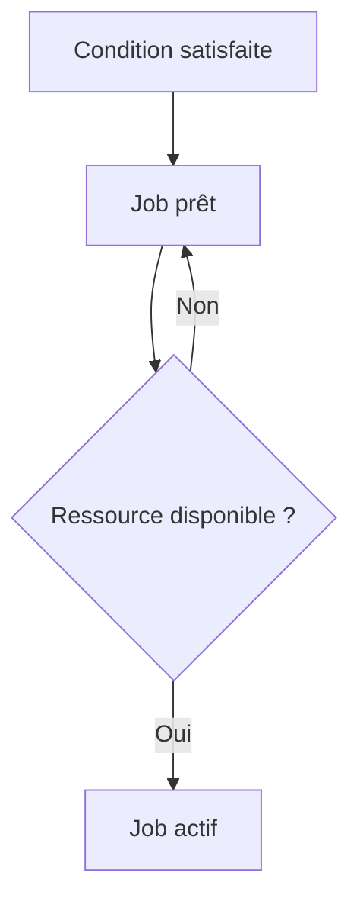

# 7. CONDITIONS DE DÉMARRAGE

## 7.A RÉSULTAT ATTENDU

- Choisir un déclencheur adapté
- Comprendre la différence entre heure prévue et heure réelle
- Éviter les chaînes fragiles basées uniquement sur l’heure

## 7.B TYPES DE CONDITIONS

| Condition           | Usage                                          |
| ------------------- | ---------------------------------------------- |
| Immédiat            | Exécution dès que possible après libération    |
| Date et heure       | Traitement planifié à un instant donné         |
| Après job[^terme-job]           | Dépendance avec un job prédécesseur            |
| Après événement     | Démarrage lié à un signal technique ou métier  |
| Mode d’exploitation | Démarrage lors de l’activation d’un mode donné |

## 7.C HEURE THÉORIQUE ET HEURE RÉELLE

La condition rend le job **éligible**. Elle ne garantit pas un démarrage exactement à la seconde prévue. Le job peut attendre :

- un processus de fond disponible ;
- la fin d’un job prioritaire ;
- la disponibilité du serveur cible ;
- la résolution d’un problème système.



## 7.D DATE LIMITE

Une date ou fenêtre limite peut empêcher le démarrage tardif d’un traitement devenu inutile ou dangereux. Elle doit être définie selon les exigences métier, pas seulement pour masquer un problème de capacité.

## 7.E PROCESS

### 7.E.1 ÉTAPE 1 — TRADUIRE LE BESOIN EN DÉCLENCHEUR

Déterminer si le job doit partir dès sa libération, à une date, après un autre job, après un événement ou après une opération. Définir aussi la règle en cas de retard, d’échec du prédécesseur ou d’événement reçu plusieurs fois.

### 7.E.2 ÉTAPE 2 — VÉRIFIER LES PRÉREQUIS

Pour une date, confirmer le fuseau et le calendrier. Pour une dépendance, relever le nom exact et la condition de fin du job précédent. Pour un événement, vérifier sa définition dans `SM62`[^outil-sm62] et le paramètre attendu.

### 7.E.3 ÉTAPE 3 — MAINTENIR LA CONDITION DANS `SM36`

Ouvrir les conditions de démarrage du job et sélectionner le type convenu. Renseigner uniquement les champs nécessaires. Pour une condition périodique, activer la périodicité et définir son intervalle après avoir contrôlé la première date.

### 7.E.4 ÉTAPE 4 — ENREGISTRER ET CONTRÔLER LE STATUT

Enregistrer le job puis le rechercher dans `SM37`[^outil-sm37]. Vérifier qu’il est libéré et que l’heure ou le déclencheur affiché correspond au contrat. Un statut planifié sans condition complète nécessite une correction avant exploitation.

### 7.E.5 ÉTAPE 5 — TESTER LE DÉCLENCHEMENT

Dans un environnement[^terme-environnement] de test, produire la date, la fin de job ou l’événement attendu. Relever l’heure de réception et l’heure réelle de début. Vérifier qu’un paramètre d’événement incorrect ou un prédécesseur en erreur ne déclenche pas silencieusement le traitement.

### 7.E.6 ÉTAPE 6 — TESTER LES CAS DE RETARD ET DE DOUBLON

Simuler une indisponibilité de processus batch, un déclencheur répété et un job déjà actif. Vérifier la règle de non-chevauchement et l’idempotence. Documenter l’action opérationnelle attendue plutôt que de laisser plusieurs instances concurrentes traiter le même périmètre.

## 7.F VÉRIFICATION

- Le job apparaît dans `SM37` avec le statut attendu.
- Le journal ne contient pas de message d’erreur non traité.
- Le spool[^terme-spool], le fichier ou le journal applicatif contient le résultat attendu.
- Une relance contrôlée ne crée pas de doublon métier.

## 7.G ERREURS FRÉQUENTES

- Planifier un job avec l’utilisateur personnel d’un développeur.
- Relancer un job non idempotent après un échec partiel.

## 7.H FICHE DE CONTRÔLE À COPIER

```text
Système / SID       :
Mandant             :
Utilisateur         :
Transaction / outil :
Objet technique     :
Jeu de données      :
Résultat attendu    :
Résultat observé    :
Horodatage          :
Ordre de transport  :
```

## 7.I TERMES DU LEXIQUE

- [Job](<../🧩 00 ├── LEXIQUE SAP ET ABAP/06 ├── PROGRAMMES CLASSES ET OBJETS TECHNIQUES.md#job>)
- [Spool](<../🧩 00 ├── LEXIQUE SAP ET ABAP/06 ├── PROGRAMMES CLASSES ET OBJETS TECHNIQUES.md#spool>)
- [Processus background](<../🧩 00 ├── LEXIQUE SAP ET ABAP/08 ├── EXECUTION EXPLOITATION ET ADMINISTRATION.md#processus-background>)
- [Variante](<../🧩 00 ├── LEXIQUE SAP ET ABAP/06 ├── PROGRAMMES CLASSES ET OBJETS TECHNIQUES.md#variante>)

## 7.J RÉFÉRENCES OFFICIELLES SAP

- [Specifying Job Start Conditions — SAP Help Portal](https://help.sap.com/docs/ABAP_PLATFORM_NEW/b07e7195f03f438b8e7ed273099d74f3/4b2b2b4a365474fee10000000a421937.html)
- [Job Start Management — SAP Help Portal](https://help.sap.com/docs/ABAP_PLATFORM_NEW/b07e7195f03f438b8e7ed273099d74f3/4b2bc0094c594ba2e10000000a42189c.html)

---

[Chapitre suivant — CLASSES DE JOB, PRIORITÉS ET SERVEUR CIBLE](<./08 ├── CLASSES DE JOB PRIORITES ET SERVEUR CIBLE.md>)

[^terme-job]: **JOB.** Traitement planifié en arrière-plan composé d’une ou plusieurs étapes. Voir [l’entrée du lexique](<../🧩 00 ├── LEXIQUE SAP ET ABAP/06 ├── PROGRAMMES CLASSES ET OBJETS TECHNIQUES.md#job>).
[^terme-environnement]: **ENVIRONNEMENT.** Rôle fonctionnel attribué à un système dans le cycle de vie : développement, test, recette, préproduction ou production. Voir [l’entrée du lexique](<../🧩 00 ├── LEXIQUE SAP ET ABAP/01 ├── SYSTEMES ENVIRONNEMENTS ET MANDANTS.md#environnement>).
[^terme-spool]: **SPOOL.** Infrastructure stockant et acheminant les sorties imprimables produites par les traitements SAP. Voir [l’entrée du lexique](<../🧩 00 ├── LEXIQUE SAP ET ABAP/06 ├── PROGRAMMES CLASSES ET OBJETS TECHNIQUES.md#spool>).

[^outil-sm62]: **SM62.** Transaction de définition des événements utilisables par les traitements d’arrière-plan. Voir [le chapitre associé](<11 ├── EVENEMENTS DE FOND SM62 ET SM64.md>).
[^outil-sm37]: **SM37.** Transaction de recherche, surveillance et administration des jobs d’arrière-plan. Voir [le chapitre associé](<15 ├── SURVEILLER LES JOBS AVEC SM37.md>).
