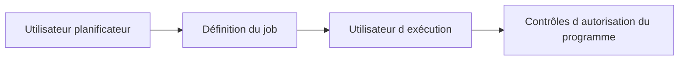

# 14. UTILISATEUR D’EXÉCUTION ET AUTORISATIONS

## 14.A RÉSULTAT ATTENDU

- Comprendre sous quelle identité une étape s’exécute
- Identifier les principaux objets d’autorisation
- Éviter les comptes techniques surdimensionnés

## 14.B UTILISATEUR D’EXÉCUTION

Chaque étape possède un utilisateur dont les autorisations sont utilisées pendant l’exécution. Le planificateur et l’utilisateur d’exécution peuvent être différents.



## 14.C OBJETS PRINCIPAUX

| Objet        | Usage général                                                                      |
| ------------ | ---------------------------------------------------------------------------------- |
| `S_BTCH_JOB` | Actions sur les jobs, notamment libération ou gestion selon les valeurs autorisées |
| `S_BTCH_NAM` | Autoriser l’affectation d’un autre utilisateur d’exécution                         |
| `S_BTCH_ADM` | Administration étendue du traitement de fond                                       |
| `S_PROGRAM`  | Autorisation d’exécuter des groupes de programmes protégés                         |
| `S_RZL_ADM`  | Certaines opérations d’administration, notamment liées aux programmes externes     |

Les champs et valeurs exacts doivent être analysés dans `SU21`[^outil-su21] et via la documentation de l’objet sur le système cible.

## 14.D COMPTE TECHNIQUE

Un compte batch doit :

- être nominativement ou fonctionnellement identifié ;
- disposer du minimum d’autorisations ;
- ne pas être un super[^terme-super-reference]-utilisateur ;
- avoir une gestion de mot de passe et de verrouillage adaptée à son type ;
- être surveillé et documenté ;
- être remplacé proprement lors d’un changement d’organisation.

## 14.E DIAGNOSTIC

Un job[^terme-job] peut être planifié avec succès puis échouer à l’exécution pour défaut d’autorisation. Examiner le journal, `SU53`[^outil-su53] lorsque le contexte le permet, et les traces `STAUTHTRACE`[^outil-stauthtrace] ou `ST01`[^outil-st01] selon la procédure de sécurité.

## 14.F PROCESS

### 14.F.1 ÉTAPE 1 — IDENTIFIER LES DEUX UTILISATEURS

Dans `SM37`[^outil-sm37], ouvrir le job et relever son créateur puis l’utilisateur de chaque étape. Distinguer les droits nécessaires pour planifier ou libérer le job de ceux nécessaires au programme métier exécuté.

### 14.F.2 ÉTAPE 2 — REPRODUIRE SOUS L’IDENTITÉ D’EXÉCUTION

Utiliser une exécution de test planifiée avec le même utilisateur technique et la même variante. Une exécution réussie sous le compte du développeur ne valide pas les autorisations batch.

### 14.F.3 ÉTAPE 3 — LOCALISER LE CONTRÔLE REFUSÉ

Lire le journal de job et les messages applicatifs. Déclencher une trace[^terme-trace] d’autorisations ciblée selon la procédure sécurité, par exemple `STAUTHTRACE` ou `ST01`, sur l’utilisateur et l’intervalle exacts. Relever l’objet, les champs et les valeurs refusés.

### 14.F.4 ÉTAPE 4 — CLASSER L’AUTORISATION

Déterminer si le refus concerne la gestion du job (`S_BTCH_*`), l’exécution du programme (`S_PROGRAM`) ou l’opération métier réalisée par le report. Ne pas ajouter une autorisation d’administration batch pour résoudre un contrôle métier.

### 14.F.5 ÉTAPE 5 — CORRIGER LE RÔLE MINIMAL

Transmettre à l’équipe sécurité la preuve du contrôle et les valeurs strictement requises. Éviter les profils larges et les comptes personnels. Faire transporter ou appliquer le rôle selon la gouvernance, puis fermer la trace.

### 14.F.6 ÉTAPE 6 — REJOUER LE MÊME JOB

Planifier à nouveau avec le même programme, la même variante et le même utilisateur. Vérifier le résultat métier et l’absence de nouveaux refus. Conserver le job, l’horodatage et la trace comme preuve de la correction.

## 14.G VÉRIFICATION

- Le scénario reproduit correspond au même utilisateur, mandant[^terme-mandant], transaction et jeu de données.
- L’horodatage et l’identifiant de l’analyse sont conservés.
- La cause retenue est soutenue par une ligne source, une trace ou une valeur observée.
- Après correction, le même scénario ne reproduit plus le défaut et le résultat métier reste identique.

## 14.H ERREURS FRÉQUENTES

- Planifier un job avec l’utilisateur personnel d’un développeur.
- Relancer un job non idempotent après un échec partiel.

## 14.I FICHE DE CONTRÔLE À COPIER

```text
Système / SID       :
Mandant             :
Utilisateur         :
Transaction / outil :
Objet technique     :
Jeu de données      :
Résultat attendu    :
Résultat observé    :
Horodatage          :
Ordre de transport  :
```

## 14.J TERMES DU LEXIQUE

- [Job](<../🧩 00 ├── LEXIQUE SAP ET ABAP/06 ├── PROGRAMMES CLASSES ET OBJETS TECHNIQUES.md#job>)
- [Spool](<../🧩 00 ├── LEXIQUE SAP ET ABAP/06 ├── PROGRAMMES CLASSES ET OBJETS TECHNIQUES.md#spool>)
- [Processus background](<../🧩 00 ├── LEXIQUE SAP ET ABAP/08 ├── EXECUTION EXPLOITATION ET ADMINISTRATION.md#processus-background>)
- [Variante](<../🧩 00 ├── LEXIQUE SAP ET ABAP/06 ├── PROGRAMMES CLASSES ET OBJETS TECHNIQUES.md#variante>)

## 14.K RÉFÉRENCES OFFICIELLES SAP

- [Roles and Authorizations for Background Processing — SAP Help Portal](https://help.sap.com/docs/ABAP_PLATFORM_NEW/621bb4e3951b4a8ca633ca7ed1c0aba2/4ec48f2468ac35fde10000000a42189e.html)
- [Defining Users for Background Processing — SAP Help Portal](https://help.sap.com/docs/ABAP_PLATFORM_BW4HANA/864321b9b3dd487d94c70f6a007b0397/4ec4b1bd745068b9e10000000a42189e.html)

---

[Chapitre suivant — SURVEILLER LES JOBS AVEC `SM37`](<./15 ├── SURVEILLER LES JOBS AVEC SM37.md>)

[^terme-super-reference]: **SUPER.** Pseudo-référence permettant à une sous-classe d’accéder à l’implémentation héritée de sa super-classe. Voir [l’entrée du lexique](<../🧩 00 ├── LEXIQUE SAP ET ABAP/04 ├── LANGAGE ET DEVELOPPEMENT ABAP.md#super-reference>).
[^terme-job]: **JOB.** Traitement planifié en arrière-plan composé d’une ou plusieurs étapes. Voir [l’entrée du lexique](<../🧩 00 ├── LEXIQUE SAP ET ABAP/06 ├── PROGRAMMES CLASSES ET OBJETS TECHNIQUES.md#job>).
[^terme-trace]: **TRACE.** Enregistrement détaillé d’événements techniques pour analyser exécution, SQL ou appels. Voir [l’entrée du lexique](<../🧩 00 ├── LEXIQUE SAP ET ABAP/08 ├── EXECUTION EXPLOITATION ET ADMINISTRATION.md#trace>).
[^terme-mandant]: **MANDANT.** Subdivision logique d’un système SAP. Il est identifié par un numéro à trois chiffres et isole une partie des données, du paramétrage et des utilisateurs. Voir [l’entrée du lexique](<../🧩 00 ├── LEXIQUE SAP ET ABAP/01 ├── SYSTEMES ENVIRONNEMENTS ET MANDANTS.md#mandant>).

[^outil-su21]: **SU21.** Transaction de création et de maintenance des objets et classes d’autorisation. Voir [le chapitre associé](<../🧩 21 ├── AUTORISATIONS ET SECURITE ABAP/03 ├── CREER UN OBJET D AUTORISATION.md>).
[^outil-su53]: **SU53.** Transaction affichant les derniers contrôles d’autorisation en échec pour l’utilisateur courant. Voir [le chapitre associé](<../🧩 21 ├── AUTORISATIONS ET SECURITE ABAP/02 ├── DIAGNOSTIQUER UN REFUS AVEC SU53 ET STAUTHTRACE.md>).
[^outil-stauthtrace]: **STAUTHTRACE.** Trace d’autorisations utilisée pour enregistrer et analyser les contrôles exécutés pendant un scénario. Voir [le chapitre associé](<../🧩 21 ├── AUTORISATIONS ET SECURITE ABAP/02 ├── DIAGNOSTIQUER UN REFUS AVEC SU53 ET STAUTHTRACE.md>).
[^outil-st01]: **ST01.** Trace système classique pouvant enregistrer notamment les contrôles d’autorisation et certains accès techniques. Voir [le chapitre associé](<../🧩 21 ├── AUTORISATIONS ET SECURITE ABAP/02 ├── DIAGNOSTIQUER UN REFUS AVEC SU53 ET STAUTHTRACE.md>).
[^outil-sm37]: **SM37.** Transaction de recherche, surveillance et administration des jobs d’arrière-plan. Voir [le chapitre associé](<15 ├── SURVEILLER LES JOBS AVEC SM37.md>).
