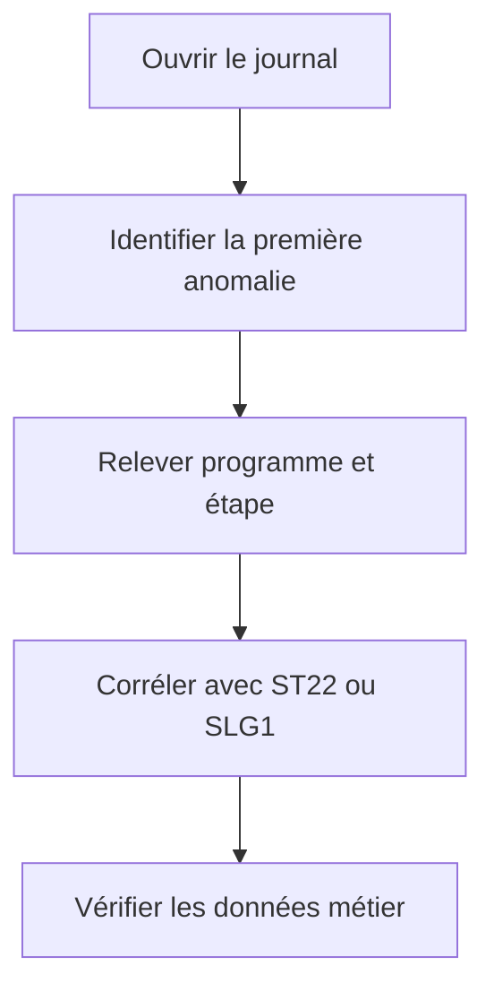

# 17. JOURNAL DE JOB ET MESSAGES

## 17.A RÉSULTAT ATTENDU

- Lire le journal dans l’ordre chronologique
- Distinguer messages système et applicatifs
- Produire des informations exploitables

## 17.B CONTENU

Le journal de job[^terme-job] contient notamment :

- démarrage et fin des étapes ;
- programme et variante ;
- messages du système de traitement de fond ;
- erreurs émises par les programmes ABAP[^terme-abap] ;
- sorties ou erreurs de certains programmes externes ;
- informations de terminaison.

## 17.C ANALYSE



La dernière erreur affichée peut n’être qu’une conséquence. Rechercher le premier message anormal et son contexte.

## 17.D JOURNALISATION APPLICATIVE

Pour un traitement professionnel, enregistrer au minimum :

- identifiant de l’exécution ;
- plage de données ;
- nombre lu, traité, réussi et rejeté ;
- erreurs avec clé métier ;
- durée des phases ;
- statut final métier.

Le Business Application Log[^terme-application-log], consultable avec `SLG1`[^outil-slg1], est souvent plus adapté qu’une longue série de `WRITE` ou de messages génériques.

## 17.E MESSAGES DANGEREUX

Des messages de type `A`, `E` ou certaines exceptions non traitées peuvent provoquer l’annulation du job. Le comportement doit être testé explicitement en arrière-plan.

## 17.F PROCESS

### 17.F.1 ÉTAPE 1 — OUVRIR L’OCCURRENCE EXACTE

Dans `SM37`[^outil-sm37], rechercher le job avec nom, utilisateur et période, puis vérifier l’heure et le numéro. Sélectionner l’occurrence et ouvrir son journal. Ne pas utiliser le journal d’une exécution homonyme comme preuve.

### 17.F.2 ÉTAPE 2 — LIRE LES MESSAGES DANS L’ORDRE

Relever l’heure, le type de message, l’étape et le texte complet. Identifier le dernier message de progression réussi puis la première erreur. Les messages de fin qui suivent peuvent être des conséquences et non la cause initiale.

### 17.F.3 ÉTAPE 3 — RETROUVER LA SOURCE DU MESSAGE

Pour un message de classe[^terme-classe], relever l’identifiant et le numéro puis l’analyser dans `SE91`[^outil-se91]. Pour un texte écrit par le report, localiser l’instruction correspondante. Relier le message au programme et à la variante de l’étape.

### 17.F.4 ÉTAPE 4 — CORRÉLER AVEC LES AUTRES PREUVES

À la même heure et sous le même utilisateur, rechercher un dump dans `ST22`[^outil-st22], une erreur d’update dans `SM13`[^outil-sm13], un log applicatif dans `SLG1` ou un problème de spool[^terme-spool]. N’ouvrir que les outils justifiés par le type d’échec observé.

### 17.F.5 ÉTAPE 5 — AMÉLIORER LA JOURNALISATION DU PROGRAMME

Ajouter des messages avant et après les unités importantes, avec identifiant d’exécution, clé métier et compteurs. Utiliser le journal applicatif pour les traitements nécessitant recherche, regroupement et conservation structurée. Éviter les données sensibles et les milliers de messages identiques.

### 17.F.6 ÉTAPE 6 — VALIDER LE DIAGNOSTIC

Rejouer avec la même variante après correction. Vérifier que la progression atteint l’étape suivante, que le résultat métier est correct et que le journal contient un résumé cohérent : lus, réussis, rejetés et durée.

## 17.G VÉRIFICATION

- Le scénario reproduit correspond au même utilisateur, mandant[^terme-mandant], transaction et jeu de données.
- L’horodatage et l’identifiant de l’analyse sont conservés.
- La cause retenue est soutenue par une ligne source, une trace[^terme-trace] ou une valeur observée.
- Après correction, le même scénario ne reproduit plus le défaut et le résultat métier reste identique.

## 17.H ERREURS FRÉQUENTES

- Planifier un job avec l’utilisateur personnel d’un développeur.
- Relancer un job non idempotent après un échec partiel.

## 17.I FICHE DE CONTRÔLE À COPIER

```text
Système / SID       :
Mandant             :
Utilisateur         :
Transaction / outil :
Objet technique     :
Jeu de données      :
Résultat attendu    :
Résultat observé    :
Horodatage          :
Ordre de transport  :
```

## 17.J TERMES DU LEXIQUE

- [Job](<../🧩 00 ├── LEXIQUE SAP ET ABAP/06 ├── PROGRAMMES CLASSES ET OBJETS TECHNIQUES.md#job>)
- [Spool](<../🧩 00 ├── LEXIQUE SAP ET ABAP/06 ├── PROGRAMMES CLASSES ET OBJETS TECHNIQUES.md#spool>)
- [Processus background](<../🧩 00 ├── LEXIQUE SAP ET ABAP/08 ├── EXECUTION EXPLOITATION ET ADMINISTRATION.md#processus-background>)
- [Variante](<../🧩 00 ├── LEXIQUE SAP ET ABAP/06 ├── PROGRAMMES CLASSES ET OBJETS TECHNIQUES.md#variante>)

## 17.K RÉFÉRENCES OFFICIELLES SAP

- [Displaying a Job Log — SAP Help Portal](https://help.sap.com/docs/ABAP_PLATFORM_NEW/b07e7195f03f438b8e7ed273099d74f3/4b2bbd0f4c594ba2e10000000a42189c.html)
- [Background Processing Function Modules — SAP Help Portal](https://help.sap.com/docs/ABAP_PLATFORM_BW4HANA/7bfe8cdcfbb040dcb6702dada8c3e2f0/4d906689eba36e73e10000000a15822b.html)

---

[Chapitre suivant — SPOOL, SORTIES ET DESTINATAIRES](<./18 ├── SPOOL SORTIES ET DESTINATAIRES.md>)

[^terme-job]: **JOB.** Traitement planifié en arrière-plan composé d’une ou plusieurs étapes. Voir [l’entrée du lexique](<../🧩 00 ├── LEXIQUE SAP ET ABAP/06 ├── PROGRAMMES CLASSES ET OBJETS TECHNIQUES.md#job>).
[^terme-abap]: **ABAP.** Langage de programmation de la plateforme ABAP, conçu pour développer des applications métier et techniques SAP. Voir [l’entrée du lexique](<../🧩 00 ├── LEXIQUE SAP ET ABAP/04 ├── LANGAGE ET DEVELOPPEMENT ABAP.md#abap>).
[^terme-application-log]: **APPLICATION LOG.** Infrastructure BAL permettant de stocker des journaux applicatifs consultables avec `SLG1`. Voir [l’entrée du lexique](<../🧩 00 ├── LEXIQUE SAP ET ABAP/08 ├── EXECUTION EXPLOITATION ET ADMINISTRATION.md#application-log>).
[^terme-classe]: **CLASSE.** Modèle orienté objet définissant état et comportements. Voir [l’entrée du lexique](<../🧩 00 ├── LEXIQUE SAP ET ABAP/04 ├── LANGAGE ET DEVELOPPEMENT ABAP.md#classe>).
[^terme-spool]: **SPOOL.** Infrastructure stockant et acheminant les sorties imprimables produites par les traitements SAP. Voir [l’entrée du lexique](<../🧩 00 ├── LEXIQUE SAP ET ABAP/06 ├── PROGRAMMES CLASSES ET OBJETS TECHNIQUES.md#spool>).
[^terme-mandant]: **MANDANT.** Subdivision logique d’un système SAP. Il est identifié par un numéro à trois chiffres et isole une partie des données, du paramétrage et des utilisateurs. Voir [l’entrée du lexique](<../🧩 00 ├── LEXIQUE SAP ET ABAP/01 ├── SYSTEMES ENVIRONNEMENTS ET MANDANTS.md#mandant>).
[^terme-trace]: **TRACE.** Enregistrement détaillé d’événements techniques pour analyser exécution, SQL ou appels. Voir [l’entrée du lexique](<../🧩 00 ├── LEXIQUE SAP ET ABAP/08 ├── EXECUTION EXPLOITATION ET ADMINISTRATION.md#trace>).

[^outil-slg1]: **SLG1.** Transaction de recherche et d’affichage des journaux applicatifs persistés. Voir [le chapitre associé](<../🧩 19 ├── JOURNAUX APPLICATIFS/05 ├── ANALYSER LES JOURNAUX AVEC SLG1.md>).
[^outil-sm37]: **SM37.** Transaction de recherche, surveillance et administration des jobs d’arrière-plan. Voir [le chapitre associé](<15 ├── SURVEILLER LES JOBS AVEC SM37.md>).
[^outil-se91]: **SE91.** Transaction de création et de maintenance des classes de messages SAP. Voir [le chapitre associé](<../🧩 10 ├── MESSAGES ET GESTION DES ERREURS/02 ├── CLASSES DE MESSAGES ET TRANSACTION SE91.md>).
[^outil-st22]: **ST22.** Transaction d’analyse des terminaisons anormales et dumps ABAP. Voir [le chapitre associé](<../🧩 11 ├── DEBUG ET ANALYSE/13 ├── ANALYSER LES DUMPS AVEC ST22.md>).
[^outil-sm13]: **SM13.** Transaction de surveillance et de reprise des enregistrements de mise à jour SAP. Voir [le chapitre associé](<../🧩 16 ├── LUW VERROUILLAGES ET MISES A JOUR/19 ├── ANALYSER ET REPRENDRE LES UPDATES AVEC SM13.md>).
