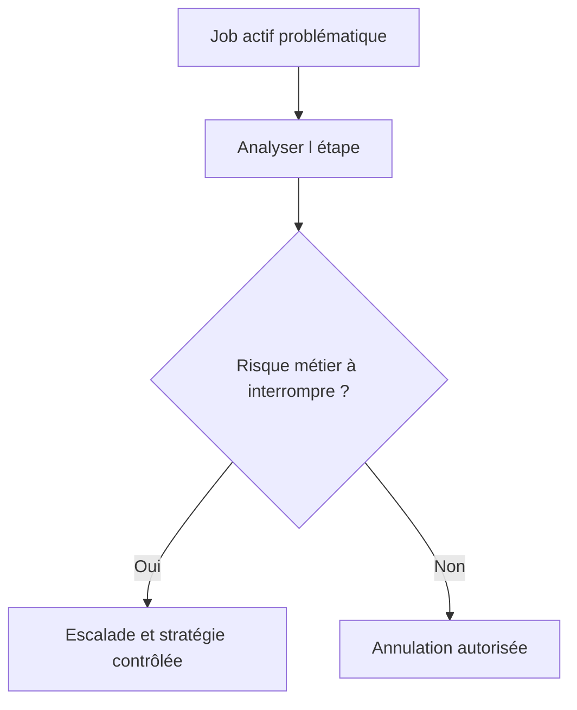

# 19. MODIFIER, COPIER, REPLANIFIER, ANNULER ET SUPPRIMER

## 19.A RÉSULTAT ATTENDU

- Choisir l’action appropriée selon le statut
- Préserver les preuves avant une intervention
- Éviter les modifications non maîtrisées d’une série périodique

## 19.B ACTIONS PRINCIPALES

| Action                | Usage                                                    |
| --------------------- | -------------------------------------------------------- |
| Copier                | Créer une nouvelle définition à partir d’un job[^terme-job] existant |
| Replanifier           | Affecter une nouvelle condition de démarrage             |
| Retirer la libération | Empêcher un job encore modifiable de démarrer            |
| Annuler               | Interrompre un job actif                                 |
| Supprimer             | Retirer une définition ou un historique selon le statut  |

Les actions disponibles dépendent du statut et des autorisations.

## 19.C AVANT D’ANNULER

1. identifier l’étape active ;
2. vérifier si le programme est en phase d’écriture ;
3. rechercher les verrous dans `SM12`[^outil-sm12] ;
4. vérifier les effets externes déjà déclenchés ;
5. déterminer la procédure de reprise ;
6. conserver le journal et les éléments de diagnostic.



## 19.D JOB PÉRIODIQUE

Modifier une occurrence ne modifie pas nécessairement toute la série de la manière attendue. Après intervention, vérifier la prochaine date planifiée et l’existence d’éventuelles occurrences en doublon.

## 19.E PROCESS

### 19.E.1 ÉTAPE 1 — SAUVEGARDER L’ÉTAT INITIAL

Dans `SM37`[^outil-sm37], sélectionner l’occurrence exacte et relever nom, numéro, statut, étapes, variantes, utilisateur, condition et journal. Vérifier l’état métier déjà produit. Toute action de gestion doit rester corrélable au job initial.

### 19.E.2 ÉTAPE 2 — CHOISIR L’ACTION SELON LE STATUT

Modifier ou replanifier un job qui n’a pas encore commencé selon les autorisations. Copier lorsque le job d’origine doit rester comme preuve et qu’une nouvelle définition est nécessaire. Annuler uniquement un job actif dont l’arrêt a été validé par l’exploitation.

### 19.E.3 ÉTAPE 3 — MODIFIER OU COPIER SANS PERDRE LES PARAMÈTRES

Après l’action dans `SM37`, ouvrir le nouveau job et comparer toutes les étapes, variantes, utilisateurs, paramètres de spool[^terme-spool] et conditions. Changer uniquement la cause identifiée. Un job copié peut conserver une variante ou un utilisateur inadapté.

### 19.E.4 ÉTAPE 4 — ANNULER EN CONNAISSANT LES EFFETS

Avant l’annulation, identifier l’étape active et les unités déjà commitées. L’annulation du processus ne restaure pas les données déjà validées ni les effets externes. Prévoir une reprise ou une compensation avant de lancer une nouvelle occurrence.

### 19.E.5 ÉTAPE 5 — SUPPRIMER UNIQUEMENT APRÈS RÉTENTION

Ne supprimer un job ou ses spools qu’après conservation des journaux, identifiants et preuves requises. Vérifier qu’il n’est pas le prédécesseur ou la référence d’une chaîne encore exploitée. Appliquer la politique de rétention plutôt qu’un nettoyage ponctuel non tracé.

### 19.E.6 ÉTAPE 6 — CONTRÔLER LE RÉSULTAT DE L’ACTION

Rechercher de nouveau l’ancien et le nouveau numéro dans `SM37`. Vérifier statut, prochaine exécution et résultat métier. Documenter l’auteur, l’heure, la raison et le lien entre les occurrences.

## 19.F VÉRIFICATION

- Le job apparaît dans `SM37` avec le statut attendu.
- Le journal ne contient pas de message d’erreur non traité.
- Le spool, le fichier ou le journal applicatif contient le résultat attendu.
- Une relance contrôlée ne crée pas de doublon métier.

## 19.G ERREURS FRÉQUENTES

- Planifier un job avec l’utilisateur personnel d’un développeur.
- Relancer un job non idempotent après un échec partiel.

## 19.H FICHE DE CONTRÔLE À COPIER

```text
Système / SID       :
Mandant             :
Utilisateur         :
Transaction / outil :
Objet technique     :
Jeu de données      :
Résultat attendu    :
Résultat observé    :
Horodatage          :
Ordre de transport  :
```

## 19.I TERMES DU LEXIQUE

- [Job](<../🧩 00 ├── LEXIQUE SAP ET ABAP/06 ├── PROGRAMMES CLASSES ET OBJETS TECHNIQUES.md#job>)
- [Spool](<../🧩 00 ├── LEXIQUE SAP ET ABAP/06 ├── PROGRAMMES CLASSES ET OBJETS TECHNIQUES.md#spool>)
- [Processus background](<../🧩 00 ├── LEXIQUE SAP ET ABAP/08 ├── EXECUTION EXPLOITATION ET ADMINISTRATION.md#processus-background>)
- [Variante](<../🧩 00 ├── LEXIQUE SAP ET ABAP/06 ├── PROGRAMMES CLASSES ET OBJETS TECHNIQUES.md#variante>)

## 19.J RÉFÉRENCES OFFICIELLES SAP

- [Managing Jobs from the Job Overview — SAP Help Portal](https://help.sap.com/docs/ABAP_PLATFORM_NEW/b07e7195f03f438b8e7ed273099d74f3/4b2bc2224c594ba2e10000000a42189c.html)
- [Possible Status of Background Jobs — SAP Help Portal](https://help.sap.com/docs/ABAP_PLATFORM_NEW/b07e7195f03f438b8e7ed273099d74f3/4b308aa91dd90a93e10000000a421937.html)

---

[Chapitre suivant — DEBUGGER UN JOB AVEC `JDBG`[^outil-jdbg]](<./20 ├── DEBUGGER UN JOB AVEC JDBG.md>)

[^terme-job]: **JOB.** Traitement planifié en arrière-plan composé d’une ou plusieurs étapes. Voir [l’entrée du lexique](<../🧩 00 ├── LEXIQUE SAP ET ABAP/06 ├── PROGRAMMES CLASSES ET OBJETS TECHNIQUES.md#job>).
[^terme-spool]: **SPOOL.** Infrastructure stockant et acheminant les sorties imprimables produites par les traitements SAP. Voir [l’entrée du lexique](<../🧩 00 ├── LEXIQUE SAP ET ABAP/06 ├── PROGRAMMES CLASSES ET OBJETS TECHNIQUES.md#spool>).

[^outil-sm12]: **SM12.** Transaction de surveillance et d’administration des entrées de verrouillage SAP. Voir [le chapitre associé](<../🧩 16 ├── LUW VERROUILLAGES ET MISES A JOUR/12 ├── ANALYSER LES VERROUS AVEC SM12.md>).
[^outil-sm37]: **SM37.** Transaction de recherche, surveillance et administration des jobs d’arrière-plan. Voir [le chapitre associé](<15 ├── SURVEILLER LES JOBS AVEC SM37.md>).
[^outil-jdbg]: **JDBG.** Commande utilisée depuis SM37 pour démarrer le débogage contrôlé d’un job sélectionné. Voir [le chapitre associé](<20 ├── DEBUGGER UN JOB AVEC JDBG.md>).
