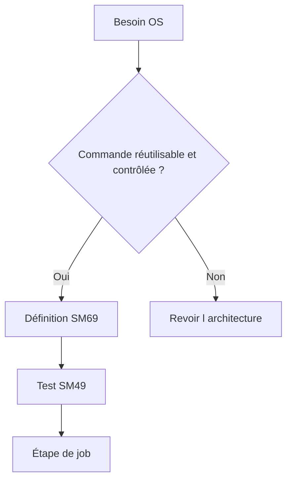

# 21. COMMANDES ET PROGRAMMES EXTERNES

## 21.A RÉSULTAT ATTENDU

- Distinguer commande externe et programme externe
- Utiliser `SM69`[^outil-sm69] et `SM49`[^outil-sm49] de manière sécurisée
- Diagnostiquer les erreurs SAPXPG

## 21.B DISTINCTION

Une **commande externe** est prédéfinie et administrée dans SAP[^terme-acro-sap], généralement avec `SM69`. Un **programme externe** peut être spécifié plus directement et nécessite des autorisations d’administration plus fortes.



## 21.C SÉCURITÉ

Une commande externe peut donner accès au système d’exploitation. Elle doit imposer :

- chemin absolu ou environnement[^terme-environnement] maîtrisé ;
- paramètres autorisés limités ;
- utilisateur OS adapté ;
- interdiction d’injection de commandes ;
- journalisation ;
- restrictions d’autorisation ;
- validation par l’administration Basis et sécurité.

## 21.D OUTILS

- `SM69` : définition des commandes externes ;
- `SM49` : test d’une commande définie ;
- `SM37`[^outil-sm37] : journal de l’étape ;
- trace[^terme-trace] SAPXPG : diagnostic des exécutions externes selon la configuration.

## 21.E ERREURS COURANTES

- exécutable absent sur le serveur cible ;
- droits OS insuffisants ;
- paramètres mal échappés ;
- différence de répertoire ou d’environnement ;
- code retour non nul ;
- sortie d’erreur dans le journal ;
- serveur cible incompatible.

## 21.F PROCESS

### 21.F.1 ÉTAPE 1 — DÉFINIR LE BESOIN AVEC BASIS

Documenter la commande, l’hôte, le compte système, les paramètres autorisés, le répertoire et les codes retour. Écarter tout appel construit librement à partir d’une saisie utilisateur. Une commande externe étend le périmètre de sécurité au système d’exploitation.

### 21.F.2 ÉTAPE 2 — CRÉER OU ANALYSER LA DÉFINITION DANS `SM69`

Utiliser une définition existante validée ou faire créer une commande Z par l’administration. Vérifier le programme externe, les paramètres, les restrictions d’hôte et les contrôles de sécurité. Ne placer aucun secret dans une ligne de commande ou un journal.

### 21.F.3 ÉTAPE 3 — TESTER DE MANIÈRE CONTRÔLÉE

Exécuter la commande avec l’outil d’administration autorisé, notamment `SM49` selon le scénario. Utiliser des paramètres non destructifs et relever sortie, erreur et code retour. Confirmer l’utilisateur système et le répertoire de travail effectifs.

### 21.F.4 ÉTAPE 4 — AJOUTER L’ÉTAPE AU JOB

Dans `SM36`[^outil-sm36], créer une étape de commande ou programme externe en sélectionnant uniquement l’objet défini. Renseigner les paramètres validés, l’utilisateur SAP et la condition de démarrage. Enregistrer puis contrôler le détail de l’étape dans `SM37`.

### 21.F.5 ÉTAPE 5 — TRAITER LE CODE RETOUR ET LES SORTIES

Définir quels codes représentent succès, avertissement ou échec. Conserver la sortie utile dans le journal prévu sans exposer de secret. Un processus lancé avec succès mais retournant une erreur métier ne doit pas être annoncé comme réussi.

### 21.F.6 ÉTAPE 6 — TESTER ÉCHEC ET REPRISE

Simuler un exécutable absent, un droit insuffisant, un paramètre invalide et un timeout. Vérifier l’état métier externe avant relance. La répétition doit être sûre ou protégée par un identifiant transmis au programme externe.

## 21.G VÉRIFICATION

- Le job[^terme-job] apparaît dans `SM37` avec le statut attendu.
- Le journal ne contient pas de message d’erreur non traité.
- Le spool[^terme-spool], le fichier ou le journal applicatif contient le résultat attendu.
- Une relance contrôlée ne crée pas de doublon métier.

## 21.H ERREURS FRÉQUENTES

- Planifier un job avec l’utilisateur personnel d’un développeur.
- Relancer un job non idempotent après un échec partiel.

## 21.I FICHE DE CONTRÔLE À COPIER

```text
Système / SID       :
Mandant             :
Utilisateur         :
Transaction / outil :
Objet technique     :
Jeu de données      :
Résultat attendu    :
Résultat observé    :
Horodatage          :
Ordre de transport  :
```

## 21.J TERMES DU LEXIQUE

- [Job](<../🧩 00 ├── LEXIQUE SAP ET ABAP/06 ├── PROGRAMMES CLASSES ET OBJETS TECHNIQUES.md#job>)
- [Spool](<../🧩 00 ├── LEXIQUE SAP ET ABAP/06 ├── PROGRAMMES CLASSES ET OBJETS TECHNIQUES.md#spool>)
- [Processus background](<../🧩 00 ├── LEXIQUE SAP ET ABAP/08 ├── EXECUTION EXPLOITATION ET ADMINISTRATION.md#processus-background>)
- [Variante](<../🧩 00 ├── LEXIQUE SAP ET ABAP/06 ├── PROGRAMMES CLASSES ET OBJETS TECHNIQUES.md#variante>)

## 21.K RÉFÉRENCES OFFICIELLES SAP

- [External Commands and External Programs — SAP Help Portal](https://help.sap.com/docs/ABAP_PLATFORM_NEW/b07e7195f03f438b8e7ed273099d74f3/4b2bbe5e4c594ba2e10000000a42189c.html)
- [Defining External Commands — SAP Help Portal](https://help.sap.com/docs/ABAP_PLATFORM_NEW/b07e7195f03f438b8e7ed273099d74f3/4b2b3e958eb51780e10000000a42189c.html)
- [Analyzing Problems with External Commands — SAP Help Portal](https://help.sap.com/docs/ABAP_PLATFORM_NEW/b07e7195f03f438b8e7ed273099d74f3/4b272d0ed1341780e10000000a42189c.html)

---

[Chapitre suivant — ANALYSER LES ÉCHECS ET LES RETARDS](<./22 ├── ANALYSER LES ECHECS ET LES RETARDS.md>)

[^terme-acro-sap]: **SAP.** Nom de l’éditeur et de son écosystème logiciel ; l’acronyme historique provient de l’allemand. Voir [l’entrée du lexique](<../🧩 00 ├── LEXIQUE SAP ET ABAP/10 └── ACRONYMES SAP.md#acro-sap>).
[^terme-environnement]: **ENVIRONNEMENT.** Rôle fonctionnel attribué à un système dans le cycle de vie : développement, test, recette, préproduction ou production. Voir [l’entrée du lexique](<../🧩 00 ├── LEXIQUE SAP ET ABAP/01 ├── SYSTEMES ENVIRONNEMENTS ET MANDANTS.md#environnement>).
[^terme-trace]: **TRACE.** Enregistrement détaillé d’événements techniques pour analyser exécution, SQL ou appels. Voir [l’entrée du lexique](<../🧩 00 ├── LEXIQUE SAP ET ABAP/08 ├── EXECUTION EXPLOITATION ET ADMINISTRATION.md#trace>).
[^terme-job]: **JOB.** Traitement planifié en arrière-plan composé d’une ou plusieurs étapes. Voir [l’entrée du lexique](<../🧩 00 ├── LEXIQUE SAP ET ABAP/06 ├── PROGRAMMES CLASSES ET OBJETS TECHNIQUES.md#job>).
[^terme-spool]: **SPOOL.** Infrastructure stockant et acheminant les sorties imprimables produites par les traitements SAP. Voir [l’entrée du lexique](<../🧩 00 ├── LEXIQUE SAP ET ABAP/06 ├── PROGRAMMES CLASSES ET OBJETS TECHNIQUES.md#spool>).

[^outil-sm69]: **SM69.** Transaction de création et de maintenance des commandes externes autorisées dans SAP. Voir [le chapitre associé](<21 ├── COMMANDES ET PROGRAMMES EXTERNES.md>).
[^outil-sm49]: **SM49.** Transaction de test et d’exécution contrôlée des commandes externes définies dans SAP. Voir [le chapitre associé](<21 ├── COMMANDES ET PROGRAMMES EXTERNES.md>).
[^outil-sm37]: **SM37.** Transaction de recherche, surveillance et administration des jobs d’arrière-plan. Voir [le chapitre associé](<15 ├── SURVEILLER LES JOBS AVEC SM37.md>).
[^outil-sm36]: **SM36.** Transaction de définition et de planification des jobs d’arrière-plan. Voir [le chapitre associé](<06 ├── PLANIFIER UN JOB AVEC SM36.md>).
