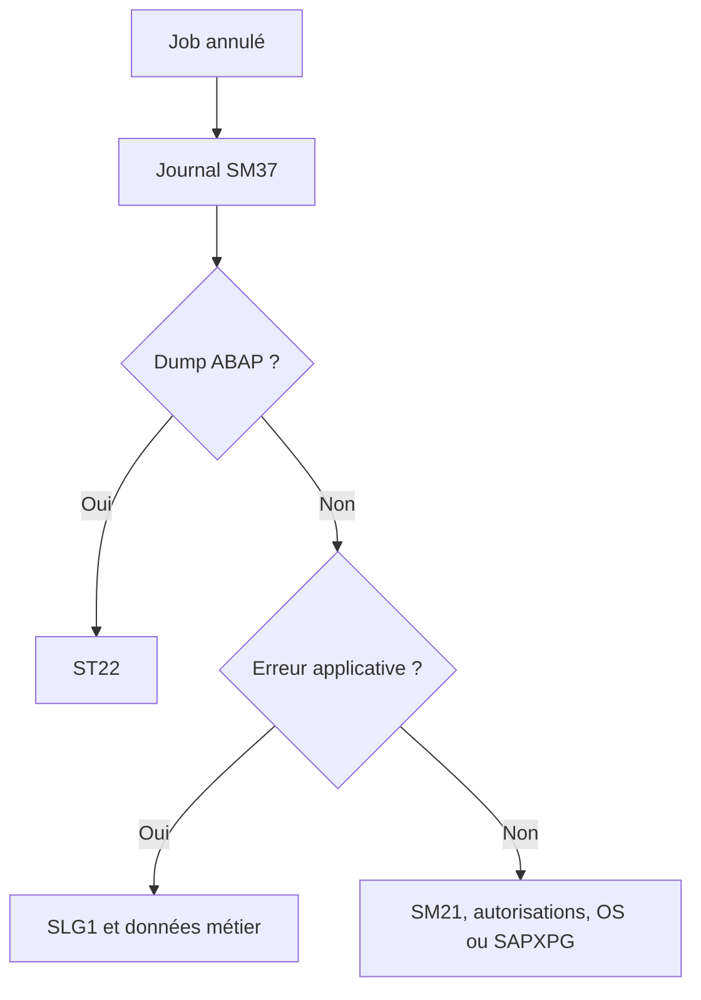

# 22. ANALYSER LES ÉCHECS ET LES RETARDS

## 22.A RÉSULTAT ATTENDU

- Appliquer une méthode[^terme-methode] de diagnostic reproductible
- Distinguer un job[^terme-job] non démarré, lent ou annulé
- Corréler les outils SAP[^terme-acro-sap]

## 22.B JOB NON DÉMARRÉ

Contrôler dans cet ordre :

1. statut libéré ;
2. condition de démarrage atteinte ;
3. date limite non dépassée ;
4. serveur cible disponible ;
5. processus batch disponibles ;
6. classe[^terme-classe] et concurrence ;
7. autorisations de libération ;
8. cohérence du système de jobs.

## 22.C JOB ANNULÉ



## 22.D JOB LENT

- mesurer la durée par phase ;
- analyser SQL[^terme-acro-sql] avec `ST05`[^outil-st05] ;
- analyser le runtime avec `SAT`[^outil-sat] ou `ST12`[^outil-st12] ;
- contrôler les volumes de sélection ;
- vérifier les verrous et attentes ;
- rechercher les exécutions simultanées ;
- contrôler le serveur et les processus ;
- comparer avec une exécution précédente de volume similaire.

## 22.E DONNÉES À CONSERVER

- nom et numéro du job ;
- date, heure et client ;
- utilisateur d’exécution ;
- programme et variante ;
- serveur ;
- statut ;
- journal ;
- spool[^terme-spool] ;
- dump éventuel ;
- volumes ;
- traces et identifiants applicatifs.

## 22.F PROCESS

### 22.F.1 ÉTAPE 1 — IDENTIFIER L’OCCURRENCE ET LE SYMPTÔME

Dans `SM37`[^outil-sm37], relever nom, numéro, statut, heure prévue, début, fin, serveur et étape. Classer le problème : non déclenché, démarré en retard, durée excessive, annulé ou terminé avec résultat métier incorrect.

### 22.F.2 ÉTAPE 2 — ANALYSER LA CONDITION DE DÉMARRAGE

Pour un job en attente, vérifier date, événement, argument, prédécesseur, périodicité et statut libéré. Comparer l’heure prévue au début réel. Contrôler ensuite la capacité batch et le ciblage serveur avec Basis.

### 22.F.3 ÉTAPE 3 — LOCALISER LA PREMIÈRE ERREUR

Lire journal, étapes et spool dans l’ordre. Corréler l’heure avec `ST22`[^outil-st22], `SM13`[^outil-sm13], `SLG1`[^outil-slg1], les traces d’autorisation ou les systèmes externes selon le message. Relever la clé métier et le dernier point de progression confirmé.

### 22.F.4 ÉTAPE 4 — ANALYSER UNE DURÉE EXCESSIVE

Comparer volume et durée à plusieurs exécutions de référence. Distinguer attente de verrou, SQL coûteux, appel externe, spool volumineux et manque de capacité. Utiliser une trace[^terme-trace] ciblée sur une reproduction contrôlée, pas sur une hypothèse générale.

### 22.F.5 ÉTAPE 5 — DÉTERMINER L’ÉTAT APRÈS INTERRUPTION

Vérifier les commits, documents, fichiers, événements et statuts déjà produits. Identifier la première unité non validée. Ne pas relancer avant de savoir si le job est idempotent ou si une compensation est nécessaire.

### 22.F.6 ÉTAPE 6 — CORRIGER ET MESURER LE MÊME SCÉNARIO

Appliquer la correction prouvée puis relancer avec la même variante et un volume comparable. Vérifier résultat métier, absence de doublons, début, durée, journal et spool. Conserver les identifiants avant/après dans le diagnostic.

## 22.G VÉRIFICATION

- Le job apparaît dans `SM37` avec le statut attendu.
- Le journal ne contient pas de message d’erreur non traité.
- Le spool, le fichier ou le journal applicatif contient le résultat attendu.
- Une relance contrôlée ne crée pas de doublon métier.

## 22.H ERREURS FRÉQUENTES

- Planifier un job avec l’utilisateur personnel d’un développeur.
- Relancer un job non idempotent après un échec partiel.

## 22.I FICHE DE CONTRÔLE À COPIER

```text
Système / SID       :
Mandant             :
Utilisateur         :
Transaction / outil :
Objet technique     :
Jeu de données      :
Résultat attendu    :
Résultat observé    :
Horodatage          :
Ordre de transport  :
```

## 22.J TERMES DU LEXIQUE

- [Job](<../🧩 00 ├── LEXIQUE SAP ET ABAP/06 ├── PROGRAMMES CLASSES ET OBJETS TECHNIQUES.md#job>)
- [Spool](<../🧩 00 ├── LEXIQUE SAP ET ABAP/06 ├── PROGRAMMES CLASSES ET OBJETS TECHNIQUES.md#spool>)
- [Processus background](<../🧩 00 ├── LEXIQUE SAP ET ABAP/08 ├── EXECUTION EXPLOITATION ET ADMINISTRATION.md#processus-background>)
- [Variante](<../🧩 00 ├── LEXIQUE SAP ET ABAP/06 ├── PROGRAMMES CLASSES ET OBJETS TECHNIQUES.md#variante>)

## 22.K RÉFÉRENCES OFFICIELLES SAP

- [Job Was Not Started — SAP Help Portal](https://help.sap.com/docs/ABAP_PLATFORM_NEW/b07e7195f03f438b8e7ed273099d74f3/4b272c13d1341780e10000000a42189c.html)
- [Managing Jobs from the Job Overview — SAP Help Portal](https://help.sap.com/docs/ABAP_PLATFORM_NEW/b07e7195f03f438b8e7ed273099d74f3/4b2bc2224c594ba2e10000000a42189c.html)
- [Job Storage Management — SAP Help Portal](https://help.sap.com/docs/ABAP_PLATFORM_NEW/b07e7195f03f438b8e7ed273099d74f3/4b2bc0974c594ba2e10000000a42189c.html)

---

[Chapitre suivant — CONCEPTION, REPRISE, IDEMPOTENCE ET BONNES PRATIQUES](<./23 └── CONCEPTION REPRISE IDEMPOTENCE ET BONNES PRATIQUES.md>)

[^terme-methode]: **MÉTHODE.** Comportement déclaré dans une classe ou une interface et appelé avec une liste de paramètres définie. Voir [l’entrée du lexique](<../🧩 00 ├── LEXIQUE SAP ET ABAP/04 ├── LANGAGE ET DEVELOPPEMENT ABAP.md#methode>).
[^terme-job]: **JOB.** Traitement planifié en arrière-plan composé d’une ou plusieurs étapes. Voir [l’entrée du lexique](<../🧩 00 ├── LEXIQUE SAP ET ABAP/06 ├── PROGRAMMES CLASSES ET OBJETS TECHNIQUES.md#job>).
[^terme-acro-sap]: **SAP.** Nom de l’éditeur et de son écosystème logiciel ; l’acronyme historique provient de l’allemand. Voir [l’entrée du lexique](<../🧩 00 ├── LEXIQUE SAP ET ABAP/10 └── ACRONYMES SAP.md#acro-sap>).
[^terme-classe]: **CLASSE.** Modèle orienté objet définissant état et comportements. Voir [l’entrée du lexique](<../🧩 00 ├── LEXIQUE SAP ET ABAP/04 ├── LANGAGE ET DEVELOPPEMENT ABAP.md#classe>).
[^terme-acro-sql]: **SQL.** Structured Query Language. Voir [l’entrée du lexique](<../🧩 00 ├── LEXIQUE SAP ET ABAP/10 └── ACRONYMES SAP.md#acro-sql>).
[^terme-spool]: **SPOOL.** Infrastructure stockant et acheminant les sorties imprimables produites par les traitements SAP. Voir [l’entrée du lexique](<../🧩 00 ├── LEXIQUE SAP ET ABAP/06 ├── PROGRAMMES CLASSES ET OBJETS TECHNIQUES.md#spool>).
[^terme-trace]: **TRACE.** Enregistrement détaillé d’événements techniques pour analyser exécution, SQL ou appels. Voir [l’entrée du lexique](<../🧩 00 ├── LEXIQUE SAP ET ABAP/08 ├── EXECUTION EXPLOITATION ET ADMINISTRATION.md#trace>).

[^outil-st05]: **ST05.** Performance Trace utilisée notamment pour enregistrer et analyser les accès SQL. Voir [le chapitre associé](<../🧩 20 ├── PERFORMANCE QUALITE ET TESTS/08 ├── ANALYSER LES ACCES SQL AVEC ST05.md>).
[^outil-sat]: **SAT.** Runtime Analysis utilisée pour mesurer et analyser le temps d’exécution ABAP. Voir [le chapitre associé](<../🧩 20 ├── PERFORMANCE QUALITE ET TESTS/07 ├── MESURER LE TEMPS D EXECUTION AVEC SAT.md>).
[^outil-st12]: **ST12.** Outil d’analyse ciblée combinant des traces ABAP et SQL pour un scénario reproduit. Voir [le chapitre associé](<../🧩 11 ├── DEBUG ET ANALYSE/16 ├── ANALYSE CIBLEE AVEC ST12.md>).
[^outil-sm37]: **SM37.** Transaction de recherche, surveillance et administration des jobs d’arrière-plan. Voir [le chapitre associé](<15 ├── SURVEILLER LES JOBS AVEC SM37.md>).
[^outil-st22]: **ST22.** Transaction d’analyse des terminaisons anormales et dumps ABAP. Voir [le chapitre associé](<../🧩 11 ├── DEBUG ET ANALYSE/13 ├── ANALYSER LES DUMPS AVEC ST22.md>).
[^outil-sm13]: **SM13.** Transaction de surveillance et de reprise des enregistrements de mise à jour SAP. Voir [le chapitre associé](<../🧩 16 ├── LUW VERROUILLAGES ET MISES A JOUR/19 ├── ANALYSER ET REPRENDRE LES UPDATES AVEC SM13.md>).
[^outil-slg1]: **SLG1.** Transaction de recherche et d’affichage des journaux applicatifs persistés. Voir [le chapitre associé](<../🧩 19 ├── JOURNAUX APPLICATIFS/05 ├── ANALYSER LES JOURNAUX AVEC SLG1.md>).
