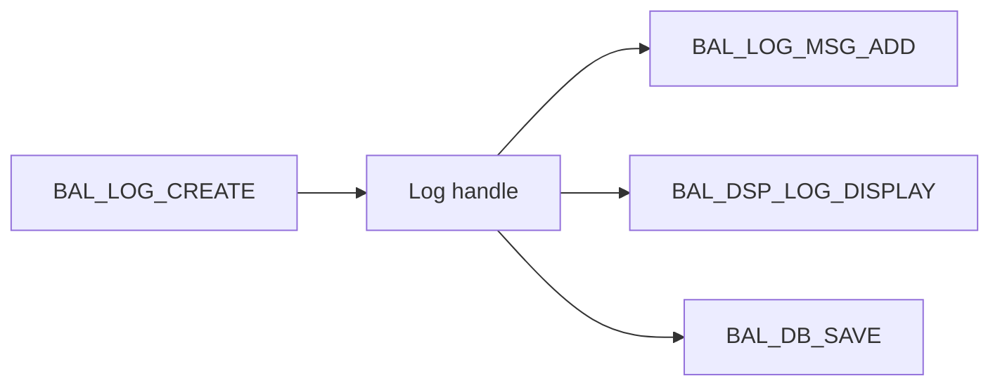

# 7. CRÉER UN JOURNAL AVEC BAL_LOG_CREATE

## 7.A RÉSULTAT ATTENDU

- Créer un journal en mémoire
- Récupérer son handle
- Contrôler les erreurs de configuration

## 7.B EXEMPLE

```abap
DATA:
  ls_log        TYPE bal_s_log,
  lv_log_handle TYPE balloghndl.

ls_log-object    = 'ZDEV_LOG'.
ls_log-subobject = 'IMPORT'.
ls_log-extnumber = |RUN_{ sy-datum }_{ sy-uzeit }|.
ls_log-alprog     = sy-repid.

CALL FUNCTION 'BAL_LOG_CREATE'
  EXPORTING
    i_s_log                 = ls_log
  IMPORTING
    e_log_handle            = lv_log_handle
  EXCEPTIONS
    log_header_inconsistent = 1
    OTHERS                  = 2.

IF sy-subrc <> 0.
  MESSAGE ID sy-msgid TYPE sy-msgty NUMBER sy-msgno
    WITH sy-msgv1 sy-msgv2 sy-msgv3 sy-msgv4.
ENDIF.
```

## 7.C HANDLE

Le type `BALLOGHNDL` identifie le journal créé. Il doit être conservé par le composant de journalisation et transmis à chaque ajout de message, affichage ou sauvegarde ciblée.



## 7.D ERREURS DE CRÉATION

La création échoue notamment lorsque :

- l’objet ou le sous-objet n’existe pas ;
- la combinaison objet/sous-objet est invalide ;
- l’en-tête contient des données incohérentes.

Ne pas ignorer `sy-subrc`. Sans handle valide, les appels suivants ne produisent pas de journal exploitable.

## 7.E PROCESS

### 7.E.1 ÉTAPE 1 — PRÉPARER LA CONFIGURATION

Vérifier l’objet et le sous-objet dans `SLG0`[^outil-slg0]. Définir l’identifiant externe et la politique de rétention. Exécuter le test avec un objet Z transporté dans le système courant.

### 7.E.2 ÉTAPE 2 — INITIALISER `BAL_S_LOG`

Créer une structure neuve et renseigner objet, sous-objet, identifiant et programme. Contrôler la longueur et le contenu de chaque champ avant l’appel. Ne pas transmettre une structure issue d’un précédent traitement.

### 7.E.3 ÉTAPE 3 — APPELER `BAL_LOG_CREATE`

Passer l’en-tête dans `I_S_LOG` et récupérer `E_LOG_HANDLE`. Traiter `LOG_HEADER_INCONSISTENT` séparément des autres erreurs. Contrôler `sy-subrc` immédiatement après le module.

### 7.E.4 ÉTAPE 4 — CONSERVER LE HANDLE DANS LE BON COMPOSANT

Stocker le handle dans l’objet responsable de l’exécution et le transmettre explicitement à chaque ajout, affichage et sauvegarde. Ne pas dépendre du journal par défaut de la mémoire globale BAL[^terme-acro-bal].

### 7.E.5 ÉTAPE 5 — TESTER LE PREMIER MESSAGE

Ajouter un message d’information au handle et contrôler le retour. En cas de `LOG_NOT_FOUND`, vérifier que le handle n’a pas été écrasé ou retiré de la mémoire. Ne pas poursuivre silencieusement avec un autre journal.

### 7.E.6 ÉTAPE 6 — SAUVEGARDER ET RECHERCHER

Sauvegarder uniquement ce handle, puis rechercher dans `SLG1`[^outil-slg1] par objet et identifiant externe. Tester aussi un objet inexistant, un sous-objet invalide et un handle initial pour confirmer la gestion des erreurs.

## 7.F VÉRIFICATION

- Le journal est retrouvable dans `SLG1` avec objet, sous-objet et période.
- Chaque erreur contient un contexte permettant d’identifier l’enregistrement concerné.
- Le log est sauvegardé même lorsque le traitement se termine avec des erreurs gérées.
- Aucune donnée sensible inutile n’est enregistrée.

## 7.G ERREURS FRÉQUENTES

- Copier un exemple sans adapter les types, noms d’objets et données disponibles dans le système.
- Tester uniquement le cas nominal et ignorer les valeurs initiales, absentes ou invalides.
- Enregistrer uniquement un texte générique sans clé métier.
- Journaliser des mots de passe, tokens ou données personnelles inutiles.

## 7.H SNIPPET À RÉUTILISER

> [!NOTE]
> Adapter les noms `Z*`, les types DDIC[^terme-acro-ddic], les données et les autorisations au système cible. Effectuer un contrôle syntaxique avant activation.

```abap
DATA:
  ls_log        TYPE bal_s_log,
  lv_log_handle TYPE balloghndl.

ls_log-object    = 'ZDEV_LOG'.
ls_log-subobject = 'IMPORT'.
ls_log-extnumber = |RUN_{ sy-datum }_{ sy-uzeit }|.
ls_log-alprog     = sy-repid.

CALL FUNCTION 'BAL_LOG_CREATE'
  EXPORTING
    i_s_log                 = ls_log
  IMPORTING
    e_log_handle            = lv_log_handle
  EXCEPTIONS
    log_header_inconsistent = 1
    OTHERS                  = 2.

IF sy-subrc <> 0.
  MESSAGE ID sy-msgid TYPE sy-msgty NUMBER sy-msgno
    WITH sy-msgv1 sy-msgv2 sy-msgv3 sy-msgv4.
ENDIF.
```

## 7.I TERMES DU LEXIQUE

- [Application Log](<../🧩 00 ├── LEXIQUE SAP ET ABAP/08 ├── EXECUTION EXPLOITATION ET ADMINISTRATION.md#application-log>)
- [BAL](<../🧩 00 ├── LEXIQUE SAP ET ABAP/10 └── ACRONYMES SAP.md#acro-bal>)
- [Job](<../🧩 00 ├── LEXIQUE SAP ET ABAP/06 ├── PROGRAMMES CLASSES ET OBJETS TECHNIQUES.md#job>)

## 7.J RÉFÉRENCES OFFICIELLES SAP

- [Basics — SAP Help Portal](https://help.sap.com/docs/ABAP_PLATFORM_NEW/addb96cd90c945dfb3182865363bbc47/4e21029235d44180e10000000a15822b.html)
- [Function Module Overview — SAP Help Portal](https://help.sap.com/docs/ABAP_PLATFORM_NEW/addb96cd90c945dfb3182865363bbc47/4e23b1720771417fe10000000a15822b.html)

---

[Chapitre suivant — AJOUTER DES MESSAGES T100](<./08 ├── AJOUTER DES MESSAGES T100.md>)

[^terme-acro-bal]: **BAL.** Business Application Log, API technique du journal applicatif. Voir [l’entrée du lexique](<../🧩 00 ├── LEXIQUE SAP ET ABAP/10 └── ACRONYMES SAP.md#acro-bal>).
[^terme-acro-ddic]: **DDIC.** Data Dictionary, abréviation courante de l’ABAP Dictionary. Voir [l’entrée du lexique](<../🧩 00 ├── LEXIQUE SAP ET ABAP/10 └── ACRONYMES SAP.md#acro-ddic>).

[^outil-slg0]: **SLG0.** Transaction de définition des objets et sous-objets de journal applicatif. Voir [le chapitre associé](<04 ├── CREER UN OBJET AVEC SLG0.md>).
[^outil-slg1]: **SLG1.** Transaction de recherche et d’affichage des journaux applicatifs persistés. Voir [le chapitre associé](<05 ├── ANALYSER LES JOURNAUX AVEC SLG1.md>).
