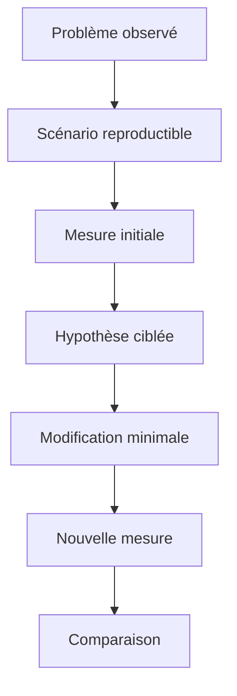

# 2. MESURER AVANT D OPTIMISER

## 2.A RÉSULTAT ATTENDU

Établir une méthode[^terme-methode] de mesure reproductible avant toute modification de performance.

## 2.B Définir un scénario de référence

Une mesure n’est comparable que si le contexte reste stable :

- même système et même client ;
- même utilisateur ou mêmes autorisations ;
- mêmes paramètres de sélection ;
- volume de données comparable ;
- état du buffer identifié ;
- même mode d’exécution : dialogue, RFC[^terme-rfc] ou batch.



## 2.C Choisir l’outil selon la question

| Question                                         | Outil            |
| ------------------------------------------------ | ---------------- |
| Quelle procédure ABAP[^terme-abap] consomme le plus ?         | `SAT`[^outil-sat]            |
| Quelles requêtes SQL[^terme-acro-sql] sont exécutées ?            | `ST05`[^outil-st05]           |
| Quels accès SQL sont coûteux sur une période ?   | `SQLM`[^outil-sqlm]           |
| Quel code cumule finding statique et coût réel ? | `SWLT`[^outil-swlt]           |
| La mémoire augmente-t-elle entre deux étapes ?   | Memory Inspector |

## 2.D Mesures minimales à conserver

Documenter au minimum :

- temps total ;
- temps base de données ;
- nombre d’exécutions SQL ;
- nombre de lignes lues ou transférées ;
- consommation mémoire lorsque pertinente ;
- identifiant du scénario et date de la mesure.

## 2.E Sources de biais

Le premier passage peut charger des programmes, remplir des buffers ou initialiser des caches. Une seule exécution n’est donc pas suffisante. Répéter le scénario, écarter les mesures manifestement perturbées et comparer des tendances plutôt qu’une valeur isolée.

## 2.F Critère de décision

La modification est retenue uniquement si elle améliore la métrique visée sans dégrader le résultat fonctionnel, la lisibilité, la robustesse ou une autre métrique importante.

## 2.G Références SAP officielles

- [SAP Help Portal — ABAP Performance and Tuning](https://help.sap.com/docs/SUPPORT_CONTENT/ABAP/3353523595.html)
- [SAP Help Portal — Analyzing Performance with ABAP Runtime Analysis](https://help.sap.com/docs/ABAP_PLATFORM_NEW/ba879a6e2ea04d9bb94c7ccd7cdac446/3c74c6163ce4459888bc06dedda37685.html)
- [SAP Help Portal — SQL Trace Analysis](https://help.sap.com/docs/ABAP_PLATFORM_NEW/ba879a6e2ea04d9bb94c7ccd7cdac446/d1801f89454211d189710000e8322d00.html)
- [SAP Help Portal — Memory Inspector Concepts](https://help.sap.com/docs/ABAP_PLATFORM_NEW/ba879a6e2ea04d9bb94c7ccd7cdac446/8884fb5269d34838a1f119b41dcdbc57.html)

## 2.H PROCESS

### 2.H.1 ÉTAPE 1 — FORMULER LE SYMPTÔME MESURABLE

Définir l’action lente, l’utilisateur, le volume, l’heure et la limite attendue. Séparer temps de réponse, temps CPU, temps SQL, attente et mémoire. Éviter des objectifs vagues comme « rendre le programme plus rapide ».

### 2.H.2 ÉTAPE 2 — CONSTRUIRE UN SCÉNARIO REPRODUCTIBLE

Fixer variante, clés métier, état des données, mandant[^terme-mandant] et type d’exécution. Réduire le scénario à une action. Noter les effets de cache ou d’échauffement et décider si la première exécution doit être exclue ou mesurée séparément.

### 2.H.3 ÉTAPE 3 — CHOISIR L’OUTIL SELON L’HYPOTHÈSE

Utiliser `SAT` pour la répartition du temps ABAP, `ST05` pour une trace[^terme-trace] SQL courte, `SQLM` pour une observation agrégée, `SWLT` pour prioriser et Memory Inspector pour la mémoire. Définir le périmètre et la durée avant activation.

### 2.H.4 ÉTAPE 4 — CAPTURER LA RÉFÉRENCE

Exécuter le scénario sans autre activité volontaire et conserver la mesure, son identifiant, l’horodatage, l’utilisateur et le volume. Relever appels dominants, SQL, lignes et mémoire. Ne pas modifier le code avant cette capture.

### 2.H.5 ÉTAPE 5 — MODIFIER LA CAUSE PROUVÉE

Appliquer une correction limitée et expliquer le mécanisme attendu : moins d’exécutions, moins de lignes, accès par clé ou copie évitée. Exécuter les tests fonctionnels avant la seconde mesure.

### 2.H.6 ÉTAPE 6 — COMPARER SUR LES MÊMES BASES

Relancer le même scénario et comparer temps total, temps du composant, nombre d’appels, volume et résultat. Si le gain n’est pas reproductible, retirer ou réévaluer la modification au lieu de conclure sur une mesure isolée.

## 2.I VÉRIFICATION

- Le scénario reproduit correspond au même utilisateur, mandant, transaction et jeu de données.
- L’horodatage et l’identifiant de l’analyse sont conservés.
- La cause retenue est soutenue par une ligne source, une trace ou une valeur observée.
- Après correction, le même scénario ne reproduit plus le défaut et le résultat métier reste identique.

## 2.J ERREURS FRÉQUENTES

- Optimiser sans mesure de référence.
- Accepter un finding critique sans correction ni justification formelle.

## 2.K FICHE DE CONTRÔLE À COPIER

```text
Système / SID       :
Mandant             :
Utilisateur         :
Transaction / outil :
Objet technique     :
Jeu de données      :
Résultat attendu    :
Résultat observé    :
Horodatage          :
Ordre de transport  :
```

## 2.L TERMES DU LEXIQUE

- [ATC](<../🧩 00 ├── LEXIQUE SAP ET ABAP/10 └── ACRONYMES SAP.md#acro-atc>)
- [ABAP](<../🧩 00 ├── LEXIQUE SAP ET ABAP/10 └── ACRONYMES SAP.md#acro-abap>)
- [Trace](<../🧩 00 ├── LEXIQUE SAP ET ABAP/08 ├── EXECUTION EXPLOITATION ET ADMINISTRATION.md#trace>)

[^terme-methode]: **MÉTHODE.** Comportement déclaré dans une classe ou une interface et appelé avec une liste de paramètres définie. Voir [l’entrée du lexique](<../🧩 00 ├── LEXIQUE SAP ET ABAP/04 ├── LANGAGE ET DEVELOPPEMENT ABAP.md#methode>).
[^terme-rfc]: **RFC.** Remote Function Call, mécanisme permettant d’appeler un module fonction compatible dans un autre contexte ou système. Voir [l’entrée du lexique](<../🧩 00 ├── LEXIQUE SAP ET ABAP/06 ├── PROGRAMMES CLASSES ET OBJETS TECHNIQUES.md#rfc>).
[^terme-abap]: **ABAP.** Langage de programmation de la plateforme ABAP, conçu pour développer des applications métier et techniques SAP. Voir [l’entrée du lexique](<../🧩 00 ├── LEXIQUE SAP ET ABAP/04 ├── LANGAGE ET DEVELOPPEMENT ABAP.md#abap>).
[^terme-acro-sql]: **SQL.** Structured Query Language. Voir [l’entrée du lexique](<../🧩 00 ├── LEXIQUE SAP ET ABAP/10 └── ACRONYMES SAP.md#acro-sql>).
[^terme-mandant]: **MANDANT.** Subdivision logique d’un système SAP. Il est identifié par un numéro à trois chiffres et isole une partie des données, du paramétrage et des utilisateurs. Voir [l’entrée du lexique](<../🧩 00 ├── LEXIQUE SAP ET ABAP/01 ├── SYSTEMES ENVIRONNEMENTS ET MANDANTS.md#mandant>).
[^terme-trace]: **TRACE.** Enregistrement détaillé d’événements techniques pour analyser exécution, SQL ou appels. Voir [l’entrée du lexique](<../🧩 00 ├── LEXIQUE SAP ET ABAP/08 ├── EXECUTION EXPLOITATION ET ADMINISTRATION.md#trace>).

[^outil-sat]: **SAT.** Runtime Analysis utilisée pour mesurer et analyser le temps d’exécution ABAP. Voir [le chapitre associé](<07 ├── MESURER LE TEMPS D EXECUTION AVEC SAT.md>).
[^outil-st05]: **ST05.** Performance Trace utilisée notamment pour enregistrer et analyser les accès SQL. Voir [le chapitre associé](<08 ├── ANALYSER LES ACCES SQL AVEC ST05.md>).
[^outil-sqlm]: **SQLM.** SQL Monitor utilisé pour agréger l’usage des instructions SQL pendant une période d’enregistrement. Voir [le chapitre associé](<09 ├── SURVEILLER LES ACCES SQL AVEC SQLM.md>).
[^outil-swlt]: **SWLT.** SQL Performance Tuning Worklist utilisée pour rapprocher usage productif et résultats de contrôles statiques. Voir [le chapitre associé](<10 ├── PRIORISER AVEC SWLT.md>).
