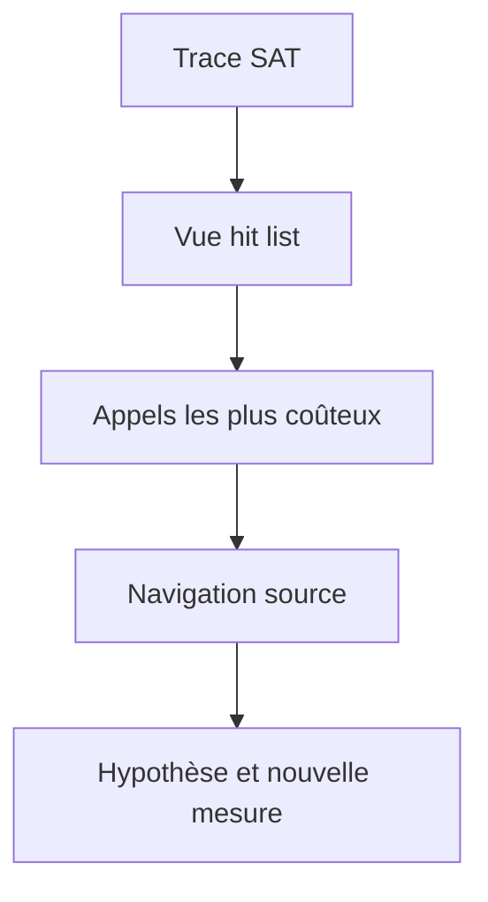

# 7. MESURER LE TEMPS D EXECUTION AVEC SAT

## 7.A RÉSULTAT ATTENDU

Utiliser `SAT`[^outil-sat] pour localiser le temps consommé dans le code ABAP[^terme-abap] et les appels qu’il déclenche.

## 7.B PROCESS

### 7.B.1 ÉTAPE 1 — PRÉPARER LE SCÉNARIO

Noter programme ou transaction, utilisateur, variante, jeu de données et action unique. Définir le résultat fonctionnel et une mesure de référence. Réduire les activités parallèles non nécessaires.

### 7.B.2 ÉTAPE 2 — CRÉER UNE VARIANTE SAT CIBLÉE

Saisir `/nSAT`, choisir le type d’exécution et limiter les composants ou instructions enregistrés selon le besoin. Conserver assez de détail pour la pile suspecte sans produire une trace[^terme-trace] disproportionnée.

### 7.B.3 ÉTAPE 3 — ENREGISTRER UNE SEULE REPRODUCTION

Démarrer la mesure, exécuter exactement l’action puis arrêter. Éviter navigation et temps d’attente utilisateur dans la fenêtre. Relever l’identifiant et l’horodatage de l’évaluation.

### 7.B.4 ÉTAPE 4 — ANALYSER LA HIT LIST

Trier par temps net, temps brut et nombre d’appels. Identifier les routines dominantes et distinguer leur temps propre du temps des sous-appels. Vérifier si la base ou un appel externe explique le coût.

### 7.B.5 ÉTAPE 5 — NAVIGUER DANS LA HIÉRARCHIE

Remonter de l’appel coûteux jusqu’au point métier qui le répète. Ouvrir la source et corréler les volumes. Formuler une correction portant sur la cause : réduction d’appels, algorithme ou données traitées.

### 7.B.6 ÉTAPE 6 — COMPARER APRÈS CORRECTION

Rejouer la même variante SAT avec les mêmes données. Comparer temps net, brut, appels et résultat. Conserver les deux évaluations et exécuter les tests de non-régression.

## 7.C Lire les résultats

| Indicateur      | Interprétation                             |
| --------------- | ------------------------------------------ |
| Temps brut      | temps de la procédure avec ses sous-appels |
| Temps net       | temps propre à la procédure                |
| Nombre d’appels | fréquence d’exécution                      |
| Temps moyen     | coût moyen par appel                       |

Une méthode[^terme-methode] peu coûteuse appelée un million de fois peut dominer le traitement. Une méthode longue appelée une fois doit être analysée différemment.

## 7.D Filtrer le périmètre

Limiter la trace aux objets, packages ou composants pertinents réduit le bruit. Pour un scénario batch ou RFC[^terme-rfc], utiliser le mode d’enregistrement adapté plutôt que de reproduire artificiellement le traitement en dialogue.



## 7.E Interprétation

`SAT` montre où le temps est consommé. Il ne prouve pas à lui seul pourquoi une requête SQL[^terme-acro-sql] est lente. Pour la base de données, poursuivre avec `ST05`[^outil-st05] ou `SQLM`[^outil-sqlm].

## 7.F Références SAP officielles

- [SAP Help Portal — Analyzing Performance with ABAP Runtime Analysis](https://help.sap.com/docs/ABAP_PLATFORM_NEW/ba879a6e2ea04d9bb94c7ccd7cdac446/3c74c6163ce4459888bc06dedda37685.html)
- [SAP Help Portal — ABAP Performance and Tuning](https://help.sap.com/docs/SUPPORT_CONTENT/ABAP/3353523595.html)

## 7.G VÉRIFICATION

- Le scénario reproduit correspond au même utilisateur, mandant[^terme-mandant], transaction et jeu de données.
- L’horodatage et l’identifiant de l’analyse sont conservés.
- La cause retenue est soutenue par une ligne source, une trace ou une valeur observée.
- Après correction, le même scénario ne reproduit plus le défaut et le résultat métier reste identique.

## 7.H ERREURS FRÉQUENTES

- Optimiser sans mesure de référence.
- Accepter un finding critique sans correction ni justification formelle.

## 7.I FICHE DE CONTRÔLE À COPIER

```text
Système / SID       :
Mandant             :
Utilisateur         :
Transaction / outil :
Objet technique     :
Jeu de données      :
Résultat attendu    :
Résultat observé    :
Horodatage          :
Ordre de transport  :
```

## 7.J TERMES DU LEXIQUE

- [ATC](<../🧩 00 ├── LEXIQUE SAP ET ABAP/10 └── ACRONYMES SAP.md#acro-atc>)
- [ABAP](<../🧩 00 ├── LEXIQUE SAP ET ABAP/10 └── ACRONYMES SAP.md#acro-abap>)
- [Trace](<../🧩 00 ├── LEXIQUE SAP ET ABAP/08 ├── EXECUTION EXPLOITATION ET ADMINISTRATION.md#trace>)

[^terme-abap]: **ABAP.** Langage de programmation de la plateforme ABAP, conçu pour développer des applications métier et techniques SAP. Voir [l’entrée du lexique](<../🧩 00 ├── LEXIQUE SAP ET ABAP/04 ├── LANGAGE ET DEVELOPPEMENT ABAP.md#abap>).
[^terme-trace]: **TRACE.** Enregistrement détaillé d’événements techniques pour analyser exécution, SQL ou appels. Voir [l’entrée du lexique](<../🧩 00 ├── LEXIQUE SAP ET ABAP/08 ├── EXECUTION EXPLOITATION ET ADMINISTRATION.md#trace>).
[^terme-methode]: **MÉTHODE.** Comportement déclaré dans une classe ou une interface et appelé avec une liste de paramètres définie. Voir [l’entrée du lexique](<../🧩 00 ├── LEXIQUE SAP ET ABAP/04 ├── LANGAGE ET DEVELOPPEMENT ABAP.md#methode>).
[^terme-rfc]: **RFC.** Remote Function Call, mécanisme permettant d’appeler un module fonction compatible dans un autre contexte ou système. Voir [l’entrée du lexique](<../🧩 00 ├── LEXIQUE SAP ET ABAP/06 ├── PROGRAMMES CLASSES ET OBJETS TECHNIQUES.md#rfc>).
[^terme-acro-sql]: **SQL.** Structured Query Language. Voir [l’entrée du lexique](<../🧩 00 ├── LEXIQUE SAP ET ABAP/10 └── ACRONYMES SAP.md#acro-sql>).
[^terme-mandant]: **MANDANT.** Subdivision logique d’un système SAP. Il est identifié par un numéro à trois chiffres et isole une partie des données, du paramétrage et des utilisateurs. Voir [l’entrée du lexique](<../🧩 00 ├── LEXIQUE SAP ET ABAP/01 ├── SYSTEMES ENVIRONNEMENTS ET MANDANTS.md#mandant>).

[^outil-sat]: **SAT.** Runtime Analysis utilisée pour mesurer et analyser le temps d’exécution ABAP. Voir [le chapitre associé](<07 ├── MESURER LE TEMPS D EXECUTION AVEC SAT.md>).
[^outil-st05]: **ST05.** Performance Trace utilisée notamment pour enregistrer et analyser les accès SQL. Voir [le chapitre associé](<08 ├── ANALYSER LES ACCES SQL AVEC ST05.md>).
[^outil-sqlm]: **SQLM.** SQL Monitor utilisé pour agréger l’usage des instructions SQL pendant une période d’enregistrement. Voir [le chapitre associé](<09 ├── SURVEILLER LES ACCES SQL AVEC SQLM.md>).
