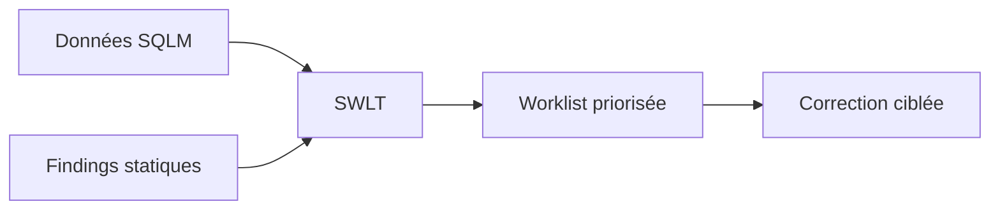

# 10. PRIORISER AVEC SWLT

## 10.A RÉSULTAT ATTENDU

Combiner les données d’exécution SQL[^terme-acro-sql] avec les findings statiques afin de concentrer l’effort sur le code réellement coûteux.

## 10.B Principe

`SWLT`[^outil-swlt] rapproche notamment :

- données de runtime issues de `SQLM`[^outil-sqlm] ou d’un snapshot ;
- contrôles statiques du Code Inspector ;
- informations sur les objets et tables concernés.



## 10.C Utilisation

1. Ouvrir la transaction `SWLT`.
2. Sélectionner le jeu d’objets ou la variante.
3. Choisir les sources de données disponibles.
4. Exécuter la worklist.
5. Trier selon le coût cumulé, la fréquence et la criticité du finding.
6. Naviguer vers le point source.

## 10.D Priorisation

Traiter en premier les instructions :

- coûteuses et fréquentes ;
- exécutées dans des processus critiques ;
- associées à un finding statique pertinent ;
- modifiables avec un risque maîtrisé.

## 10.E Limites

Une instruction absente de la collecte n’est pas nécessairement inutilisée ; le scénario peut simplement ne pas avoir été exécuté. Les données de runtime doivent couvrir la période métier appropriée, y compris traitements mensuels ou annuels si nécessaire.

## 10.F Livrable

Conserver la worklist initiale, la justification du choix, la correction et les mesures après modification.

## 10.G Références SAP officielles

- [SAP Help Portal — SQL Performance Tuning Worklist](https://help.sap.com/docs/SAP_NETWEAVER_AS_ABAP_FOR_SOH_740/a24970c68fcf4770a64bf9a78e3719e2/713ff185b9b347aaacbe3ada28d4fa72.html)
- [SAP Help Portal — SQL Monitor](https://help.sap.com/docs/ABAP_PLATFORM_NEW/a24970c68fcf4770a64bf9a78e3719e2/1ec2329419b64f3992a9c342437d3a0f.html)
- [SAP Help Portal — Code Inspector](https://help.sap.com/docs/ABAP_PLATFORM_NEW/ba879a6e2ea04d9bb94c7ccd7cdac446/49205531d0fc14cfe10000000a42189b.html)

## 10.H PROCESS

### 10.H.1 ÉTAPE 1 — PRÉPARER LES DONNÉES D’USAGE

Collecter avec SQLM une période représentative et correctement bornée. Vérifier que les applications et jobs cibles ont réellement été exécutés. Une priorisation sans données d’usage ne distingue pas le code critique du code dormant.

### 10.H.2 ÉTAPE 2 — CHOISIR LES CONTRÔLES STATIQUES

Sélectionner la variante SCI[^outil-sci] ou ATC[^terme-acro-atc] adaptée aux problèmes SQL et performance recherchés. Vérifier sa portée, ses priorités et la release. Ne pas modifier la variante centrale pour un besoin ponctuel sans gouvernance.

### 10.H.3 ÉTAPE 3 — LANCER L’ANALYSE DANS `SWLT`

Saisir `/nSWLT`, sélectionner les données SQLM, la période et la variante statique disponibles. Exécuter la combinaison. Conserver les paramètres afin de pouvoir reproduire la liste.

### 10.H.4 ÉTAPE 4 — TRIER PAR IMPACT RUNTIME

Examiner les findings qui correspondent à du code réellement exécuté et coûteux. Relever objet, source, fréquence et métrique. Distinguer un finding grave mais rare d’un coût modéré répété des millions de fois.

### 10.H.5 ÉTAPE 5 — CONFIRMER CHAQUE CANDIDAT

Ouvrir le code, comprendre la sémantique puis utiliser `ST05`[^outil-st05] ou `SAT`[^outil-sat] si un détail runtime manque. Corriger une cause à la fois et exécuter les tests. Ne pas appliquer mécaniquement une proposition statique à un contexte non compris.

### 10.H.6 ÉTAPE 6 — RECOLLECTER ET RECLASSER

Après correction, collecter une fenêtre comparable puis relancer SWLT. Vérifier la baisse du coût et l’absence de nouveau finding. Documenter les éléments non corrigés avec leur impact et leur justification.

## 10.I VÉRIFICATION

- Le résultat fonctionnel est identique avant et après optimisation.
- La mesure est répétée avec le même jeu de données et le même contexte.
- Les contrôles statiques ne retournent plus de finding bloquant.
- Les tests automatiques couvrent les cas nominal, limites et erreurs attendues.

## 10.J ERREURS FRÉQUENTES

- Optimiser sans mesure de référence.
- Accepter un finding critique sans correction ni justification formelle.

## 10.K FICHE DE CONTRÔLE À COPIER

```text
Système / SID       :
Mandant             :
Utilisateur         :
Transaction / outil :
Objet technique     :
Jeu de données      :
Résultat attendu    :
Résultat observé    :
Horodatage          :
Ordre de transport  :
```

## 10.L TERMES DU LEXIQUE

- [ATC](<../🧩 00 ├── LEXIQUE SAP ET ABAP/10 └── ACRONYMES SAP.md#acro-atc>)
- [ABAP](<../🧩 00 ├── LEXIQUE SAP ET ABAP/10 └── ACRONYMES SAP.md#acro-abap>)
- [Trace](<../🧩 00 ├── LEXIQUE SAP ET ABAP/08 ├── EXECUTION EXPLOITATION ET ADMINISTRATION.md#trace>)

[^terme-acro-sql]: **SQL.** Structured Query Language. Voir [l’entrée du lexique](<../🧩 00 ├── LEXIQUE SAP ET ABAP/10 └── ACRONYMES SAP.md#acro-sql>).
[^terme-acro-atc]: **ATC.** ABAP Test Cockpit, infrastructure de contrôles statiques et de gouvernance qualité. Voir [l’entrée du lexique](<../🧩 00 ├── LEXIQUE SAP ET ABAP/10 └── ACRONYMES SAP.md#acro-atc>).

[^outil-swlt]: **SWLT.** SQL Performance Tuning Worklist utilisée pour rapprocher usage productif et résultats de contrôles statiques. Voir [le chapitre associé](<10 ├── PRIORISER AVEC SWLT.md>).
[^outil-sqlm]: **SQLM.** SQL Monitor utilisé pour agréger l’usage des instructions SQL pendant une période d’enregistrement. Voir [le chapitre associé](<09 ├── SURVEILLER LES ACCES SQL AVEC SQLM.md>).
[^outil-sci]: **SCI.** Code Inspector utilisé pour exécuter des contrôles statiques sur un ensemble d’objets ABAP. Voir [le chapitre associé](<13 ├── CODE INSPECTOR AVEC SCI.md>).
[^outil-st05]: **ST05.** Performance Trace utilisée notamment pour enregistrer et analyser les accès SQL. Voir [le chapitre associé](<08 ├── ANALYSER LES ACCES SQL AVEC ST05.md>).
[^outil-sat]: **SAT.** Runtime Analysis utilisée pour mesurer et analyser le temps d’exécution ABAP. Voir [le chapitre associé](<07 ├── MESURER LE TEMPS D EXECUTION AVEC SAT.md>).
