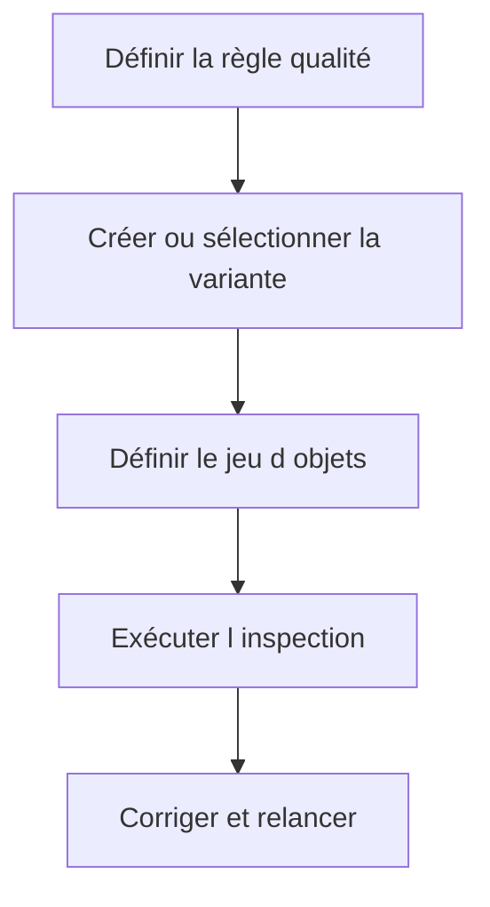

# 14. VARIANTES ET INSPECTIONS SCI

## 14.A RÉSULTAT ATTENDU

Construire des variantes de contrôle stables et des inspections reproductibles.

## 14.B Concevoir une variante

Une variante doit refléter un objectif explicite : contrôle quotidien développeur, sécurité, performance SQL[^terme-acro-sql], migration ou validation avant transport.

### 14.B.1 Principes

- partir d’une variante SAP[^terme-acro-sap] ou projet reconnue ;
- ne pas désactiver une règle uniquement pour réduire le nombre de findings ;
- paramétrer les seuils selon la volumétrie et la release ;
- versionner la décision de gouvernance hors de l’outil si nécessaire ;
- tester la variante sur un package[^terme-package] pilote.

## 14.C Construire un jeu d’objets

Le jeu peut viser un programme, une classe[^terme-classe], un package, un transport ou un ensemble sélectionné. Il doit être assez précis pour fournir un résultat exploitable.

## 14.D Inspection reproductible

Une inspection nommée permet de relancer la même combinaison et de comparer l’évolution des findings.



## 14.E Résultats historiques

Ne pas comparer deux inspections si la variante, le jeu d’objets ou la version active a changé sans le documenter.

## 14.F Références SAP officielles

- [SAP Help Portal — Code Inspector](https://help.sap.com/docs/ABAP_PLATFORM_NEW/ba879a6e2ea04d9bb94c7ccd7cdac446/49205531d0fc14cfe10000000a42189b.html)
- [SAP Help Portal — Creating Code Inspections](https://help.sap.com/docs/ABAP_PLATFORM_NEW/ba879a6e2ea04d9bb94c7ccd7cdac446/4926dff4c93016b8e10000000a42189d.html)

## 14.G PROCESS

### 14.G.1 ÉTAPE 1 — DÉFINIR L’OBJECTIF DE LA VARIANTE

Lister les règles obligatoires : syntaxe, sécurité, performance, robustesse et conventions. Définir les priorités et les versions cibles. Partir d’une variante centrale ou de référence au lieu d’une sélection arbitraire de contrôles.

### 14.G.2 ÉTAPE 2 — CRÉER LA VARIANTE DANS `SCI`

Créer une variante Z avec description, propriétaire et périmètre d’usage. Ajouter les contrôles et paramétrer leurs options. Enregistrer de façon transportable ou locale selon la gouvernance explicitement choisie.

### 14.G.3 ÉTAPE 3 — TESTER LA VARIANTE SUR DES OBJETS CONNUS

Exécuter une inspection sur un objet contenant des défauts représentatifs et sur un objet conforme. Vérifier que les findings et priorités correspondent à l’intention. Ajuster la variante avant son adoption par le projet.

### 14.G.4 ÉTAPE 4 — CRÉER L’INSPECTION DE LIVRAISON

Sélectionner variante et ensemble d’objets exacts : package ou demande de transport. Donner un nom contenant périmètre et date. Lancer puis conserver l’identifiant de résultat.

### 14.G.5 ÉTAPE 5 — GÉRER LES FINDINGS

Attribuer chaque finding, corriger la cause et exécuter les tests. Documenter les exceptions avec règle, ligne, justification et échéance. Ne pas retirer un contrôle de la variante pour résoudre un cas isolé.

### 14.G.6 ÉTAPE 6 — VERSIONNER LA GOUVERNANCE

Après changement de variante, informer les consommateurs et relancer les périmètres concernés. Conserver la date d’entrée en vigueur et les différences. Aligner SCI[^outil-sci] et ATC[^terme-acro-atc] afin d’éviter des résultats contradictoires au moment du transport.

## 14.H VÉRIFICATION

- Le résultat fonctionnel est identique avant et après optimisation.
- La mesure est répétée avec le même jeu de données et le même contexte.
- Les contrôles statiques ne retournent plus de finding bloquant.
- Les tests automatiques couvrent les cas nominal, limites et erreurs attendues.

## 14.I ERREURS FRÉQUENTES

- Optimiser sans mesure de référence.
- Accepter un finding critique sans correction ni justification formelle.

## 14.J FICHE DE CONTRÔLE À COPIER

```text
Système / SID       :
Mandant             :
Utilisateur         :
Transaction / outil :
Objet technique     :
Jeu de données      :
Résultat attendu    :
Résultat observé    :
Horodatage          :
Ordre de transport  :
```

## 14.K TERMES DU LEXIQUE

- [Variante](<../🧩 00 ├── LEXIQUE SAP ET ABAP/06 ├── PROGRAMMES CLASSES ET OBJETS TECHNIQUES.md#variante>)
- [ATC](<../🧩 00 ├── LEXIQUE SAP ET ABAP/10 └── ACRONYMES SAP.md#acro-atc>)
- [ABAP](<../🧩 00 ├── LEXIQUE SAP ET ABAP/10 └── ACRONYMES SAP.md#acro-abap>)
- [Trace](<../🧩 00 ├── LEXIQUE SAP ET ABAP/08 ├── EXECUTION EXPLOITATION ET ADMINISTRATION.md#trace>)

[^terme-acro-sql]: **SQL.** Structured Query Language. Voir [l’entrée du lexique](<../🧩 00 ├── LEXIQUE SAP ET ABAP/10 └── ACRONYMES SAP.md#acro-sql>).
[^terme-acro-sap]: **SAP.** Nom de l’éditeur et de son écosystème logiciel ; l’acronyme historique provient de l’allemand. Voir [l’entrée du lexique](<../🧩 00 ├── LEXIQUE SAP ET ABAP/10 └── ACRONYMES SAP.md#acro-sap>).
[^terme-package]: **PACKAGE.** Conteneur logique qui regroupe les objets de développement et détermine notamment leur transportabilité. Voir [l’entrée du lexique](<../🧩 00 ├── LEXIQUE SAP ET ABAP/03 ├── REPOSITORY PACKAGES ET TRANSPORTS.md#package>).
[^terme-classe]: **CLASSE.** Modèle orienté objet définissant état et comportements. Voir [l’entrée du lexique](<../🧩 00 ├── LEXIQUE SAP ET ABAP/04 ├── LANGAGE ET DEVELOPPEMENT ABAP.md#classe>).
[^terme-acro-atc]: **ATC.** ABAP Test Cockpit, infrastructure de contrôles statiques et de gouvernance qualité. Voir [l’entrée du lexique](<../🧩 00 ├── LEXIQUE SAP ET ABAP/10 └── ACRONYMES SAP.md#acro-atc>).

[^outil-sci]: **SCI.** Code Inspector utilisé pour exécuter des contrôles statiques sur un ensemble d’objets ABAP. Voir [le chapitre associé](<13 ├── CODE INSPECTOR AVEC SCI.md>).
