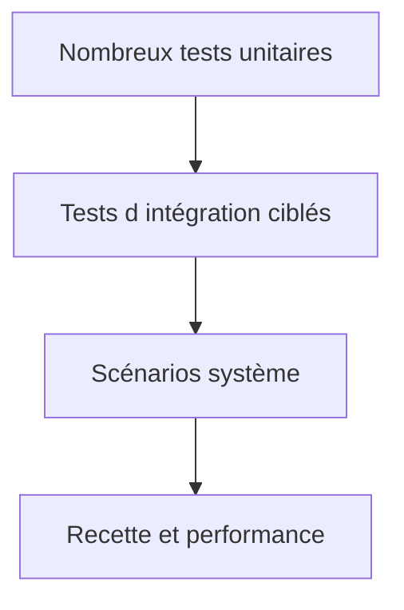

# 23. STRATEGIE DE TEST ET NON REGRESSION

## 23.A RÉSULTAT ATTENDU

Organiser les tests selon leur portée, leur coût et le risque couvert.

## 23.B Niveaux de test

| Niveau      | Cible                       | Exemple                             |
| ----------- | --------------------------- | ----------------------------------- |
| Unitaire    | méthode[^terme-methode] ou classe[^terme-classe] isolée    | calcul, validation, mapping         |
| Intégration | collaboration de composants | accès DDIC[^terme-acro-ddic], module fonction[^terme-module-fonction], BAPI[^terme-bapi]   |
| Système     | processus technique complet | job[^terme-job], interface fichier, transaction |
| Recette     | besoin métier               | scénario validé par le fonctionnel  |
| Performance | temps, volume, concurrence  | charge batch représentative         |



## 23.C Construire la non-régression

À chaque correction de défaut :

1. reproduire le défaut ;
2. créer un test qui échoue ;
3. corriger le code ;
4. vérifier que le test réussit ;
5. conserver le test dans la suite.

## 23.D Données de test

Elles doivent être minimales, compréhensibles et indépendantes du système lorsque le niveau de test le permet. Pour les tests d’intégration, définir clairement le client, les prérequis, le nettoyage et l’idempotence.

## 23.E Couverture du risque

Prioriser les règles financières, autorisations, conversions d’unité, dates, arrondis, reprise après erreur, concurrence et volumes importants. Le nombre de tests n’est pas un objectif autonome.

## 23.F Références SAP officielles

- [SAP Help Portal — ABAP Unit](https://help.sap.com/docs/ABAP_PLATFORM_NEW/ba879a6e2ea04d9bb94c7ccd7cdac446/491cfd8926bc14cde10000000a42189b.html)
- [SAP Help Portal — Coverage Analyzer](https://help.sap.com/docs/ABAP_PLATFORM_NEW/ba879a6e2ea04d9bb94c7ccd7cdac446/49216c634ab514cde10000000a42189b.html)
- [SAP Help Portal — ATC Quality Checking](https://help.sap.com/docs/ABAP_PLATFORM_NEW/c238d694b825421f940829321ffa326a/4ec1a1126e391014adc9fffe4e204223.html)

## 23.G PROCESS

### 23.G.1 ÉTAPE 1 — CARTOGRAPHIER LES RISQUES DE LA MODIFICATION

Lister règles modifiées, appelants, tables, interfaces, autorisations, jobs et volumes. Classer les risques par impact et probabilité. Relier chaque risque à au moins une preuve de test.

### 23.G.2 ÉTAPE 2 — RÉPARTIR LES TESTS PAR NIVEAU

Utiliser ABAP[^terme-abap] Unit pour la logique déterministe, tests d’intégration pour base et API[^terme-api], tests de transaction pour le flux, contrôles d’autorisation pour les rôles et mesures dédiées pour la performance. Ne faire pas porter toutes les preuves à une recette manuelle unique.

### 23.G.3 ÉTAPE 3 — DÉFINIR DONNÉES ET RÉSULTATS ATTENDUS

Créer des cas nominaux, limites, erreurs et non-régression avec clés identifiables. Définir les résultats avant exécution. Prévoir nettoyage et idempotence afin que les tests soient répétables.

### 23.G.4 ÉTAPE 4 — AUTOMATISER LE SOCLE RAPIDE

Ajouter les tests ABAP Unit au composant et les exécuter avec syntaxe, SLIN[^outil-slin] et ATC[^terme-acro-atc]. Garder ce socle rapide, sans effets persistants et indépendant de l’ordre. Corriger tout test instable avant d’élargir la couverture.

### 23.G.5 ÉTAPE 5 — EXÉCUTER L’INTÉGRATION ET LA PERFORMANCE

Tester le processus complet sous un utilisateur représentatif, puis mesurer le scénario critique avec le volume défini. Comparer aux références fonctionnelles et temporelles. Conserver journaux, variantes et horodatages.

### 23.G.6 ÉTAPE 6 — CONSTRUIRE LA MATRICE DE LIVRAISON

Pour chaque risque, indiquer test, système, donnée, résultat et statut. Aucun risque majeur ne doit rester couvert par une affirmation sans preuve. Documenter les limites acceptées avec propriétaire et échéance.

## 23.H VÉRIFICATION

- Le résultat fonctionnel est identique avant et après optimisation.
- La mesure est répétée avec le même jeu de données et le même contexte.
- Les contrôles statiques ne retournent plus de finding bloquant.
- Les tests automatiques couvrent les cas nominal, limites et erreurs attendues.

## 23.I ERREURS FRÉQUENTES

- Optimiser sans mesure de référence.
- Accepter un finding critique sans correction ni justification formelle.

## 23.J FICHE DE CONTRÔLE À COPIER

```text
Système / SID       :
Mandant             :
Utilisateur         :
Transaction / outil :
Objet technique     :
Jeu de données      :
Résultat attendu    :
Résultat observé    :
Horodatage          :
Ordre de transport  :
```

## 23.K TERMES DU LEXIQUE

- [ATC](<../🧩 00 ├── LEXIQUE SAP ET ABAP/10 └── ACRONYMES SAP.md#acro-atc>)
- [ABAP](<../🧩 00 ├── LEXIQUE SAP ET ABAP/10 └── ACRONYMES SAP.md#acro-abap>)
- [Trace](<../🧩 00 ├── LEXIQUE SAP ET ABAP/08 ├── EXECUTION EXPLOITATION ET ADMINISTRATION.md#trace>)

[^terme-methode]: **MÉTHODE.** Comportement déclaré dans une classe ou une interface et appelé avec une liste de paramètres définie. Voir [l’entrée du lexique](<../🧩 00 ├── LEXIQUE SAP ET ABAP/04 ├── LANGAGE ET DEVELOPPEMENT ABAP.md#methode>).
[^terme-classe]: **CLASSE.** Modèle orienté objet définissant état et comportements. Voir [l’entrée du lexique](<../🧩 00 ├── LEXIQUE SAP ET ABAP/04 ├── LANGAGE ET DEVELOPPEMENT ABAP.md#classe>).
[^terme-acro-ddic]: **DDIC.** Data Dictionary, abréviation courante de l’ABAP Dictionary. Voir [l’entrée du lexique](<../🧩 00 ├── LEXIQUE SAP ET ABAP/10 └── ACRONYMES SAP.md#acro-ddic>).
[^terme-module-fonction]: **MODULE FONCTION.** Procédure globale appelée avec `CALL FUNCTION` et définie dans un groupe de fonctions. Voir [l’entrée du lexique](<../🧩 00 ├── LEXIQUE SAP ET ABAP/06 ├── PROGRAMMES CLASSES ET OBJETS TECHNIQUES.md#module-fonction>).
[^terme-bapi]: **BAPI.** Interface métier publiée autour d’un Business Object SAP, généralement implémentée par un module fonction RFC. Voir [l’entrée du lexique](<../🧩 00 ├── LEXIQUE SAP ET ABAP/06 ├── PROGRAMMES CLASSES ET OBJETS TECHNIQUES.md#bapi>).
[^terme-job]: **JOB.** Traitement planifié en arrière-plan composé d’une ou plusieurs étapes. Voir [l’entrée du lexique](<../🧩 00 ├── LEXIQUE SAP ET ABAP/06 ├── PROGRAMMES CLASSES ET OBJETS TECHNIQUES.md#job>).
[^terme-abap]: **ABAP.** Langage de programmation de la plateforme ABAP, conçu pour développer des applications métier et techniques SAP. Voir [l’entrée du lexique](<../🧩 00 ├── LEXIQUE SAP ET ABAP/04 ├── LANGAGE ET DEVELOPPEMENT ABAP.md#abap>).
[^terme-api]: **API.** Application Programming Interface, contrat exposant des opérations ou données utilisables par d’autres composants. Voir [l’entrée du lexique](<../🧩 00 ├── LEXIQUE SAP ET ABAP/10 └── ACRONYMES SAP.md#api>).
[^terme-acro-atc]: **ATC.** ABAP Test Cockpit, infrastructure de contrôles statiques et de gouvernance qualité. Voir [l’entrée du lexique](<../🧩 00 ├── LEXIQUE SAP ET ABAP/10 └── ACRONYMES SAP.md#acro-atc>).

[^outil-slin]: **SLIN.** Extended Program Check utilisé pour détecter des problèmes statiques au-delà du contrôle syntaxique. Voir [le chapitre associé](<12 ├── EXTENDED PROGRAM CHECK AVEC SLIN.md>).
