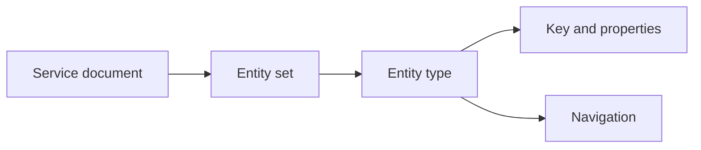

# 1. COMPRENDRE ODATA V2 ET V4

## 1.A RÉSULTAT ATTENDU

Identifier le protocole, la version et le type de service avant de modifier son implémentation.

## 1.B MODÈLE

OData[^terme-odata] expose des ressources HTTP[^terme-http] décrites par un modèle de données. Un service fournit des entity types[^terme-entity-type], entity sets[^terme-entity-set], propriétés, clés, relations et opérations. Le document `$metadata`[^terme-metadata] constitue le contrat technique visible par le consommateur.

| Besoin | OData V2 Gateway classique | OData V4 avec RAP |
|---|---|---|
| Outil principal | `SEGW`, SAP GUI | ADT |
| Modèle | MPC/MPC_EXT | CDS |
| Traitement | DPC/DPC_EXT | behavior pool RAP |
| Publication | `/IWFND/MAINT_SERVICE` | service binding, puis activation cible |
| Cible | Maintenance et scénarios Gateway existants | Nouveaux services modernes |

## 1.C PRÉREQUIS

- Connaître le système et le mandant appelés.
- Disposer de l’URL racine ou du nom technique du service.
- Pouvoir exécuter une requête HTTP avec `/IWFND/GW_CLIENT` ou un client externe autorisé.
- Connaître les versions d’ABAP Platform et de `SAP_GWFND`.

## 1.D STRUCTURE D’UN SERVICE

Le modèle EDM contient des entity types. Chaque entity type définit une clé, des propriétés et éventuellement des navigations. Les entity sets exposent des collections d’entités. En V2, une navigation repose sur une association et un association set. En V4, elle repose sur une navigation property et son binding. V4 ajoute notamment les singletons.

## 1.E PROTOCOLE HTTP

| Intention | Méthode habituelle | Résultat attendu |
|---|---|---|
| Lire une collection | `GET` | `200 OK` |
| Lire une ressource | `GET` | `200 OK` ou `404 Not Found` |
| Créer | `POST` | Réponse de création selon le service |
| Modifier | `PATCH` ou `PUT` | Succès ou erreur de précondition |
| Supprimer | `DELETE` | Succès ou ressource absente |

Le statut HTTP décrit le traitement protocolaire. Le corps d’erreur doit fournir le diagnostic fonctionnel autorisé sans exposer d’information interne.

## 1.F PROCESS

### 1.F.1 ÉTAPE 1 — IDENTIFIER LA RACINE

Relever le protocole, l’hôte, le port, le préfixe ICF, le nom et la version du service. Ne conserver ni cookie ni jeton dans la documentation.

### 1.F.2 ÉTAPE 2 — LIRE LE SERVICE DOCUMENT

Exécuter `GET` sur la racine. Relever les collections publiées. Une réponse valide prouve l’accessibilité, pas la correction de la logique métier.

### 1.F.3 ÉTAPE 3 — LIRE LE METADATA

Ajouter `/$metadata`, puis relever entity sets, clés, types, navigations et opérations. Identifier V2 ou V4 à partir du contrat et des en-têtes.

### 1.F.4 ÉTAPE 4 — IDENTIFIER L’IMPLÉMENTATION

Pour V2 classique, rechercher l’enregistrement Gateway et le projet SEGW. Pour RAP, rechercher la service binding, la service definition et les projections CDS dans ADT.

### 1.F.5 ÉTAPE 5 — TESTER UNE RESSOURCE

Choisir une entity set, limiter le résultat et tester une clé existante puis inexistante. Conserver URI, statut et réponse expurgée.

## 1.G CONTRÔLE

1. Appeler la racine du service.
2. Appeler `$metadata`.
3. Relever la version OData dans les en-têtes et le format du document.
4. Identifier l’objet de conception : projet `SEGW` ou service binding RAP.
5. Ne modifier aucun objet avant d’avoir identifié le système d’implémentation.

## 1.H ERREURS FRÉQUENTES

- Déduire V2 ou V4 uniquement à partir du nom du service.
- Chercher un projet `SEGW` pour un service généré par RAP.
- Considérer `$metadata` comme une documentation fonctionnelle complète.

## 1.I COMPATIBILITÉ S/4HANA

- OData V2 est pris en charge par SAP Gateway et reste largement utilisé par les services existants.
- SAP Gateway prend en charge OData V4 à partir d’AS ABAP 7.50 selon SAP Learning.
- Pour un nouveau service transactionnel, SAP recommande OData V4 lorsque le scénario le permet dans la documentation des service bindings RAP.
- La disponibilité d’une fonction doit être vérifiée sur la version exacte d’ABAP Platform.

## 1.J RÉFÉRENCES OFFICIELLES SAP

- [Explaining Open Data Protocol — SAP Learning](https://learning.sap.com/courses/building-odata-services-with-sap-gateway/explaining-open-data-protocol-odata-)
- [Configuring SAP Gateway — SAP Learning](https://learning.sap.com/courses/technical-implementation-and-operation-i-of-sap-s-4hana-and-sap-business-suite/configuring-sap-gateway)
- [SAP Gateway and OData — SAP Help Portal, 2025 FPS01](https://help.sap.com/docs/PRODUCT_ID/22bbe89ef68b4d0e98d05f0d56a7f6c8/24d9ac6065954bf7a61f2dc9040f7870.html)
- [Service Binding — SAP Help Portal](https://help.sap.com/docs/abap-cloud/abap-rap/service-binding)

[^terme-odata]: **ODATA.** Protocole standardisé exposant des ressources au moyen de HTTP. Voir [le lexique](<../🧩 00 ├── LEXIQUE ODATA ET SAP GATEWAY/01 ├── PROTOCOLE HTTP ET ODATA.md#odata>).
[^terme-http]: **HTTP.** Protocole requête-réponse transportant méthodes, URI, en-têtes, statuts et corps. Voir [le lexique](<../🧩 00 ├── LEXIQUE ODATA ET SAP GATEWAY/01 ├── PROTOCOLE HTTP ET ODATA.md#http>).
[^terme-entity-type]: **ENTITY TYPE.** Type définissant clé, propriétés et navigations d’une entité. Voir [le lexique](<../🧩 00 ├── LEXIQUE ODATA ET SAP GATEWAY/02 ├── MODELE DE DONNEES ODATA.md#entity-type>).
[^terme-entity-set]: **ENTITY SET.** Collection adressable d’entités d’un même type. Voir [le lexique](<../🧩 00 ├── LEXIQUE ODATA ET SAP GATEWAY/02 ├── MODELE DE DONNEES ODATA.md#entity-set>).
[^terme-metadata]: **METADATA.** Document CSDL décrivant le contrat technique d’un service OData. Voir [le lexique](<../🧩 00 ├── LEXIQUE ODATA ET SAP GATEWAY/02 ├── MODELE DE DONNEES ODATA.md#metadata>).
